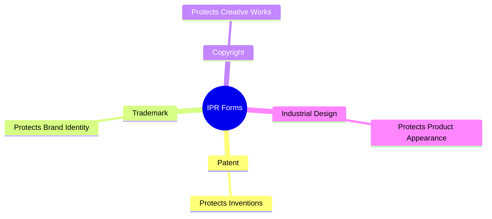
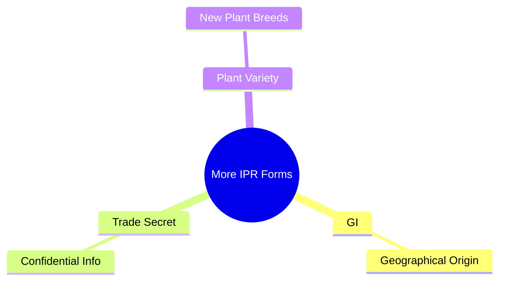

# Chapter 1: Concept of Intellectual Property Rights (IPR)

---

## What is Intellectual Property (IP)?

Intellectual Property refers to **creations of the human mind** that have commercial, artistic, scientific, or industrial value. These are **intangible assets** — they can't be touched physically, but have significant economic value.

**Examples from PDF:**
| IP | Type |
|---|---|
| Microsoft Windows | Copyright |
| Apple Logo | Trademark |
| New Electric Vehicle Battery | Patent |
| Coca-Cola Bottle Shape | Industrial Design |
| Darjeeling Tea | GI |
| Coca-Cola Formula | Trade Secret |

---

## What are Intellectual Property Rights (IPR)?

IPR are the **legal rights granted by the government** to creators, inventors, authors, designers, and businesses over their intellectual creations. They give the owner **exclusive control** over use, production, sale, and licensing of their work.

> **WIPO Definition:** "Intellectual Property refers to creations of the mind, such as inventions, literary and artistic works, designs, symbols, names, and images used in commerce."

> 🧠 **Simple:** IP = Creation of mind | IPR = Legal protection of that creation

---

## Why are IPR Needed?

| Without IPR | With IPR |
|---|---|
| Anyone can copy inventions | Inventors get legal protection |
| Authors get no recognition | Artists and authors earn royalties |
| Businesses misuse brand names | Businesses build strong brands |
| Innovation declines | R&D is encouraged |
| Counterfeit products increase | Consumers get genuine products |

---

## Objectives of IPR

1. Encourage innovation and creativity
2. Provide legal protection for inventions and creative works
3. Reward inventors and creators
4. Promote research and technological development
5. Facilitate technology transfer and commercialization
6. Stimulate economic growth and industrial development
7. Protect consumers from counterfeit products
8. Encourage fair competition

> 🧠 **Trick:** I-P-R-P-F-S-P-E (8 objectives)

---

## Characteristics of IPR

1. **Intangible Nature** – No physical form, but has economic value
2. **Exclusive Rights** – Only owner can use, sell, or license it
3. **Territorial Protection** – Valid only in the country/region where registered
4. **Limited Duration** – Valid only for a specified period
5. **Transferable** – Can be sold, assigned, licensed, or inherited
6. **Legal Protection** – Owner can sue for infringement
7. **Commercial Value** – Generates income through licensing, royalties, etc.

> 🧠 **Trick: I-E-T-L-T-L-C** (7 characteristics)

---

## Major Forms of IPR

---

## Advantages of IPR

| For Individuals | For Businesses | For Society |
|---|---|---|
| Recognition | Brand protection | Tech advancement |
| Financial rewards | Competitive advantage | Economic development |
| Motivation to create | Increased market value | Product quality |
| | Business expansion | Employment |

---

## Limitations of IPR

- Registration and maintenance can be **expensive**
- Enforcement may require **legal proceedings**
- Protection is for a **limited period**
- Rights are **territorial** (separate registration per country)
- Misuse can create **monopolies** and restrict competition

---

## Importance in the Digital Era

IPR is crucial to protect:
- Software applications & AI innovations
- Mobile apps, websites, digital content
- Online educational materials & multimedia
- E-commerce brands, databases, cloud services

> As digital information can be **copied and distributed easily**, IPR provides the legal framework to safeguard innovation and creativity.
