# Intellectual Property Rights (IPR) — Complete Easy Notes

Below I have combined **all the slides** into one structured set of notes. I've kept the **important keywords in bold** so you can reproduce them in an exam and maximize marks.

## 1. What is Intellectual Property (IP)?

**Definition**
**Intellectual Property (IP)** refers to **creations of the human mind/intellect** that have **commercial, artistic, scientific, or industrial value**. 
These creations are generally **intangible assets**, meaning they do not have a physical form but can have significant **economic and social value**.

**Simple meaning**
> **IP = Valuable creation of the human mind.**

For example:
* An invention → **IP**
* A software program → **IP**
* A book → **IP**
* A company logo → **IP**
* A secret business formula → **IP**

**Examples of IP**
| **Creation** | **Example** |
| :--- | :--- |
| **Invention** | New electric vehicle battery |
| **Software** | Microsoft Windows |
| **Literary work** | Book / research paper |
| **Artistic work** | Painting / photograph |
| **Music & Film** | Song / movie |
| **Brand identity** | Apple logo |
| **Product appearance** | Coca-Cola bottle shape |
| **Business information** | Coca-Cola formula |

**Easy way to remember**
**IP = Something created by your MIND that has VALUE.**

---

## 2. What are Intellectual Property Rights (IPR)?

**Intellectual Property Rights (IPR)** are the **legal rights** granted to creators, inventors, authors, designers and businesses to **protect their intellectual creations**.

These rights give the owner certain **exclusive rights** over the use, production, sale, licensing and commercialization of their intellectual property, subject to the applicable law.

**In very simple words:**
> **IPR = Legal protection given to valuable creations of the human mind.**

**Basic idea**
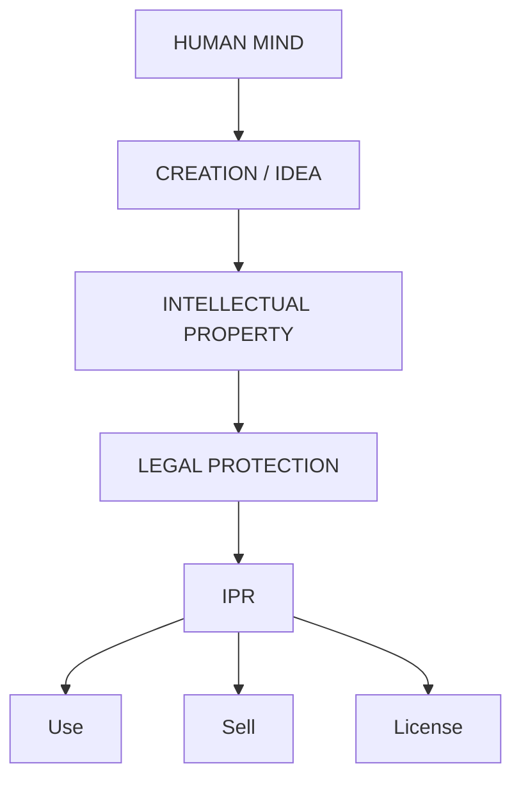

**Example**
Suppose **A** develops a new technology for charging electric vehicles.
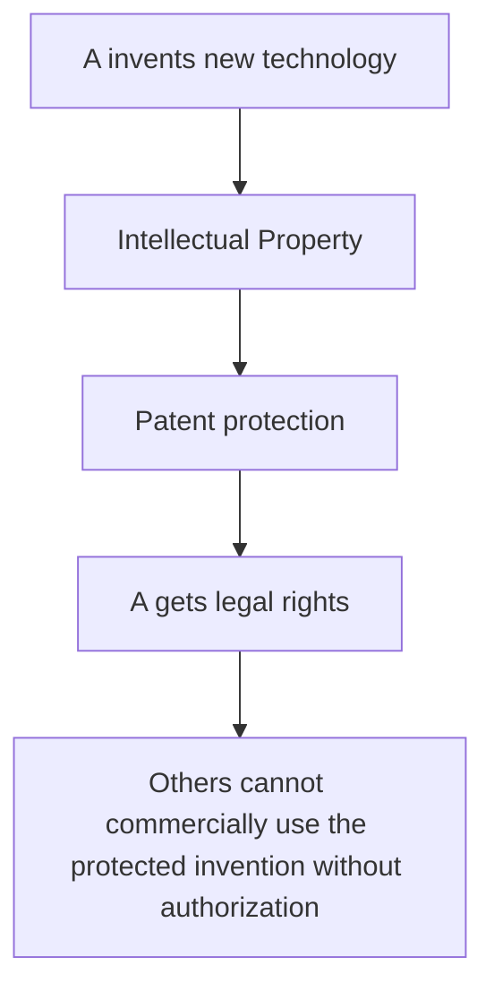

---

## 3. IP vs IPR

This distinction is **very important for exams**.

| **IP** | **IPR** |
| :--- | :--- |
| **Creation/intellectual asset** | **Legal right protecting that creation** |
| What has been created | Legal protection over it |
| Example: new invention | Example: patent protecting invention |
| Example: Apple logo | Example: trademark protecting logo |

**One-line answer**
> **IP is the creation; IPR is the legal protection/right associated with that creation.**

---

## 4. Definition According to WIPO

According to the **World Intellectual Property Organization (WIPO)**:
> **Intellectual Property refers to creations of the mind**, such as **inventions, literary and artistic works, designs, symbols, names, and images used in commerce.**

**Keywords to remember**
**Creations of the mind → Inventions → Literary works → Artistic works → Designs → Symbols → Names → Commercial images**

---

## 5. Why are Intellectual Property Rights Needed?

The basic purpose is to ensure that people who create something valuable receive **legal protection** and can benefit from their creation.

**Without IPR**
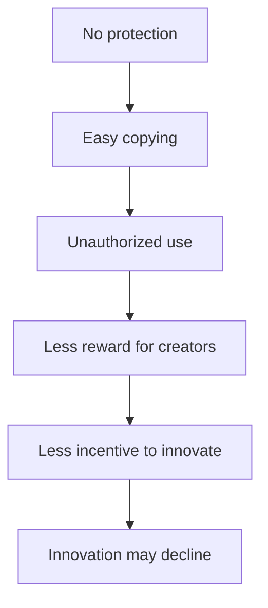

Examples of problems:
* Anyone could **copy inventions** without permission.
* Authors may not receive proper **recognition/reward**.
* Businesses could misuse **brand names and logos**.
* **Innovation and creativity** may decrease.
* **Counterfeit/duplicate products** may increase.

**With IPR**
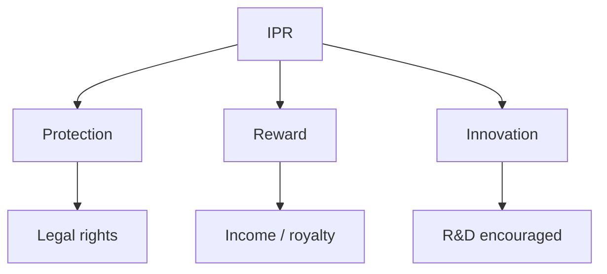

IPR can provide:
* **Legal protection** to inventors.
* **Brand protection** for businesses.
* **Royalties/licensing income** for creators.
* Greater incentive for **research and development**.
* Protection against certain forms of **unauthorized use** and counterfeiting.

---

## 6. Objectives of IPR

The primary objectives are:

1. **Encourage innovation and creativity**
   IPR gives creators an incentive to develop **new ideas, inventions and creative works**.
2. **Provide legal protection**
   It protects **inventions and creative works** from unauthorized exploitation.
3. **Reward inventors and creators**
   Creators can receive **financial benefits, recognition, royalties or licensing income**.
4. **Promote research and technological development**
   Protection can encourage companies and individuals to invest in **R&D**.
5. **Facilitate technology transfer and commercialization**
   IP can be **licensed, assigned or commercialized**, allowing technology to reach the market.
6. **Stimulate economic and industrial development**
   IP can contribute to **business growth, investment and industrial development**.
7. **Protect consumers from counterfeit products**
   IPR, particularly trademarks and related enforcement mechanisms, helps combat **counterfeit and misleading products**.
8. **Encourage fair competition**
   IP law seeks to provide a framework where creators and businesses can compete while respecting **legally protected rights**.

---

## 7. Characteristics of Intellectual Property Rights

There are **7 major characteristics** in your slides.

**1. Intangible Nature**
IP has **no physical form**, but it can have significant **economic value**.
*Example - A software program:*
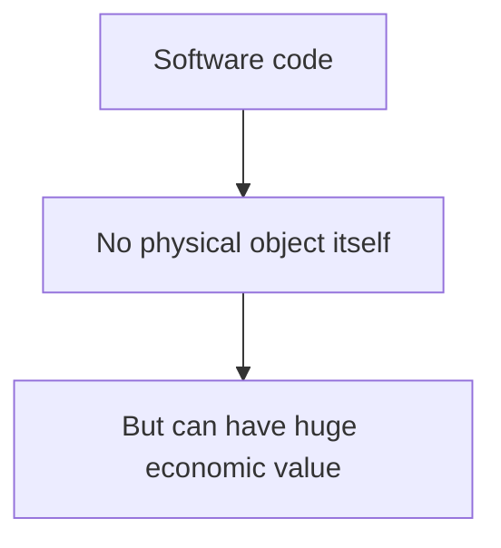

**2. Exclusive Rights**
IPR generally gives the owner **exclusive legal rights** to use, license, sell or otherwise exploit the protected IP, subject to legal limitations.
*Example - If a company owns a valid patent:*
> Others generally cannot commercially exploit the patented invention without authorization, subject to exceptions under law.

**3. Territorial Protection**
IP rights are generally **territorial**.
This means protection is normally based on the **country or jurisdiction** in which the right is obtained.
*Example:*
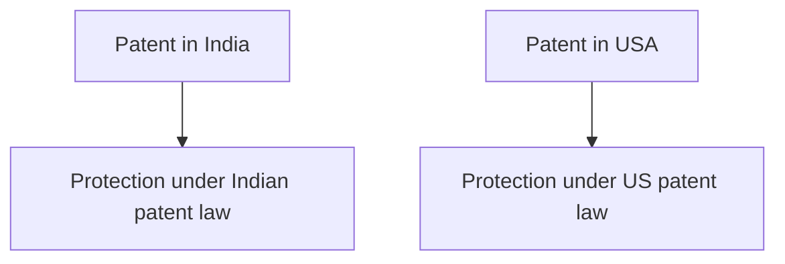
International systems can simplify filing, but protection is still ultimately governed by applicable national/regional laws.

**4. Limited Duration**
Many IP rights have a **limited duration**. For example, patents have a defined statutory term.
**Important exam nuance:** don't write that *every* form of IP always expires after a fixed period. **Trademarks can generally be renewed**, and **trade-secret protection can potentially continue as long as secrecy is maintained**.

**5. Transferable**
IP rights can often be:
* **Sold**
* **Assigned**
* **Licensed**
* **Transferred**
* **Inherited**, where applicable

*Example - Company A owns software IP:*
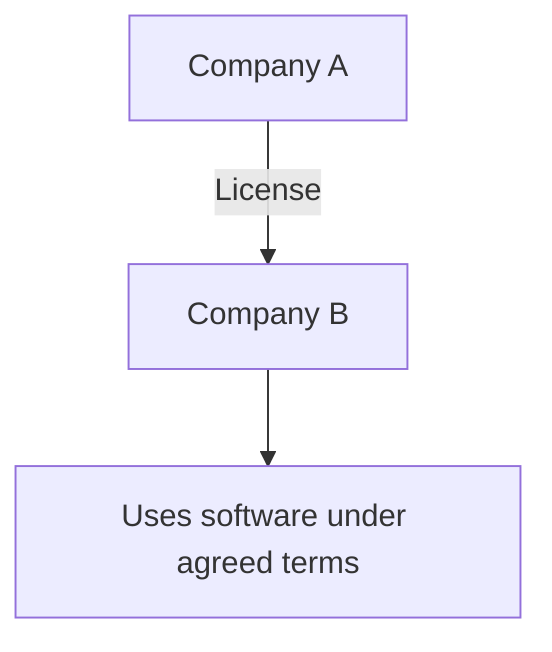
The important distinction is:
> **Assignment = transfer of ownership**
> **License = permission to use without necessarily transferring ownership**

**6. Legal Protection**
The owner can use **legal remedies** against infringement or unauthorized use, subject to the relevant law.
*Example - If someone commercially uses protected IP without authorization:*
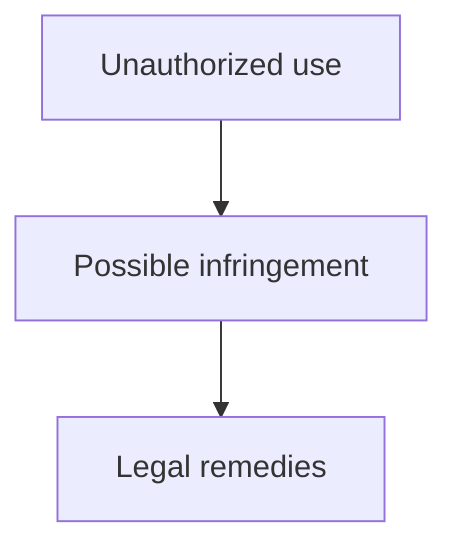

**7. Commercial Value**
IP can generate **economic income** through:
* **Licensing**
* **Royalties**
* **Franchising**
* **Commercialization**
* **Sale/assignment**

*Example - A company owns a patented technology. Instead of manufacturing everything itself:*
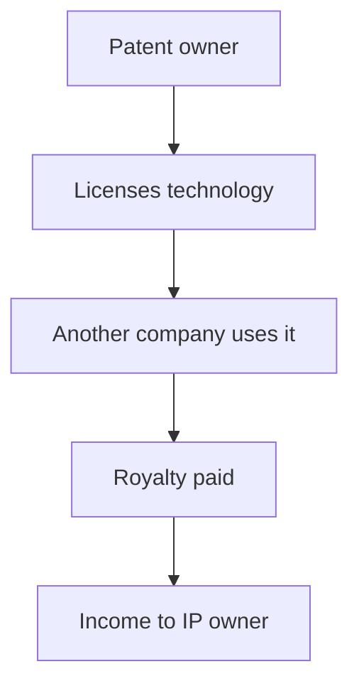

---

## 8. Components / Major Types of Intellectual Property

This is one of the **most important sections**.

Remember:
> **Patent + Trademark + Copyright + Industrial Design + GI + Trade Secret + Plant Variety Protection**

### 1. Patent
**Protects: Inventions and technological innovations.**
A patent generally provides exclusive rights over a qualifying invention for a **limited statutory period**, in exchange for disclosure of the invention.

*Example - A company invents a new electric vehicle battery technology:*
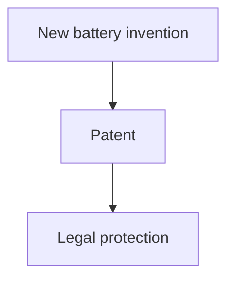
**Keyword:** **Patent → Invention**

### 2. Trademark
**Protects: Brand names, logos, symbols, slogans** and other signs that distinguish goods/services.

*Example - Apple logo → Trademark:*
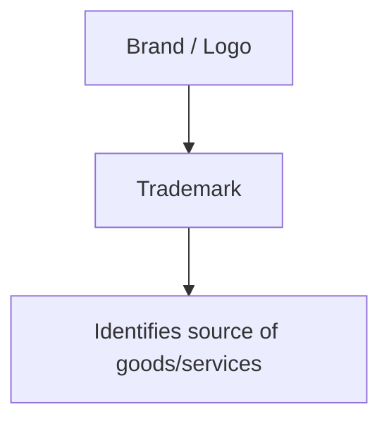
**Keyword:** **Trademark → Brand identity**

### 3. Copyright
**Protects: Original literary, artistic, musical and software works**, among other eligible works.
Examples include Books, Songs, Movies, Photographs, Software code, and Articles.

*Example:*
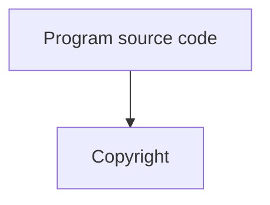
**Keyword:** **Copyright → Creative expression**

**Important distinction:** Copyright generally protects the **expression of an idea**, not the underlying idea itself. The **source code** of a software program can be protected by copyright, while a purely abstract idea behind the software is not automatically protected by copyright.

### 4. Industrial Design
**Protects: The visual/aesthetic appearance** of a product.
It can concern features such as Shape, Configuration, Pattern, Ornamentation, or Overall visual appearance.

*Example - Coca-Cola bottle shape:*
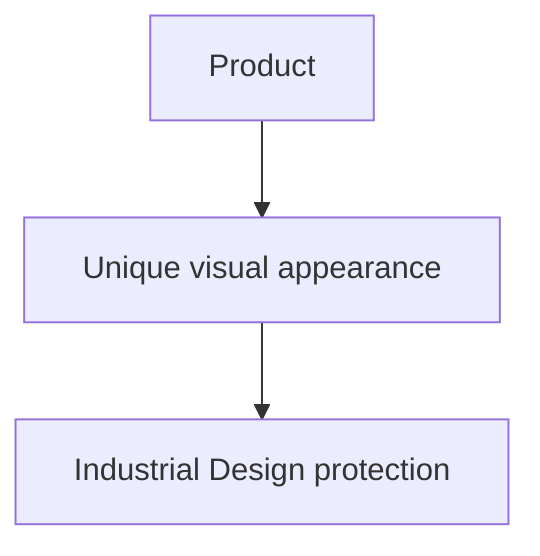
**Keyword:** **Industrial Design → Appearance**

### 5. Geographical Indication (GI)
**Protects:** Products associated with a **specific geographical origin** where the product's qualities, reputation or characteristics are linked to that origin.

*Example - Darjeeling Tea:*
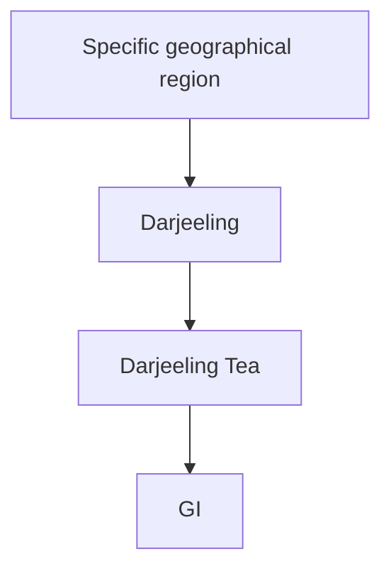
**Keyword:** **GI → Geographical origin**

### 6. Trade Secret
**Protects: Confidential business information** that provides economic value because it is secret and is subject to reasonable measures to maintain secrecy.

*Example:* **Coca-Cola formula** is commonly used as an example of a trade secret. Other examples: Secret manufacturing process, Confidential algorithm, Customer strategy, Business formula.

**Keyword:** **Trade Secret → Confidential information**

### 7. Plant Variety Protection
**Protects:** Certain **new plant varieties** developed through **breeding**, subject to the applicable legal requirements.

*Example - A breeder develops a new plant variety with desirable characteristics:*
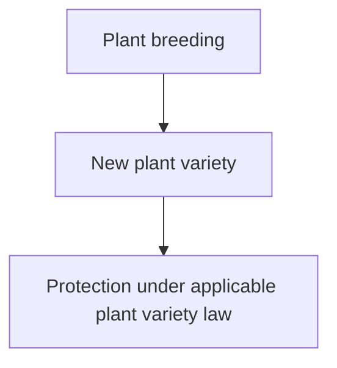
**Keyword:** **Plant Variety Protection → New plant varieties**

---

## 15. Super-Easy IPR Table

Memorize this table:

| **Type** | **Protects** | **Example** |
| :--- | :--- | :--- |
| **Patent** | **Invention** | New EV battery |
| **Trademark** | **Brand identity** | Apple logo |
| **Copyright** | **Creative works** | Software, book, song |
| **Industrial Design** | **Product appearance** | Bottle design |
| **GI** | **Geographical origin** | Darjeeling Tea |
| **Trade Secret** | **Confidential business information** | Secret formula |
| **Plant Variety Protection** | **New plant varieties** | New bred crop variety |

🔥 **One-line memory trick**
> **Patent = Invention, Trademark = Brand, Copyright = Creation, Design = Appearance, GI = Place, Trade Secret = Secret, Plant Variety = Plant.**

---

## 16. Real-Life Examples

Your slides give these examples:

| **Intellectual Property** | **IPR Type** |
| :--- | :--- |
| **Microsoft Windows** | **Copyright** |
| **Apple Logo** | **Trademark** |
| **New Electric Vehicle Battery** | **Patent** |
| **Coca-Cola Bottle Shape** | **Industrial Design** |
| **Darjeeling Tea** | **Geographical Indication** |
| **Coca-Cola Formula** | **Trade Secret** |

**Easy story to remember**
Imagine a company creates a new product:
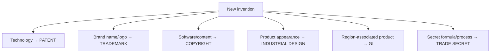
*This diagram is extremely useful for remembering the entire chapter.*

---

## 17. Advantages of IPR

The slides divide advantages into **Individuals, Businesses and Society**.

### A. Advantages for Individuals
1. **Recognition for innovation:** Creators receive **recognition** for their inventions and creative work.
2. **Financial rewards:** Creators can earn through **Licensing**, **Royalties**, and **Commercialization**.
3. **Motivation to create:** Legal protection provides an incentive to develop **new ideas and innovations**.

### B. Advantages for Businesses
1. **Brand protection:** Trademarks help protect **brand identity**.
2. **Competitive advantage:** Protected IP can provide a business with a **competitive advantage**.
3. **Increased market value:** Strong IP portfolios can contribute to the **value of a business**.
4. **Business expansion:** Businesses can use **licensing and franchising** to expand.

### C. Advantages for Society
1. **Technological advancement:** IP protection can encourage **technological innovation**.
2. **Economic development:** Commercialization of IP can contribute to **economic growth**.
3. **Product quality and consumer protection:** Trademark and anti-counterfeiting mechanisms can help consumers distinguish **genuine products**.
4. **Employment opportunities:** Innovation and commercialization can contribute to **business creation and employment**.

---

## 20. Limitations of IPR

IPR provides important protection, but it also has limitations:

1. **Expensive registration and maintenance:** Obtaining and maintaining certain IP rights can involve significant **costs**.
2. **Legal enforcement can be expensive:** Enforcing rights may require **legal proceedings**, which can take time and money.
3. **Limited duration:** Some forms of IP protection have a **limited statutory duration**.
4. **Territorial nature:** Protection is generally **territorial**, so international protection may require protection in multiple jurisdictions.
5. **Possibility of restricting competition:** IP rights create legally protected exclusivity. If improperly used or combined with other market factors, this can contribute to **market power** and restrict competition.

---

## 21. IPR in the Digital Era

This is particularly important because digital information is **extremely easy to copy and distribute**.

IPR is relevant to:
* **Software applications** & **AI innovations**
* **Mobile applications** & **Websites**
* **Digital content** & **Online educational materials**
* **Multimedia** & **Streaming content**
* **E-commerce brands** & **Databases**
* **Cloud-based services**

**Why is IPR especially important digitally?**
Consider a digital product:
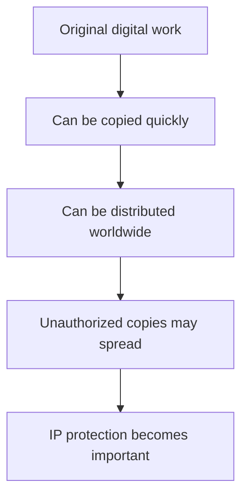

For example, suppose someone creates a paid software application. Without appropriate legal protection:
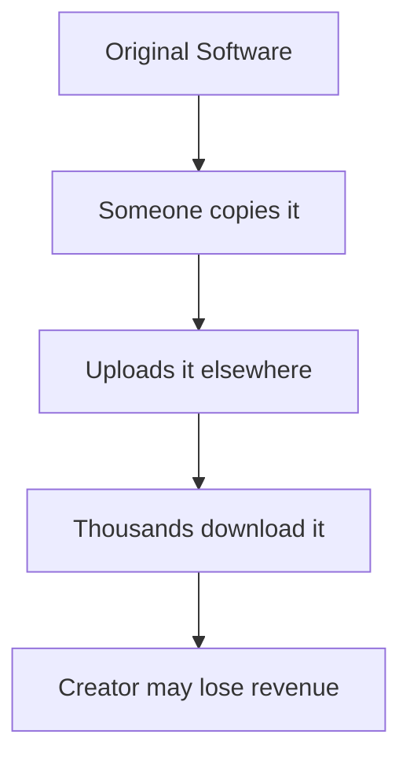
IP law provides the legal framework for addressing **unauthorized copying and exploitation**, depending on the type of IP involved.

---

## 22. Importance of IPR in Digital Technology

**IPR helps protect:**
1. **Software:** Software code may receive copyright protection, while technical inventions implemented through software may potentially involve patent protection.
2. **AI innovations:** AI-related inventions, software, datasets, models, outputs and branding can involve different forms of IP.
3. **Mobile applications:** Apps may involve Copyright, Trademark, potentially patent, and Trade secrets.
4. **Websites and digital content:** Website content, graphics, videos, articles and code can involve **copyright**.
5. **E-commerce brands:** Brand names and logos can involve **trademark protection**.
6. **Databases and cloud services:** Different elements can potentially receive different forms of legal protection depending on jurisdiction.

---

## 23. Overall Relationship Between IP and IPR

This is probably the **single best diagram** to reproduce in an exam:
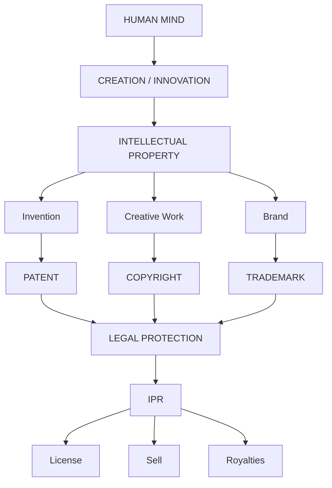

---

## 24. Complete IPR Map

For memorization:
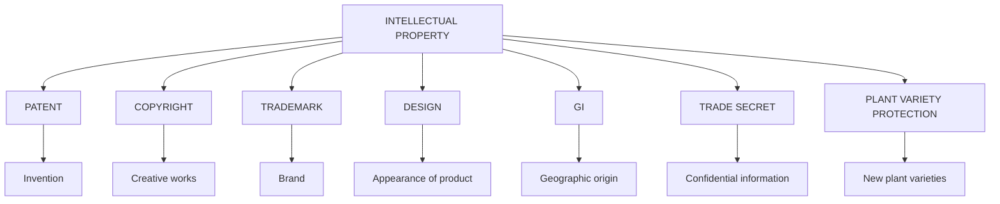

---

## 25. Most Important Differences

**Patent vs Copyright**
| **Patent** | **Copyright** |
| :--- | :--- |
| Protects **inventions** | Protects **original creative expression** |
| Example: new technology | Example: software code/book/song |
| Generally requires formal grant/registration process | Copyright protection generally arises automatically upon creation |
| Limited statutory term | Different statutory rules apply |

**Trademark vs Copyright**
| **Trademark** | **Copyright** |
| :--- | :--- |
| Protects **brand identifiers** | Protects **creative works** |
| Logo/name/symbol | Book/song/software |
| Helps identify **source of goods/services** | Protects **expression** |

**Easy:**
> **Nike logo → Trademark** | **Software source code → Copyright**

**Patent vs Trade Secret**
| **Patent** | **Trade Secret** |
| :--- | :--- |
| Protects qualifying **inventions** | Protects **confidential valuable information** |
| Requires disclosure as part of patent system | Depends on maintaining **secrecy** |
| Has a statutory term | Can potentially last as long as secrecy is maintained |
| Legal protection under patent law | Protection against misappropriation under applicable trade-secret law |

**Example:**
```mermaid
flowchart TD
    A[New invention → PATENT]
    B[Secret formula/process → TRADE SECRET]
```

---

## 26. Full-Marks Definitions

If the exam asks:

**"Define Intellectual Property."**
Write:
> **Intellectual Property (IP)** refers to **creations of the human mind or intellect** that have **commercial, artistic, scientific or industrial value**. These creations are generally **intangible assets** and include inventions, literary and artistic works, designs, symbols, names and images used in commerce.

**"Define Intellectual Property Rights."**
Write:
> **Intellectual Property Rights (IPR)** are legal rights granted under law to creators, inventors, authors, designers and businesses to **protect their intellectual creations** and provide them with certain **exclusive rights** to use, license, commercialize or otherwise exploit their protected intellectual property, subject to applicable legal limitations.

---

## 27. 5-Mark Answer: "Explain IPR"

You can write this directly:
> **Intellectual Property Rights (IPR)** are legal rights that protect **creations of the human mind** having economic, artistic, scientific or industrial value. IPR provides creators and owners with certain **exclusive legal rights** over their intellectual creations and helps prevent unauthorized use or exploitation.
> 
> The major forms of IPR include **Patents, Copyrights, Trademarks, Industrial Designs, Geographical Indications, Trade Secrets and Plant Variety Protection**.
> 
> The main objectives of IPR are to **encourage innovation and creativity, provide legal protection, reward creators, promote research and development, facilitate commercialization and technology transfer, and contribute to economic development**.
> 
> IPR is particularly important in the **digital era**, because software, digital content, AI-related innovations and online products can be copied and distributed very easily.

---

## 28. 10-Mark Answer Structure

If the question is: **"Explain Intellectual Property Rights, their objectives, types, advantages and limitations."** Use this structure:

1. **Definition:** IPR = legal rights protecting creations of the human mind.
2. **Need:** Prevents unauthorized use, encourages innovation, rewards creators, protects brands, helps combat counterfeiting.
3. **Objectives:** Innovation/creativity, legal protection, reward creators, R&D, technology transfer, commercialization, economic development, fair competition.
4. **Types:**
```mermaid
flowchart TD
    A[Patent → Invention]
    B[Trademark → Brand]
    C[Copyright → Creative work]
    D[Industrial Design → Appearance]
    E[GI → Geographical origin]
    F[Trade Secret → Confidential information]
    G[Plant Variety Protection → New plant varieties]
```
5. **Advantages:**
   * **Individuals:** Recognition + Financial rewards + Motivation
   * **Businesses:** Brand protection + Competitive advantage + Market value + Licensing
   * **Society:** Technological advancement + Economic development + Consumer protection + Employment
6. **Limitations:** Cost, legal enforcement, limited duration, territorial protection, potential competition/market-power concerns.
7. **Digital Era:** Mention Software + AI + Mobile Apps + Websites + Digital Content + E-commerce + Databases + Cloud Services.
8. **Conclusion:** IPR provides a legal framework for **protecting innovation and creativity**, rewarding creators and supporting **commercialization, technological development and economic growth**.

---

## 29. Ultra-Short Revision Before Exam

If you have only **2 minutes**, memorize this:

**IP** = Creation of the human mind having value.
**IPR** = Legal rights protecting IP.

**7 Types**
* **Patent** → Invention
* **Trademark** → Brand
* **Copyright** → Creative work
* **Industrial Design** → Appearance
* **GI** → Place
* **Trade Secret** → Secret information
* **Plant Variety** → New plant variety

**Objectives:** Innovate → Protect → Reward → Research → Commercialize → Grow → Compete
**Characteristics:** Intangible → Exclusive → Territorial → Limited duration → Transferable → Legal protection → Commercial value
**Advantages:**
* Individuals → Recognition + Money + Motivation
* Business → Brand + Competition + Value + Expansion
* Society → Technology + Economy + Quality/Consumer protection + Jobs
**Limitations:** Cost + Enforcement + Duration + Territoriality + Competition concerns
**Digital Era:** Software + AI + Apps + Websites + Digital Content + E-commerce + Databases + Cloud

---

## 30. One Master Diagram to Memorize Everything

```mermaid
flowchart TD
    A[INTELLECTUAL PROPERTY]
    A --- B["CREATION OF HUMAN MIND"]
    B --> C[IPR LEGAL PROTECTION]
    
    C --> D[PATENT<br>Invention]
    C --> E[COPYRIGHT<br>Creative<br>Work]
    C --> F[TRADEMARK<br>Brand]
    C --> G[DESIGN<br>Appearance]
    C --> H[GI<br>Place]
    
    C --> I[TRADE SECRET<br>Secret Information]
    C --> J[PLANT VARIETY<br>Protection]
    
    C --> K[BENEFITS]
    
    K --> L[INDIVIDUALS<br>Recognition<br>Royalties<br>Motivation]
    K --> M[BUSINESSES<br>Brand Protection<br>Competition<br>Market Value<br>Expansion]
    K --> N[SOCIETY<br>Technology<br>Economy<br>Employment]
    
    C --> O[LIMITATIONS]
    
    O --> P[Cost • Enforcement • Duration<br>Territoriality • Competition concerns]
    
    C --> Q[DIGITAL ERA]
    
    Q --> R[Software • AI • Apps • Websites • Digital Content<br>E-commerce • Databases • Cloud Services]
```

🔥 **Final memory formula**
**IPR = PROTECT + REWARD + INNOVATE + COMMERCIALIZE**

If you remember that formula plus:
**"Patent–Invention, Trademark–Brand, Copyright–Creative Work, Design–Appearance, GI–Place, Trade Secret–Secret, Plant Variety–Plant"**
you can reconstruct almost the **entire chapter** in the exam.


## 🧠 Ultimate Mindmap: Introduction to IPR
```mermaid
mindmap
  root((IPR))
    Definitions
      IP
        Valuable creations of mind
        Intangible assets
      IPR
        Legal protection for IP
        Exclusive rights
      IP vs IPR
        IP is creation
        IPR is legal right
      WIPO Definition
        Inventions
        Literary & Artistic
        Designs
        Symbols & Names
    Characteristics
      Intangible Nature
      Exclusive Rights
      Territorial Protection
      Limited Duration
      Transferable
        Sale
        Assignment
        License
      Legal Protection
      Commercial Value
    Types of IPR
      Patent
        Inventions
      Trademark
        Brand identity
      Copyright
        Creative expression
      Industrial Design
        Visual appearance
      Geographical Indication
        Geographical origin
      Trade Secret
        Confidential info
      Plant Variety
        New breeds
    Objectives & Need
      Encourage Innovation
      Reward Creators
      Prevent Unauthorized Use
      Tech Transfer
      Economic Growth
      Fair Competition
    Advantages
      For Individuals
        Recognition
        Financial Reward
        Motivation
      For Businesses
        Brand Protection
        Competitive Edge
        Market Value
      For Society
        Tech Advancement
        Consumer Protection
        Jobs
    Limitations
      Expensive Registration
      Costly Enforcement
      Limited Duration
      Territorial Limits
      Restricts Competition
    Digital Era
      Software & AI
      Apps & Websites
      Digital Content
      E-commerce Brands
      Databases & Cloud
```
