# Historical Development of Intellectual Property Rights (IPR)

**Easy + Structured + Exam-Oriented Notes**

I have covered **all the slides** you provided, including the **timeline, major international developments, evolution in India, and significance**.

> **Exam strategy:** For a 5–10 mark answer, remember the **YEAR + EVENT + KEY FEATURE + IMPORTANCE**. The **bold keywords** below are the terms you should try to write in your answer.

---

## 1. What is IPR?

**Intellectual Property Rights (IPR)** are **legal rights** given to creators, inventors and businesses to protect their **intellectual creations**.

Examples:
* An invention → **Patent**
* A book/song/software → **Copyright**
* A company logo/name → **Trademark**
* A product's unique appearance → **Industrial Design**
* Darjeeling Tea → **Geographical Indication (GI)**
* Confidential business formula → **Trade Secret**

**Simple idea**
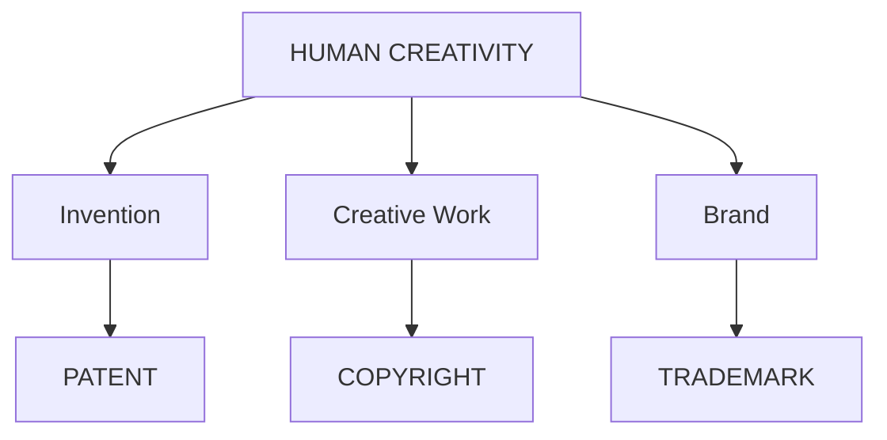

**Why was IPR developed?**
Initially, inventors and creators had **little legal protection**. Someone could copy an invention or creative work without properly compensating the creator.

Governments gradually introduced IPR systems to:
* **Protect creators and inventors**
* **Encourage innovation**
* **Reward creativity**
* **Promote scientific and technological development**
* **Support economic growth**
* **Facilitate international trade**

---

## 2. Historical Development — Overall Timeline

This is the **most important diagram to memorize**.

```mermaid
flowchart TD
    A[1624] --> B[Statute of Monopolies]
    B --> C[Foundation of modern patent principles]
    
    D[1710] --> E[Statute of Anne]
    E --> F[Early modern copyright law]
    
    G[1883] --> H[Paris Convention]
    H --> I[International industrial property protection]
    
    J[1886] --> K[Berne Convention]
    K --> L[International copyright protection]
    
    M[1967] --> N[WIPO Convention]
    N --> O[Establishment of WIPO]
    
    P[1974] --> Q[WIPO becomes UN specialized agency]
    
    R[1995] --> S[TRIPS Agreement]
    S --> T[Minimum international IPR standards]
    
    U[India]
    U --> V[1856 → First patent legislation]
    U --> W[1911 → Indian Patents & Designs Act]
    U --> X[1970 → Indian Patent Act]
    U --> Y[1999 → Trade Marks Act]
    U --> Z[2000/2003 → GI Act]
    U --> AA[2000/2001 → Semiconductor Layout-Design Act]
    U --> AB[2005 → Patent Amendment]
```

**One-line memory trick**
**1624** → Patent
**1710** → Copyright
**1883** → Paris → Industrial Property
**1886** → Berne → Copyright
**1967** → WIPO
**1974** → UN
**1995** → TRIPS

---

## 3. Statute of Monopolies — 1624

**What was it?**
The **Statute of Monopolies** was enacted by the **English Parliament in 1624**.
It is considered an important foundation in the development of **modern patent law**.

**Why was it introduced?**
Before this, the Crown could grant monopolies relatively broadly.
The Act **restricted arbitrary monopolies** and retained a patent exception for certain **new inventions**.

**Important points**
* **Year:** 1624
* **Country:** England
* Restricted the **King's power to grant monopolies arbitrarily**
* Recognized patents relating to **new inventions**
* Patent protection was generally associated with a **14-year period**

**Why is it important?**
It helped establish the principle that patent monopolies should be connected with **genuine invention**, rather than simply being arbitrary privileges.

**Simple example**
Suppose a person invents a **new machine**.
Instead of the King simply giving someone a monopoly over an industry:
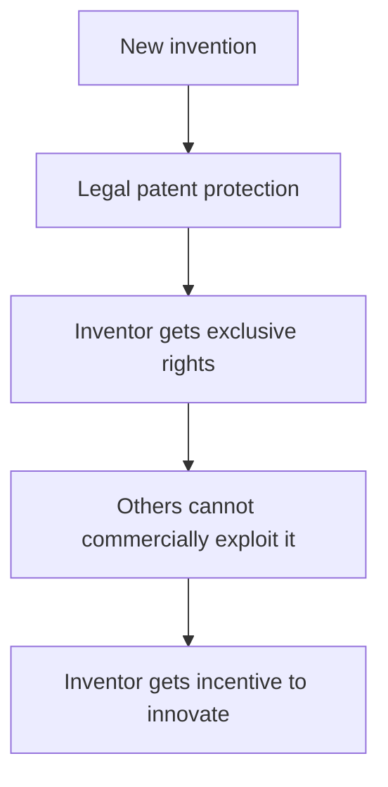

**Exam sentence**
> The **Statute of Monopolies, 1624**, was an important milestone in the development of modern **patent law** because it restricted arbitrary monopolies and recognized patent protection for **new inventions**.

---

## 4. Statute of Anne — 1710

**What is it?**
The **Statute of Anne**, enacted in **1710 in England**, is widely regarded as an important early **modern copyright law**.

**Main purpose**
It shifted the focus toward protecting **authors and their works**, rather than giving control primarily to printers.

**Key features**
* **Year:** 1710
* Protected **authors**
* Gave exclusive rights concerning publication of literary works
* Initial protection was generally **14 years**
* Could be **renewed once** under specified conditions

**Importance**
It established the important idea that:
> **The author/creator should have legally recognized rights over their creative work.**

**Example**
Suppose you write a book.

Without copyright:
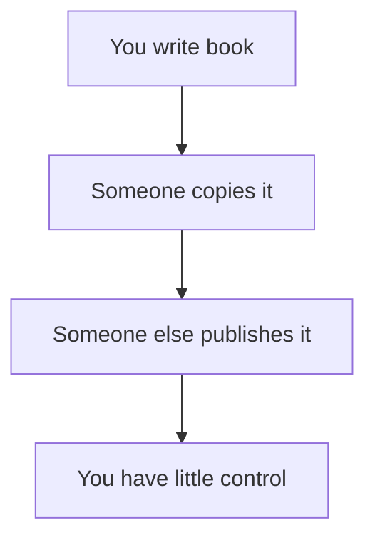

With copyright:
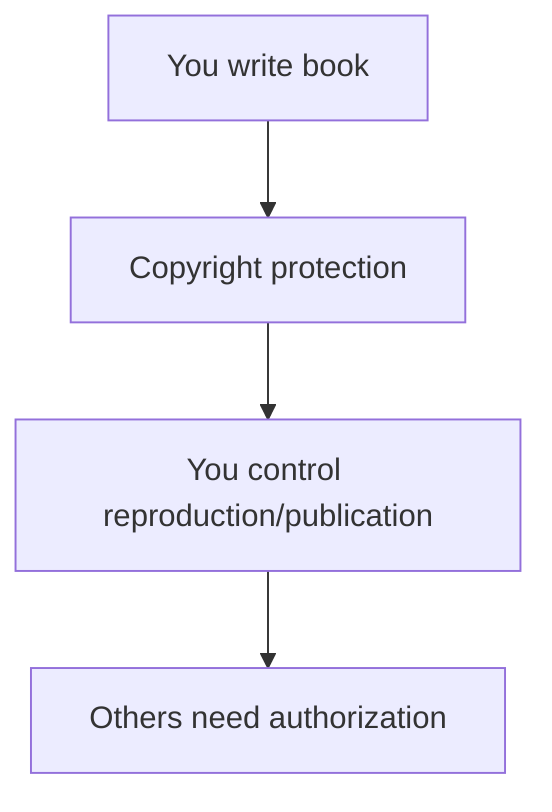

**Exam keywords**
**1710 — Statute of Anne — Authors — Copyright — Literary works**

**Exam sentence**
> The **Statute of Anne (1710)** is considered an important early modern **copyright law** because it recognized the rights of **authors** over their literary works and provided a limited period of protection.

---

## 5. Industrial Revolution — 18th–19th Century

The **Industrial Revolution** was not a particular IPR law. It was a major historical development that increased the need for stronger intellectual-property protection.

**What happened?**
There was rapid development of:
* **Machines**
* **Factories**
* **Technology**
* **Industrial inventions**
* **International trade**

Therefore, inventions became increasingly valuable and copying became a bigger concern.

**Chain of development**
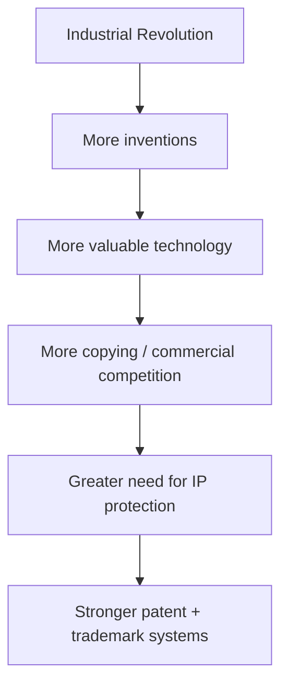

**Major developments**
* Growth of **inventions and machinery**
* Increase in **patent filings**
* Expansion of **international trade**
* Greater importance of **trademarks**
* Stronger patent and trademark systems

**Example**
Imagine a company develops a revolutionary steam-powered machine.
Other manufacturers could copy its technology and sell similar machines.
Therefore:
**Invention → Patent protection → Commercial incentive**

**Exam point**
> The **Industrial Revolution** increased the importance of IPR because rapid **technological innovation, industrialization and international trade** made inventions and brands more economically valuable.

---

## 6. Paris Convention — 1883

**Full name**
Paris Convention for the Protection of Industrial Property

**Year:** 1883

This is one of the most important international agreements concerning **industrial property**.

**What does it cover?**
Remember **P-T-D-U-T**:
* **P** → Patents
* **T** → Trademarks
* **D** → Industrial Designs
* **U** → Utility Models
* **T** → Trade Names

**Two VERY important principles**

**1. National Treatment**
A foreign applicant should generally receive **the same protection** as nationals of the member country, subject to the Convention's rules.

*Example - An Indian inventor applies for protection in another member country:*
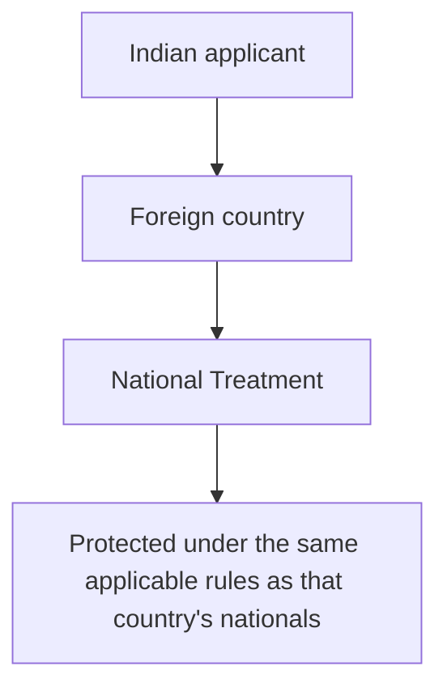

**2. Right of Priority**
This is extremely important for exams.

Suppose:
**1 January:** You file a patent application in Country A.
You subsequently want protection in other Paris Convention countries.

The **right of priority** allows you, subject to the Convention's requirements and time limits, to claim the **earlier filing date** for later applications.

*Simple example:*
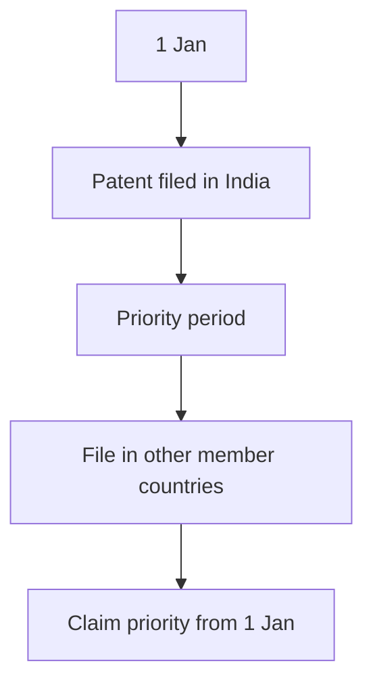
For patents and utility models, the Paris Convention provides a **12-month priority period**; for trademarks and industrial designs, it is generally **6 months**.

**Why is this useful?**
Without priority: Someone could potentially file in another country before you.
Priority provides a mechanism to preserve the significance of your **first filing date** when expanding internationally.

**Importance of Paris Convention**
* First major international agreement on **industrial property**
* Promoted international **patent and trademark protection**
* Established principles such as **national treatment**
* Established the **right of priority**

**Exam sentence**
> The **Paris Convention of 1883** established an international framework for the protection of **industrial property**, including patents, trademarks and industrial designs. Its major principles include **national treatment** and the **right of priority**.

---

## 7. Berne Convention — 1886

**Full name**
Berne Convention for the Protection of Literary and Artistic Works

**Year:** 1886

**Main purpose**
International protection of **copyright**.

**What does it protect?**
Examples include:
* **Books**
* **Music**
* **Films**
* **Paintings**
* **Photographs**
* **Artistic works**
* **Computer programs/software** as literary works under modern copyright frameworks

**Main principles**

**1. Automatic Protection**
Copyright protection generally arises **without requiring registration** when the work satisfies the applicable requirements.

*Example - You write an original story:*
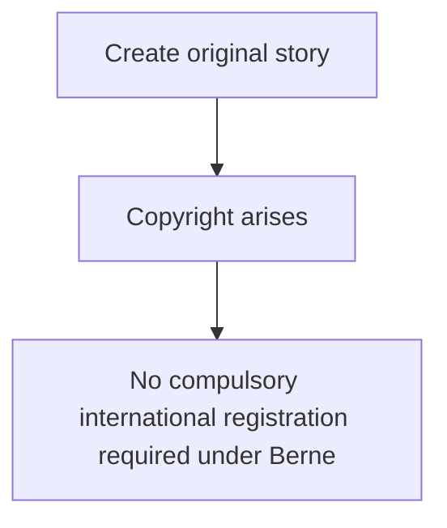

**2. National Treatment**
A work originating in one member country receives protection in other member countries under the applicable copyright rules, generally on the same basis as those countries protect their own works.

*Example - Suppose an Indian author writes a novel:*
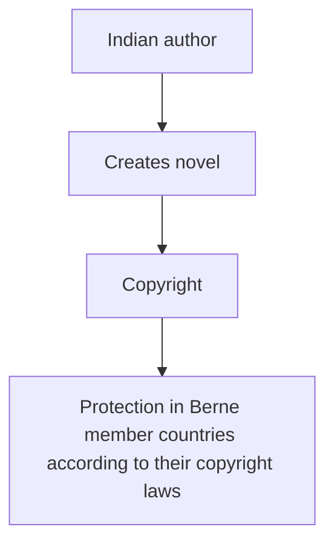

**Importance**
The Berne Convention established an international framework for **copyright protection**.

**Do NOT confuse:**
| **Convention** | **Main area** |
| :--- | :--- |
| **Paris Convention** | **Industrial Property** |
| **Berne Convention** | **Copyright / Literary & Artistic Works** |

**Memory trick**
> **Paris = Patent/Industrial**
> **Berne = Books/Creative works**

**Exam sentence**
> The **Berne Convention of 1886** established an international system for protecting **literary and artistic works**. It is based on principles including **national treatment** and **automatic copyright protection**.

---

## 8. Establishment of WIPO — 1967

**Full form**
**WIPO = World Intellectual Property Organization**

The **WIPO Convention was signed in 1967**, and WIPO formally came into existence in **1970** when the Convention entered into force.

> **Important correction to the slide:** The slide says "WIPO was established in 1967." For an exam, the safest precise wording is: **WIPO was established under the WIPO Convention of 1967; the Convention entered into force in 1970.**

**Headquarters**
**Geneva, Switzerland**

**Main objectives**
WIPO works to:
* Promote **IP protection worldwide**
* Encourage **international cooperation**
* Administer/manage international IP systems and treaties
* Provide assistance and capacity-building, including for developing countries

**Simple structure**
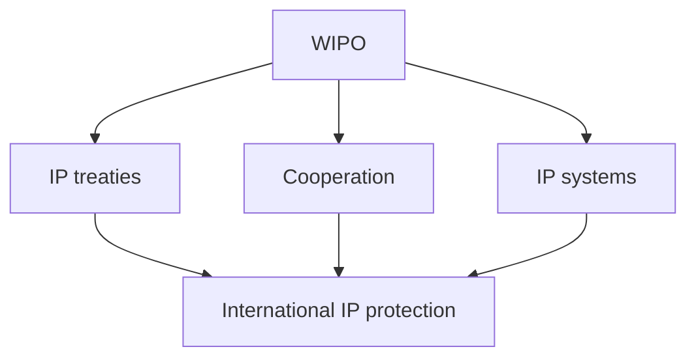

**Importance**
WIPO became the major international organization associated with **intellectual-property cooperation and administration**.

**Exam sentence**
> **WIPO (World Intellectual Property Organization)** was established under the **WIPO Convention of 1967** and is headquartered in **Geneva, Switzerland**. It promotes international cooperation and protection of intellectual property.

---

## 9. WIPO Becomes UN Specialized Agency — 1974

In **1974**, WIPO became a **specialized agency** of the United Nations.

**What does this mean?**
WIPO became formally connected with the **UN system** as a specialized agency dealing with intellectual property.

**Functions**
WIPO:
* Promotes **innovation**
* Supports **international IP cooperation**
* Provides **IP training and technical assistance**
* Supports **technology transfer**
* Provides mechanisms/services related to **international IP disputes**, including dispute-resolution services

**Example**
Suppose companies from two countries have an IP dispute.
WIPO can provide appropriate **international IP dispute-resolution mechanisms**, depending on the dispute and procedure involved.

**Exam sentence**
> In **1974**, WIPO became a **specialized agency of the United Nations**, strengthening its role in international cooperation, IP administration, training and related dispute-resolution services.

---

## 10. TRIPS Agreement — 1995

**Full form**
**TRIPS = Trade-Related Aspects of Intellectual Property Rights**

**Year: 1995**

It operates within the framework of the **World Trade Organization (WTO)**.

**Why was TRIPS important?**
Before TRIPS, countries had different levels of IP protection.
TRIPS established **minimum standards of IP protection and enforcement** that WTO members are required to meet.

**Main objectives**
* Establish **minimum standards**
* Improve **IP enforcement**
* Reduce problems involving unfair trade practices
* Facilitate **technology transfer**
* Integrate IP protection with the **international trading system**

**What does TRIPS cover?**
Remember:
* **PATENTS**
* **COPYRIGHT**
* **TRADEMARKS**
* **GEOGRAPHICAL INDICATIONS**
* **INDUSTRIAL DESIGNS**
* **TRADE SECRETS**
* **INTEGRATED CIRCUIT LAYOUT-DESIGNS**

**Simple example**
Imagine:

A company may face very different IP conditions in the two markets.
TRIPS establishes **minimum standards** that WTO members must implement.
It does **not** mean that every country's IP law becomes identical.

**Very important distinction**
> **TRIPS = minimum standards**
> NOT: TRIPS = identical IP laws in every country

**Importance for India**
India, as a WTO member, had to bring its IP laws into conformity with its **TRIPS obligations**.
This contributed to major amendments in Indian patent law, including the **2005 amendment**.

**Exam sentence**
> The **TRIPS Agreement, 1995**, established **minimum standards for intellectual property protection and enforcement** among WTO members and covered areas such as **patents, copyright, trademarks, geographical indications, industrial designs and trade secrets**.

---

## 11. Evolution of IPR in India

Now remember this as a separate timeline.
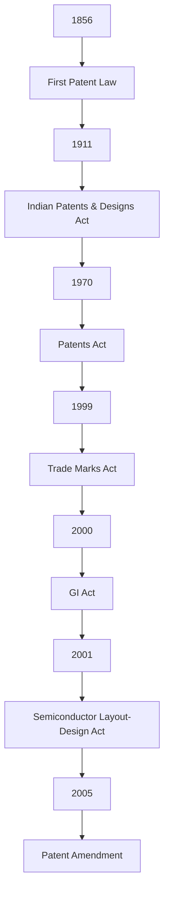

---

## 12. 1856 — First Patent Legislation in India

India's first patent legislation was enacted in **1856**.

**Main points**
* Based substantially on the British patent-law model
* Provided legal protection for inventions
* Marked the beginning of formal patent legislation in India

**Importance**
It was the **starting point of the formal patent system in India**.

**Exam sentence**
> In **1856**, India introduced its first patent legislation, providing an early formal legal framework for the protection of inventions.

---

## 13. 1911 — Indian Patents and Designs Act

The **Indian Patents and Designs Act, 1911** was an important development in India's patent and industrial-design system.

**Main points**
* Consolidated provisions relating to **patents and designs**
* Created a more formal **patent administration system**

**Easy understanding**
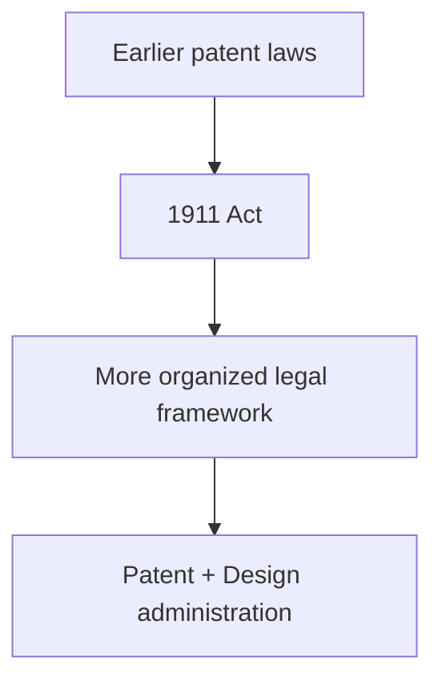

**Exam sentence**
> The **Indian Patents and Designs Act, 1911** consolidated India's patent and industrial-design law and provided a more formal framework for **patent administration**.

---

## 14. 1970 — Indian Patents Act

This is a **very important Indian IPR milestone**.

The **Patents Act, 1970** replaced the earlier 1911 framework.

**Main objectives**
The Act was designed around India's developmental and industrial needs, including encouraging **domestic industry**.

**Important historical feature**
Under the original framework, India allowed **process patents** in areas such as pharmaceuticals and food rather than broad product patents.

**What does that mean?**
Suppose a pharmaceutical company discovers: "Here is a new medicine."
There are two concepts:

**Product patent:**


**Process patent:**


Historically, India's 1970 patent regime permitted **process patents** in pharmaceuticals and food while excluding product patents in those areas.

**Why important?**
It was a major step in shaping India's **domestic patent policy**.

---

## 15. 1999 — Trade Marks Act

The **Trade Marks Act, 1999** modernized India's trademark law.

**Main points**
* Modernized the **trademark system**
* Recognized **service marks**
* Improved trademark **registration procedures**

**What is a trademark?**
A **trademark** identifies the source of goods or services.

**Examples:**
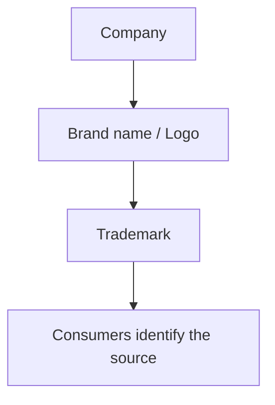

**Example**
Suppose a company creates a unique brand name: **"TechNova"**
The trademark helps distinguish its goods/services from competitors.

**Exam sentence**
> The **Trade Marks Act, 1999** modernized India's trademark framework and provided for protection and registration of **trademarks and service marks**.

---

## 16. 2000 — Geographical Indications of Goods Act

**Full name**
Geographical Indications of Goods (Registration and Protection) Act, **1999**

It came into force in **2003**.

> **Important correction to the slide:** The slide labels it "2000". For an exam, be careful: the Act is **1999**, and it **came into force in 2003**.

**What is a Geographical Indication?**
A **GI** identifies a product whose:
* **quality**
* **reputation**, or
* **other characteristic**
is essentially attributable to its **geographical origin**.

**Simple example: Darjeeling Tea**
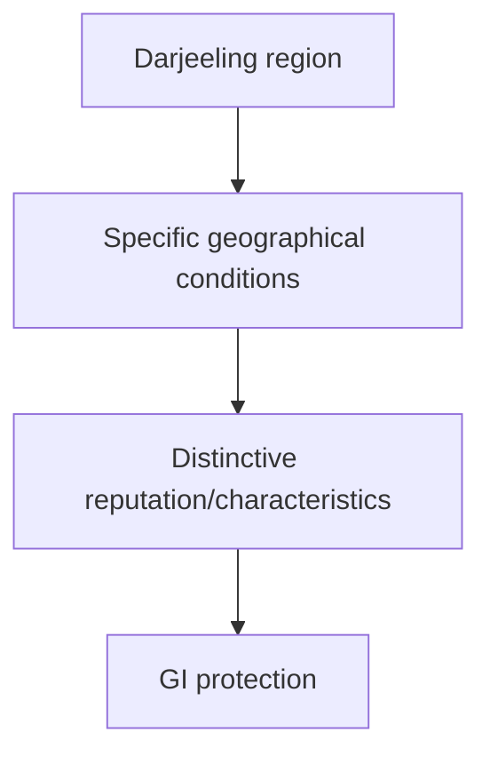

**Other examples include:**
* Darjeeling Tea
* Banarasi Saree
* Mysore Silk
* Kanchipuram Silk

**Easy distinction**
* **Trademark:** "Who made/sells this?"
* **GI:** "Where does this product come from?"

---

## 17. 2001 — Semiconductor Integrated Circuits Layout-Design Act

India introduced the **Semiconductor Integrated Circuits Layout-Design Act, 2000**, with the law coming into force in **2000/2001 framework depending on the provision/source chronology**.

> Your slide uses **2001**, so if your university's material specifically expects 2001, follow the course material, but know that the Act itself is titled **2000**.

**Purpose**
Protection of:
* **Semiconductor chip layouts**
* **Integrated circuit layout-designs**

**Why needed?**
Modern electronic chips require significant investment in their design. Someone could copy the physical layout of a chip and reproduce it. The law protects eligible **layout-designs**.

**Example**
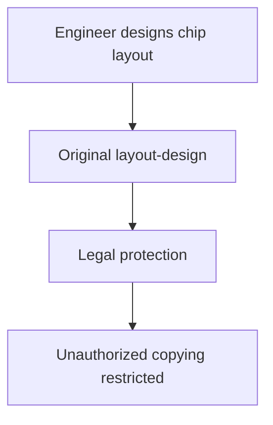

---

## 18. 2005 — Patent Amendment

This is another **very important milestone**.

India amended the **Patents Act in 2005** as part of bringing its patent regime into conformity with its **TRIPS obligations**.

**Major change**
It introduced **product patent protection** in areas including:
* **Pharmaceuticals**
* **Chemicals**
* **Food-related inventions** within the statutory framework

This represented a major change from the historical process-patent approach.

**Understand the transition**

**Earlier regime**
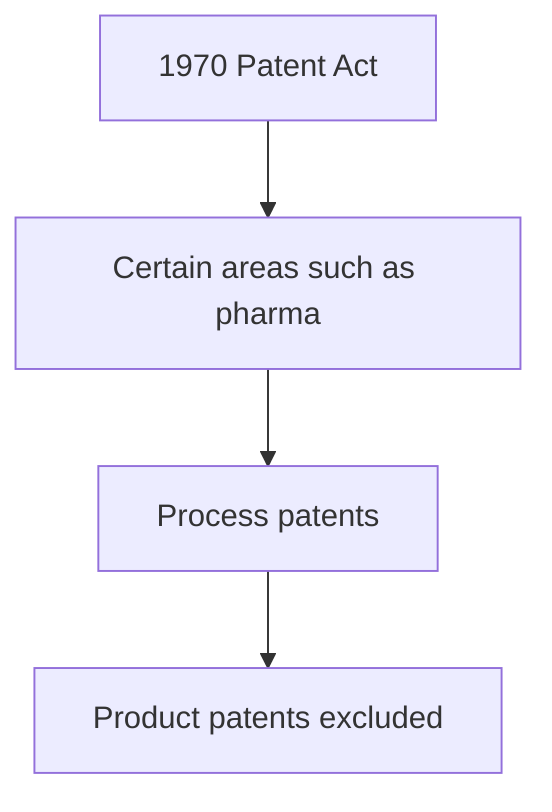

**After 2005 amendment**
```mermaid
flowchart TD
    A[TRIPS obligations] --> B[2005 amendment]
    B --> C[Product patent protection introduced]
    C --> D[Pharmaceuticals + other covered fields]
```

**Other developments**
The amendment also strengthened the **patent examination and protection framework**.

**Exam sentence**
> The **2005 amendment to India's Patents Act** was a major step toward compliance with **TRIPS obligations** and introduced **product patent protection** in areas such as pharmaceuticals and chemicals.

---

## 19. Complete Timeline — International + India

This is probably the **best diagram to reproduce in an exam**.

```mermaid
flowchart TD
    A[HISTORICAL DEVELOPMENT OF IPR]
    A --> B[1624\nStatute\nof Monopolies]
    B --> C[Patent\nprinciples]
    A --> D[1710\nStatute\nof Anne]
    D --> E[Copyright\nprinciples]
    A --> F[1883\nParis\nConvention]
    F --> G[Industrial\nProperty]
    
    G --> H[1886\nBerne Convention\nInternational Copyright]
    H --> I[1967\nWIPO\nInternational IP body]
    I --> J[1974\nWIPO -> UN Specialized Agency]
    J --> K[1995\nTRIPS Agreement\nMinimum international IP standards]
    
    K --> L[INDIAN DEVELOPMENT]
    L --> M[1856 -> First Patent Law]
    M --> N[1911 -> Patents & Designs Act]
    N --> O[1970 -> Patents Act]
    O --> P[1999 -> Trade Marks Act]
    P --> Q[2000/2003 -> GI framework]
    Q --> R[2000/2001 -> Semiconductor Layout-Design framework]
    R --> S[2005 -> Patent Amendment]
```

---

## 20. Most Important Differences

**Paris Convention vs Berne Convention**

| **Point** | **Paris Convention** | **Berne Convention** |
| :--- | :--- | :--- |
| **Year** | **1883** | **1886** |
| **Main area** | **Industrial Property** | **Copyright** |
| **Protects** | Patents, trademarks, designs, etc. | Literary & artistic works |
| **Key principle** | **Right of Priority** | **Automatic Protection** |
| **Also important** | **National Treatment** | **National Treatment** |
| **Example** | Patent for a machine | Copyright in a novel |

**Memory trick**
> **PARIS = PATENT/PRODUCT/INDUSTRIAL**
> **BERNE = BOOKS/ART/COPYRIGHT**

---

## 21. WIPO vs WTO/TRIPS

| **WIPO** | **TRIPS/WTO** |
| :--- | :--- |
| **World Intellectual Property Organization** | **TRIPS = WTO agreement** |
| Established under **1967 Convention** | Came into force **1995** |
| Specialized UN agency since **1974** | Part of WTO framework |
| Focuses on international **IP cooperation/administration** | Sets **minimum IP standards** for WTO members |
| Geneva | WTO headquarters: Geneva |

**Easy way**
```mermaid
flowchart TD
    A[WIPO] --> B[International IP cooperation + Administration of IP systems/treaties]
    C[TRIPS] --> D[WTO]
    D --> E[Minimum IP standards + Enforcement obligations + International trade]
```

---

## 22. Patent vs Copyright vs Trademark vs GI

This is highly useful for understanding the whole chapter.

| **IPR** | **Protects** | **Simple example** |
| :--- | :--- | :--- |
| **Patent** | **Invention** | New machine |
| **Copyright** | **Creative expression** | Book/song/software |
| **Trademark** | **Brand/source identifier** | Logo/brand name |
| **GI** | Product linked to **geographical origin** | Darjeeling Tea |
| **Industrial Design** | **Visual appearance/design** | Unique product shape |
| **Trade Secret** | **Confidential business information** | Secret formula |

---

## 23. Why Did IPR Develop?

This is a likely conceptual question.

**Answer structure:**
IPR developed because societies needed to balance **innovation and public access**.

```mermaid
flowchart TD
    A[CREATOR] --> B[creates]
    B --> C[INVENTION / CREATIVE WORK]
    C --> D[LEGAL PROTECTION]
    D --> E[Patent\nCopyright\nTrademark\nOther IP rights]
    E --> F[EXCLUSIVE RIGHTS FOR LIMITED/DEFINED PERIOD]
    F --> G[INCENTIVE TO CREATE + INNOVATE]
    G --> H[TECHNOLOGICAL + CULTURAL + ECONOMIC DEVELOPMENT]
```

The important concept is that IPR gives **legal protection/exclusive rights** while generally operating within defined **limitations, exceptions and durations**.

---

## 24. Significance of Historical Development of IPR

Your final slide gives the overall significance.

**1. Encouraged Innovation**
IPR gives inventors an opportunity to obtain legal protection for inventions.
*Example:* A company develops a new technology → patent protection → greater incentive to invest in development.

**2. Protected Creators**
Copyright protects eligible creative expression from unauthorized uses covered by copyright law.
*Example:* Author writes a novel → copyright → unauthorized copying can be challenged.

**3. Promoted International Trade**
International agreements such as the **Paris Convention, Berne Convention and TRIPS** created frameworks for international IP protection.

**4. Increased International Cooperation**
Organizations such as **WIPO** facilitate cooperation between countries in the field of intellectual property.

**5. Encouraged Research and Development**
IP protection can help businesses and institutions seek returns from investment in **R&D**.
```mermaid
flowchart TD
    A[R&D investment] --> B[New invention]
    B --> C[IP protection]
    C --> D[Commercial opportunity]
    D --> E[Further investment in R&D]
```

**6. Supported Technology Transfer**
IP systems can facilitate **licensing** and other mechanisms through which technology is transferred.
*Example:*
```mermaid
flowchart TD
    A[Company A owns patent] --> B[Licensing agreement]
    B --> C[Company B uses technology legally]
    C --> D[Technology transfer]
```

**7. Contributed to Economic Development**
IP can create commercial value through:
* Patents
* Copyright
* Trademarks
* Designs
* GIs
* Licensing
Therefore, IPR became connected with **innovation, commerce and industrial development**.

---

## 25. Full-Marks 10-Mark Answer

If the question is: **"Explain the historical development of Intellectual Property Rights."**

You can write this:

**Introduction**
**Intellectual Property Rights (IPR)** are legal rights that protect **creations of the human mind**, including inventions, literary and artistic works, trademarks, designs and geographical indications. The development of IPR occurred gradually from national systems to an international framework.

**Historical development**
1. **Statute of Monopolies — 1624:**
The English **Statute of Monopolies** restricted arbitrary monopolies and recognized patent protection for certain **new inventions**. It was an important milestone in the development of modern patent law.
2. **Statute of Anne — 1710:**
The **Statute of Anne** was an important early modern copyright law. It recognized the rights of **authors** over literary works and introduced limited copyright protection.
3. **Industrial Revolution — 18th–19th centuries:**
Rapid **industrialization, technological development and international trade** increased the importance of protecting inventions, designs and trademarks.
4. **Paris Convention — 1883:**
The **Paris Convention** established an international framework for **industrial property**, including patents and trademarks. Its important principles include **national treatment** and **right of priority**.
5. **Berne Convention — 1886:**
The **Berne Convention** established an international framework for protecting **literary and artistic works**. Important principles include **national treatment** and **automatic copyright protection**.
6. **WIPO — 1967/1970:**
The **WIPO Convention was adopted in 1967**, and WIPO came into existence when the Convention entered into force in **1970**. It promotes international cooperation in intellectual property.
7. **WIPO and UN — 1974:**
In **1974**, WIPO became a **specialized agency** of the United Nations.
8. **TRIPS — 1995:**
The **TRIPS Agreement**, under the WTO framework, established **minimum standards for IP protection and enforcement** among WTO members.

**Development in India**
India's IPR system developed through several stages:
* **1856** — First patent legislation
* **1911** — Indian Patents and Designs Act
* **1970** — Patents Act
* **1999** — Trade Marks Act
* **1999/2003** — Geographical Indications framework
* **2000** — Semiconductor Integrated Circuits Layout-Design Act
* **2005** — Major patent amendment introducing **product patent protection** in relevant fields

**Conclusion**
Thus, IPR evolved from early national patent and copyright systems into a **global framework** involving **international treaties, WIPO and WTO/TRIPS**, while India developed its own legal framework covering **patents, copyright, trademarks, geographical indications, designs and other forms of intellectual property**.

---

## 26. Super-Short Revision — Memorize This

If you have only **5 minutes before the exam**, learn this:

```
1624 → Statute of Monopolies → PATENT
1710 → Statute of Anne → COPYRIGHT

1883 → Paris Convention → INDUSTRIAL PROPERTY
     → National Treatment + Right of Priority

1886 → Berne Convention → COPYRIGHT
     → National Treatment + Automatic Protection

1967 → WIPO Convention
1970 → WIPO Convention enters into force
1974 → WIPO becomes UN specialized agency

1995 → TRIPS → WTO → MINIMUM IP STANDARDS
```

**India**
```
1856 → First Patent Law
1911 → Patents & Designs Act
1970 → Patents Act
1999 → Trade Marks Act
1999 → GI Act
2000 → Semiconductor Layout-Design Act
2005 → Patent Amendment → Product Patents
```

---

## 27. Ultimate Memory Diagram

```mermaid
flowchart TD
    A[DEVELOPMENT OF IPR]
    A --> B[EARLY NATIONAL LAWS]
    B --> C[1624\nPATENTS\nStatute of Monopolies]
    B --> D[1710\nCOPYRIGHT\nStatute of Anne]
    
    C --> E[INDUSTRIAL REVOLUTION]
    D --> E
    
    E --> F[NEED FOR INTERNATIONAL\nIP PROTECTION]
    
    F --> G[1883\nPARIS\nINDUSTRIAL IP]
    F --> H[1886\nBERNE\nCOPYRIGHT]
    
    G --> I[1967\nWIPO]
    H --> I
    
    I --> J[1974\nWIPO + UN]
    
    J --> K[1995\nTRIPS]
    
    K --> L[GLOBAL MINIMUM STANDARDS]
    
    L --> M[INDIA'S MODERN IPR\nSYSTEM]
    
    M --> N[Patent]
    M --> O[Trademark]
    M --> P[GI]
    M --> Q[Designs]
    M --> R[Copyright]
```

⭐️ **The 8 keywords that can save the entire chapter**
* **1624** — Patent
* **1710** — Copyright
* **1883** — Paris
* **1886** — Berne
* **1967** — WIPO Convention
* **1974** — UN Specialized Agency
* **1995** — TRIPS
* **2005** — Product Patents in India

If you remember those **8 milestones + what each one did**, you can reconstruct most answers from this entire set of slides.


## 🧠 Ultimate Mindmap: Historical Development
```mermaid
mindmap
  root((History of IPR))
    Early Origins
      1624 Statute of Monopolies
        England
        Restricted arbitrary monopolies
        Patents for new inventions
      1710 Statute of Anne
        England
        Early modern copyright
        Protected authors
      Industrial Revolution
        Tech development
        More inventions
        Need for IP protection
    International Framework
      1883 Paris Convention
        Industrial Property
        National Treatment
        Right of Priority
      1886 Berne Convention
        Copyright
        Literary & Artistic Works
        Automatic Protection
      1967 WIPO
        World IP Organization
        Geneva
        1974 UN Specialized Agency
      1995 TRIPS
        WTO Agreement
        Minimum IP standards
        Enforcement framework
    Indian Development
      1856 First Patent Law
      1911 Patents & Designs Act
      1970 Patents Act
        Process patents in pharma
        Domestic industry focus
      1999 Trade Marks Act
        Service marks
      1999 GI Act
        Geographical origin
      2000 Semiconductor Layout Act
      2005 Patent Amendment
        Product patents introduced
        TRIPS compliance
    Significance
      Encourage Innovation
      Protect Creators
      Promote Trade
      International Cooperation
      Technology Transfer
      Economic Development
```
