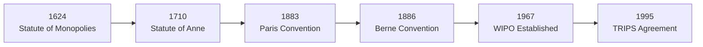

# Chapter 2: Historical Development of IPR

---

## Introduction

IPR has evolved over centuries to protect human creativity and innovation. Initially, inventors had **little or no legal protection**. Over time, governments recognized that giving exclusive rights would **encourage innovation and economic growth**.

---

## Timeline of IPR Development

---

## Key Milestones

### 1. Statute of Monopolies (1624) — England
- Restricted King's power to grant monopolies arbitrarily
- Allowed patents **only for new inventions**
- Patent protection for **14 years**
- ✅ **Considered the basis of modern patent law**

### 2. Statute of Anne (1710) — England
- **First modern copyright law**
- Protected **authors** (not just printers)
- Granted exclusive rights to publish literary works
- Initial protection: **14 years**, renewable once

### 3. Industrial Revolution (18th–19th Century)
- Rapid growth of inventions and machinery
- Increased patent filings and international trade
- Governments strengthened patent and trademark systems

### 4. Paris Convention (1883)
- First **international agreement on industrial property**
- Covers: Patents, Trademarks, Industrial Designs, Trade Names
- **Key Principles:**
  - **National Treatment** – Foreigners get same protection as citizens
  - **Right of Priority** – Filing in one country protects filing date in others

### 5. Berne Convention (1886)
- International copyright protection
- Covers: Books, Music, Films, Paintings, Software, Artistic Works
- **Automatic copyright** — No registration required
- Equal protection in all member countries

### 6. WIPO Established (1967)
- **HQ: Geneva, Switzerland**
- Promotes IP protection worldwide
- Administers international IP treaties
- Assists developing countries

### 7. WIPO Joins UN (1974)
- Became a **specialized UN agency**
- Promotes innovation globally
- Supports technology transfer

### 8. TRIPS Agreement (1995)
- Under **WTO** (World Trade Organization)
- Standardized **minimum IPR protection** globally
- Covers: Patents, Copyright, Trademarks, GIs, Industrial Designs, Trade Secrets
- Required India to amend its IP laws

---

## Evolution of IPR in India

| Year | Development |
|---|---|
| 1856 | First Patent Law (based on British law) |
| 1911 | Indian Patents and Designs Act |
| 1970 | Indian Patent Act (replaced 1911 Act) |
| 1999 | Trade Marks Act (modernized trademark system) |
| 2000 | Geographical Indications of Goods Act |
| 2001 | Semiconductor Integrated Circuits Layout-Design Act |
| 2005 | Patent Amendment Act (product patents for pharma) |

---

## Significance of Historical Development

- Encouraged innovation and scientific research
- Protected inventors from unauthorized use
- Promoted international trade and technology transfer
- Standardized IP laws across countries
- Strengthened global cooperation through WIPO and WTO

---

## Quick Revision Table

| Year | Event | Significance |
|---|---|---|
| 1624 | Statute of Monopolies | Foundation of modern patent law |
| 1710 | Statute of Anne | First modern copyright law |
| 1883 | Paris Convention | International industrial property protection |
| 1886 | Berne Convention | International copyright protection |
| 1967 | WIPO Established | Global IP administration |
| 1974 | WIPO joins UN | Specialized UN agency for IP |
| 1995 | TRIPS Agreement | Global minimum IPR standards |
| 2005 | Indian Patent Amendment | Product patents introduced in India |
