# Types of Intellectual Property Rights (IPR)

## Intellectual Property Rights (IPR) — Complete Exam Notes
Below is a **structured, easy-to-write, exam-oriented version** of all the slides you provided. I have preserved the important concepts while simplifying the language.

> **Exam Strategy:** Learn the **bold keywords**. In a 5–10 mark answer, use the **definition → key points → example → comparison/diagram** structure.

---

## 1. What is Intellectual Property Rights (IPR)?

**Intellectual Property (IP)** means a **creation of the human mind**, such as an invention, brand name, software, book, artistic work, design, etc.

**Intellectual Property Rights (IPR)** are the **legal rights given to creators/owners** over their intellectual creations.

**Simple Example**
Suppose a person develops a **new battery technology**.
* The **technology/invention** → may be protected by a **Patent**
* The **company name/logo** → **Trademark**
* The **software code** → **Copyright**
* The **physical appearance/design** → **Industrial Design**

**Easy Diagram**
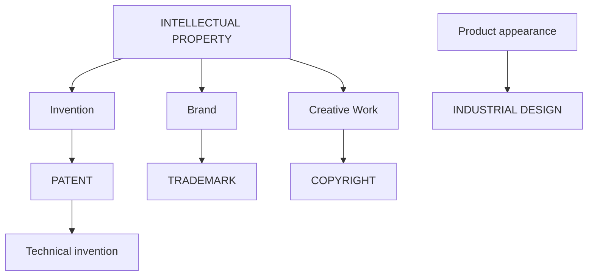

---

## 2. Types / Kinds of IPR

The major forms of Intellectual Property Rights include:

**A. Industrial Property**
1. **Patent**
2. **Trademark**
3. **Industrial Design**
4. **Geographical Indication (GI)**

**B. Copyright and Related Rights**
5. **Copyright**
6. **Related rights of performers, producers and broadcasters**

**C. Other Forms**
7. **Trade Secrets**
8. **Plant Variety Protection**
9. **Semiconductor Integrated Circuit Layout-Design**

**Easy Classification**
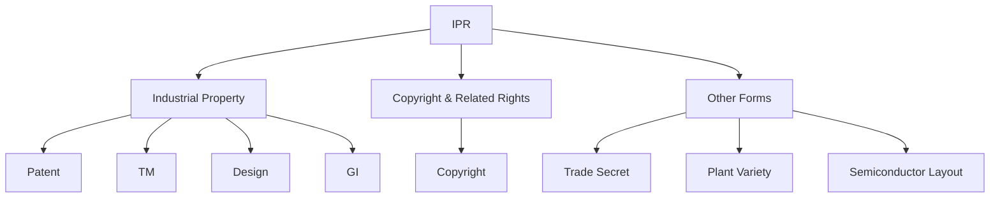

---

## 3. Four Major IPRs

For most basic exam questions, remember these **four major IPRs**:

| **IPR** | **Protects** | **Easy Example** |
| :--- | :--- | :--- |
| **Patent** | **Inventions** | New battery technology |
| **Trademark** | **Brand identity** | Company name/logo |
| **Copyright** | **Creative works** | Software code/book/music |
| **Industrial Design** | **Product appearance** | Shape/design of a phone |

**One-Line Memory Trick**
* **Patent** = How it works
* **Trademark** = Who it belongs to / identifies the source
* **Copyright** = How the idea is expressed
* **Industrial Design** = How the product looks

---

## 4. PATENT

**Definition**
A **patent** is an **exclusive legal right granted for an invention**.
It allows the **patent owner to prevent others from commercially exploiting the patented invention without authorization**, subject to applicable law.

**In simple words:**
If you invent something new and obtain a patent, others generally **cannot commercially make, use, sell, or otherwise exploit the patented invention without authorization**, subject to the law and the scope of the patent.

## 5. What Can a Patent Protect?
A patent may protect:
* **New products**
* **New processes**
* **Technical improvements**
* **New technological solutions**

**Example**
A researcher develops a new **energy-efficient battery** that:
* charges faster,
* stores more energy,
* lasts longer.
If it satisfies the legal requirements for patentability, the inventor may seek **patent protection**.

## 6. Requirements for a Patent
An invention generally needs to satisfy **three important requirements**.

**1. Novelty**
The invention must be **new** and not already publicly known.
*Simple Example:* If someone already publicly disclosed the exact same battery technology, a later applicant generally cannot claim it as a **novel invention**.

**2. Inventive Step**
The invention should involve a **non-obvious technical advancement**.
*In simple words:* It should not be an obvious solution to a person skilled in that field.

**3. Industrial Applicability**
The invention must be **capable of being made or used in industry**.

**Easy Memory Trick**
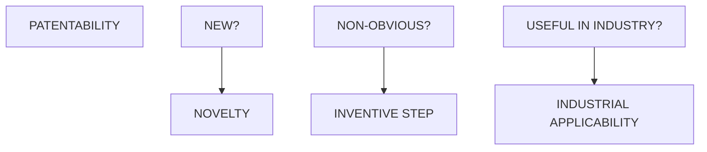

**Remember: N + I + I**
* **N**ovelty
* **I**nventive Step
* **I**ndustrial Applicability

## 7. Rights of a Patent Owner
A patent gives the owner **exclusive rights**, subject to applicable law.
The owner can generally:
1. **Manufacture** the patented product.
2. **Use** the patented process.
3. **Sell or distribute** the invention.
4. **License** the invention.
5. **Assign** the patent.
6. Take **legal action against infringement**.

**Important Point**
A patent is a **limited-term right**. It does **not mean permanent ownership** of the invention.

**Easy Diagram**
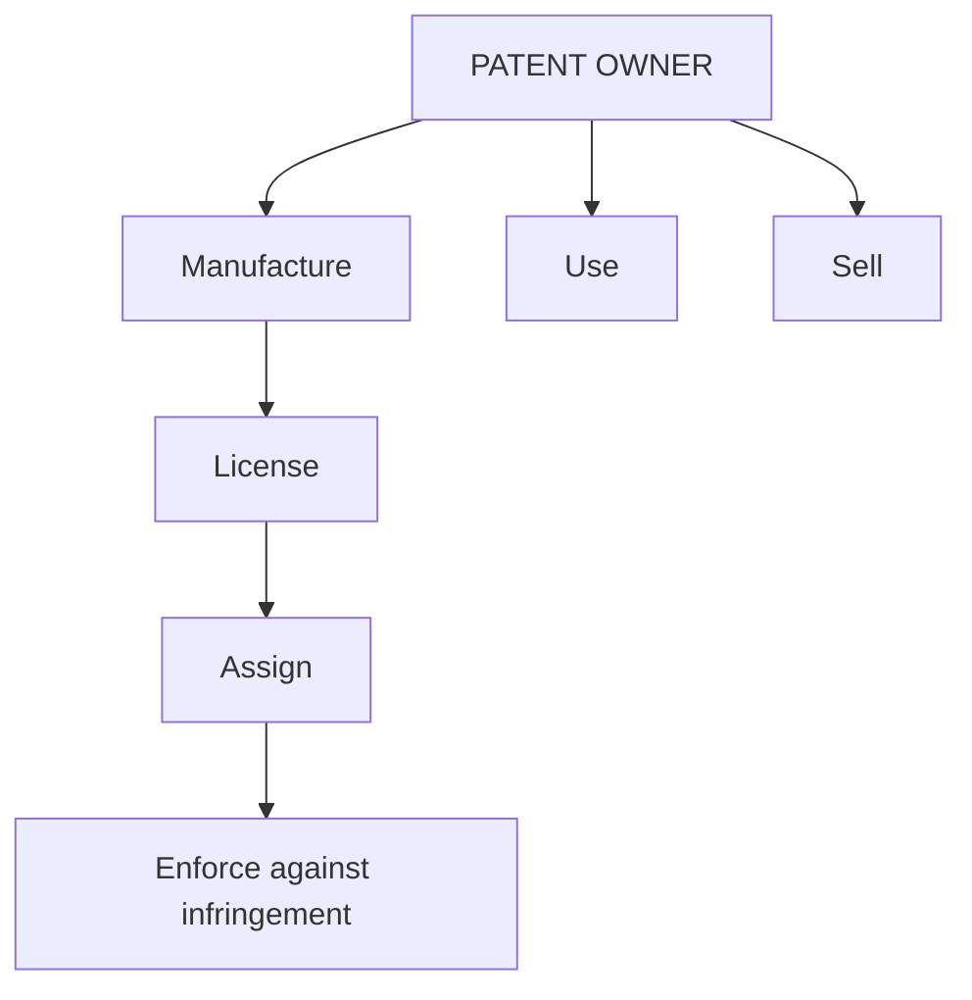

## 8. Patent Example — Electric Vehicle Battery
Suppose a researcher develops a new **EV battery**.
The battery:
* charges faster,
* stores more energy,
* has a longer lifespan.

If the invention satisfies the requirements of patentability, the technical invention may be protected by a **patent**.

**Important distinction**
A patent protects the **technical invention and its claimed features**.
It does **not automatically protect**:
* Company name
* Logo
* Artistic appearance of the battery
Those may require **other forms of IPR**.

---

## 9. TRADEMARK

**Definition**
A **trademark** is a **sign capable of distinguishing the goods or services of one business from those of others**.

**In simple words:**
A trademark helps customers recognize **which business/product/service comes from a particular source**.

## 10. Examples of Trademarks
A trademark may include:
* **Brand names**
* **Logos**
* **Symbols**
* **Words**
* **Labels**
* **Certain shapes**
* **Sound marks**

Examples of well-known brand identifiers include:
* **Apple**
* **Google**
* **Nike**
* **Tata**
* **Amul**

## 11. Purpose of a Trademark
The main purpose is to help consumers identify the **source or commercial origin** of goods or services.

**Example**
Suppose there are two companies selling smartphones:
```mermaid
flowchart TD
    A[Company A -> "ABC" + Logo]
    B[Company B -> "XYZ" + Logo]
```
Customers use the brand names/logos to distinguish the products.

## 12. Functions of a Trademark
There are **five important functions**.

**1. Identification**
Helps consumers **identify a particular brand**.

**2. Differentiation**
Distinguishes one business from its **competitors**.

**3. Quality Association**
Consumers may associate the mark with a particular **level of quality or reputation**.

**4. Goodwill**
Builds and protects the **reputation/goodwill** of a business.

**5. Legal Protection**
Helps prevent unauthorized use of **confusingly similar marks**, subject to applicable law.

**Memory Trick**
**I-D-Q-G-L**
**I**dentification → **D**ifferentiation → **Q**uality → **G**oodwill → **L**egal Protection

## 13. Trademark Example — Smartphone Company
Suppose a smartphone company has:

This is a **very important exam concept** because one product can have **multiple types of IPR protection**.

---

## 14. COPYRIGHT

**Definition**
**Copyright** is a form of **intellectual property protection for original literary, artistic, musical, dramatic and other eligible creative works**.

**Examples**
Copyright may apply to:
* **Books**
* **Research papers**
* **Music**
* **Films**
* **Paintings**
* **Photographs**
* **Computer programs**
* **Websites**
* **Digital content**

## 15. Copyright and Software
This is particularly important for **Computer Science and Engineering**.
Software-related works that may receive copyright protection include:
* **Source code**
* **Object code**
* **Software documentation**
* **User manuals**
* **Website content**
* **Graphics and multimedia elements**

**Example**
A programmer develops a new software application.
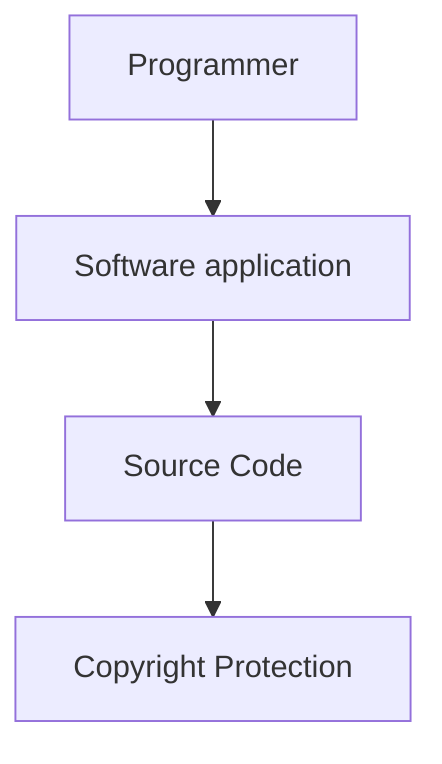

**VERY IMPORTANT CONCEPT**
> **Copyright generally protects the expression of an idea, not the underlying idea or principle itself.**

**Simple Example**
Suppose I have an idea:
"Create an application that lets users share files."
The **general idea itself** is not what copyright protects.
But my **original source code, documentation, graphics, etc.** may receive copyright protection.

## 16. Rights of a Copyright Owner
Copyright generally provides economic rights such as:
1. **Reproduction**
2. **Distribution**
3. **Public performance**
4. **Communication to the public**
5. **Adaptation**
6. **Translation**

It may also provide **moral rights** to authors under applicable law.

**Easy Diagram**
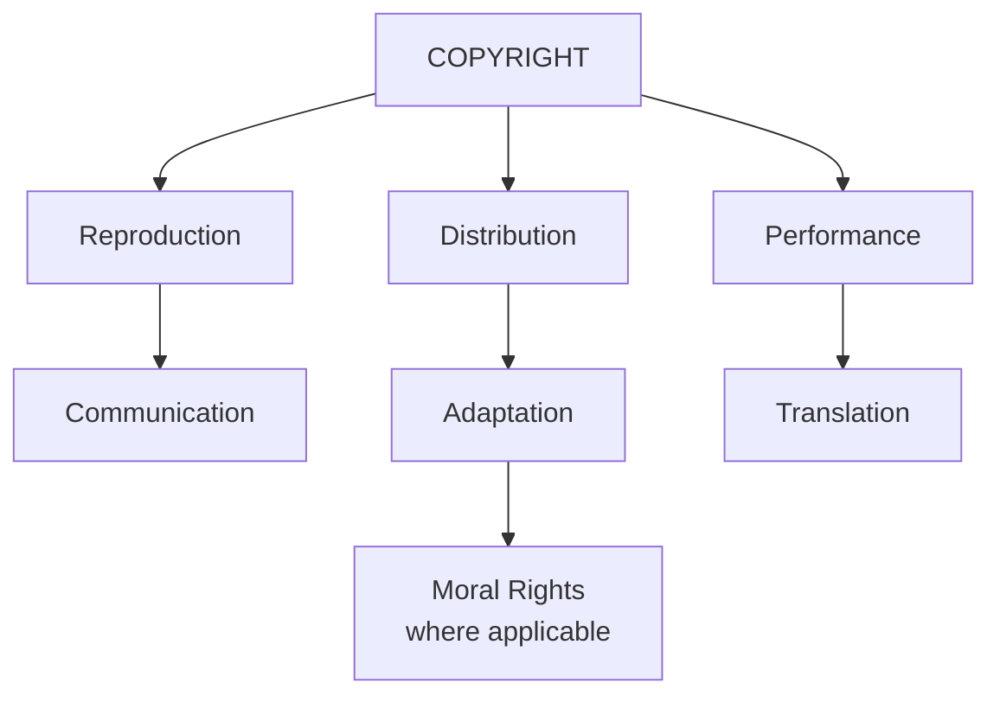

## 17. Copyright Example — Book
Suppose an author writes a book.

The author can generally control authorized:
* **Reproduction**
* **Publication/distribution**
* **Adaptation**
* **Translation**
subject to applicable **exceptions and limitations**.

**Example**
If someone copies and publishes the entire book without authorization, that may raise **copyright infringement** issues, depending on the circumstances and applicable law.

## 18. Copyright Duration
According to the material in your slides, in India, for many **literary, dramatic, musical and artistic works**:
> **Duration = Author's lifetime + 60 years**

**Important**
Different statutory terms can apply to certain categories such as:
* **Films**
* **Sound recordings**
* **Government works**

Also remember:
> Copyright protection generally arises **automatically when an eligible original work is created.**

**Registration is not a prerequisite for copyright to exist.**

**Very Important Difference**
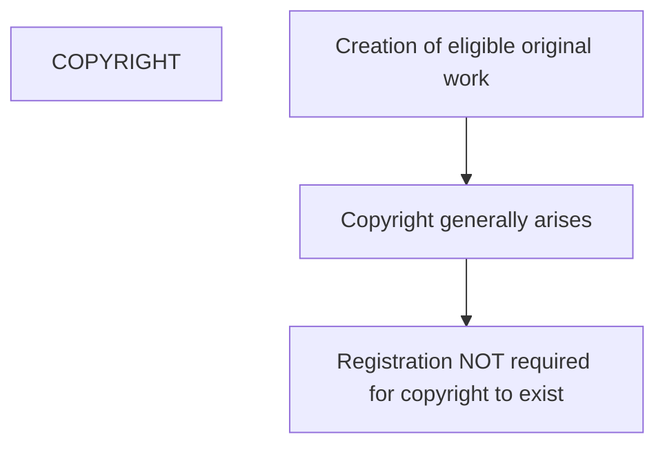

---

## 19. INDUSTRIAL DESIGN

**Definition**
**Industrial design protection safeguards the visual and aesthetic features of a product.**

It focuses on:
> **HOW A PRODUCT LOOKS**

rather than:
> **HOW THE PRODUCT TECHNICALLY FUNCTIONS**

## 20. What Can Industrial Design Include?
It may include:
* **Shape**
* **Configuration**
* **Pattern**
* **Ornamentation**
* **Composition of lines**
* **Composition of colors**

**Simple Example**
Suppose two phones have exactly the same internal technology.
But one phone has a unique:
* body shape,
* camera arrangement,
* visual pattern,
* external appearance.
That visual appearance may potentially be protected through **industrial design** if the legal requirements are satisfied.

## 21. Examples of Industrial Design
Industrial design can apply to:
* **Mobile phones**
* **Cars**
* **Watches**
* **Furniture**
* **Bottles**
* **Packaging**
* **Household appliances**
* **Electronic devices**

## 22. Mobile Phone Example — Very Important
Consider a mobile phone.
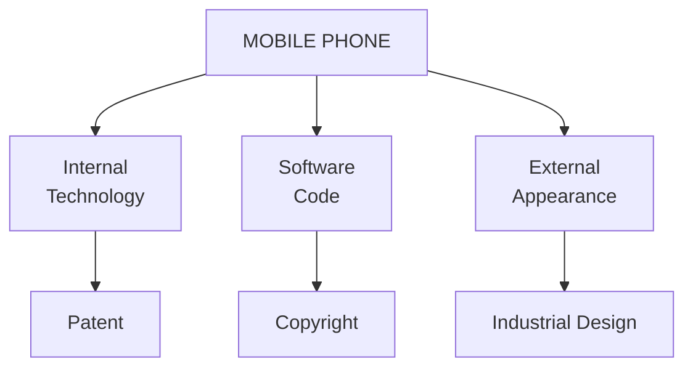
And:


**Therefore:**
A single smartphone can involve **four different IPRs**:

| **Smartphone element** | **IPR** |
| :--- | :--- |
| **Internal technology** | **Patent** |
| **Software/code** | **Copyright** |
| **Brand name/logo** | **Trademark** |
| **External appearance** | **Industrial Design** |

This is one of the **most useful examples to remember for the exam**.

## 23. What Industrial Design Does NOT Protect
Industrial design generally does **not** protect:
* **Technical functions**
* **Working mechanisms**
* **Scientific principles**
* **Manufacturing processes**
* **Purely functional features**

**Example**
Suppose a phone has a new camera mechanism.
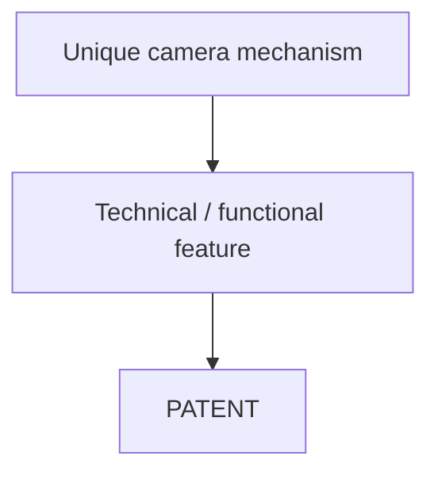

But if the phone has a unique external appearance:
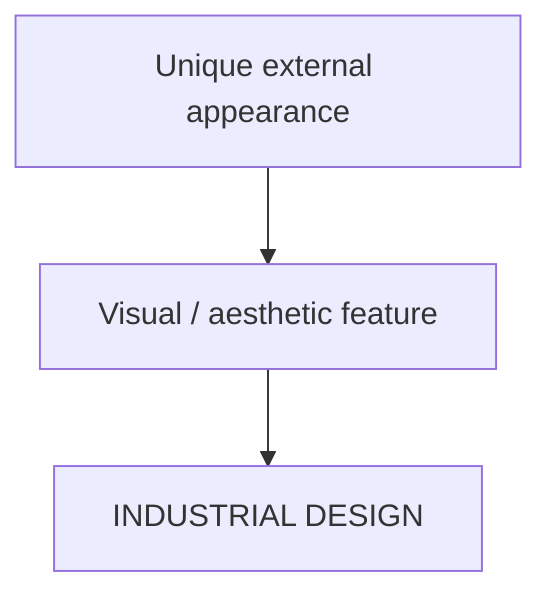

**Key Difference**
> **Patent → Technical functionality**
> **Industrial Design → Visual appearance**

## 24. Duration of Industrial Design in India
According to your slides:
* **Initial term = 10 years**
* **Can generally be extended by 5 years**
* **Maximum = 15 years**

So remember:
> **Industrial Design = 10 + 5 = 15 years**

The protection is subject to the requirements of the **Designs Act** and applicable rules.

---

## 25. Patent vs Trademark vs Copyright vs Industrial Design
This is a **high-probability exam question**.

| **Feature** | **Patent** | **Trademark** | **Copyright** | **Industrial Design** |
| :--- | :--- | :--- | :--- | :--- |
| **Protects** | **Inventions** | **Brand identity** | **Creative works** | **Product appearance** |
| **Main focus** | **Technical / functional** | **Commercial identity** | **Creative expression** | **Visual appearance** |
| **Example** | New battery | Brand logo | Software | Phone design |
| **Registration** | Required for patent rights | Registration available | Not required for existence | Required |
| **Typical term in India** | **20 years** | **10 years, renewable** | **Life + 60 years** for many works | **10 + 5 years** |

> **Important correction for your slides:** the slide on industrial-design duration says **10 + 5 = 15 years**, while the comparison slide correctly gives the patent term as **20 years**. Do **not** confuse patent duration with industrial-design duration.

---

## 26. The BEST Way to Remember the Four IPRs
Think about a **smartphone**.

**1. What makes the phone technically special?**
→ **Patent**

**2. What tells customers which company made it?**
→ **Trademark**

**3. What protects its software/code and other original expression?**
→ **Copyright**

**4. What protects its external visual appearance?**
→ **Industrial Design**

**One-Line Diagram**
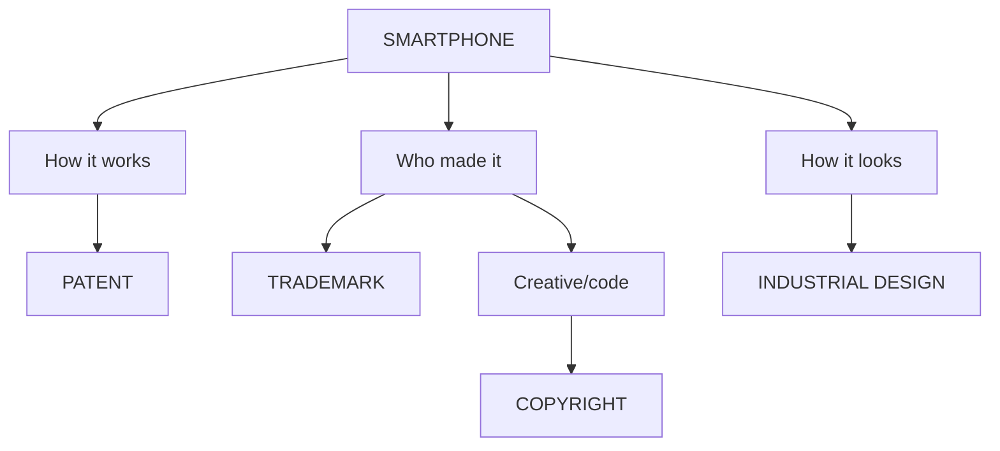

## 27. Patent vs Copyright — Important Difference
This is commonly confused.

| **Patent** | **Copyright** |
| :--- | :--- |
| Protects **inventions** | Protects **creative expression** |
| Focuses on **technical invention** | Focuses on **original expression** |
| Requires patent grant for patent rights | Copyright generally arises automatically for eligible works |
| Example: new battery technology | Example: source code |
| Protects claimed invention/features | Protects expression, not the underlying idea/principle |

**Easy Example**
Suppose you develop a new algorithm.
* The **source code implementing it** may be protected by **copyright**.
* **A technical invention** involving a patentable implementation may potentially qualify for **patent protection**, depending on applicable law.

## 28. Patent vs Industrial Design
Another important distinction:

**Patent**
Protects **technical/functional aspects**.

**Industrial Design**
Protects **visual/aesthetic aspects**.

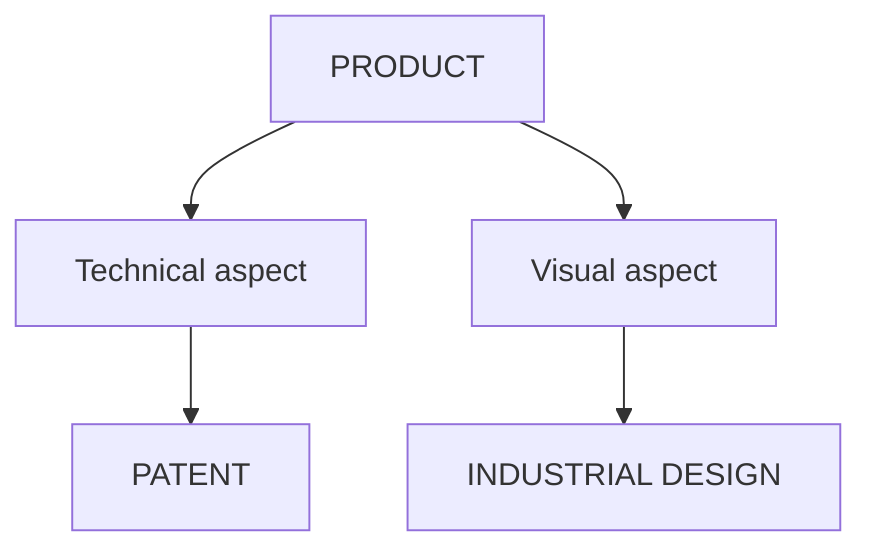

**Example: Phone**
* **Camera mechanism** → Patent
* **Shape/design of phone body** → Industrial Design

## 29. Trademark vs Copyright

**Trademark**
Protects **brand identity**.
*Example:* Company name / logo

**Copyright**
Protects **original creative expression**.
*Example:* Software code / photograph / book / music

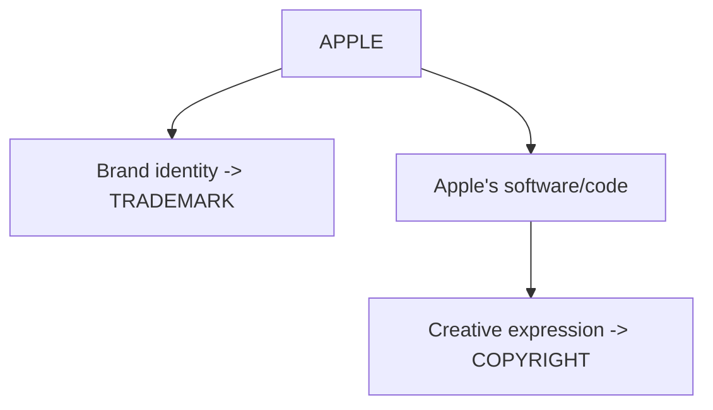

## 30. One Product Can Have Multiple IPRs
This is a very important overall concept.
Consider a **smartphone**.

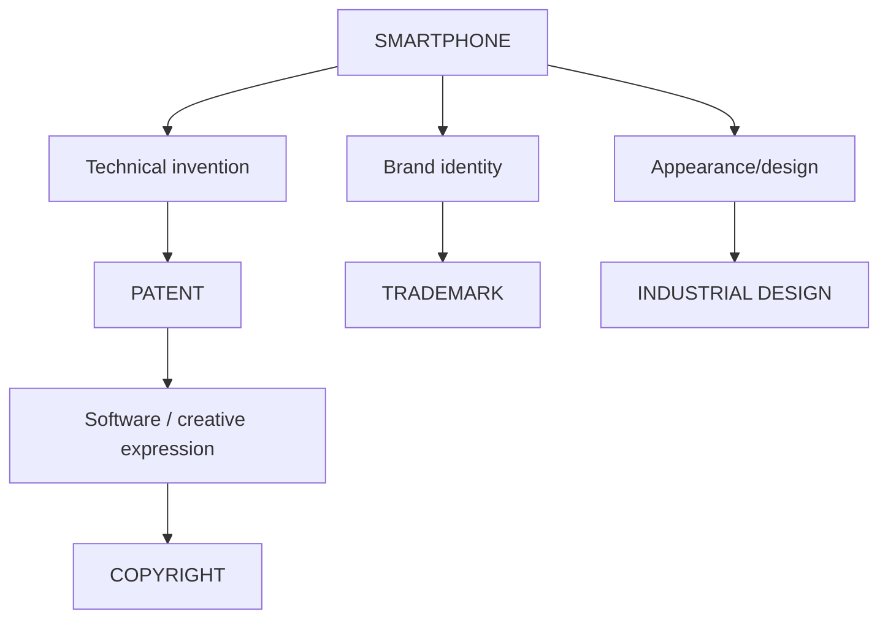
Therefore, **different aspects of the same product can be protected by different IPRs.**

---

## 31. Super-Fast Revision Table
If you have only **2 minutes before the exam**, remember this:

| **Question** | **Answer** |
| :--- | :--- |
| **What is IPR?** | Legal rights over **intellectual creations** |
| **Patent protects?** | **Inventions** |
| **Trademark protects?** | **Brand identity** |
| **Copyright protects?** | **Creative expression/works** |
| **Industrial Design protects?** | **Product appearance** |
| **Patent requirements?** | **Novelty + Inventive Step + Industrial Applicability** |
| **Patent example?** | New battery technology |
| **Trademark example?** | Company name/logo |
| **Copyright example?** | Software source code |
| **Industrial Design example?** | Shape/design of a phone |
| **Copyright registration required for existence?** | **No** |
| **Patent term in India?** | **20 years** |
| **Industrial design term in India?** | **10 + 5 = 15 years** |
| **Copyright for many literary/dramatic/musical/artistic works?** | **Author's lifetime + 60 years** |
| **Trademark term?** | **10 years, renewable** |

---

## 32. Full-Marks Answer: "Explain IPR"
If the question is simply **"Explain Intellectual Property Rights"**, you can write:

**Intellectual Property Rights (IPR)** are **legal rights granted to creators or owners over their intellectual creations**. They encourage innovation, creativity and commercial exploitation of intellectual creations while providing legal protection to their owners.

The major forms of IPR include **Patents, Trademarks, Copyrights and Industrial Designs**, along with other forms such as **Geographical Indications, Trade Secrets, Plant Variety Protection and Semiconductor Integrated Circuit Layout-Design**.

**Patent** protects **inventions**, **Trademark** protects **brand identity**, **Copyright** protects **original creative works**, and **Industrial Design** protects the **visual appearance of products**.

Then draw:
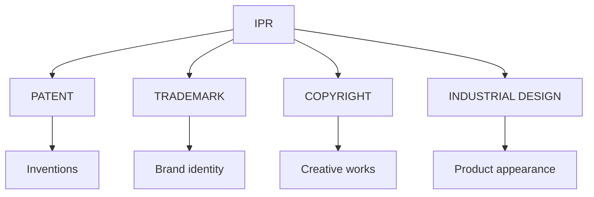

## 33. Full-Marks Answer: "Explain Patent"
A **patent** is an **exclusive legal right granted for an invention**. It generally allows the patent owner to prevent others from commercially exploiting the patented invention **without authorization**, subject to applicable law.

An invention generally needs to satisfy three important requirements: **Novelty, Inventive Step and Industrial Applicability**.

A patent may protect **new products, new processes, technical improvements and technological solutions**.

The patent owner may generally **manufacture, use, sell, license and assign** the patented invention and may take legal action against infringement.

In India, a patent generally has a **20-year term**, subject to applicable law.

## 34. Full-Marks Answer: "Explain Trademark"
A **trademark** is a **sign capable of distinguishing the goods or services of one business from those of others**.

Examples include **brand names, logos, symbols, words, labels, certain shapes and sound marks**.

The major functions of a trademark are **identification, differentiation, quality association, goodwill and legal protection**.

A trademark therefore helps consumers identify the **source or commercial origin** of goods or services.

## 35. Full-Marks Answer: "Explain Copyright"
**Copyright** is a form of **intellectual property protection for original literary, artistic, musical, dramatic and other eligible creative works**.

Examples include **books, music, films, photographs, paintings, computer programs, websites and digital content**.

In computer science, copyright may protect **source code, object code, documentation, user manuals and website content**.

Copyright generally protects the **expression of an idea rather than the underlying idea or principle itself**.

The copyright owner generally has economic rights such as **reproduction, distribution, public performance, communication to the public, adaptation and translation**.

For many literary, dramatic, musical and artistic works in India, the term is generally **the author's lifetime plus 60 years**.

## 36. Full-Marks Answer: "Explain Industrial Design"
**Industrial design protection safeguards the visual and aesthetic features of a product.** It focuses on **how a product looks rather than how it technically functions**.

It may include **shape, configuration, pattern, ornamentation, composition of lines and composition of colours**.

Examples include designs of **mobile phones, cars, watches, furniture, bottles, packaging and electronic devices**.

Industrial design generally does not protect **technical functions, working mechanisms, scientific principles, manufacturing processes or purely functional features**.

In India, according to the material provided, the protection is **10 years initially and may generally be extended by 5 years**, giving a maximum of **15 years**.

---

## 37. Most Important Keywords to Memorize

**IPR**
**Legal rights → Intellectual creations**

**Patent**
**Invention → Novelty → Inventive Step → Industrial Applicability → Exclusive right → 20 years**

**Trademark**
**Brand identity → Distinguish → Source → Goodwill → Legal protection → 10 years renewable**

**Copyright**
**Original creative work → Expression → Source code → Reproduction → Distribution → Adaptation → Translation → Lifetime + 60 years for many works**

**Industrial Design**
**Visual appearance → Aesthetic features → Shape → Pattern → Configuration → Ornamentation → 10 + 5 years**

---

## 38. The Ultimate Memory Formula
Just memorize:
* **PATENT = INVENTION**
* **TRADEMARK = BRAND**
* **COPYRIGHT = CREATION**
* **INDUSTRIAL DESIGN = APPEARANCE**

And for the patentability question:
**N + I + I**
**Novelty + Inventive Step + Industrial Applicability**

And for the smartphone example:
* **Technology → Patent**
* **Name/Logo → Trademark**
* **Code → Copyright**
* **Appearance → Industrial Design**

If you remember these three blocks, you can reconstruct most of the answers from the slides during the exam.


## 🧠 Ultimate Mindmap: Types of IPR
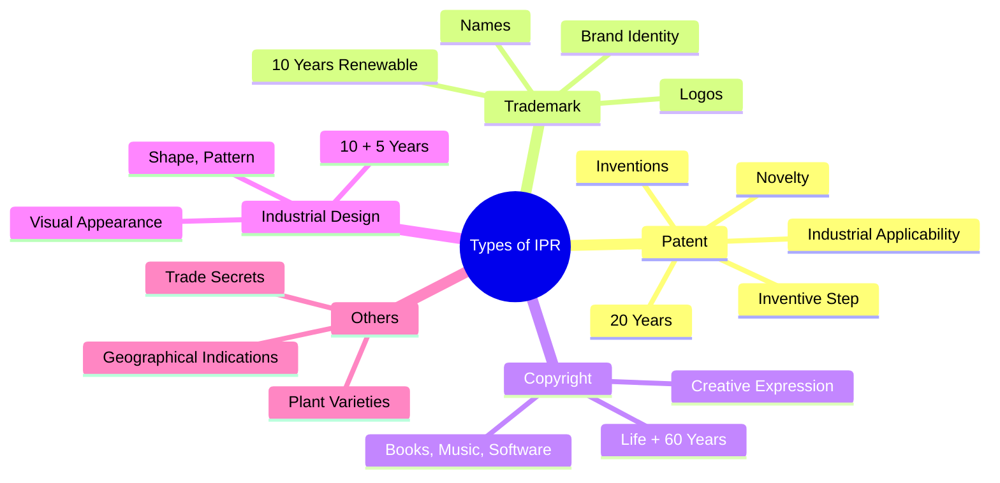
