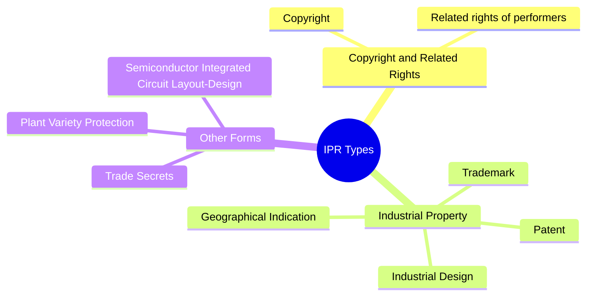
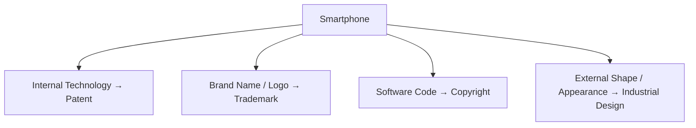

# Chapter 3: Types of Intellectual Property Rights (IPR)

---

## Overview

---

## 1. Patent

A patent is an **exclusive legal right** granted for an invention. It prevents others from **commercially exploiting** the patented invention without authorization.

**A patent may protect:**
- New products
- New processes
- Technical improvements
- New technological solutions

**Requirements for a Patent (3 conditions):**
1. **Novelty** – Must be new, not already publicly known
2. **Inventive Step** – Non-obvious technical advancement
3. **Industrial Applicability** – Must be usable in industry

**Rights of Patent Owner:**
- Manufacture, use, sell, or distribute the invention
- License or assign the patent
- Take legal action against infringement

> 🧠 **Patent = Invention**

---

## 2. Trademark

A trademark is a **sign** that distinguishes the goods or services of one business from those of others.

**Can include:** Brand names, Logos, Symbols, Words, Labels, Shapes, Sound marks

**Functions:**
1. **Identification** – Helps consumers identify a brand
2. **Differentiation** – Distinguishes from competitors
3. **Quality Association** – Represents quality/reputation
4. **Goodwill** – Builds business reputation
5. **Legal Protection** – Prevents unauthorized similar marks

**Examples:** Apple, Google, Nike, Tata, Amul

> 🧠 **Trademark = Brand Identity**

---

## 3. Copyright

Copyright protects **original literary, artistic, musical, dramatic** and other creative works.

**Examples:** Books, Research papers, Music, Films, Paintings, Photographs, Computer programs, Websites

**Key Point:** Copyright protects the **expression of an idea**, NOT the underlying idea itself.

**Rights of Copyright Owner:**
- Reproduction, Distribution, Public performance
- Communication to the public, Adaptation, Translation
- Moral rights (under applicable law)

**Duration in India:** Author's Lifetime + **60 years**

> 🧠 **Copyright = Creative Expression**

---

## 4. Industrial Design

Protects the **visual/aesthetic features** of a product — how it **looks**, not how it technically functions.

**Includes:** Shape, Configuration, Pattern, Ornamentation, Colors

**Does NOT protect:** Technical functions, Working mechanisms, Scientific principles

**Duration in India:** Initial **10 years** + Extension of **5 years** = Max **15 years**

> 🧠 **Industrial Design = Appearance**

---

## Comparison: Four Major IPRs

| Feature | Patent | Trademark | Copyright | Industrial Design |
|---|---|---|---|---|
| **Protects** | Inventions | Brand identity | Creative works | Product appearance |
| **Main focus** | Technical/functional | Commercial identity | Creative expression | Visual appearance |
| **Example** | New battery | Brand logo | Software | Phone design |
| **Registration** | Required | Available | Not required | Required |
| **Term in India** | 20 years | 10 years, renewable | Life + 60 years | 10 + 5 years |

---

## Smartphone Example (All 4 IPRs)

---

## Other Forms of IPR

### Geographical Indication (GI)
- Protects products linked to a **specific geographical origin**
- The product's quality or reputation is tied to that place
- **Examples:** Darjeeling Tea, Kanchipuram Silk, Banarasi Sarees, Alphonso Mango

### Trade Secret
- Protects **confidential business information**
- Must remain secret and have economic value
- **Examples:** Coca-Cola formula, secret manufacturing processes

### Plant Variety Protection
- Protects **new plant varieties** developed through breeding
- Subject to applicable legal requirements

> 🧠 **Memory: P-T-C-D-G-T-P** (Patent, Trademark, Copyright, Design, GI, Trade Secret, Plant Variety)
