# Importance of Intellectual Property Rights (IPR)

## 2. Why is IPR Important?
IPR is important because it provides **legal protection** to **innovations, creative works, brands and designs**.

It creates a balance between:
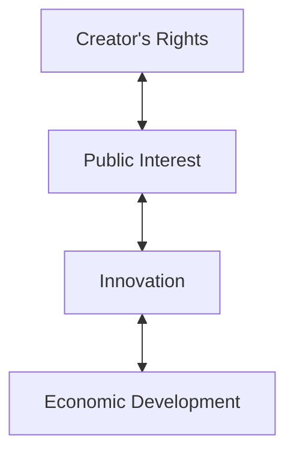

### Major Importance of IPR

#### 1. Protects Intellectual Creations
IPR prevents or provides legal remedies against **unauthorized use, copying or exploitation** of protected intellectual property.
**Example:**
A company develops an original software product. **Copyright** can protect the original software code.

#### 2. Encourages Innovation and Creativity
When creators receive legal protection, they have greater incentive to invest **time, money, knowledge and resources** into developing new ideas.
**Example:**
An inventor develops a new technology and obtains a patent. The patent can provide exclusive rights for a limited period, subject to applicable law.

#### 3. Provides Economic Benefits
Intellectual property can become a **valuable economic asset**.

It can generate income through:
* **Direct sales**
* **Licensing**
* **Royalties**
* **Technology transfer**
* **Franchising**
* **Assignment of rights**

**Example:**
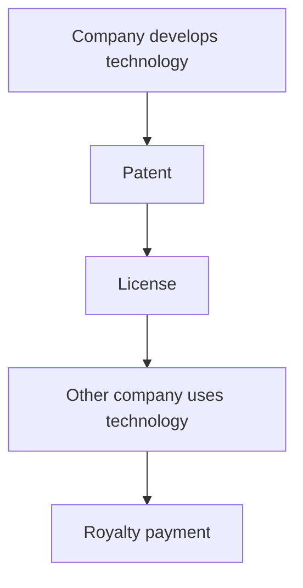

#### 4. Promotes Research and Development
IP protection can encourage organizations and researchers to invest in **Research and Development (R&D)**.

**Without effective protection:**
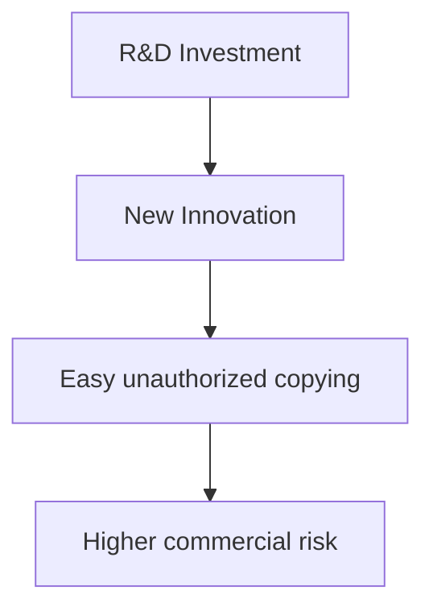

**With IP protection:**
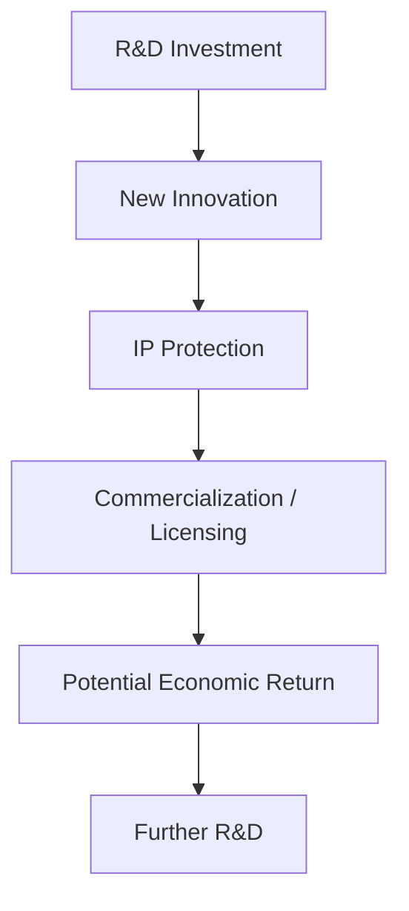

> ⭐️ **Key Point**
> IPR can reduce the commercial risk associated with investing in innovation.

#### 5. Creates Competitive Advantage
IP can provide a business with a **competitive advantage** by protecting technologies, brands, designs and other intellectual assets.
**Example:**
A company develops a unique product design and protects the eligible design. Competitors may face legal restrictions regarding unauthorized use of that protected design.

#### 6. Supports Technology Transfer
IPR helps facilitate **technology transfer** between:
* **Universities**
* **Research institutions**
* **Startups**
* **Industries**
* **Government organizations**
* **Multinational companies**

**Example:**
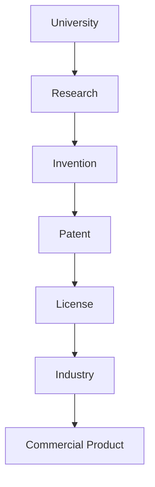
This helps convert **academic research into practical applications**.

#### 7. Helps Prevent Unauthorized Use
IPR provides legal mechanisms against certain forms of **infringement**, depending on the particular IP right.

Examples include:
* **Unauthorized copying**
* **Unauthorized use of protected technology**
* **Trademark infringement**
* **Copyright infringement**
* **Counterfeiting**

---

## 3. Protection of Innovation
One of the most important roles of IPR is **protecting innovation**.

**Why do innovators need protection?**
Inventors and researchers invest:
* **Time**
* **Money**
* **Knowledge**
* **Resources**
* **Research efforts**

If their eligible intellectual property receives legal protection, they may have greater ability to **control its use and commercialize it**.

**Example from the slide**
A company develops an **AI-based medical diagnostic system**.
If the system contains an eligible technical invention, **patent protection may potentially apply to the invention**, subject to patentability requirements.

**Important distinction**
Don't write:
> *"The entire AI system automatically gets a patent."*

Instead write:
> **Eligible technical inventions associated with the system may receive patent protection, subject to applicable patent law and patentability requirements.**

This is a more legally accurate exam answer.

---

## 4. IPR Encourages Research and Development (R&D)
IPR can create an **incentive for organizations and researchers to invest in R&D**.

**Without IPR**
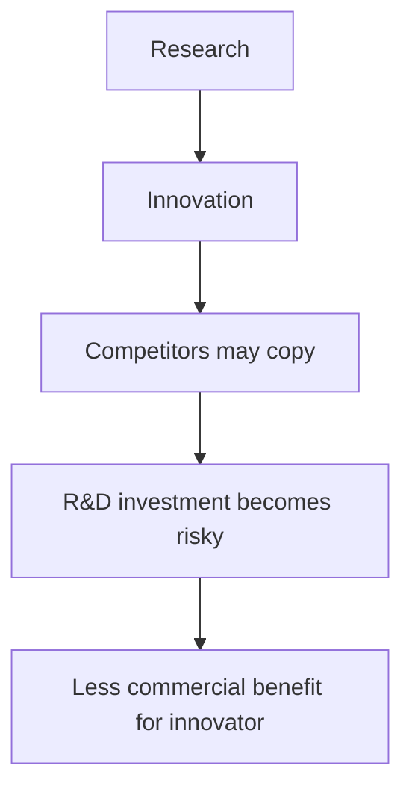

**With IPR**
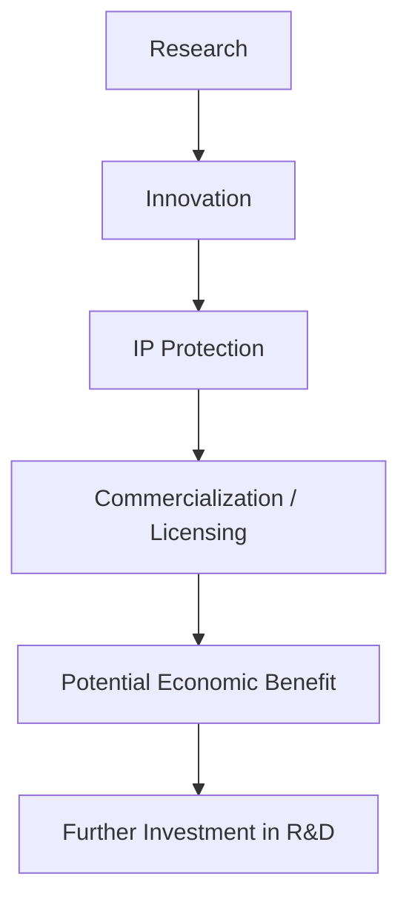

**Main Benefits**
* **Legal protection**
* **Commercialization opportunities**
* **Recovery of R&D investment**
* **Licensing opportunities**
* **Potential revenue**

> ⭐️ **Exam Answer**
> IPR encourages R&D by providing legal protection and potential commercial benefits to innovators. This reduces the risk that competitors can freely exploit protected innovations and encourages continued investment in research and development.

---

## 5. IPR Provides Economic Benefits
IPR can convert intellectual creations into **valuable economic assets**.

### Sources of Revenue

| **Method** | **Simple Meaning** |
| :--- | :--- |
| **Direct Sales** | Selling the protected product/IP |
| **Licensing** | Giving another party permission to use IP |
| **Royalties** | Payments received for authorized use |
| **Technology Transfer** | Transferring technology/know-how through appropriate arrangements |
| **Franchising** | Allowing others to operate using a protected brand/business model under an agreement |
| **Assignment** | Transferring ownership of IP rights |

**Example: Licensing**
Suppose Company A owns a patent.
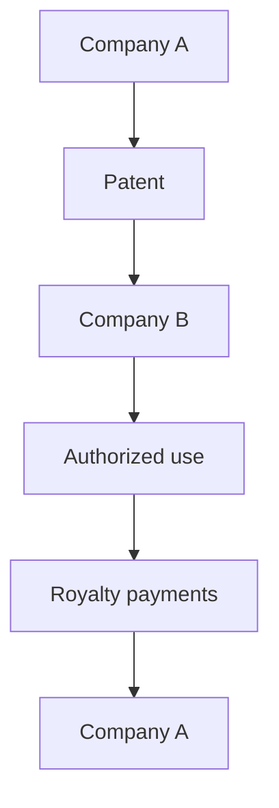
Company A can receive **royalty payments** according to the licensing agreement.

**Important Difference**
> **Licensing ≠ Assignment**

* **Licensing:** Ownership generally remains with the IP owner while another party receives permission to use the IP under agreed terms.
* **Assignment:** Ownership of the IP right is transferred to another party.

---

## 6. Technology Transfer

**Meaning**
**Technology transfer** means transferring technology, knowledge, or technical capabilities from one organization or entity to another so that it can be **used, developed or commercialized**.

IPR can facilitate this process by providing a framework for **ownership, licensing and commercialization**.

**Organizations involved**
* **Universities**
* **Research institutions**
* **Startups**
* **Industries**
* **Government organizations**
* **Multinational companies**

**Example**
Suppose a university develops a new **renewable-energy technology**.
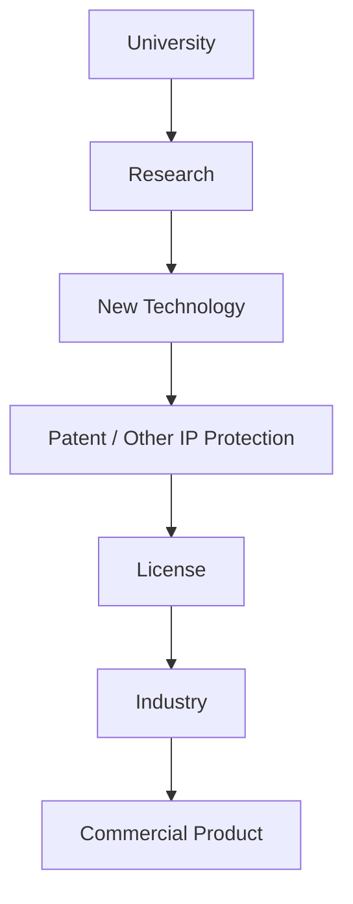
**Result:** Academic research can be converted into a **practical commercial application**.

> ⭐️ **Keyword Sentence**
> IPR facilitates technology transfer by providing mechanisms such as licensing and other contractual arrangements that enable protected technology to move from research institutions to industry and commercial applications.

---

## 7. IPR Supports Startups and Entrepreneurship
This is particularly important because startups often depend heavily on **intangible assets** such as technology, software, brands and know-how.

**Startups can protect:**

| **Startup Asset** | **Relevant IP** |
| :--- | :--- |
| Eligible new technology/invention | Patent |
| Software/code and original expression | Copyright |
| Brand name/logo | Trademark |
| Product appearance | Industrial Design |
| Confidential business information | Trade Secret |

**Easy way to remember:**
* **Technology** → Patent
* **Software** → Copyright
* **Brand** → Trademark
* **Appearance** → Industrial Design
* **Confidential Info** → Trade Secret

**Benefits to Startups**
IPR can help startups with:
* **Attracting investors**
* **Building business value**
* **Market differentiation**
* **Licensing opportunities**
* **Protection against unauthorized copying**

**Example**
Imagine a startup called **TechNova**.
It has:
* A unique technical invention → **Patent**
* Software source code → **Copyright**
* "TechNova" brand → **Trademark**
* Unique product appearance → **Industrial Design**
* Secret algorithm/recipe/business information → potentially **Trade Secret**, if confidentiality requirements are maintained

This collection of IP can contribute to the startup's **intangible business assets**.

---

## 8. Protects Brand Reputation
**Trademark protection** is especially important for protecting a business's brand identity.

**Trademarks can protect identifiers such as:**
* **Brand names**
* **Logos**
* **Symbols**
* **Other source-identifying marks**

### Benefits

**1. Prevents Consumer Confusion**
A trademark can help distinguish one company's goods or services from another's.

**2. Protects Goodwill**
A successful brand develops **goodwill and reputation**.
Trademark protection helps the owner take action against certain unauthorized uses that may cause confusion or otherwise violate applicable law.

**3. Builds Customer Trust**
Consumers can associate a particular trademark with a particular **source and expected quality**.

**4. Supports Long-Term Brand Value**
A trademark can become an important **intangible business asset**.

**Example**
Suppose a famous company uses the brand: **ABC Electronics**.
Another company starts using a highly similar name and branding in a way that causes consumer confusion.
Trademark law may provide **legal remedies** to the legitimate trademark owner, depending on the facts and applicable law.

---

## 9. Prevents Piracy and Counterfeiting
IPR also provides legal mechanisms to address certain forms of **piracy and counterfeiting**.

### A. Piracy
**Meaning**
**Piracy** generally refers to **unauthorized copying, use or distribution of protected creative works**.

**Examples**
* **Software piracy**
* **Movie piracy**
* **Music piracy**
* Unauthorized copying/distribution of **books**

**Example**
A person purchases a copyrighted software product and illegally distributes copies online without authorization.
That may constitute **copyright infringement/piracy**, depending on the circumstances and applicable law.

### 10. Counterfeiting
**Meaning**
**Counterfeiting** generally involves unauthorized imitation or reproduction of branded goods, often involving misuse of **trademarks or other protected identifiers**.

**Examples**
* **Fake branded clothing**
* **Fake electronics**
* **Fake medicines**
* **Fake consumer products**

**Example**
Suppose a company sells genuine branded shoes.
Another manufacturer produces shoes with a copied brand name and logo and sells them as genuine products.
This can involve **trademark infringement and counterfeiting**.

**Important Difference**

| **Piracy** | **Counterfeiting** |
| :--- | :--- |
| Usually associated with unauthorized copying/distribution of **protected creative works** | Usually associated with unauthorized imitation of **branded goods/identifiers** |
| Copyright is commonly involved | Trademark is commonly involved |
| Example: illegal software copy | Example: fake branded shoes |

> ⭐️ **Easy Memory Trick**
> **Piracy** → Copy the work
> **Counterfeit** → Fake the brand/product

---

## 11. Benefits of IPR to Different Stakeholders
This is an important table to remember for exams.

| **Stakeholder** | **Benefit of IPR** |
| :--- | :--- |
| **Inventors** | Recognition and commercialization |
| **Researchers** | Protection of research outcomes |
| **Businesses** | Competitive advantage |
| **Startups** | Investment and market differentiation |
| **Artists/Authors** | Protection and royalties |
| **Consumers** | Brand authenticity and product differentiation |
| **Government** | Economic and technological development |
| **Society** | Innovation and knowledge advancement |

### 12. Stakeholder Explanation — Easy Version

👨‍🔬 **Inventors**
IPR provides **recognition** and opportunities for **commercialization** of inventions.
*Example:* An inventor develops an eligible new technology and licenses it to a company.

🔬 **Researchers**
IPR can provide **protection for research outcomes** and facilitate commercialization.
*Example:* A university researcher develops a new technology that is subsequently patented and licensed.

🏢 **Businesses**
IPR can provide **competitive advantage**.
*Example:* A company protects its brand and proprietary technology and differentiates itself from competitors.

🚀 **Startups**
IP can help with **investment, valuation and market differentiation**.
*Example:* A startup with valuable patents, trademarks and software may use its IP portfolio as part of its business strategy when approaching investors.

🎨 **Artists / Authors**
Copyright can provide **protection** for original creative works and can support **royalty/licensing income**.
*Example:* An author writes a book and licenses publication rights.

🛒 **Consumers**
Trademarks and related protections can help consumers identify **authentic products** and distinguish sources.
*Example:* A trademark helps consumers distinguish genuine branded products from confusingly similar products.

🏛️ **Government**
An effective IP system can contribute to **economic development, innovation and technology development**.

🌍 **Society**
IP systems can contribute to **innovation and knowledge advancement**, while the eventual expiration or limits of certain rights can contribute to wider public access to knowledge and technology.

---

## 13. Complete IPR Flowchart
This is a very useful diagram for an exam answer:

```mermaid
flowchart TD
    A[INTELLECTUAL CREATION]
    
    A --> B[Invention\n|\nPATENT]
    A --> C[Creative Work\n|\nCOPYRIGHT]
    A --> D[Brand\n|\nTRADEMARK]
    A --> E[Product Appearance\n|\nINDUSTRIAL DESIGN]
    A --> F[Confidential Information\n|\nTRADE SECRET]
    
    B --> G[LEGAL PROTECTION]
    C --> G
    D --> G
    E --> G
    F --> G
    
    G --> H[CONTROL / COMMERCIALIZATION]
    
    H --> I[Licensing]
    H --> J[Royalties]
    H --> K[Assignment]
    
    I --> L[Economic Benefits]
    J --> L
    K --> L
    
    L --> M[Innovation + R&D + Technology Transfer]
    M --> N[Economic & Technological Development]
```

## 14. Complete Importance of IPR — One Diagram
If the question is simply **"Explain the importance of IPR"**, remember this:

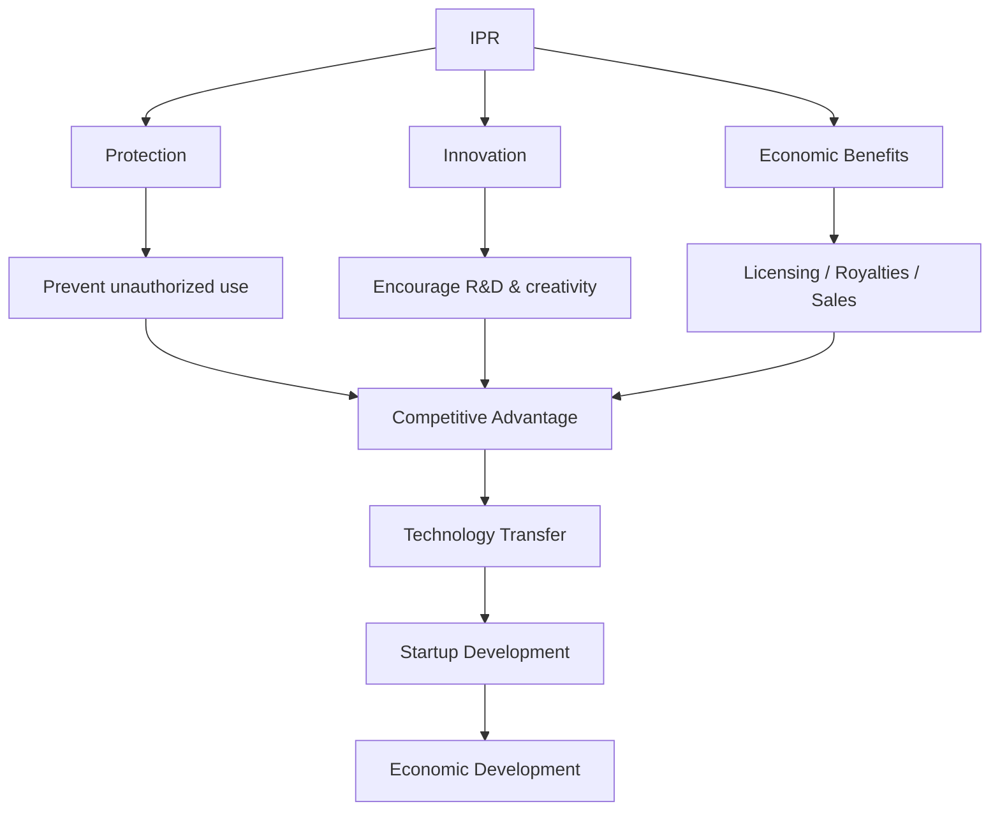

---

## 15. Best Way to Write a 5-Mark Answer
If the question is:

**"Explain the importance of Intellectual Property Rights."**
You can write:

**Intellectual Property Rights (IPR)** are legal rights that protect **intellectual creations**, including inventions, creative works, brands and designs. IPR is important because it provides legal protection against certain forms of **unauthorized use** and encourages **innovation and creativity**.

The major importance of IPR includes:
1. **Protection of innovation** – protects eligible inventions and other intellectual creations.
2. **Encourages R&D** – provides incentives for organizations and researchers to invest in **Research and Development**.
3. **Economic benefits** – IP can generate income through **sales, licensing and royalties**.
4. **Competitive advantage** – protected IP can help businesses differentiate themselves from competitors.
5. **Technology transfer** – facilitates transfer of technology from **universities and research institutions** to industries.
6. **Startup development** – helps startups build **business value, attract investment and differentiate** their products.
7. **Brand protection** – trademarks help protect **brand identity** and goodwill.
8. **Combats piracy and counterfeiting** – IP laws provide legal mechanisms to address unauthorized copying and imitation.

Thus, IPR helps create a balance between **creator's rights, public interest, innovation and economic development**.

## 16. Best 3-Mark Answer
If you have very little time:

> **IPR** provides **legal protection** to intellectual creations such as inventions, creative works, brands and designs. It **encourages innovation and R&D**, provides **economic benefits through licensing and royalties**, creates **competitive advantage**, supports **technology transfer**, protects **brands**, and helps address **piracy and counterfeiting**.

---

## 17. Keywords You MUST Remember ⭐️
For maximum marks, these are the **high-value keywords** from all your slides:

**Importance**
* Legal Protection
* Innovation
* Creativity
* R&D
* Economic Benefits
* Competitive Advantage
* Technology Transfer
* Unauthorized Use
* Economic Development

**Innovation**
* Time
* Money
* Knowledge
* Resources
* Research Efforts

**Economic Benefits**
* Direct Sales
* Licensing
* Royalties
* Technology Transfer
* Franchising
* Assignment

**Startups**
* Patent
* Copyright
* Trademark
* Industrial Design
* Trade Secret
* Investment
* Market Differentiation
* Business Value

**Brand**
* Trademark


## 🧠 Ultimate Mindmap: Importance of IPR
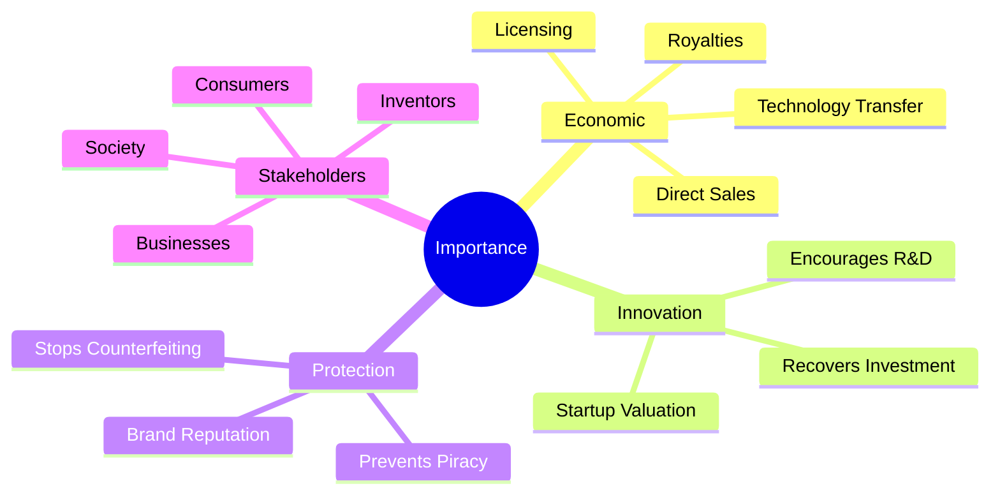
