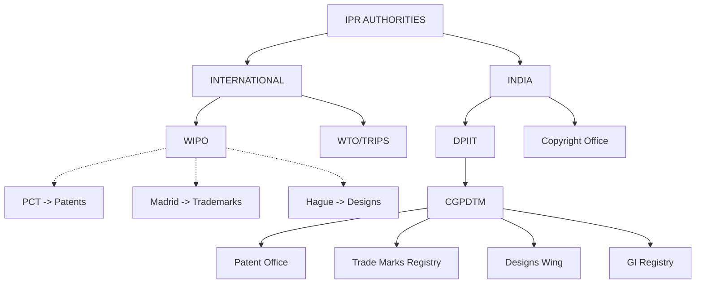
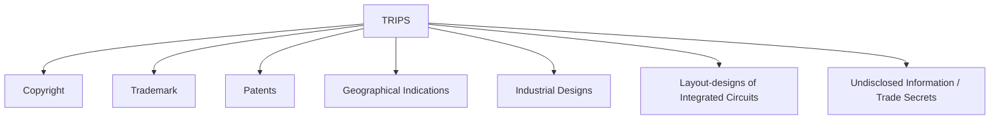
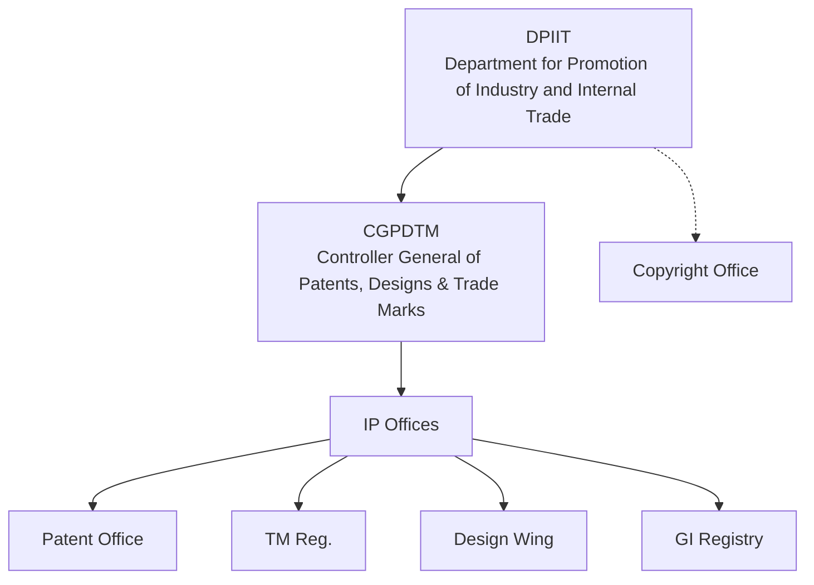
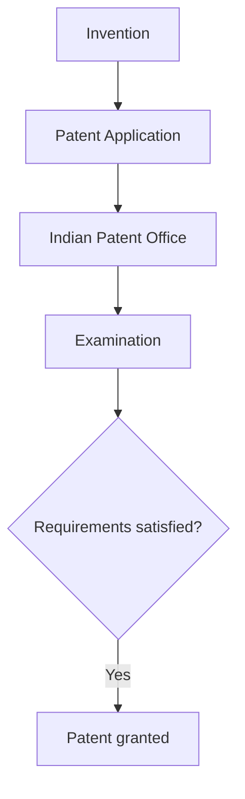
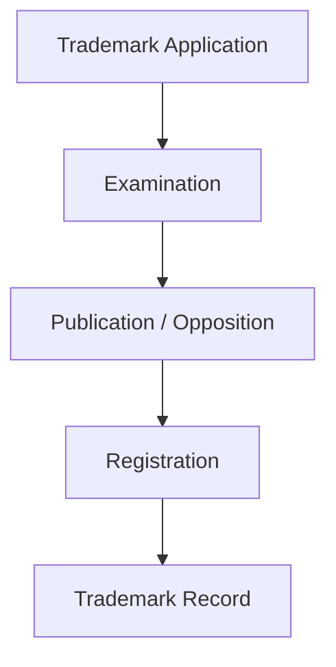
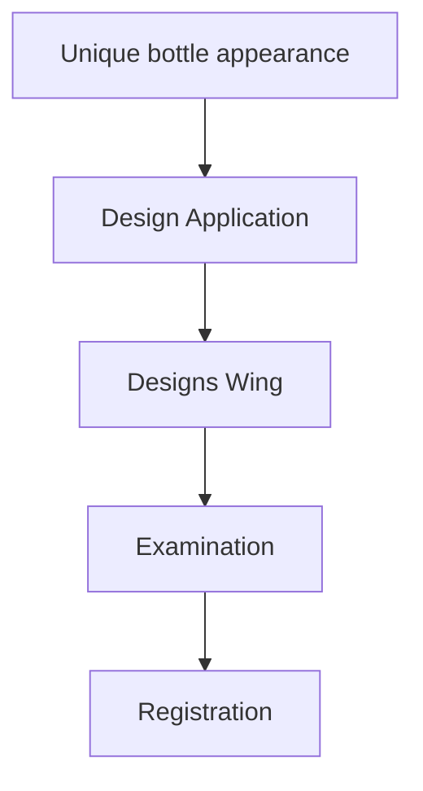
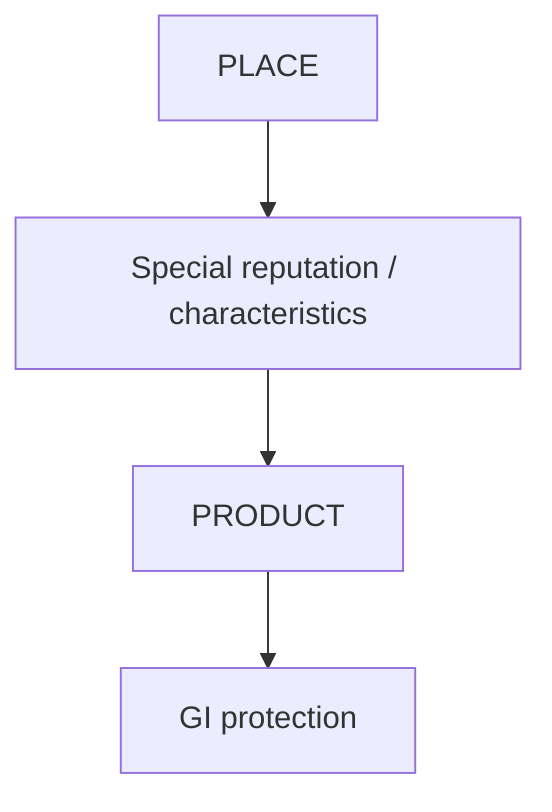
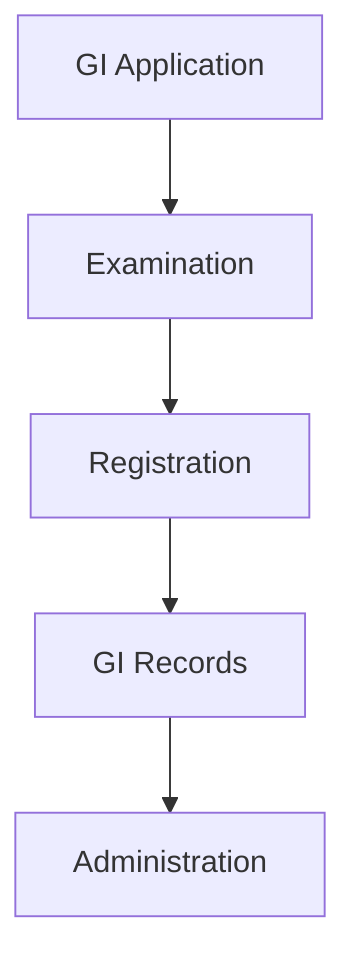
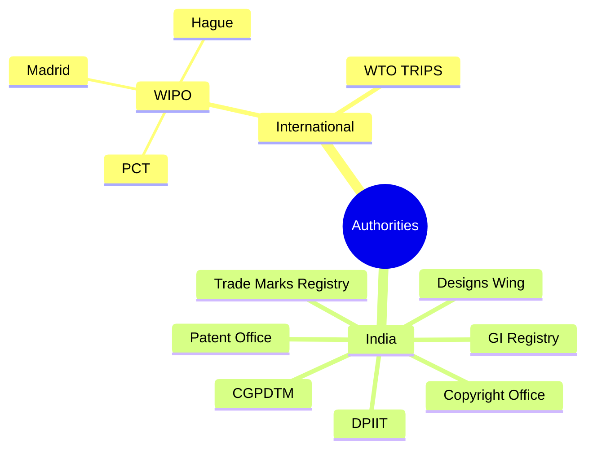

# IPR Authorities

## 1. What are IPR Authorities?

**Definition**
IPR Authorities are **organizations and government bodies** responsible for the **administration, registration, examination, protection and enforcement**-related aspects of Intellectual Property Rights (IPR).

**In simple words:**
> IPR Authorities are bodies that manage and protect intellectual property such as patents, trademarks, designs, geographical indications and copyrights.

**Main functions**
They generally deal with:
* Receiving applications
* Examining applications
* Registration / Grant of IP rights
* Maintaining IP records
* Publishing IP information
* Handling opposition / proceedings
* Providing information and awareness
* Supporting protection and enforcement

## 2. IPR Authorities — Two Levels
The authorities can broadly be understood at **two levels**:



**Remember:**
* **International level** → WIPO + WTO/TRIPS
* **Indian level** → DPIIT + CGPDTM + specialized offices

---

## 3. WIPO
**World Intellectual Property Organization**
WIPO = World Intellectual Property Organization
It is an important **international organization** dealing with intellectual property.

**Important facts**
| **Point** | **Answer** |
| :--- | :--- |
| Full form | World Intellectual Property Organization |
| Established | 1967 |
| Headquarters | Geneva, Switzerland |
| Status | Specialized agency of the United Nations |
| Main purpose | Protection of IP and international cooperation |

**Main objective**
The main objective of WIPO is to:
> Promote the protection of intellectual property and facilitate international cooperation in the field of IP.

**Easy understanding**
Suppose an Indian company has an invention and wants protection in several countries.
Instead of every country working completely independently, international systems administered by WIPO can help facilitate international IP procedures and cooperation.

## 4. Functions of WIPO
The major functions of WIPO are:

1. **Develops international IP frameworks** - WIPO helps develop international frameworks and treaties relating to intellectual property.
2. **Administers international IP treaties and systems** - It administers various international IP treaties and registration systems.
3. **Provides IP information and training** - WIPO provides IP-related information, education and training.
4. **Supports developing countries** - It helps developing countries strengthen their IP systems.
5. **Facilitates international cooperation** - It promotes international cooperation in intellectual property.
6. **Provides dispute mechanisms** - WIPO provides mechanisms for certain IP disputes and domain-name disputes.
7. **Promotes innovation and creativity** - It supports innovation and creativity globally.

## 5. Important WIPO Systems
Three important systems mentioned in your slides are:

* **PCT**: Patent Cooperation Treaty. It facilitates filing of a patent application through an international procedure.
* **Madrid System**: The Madrid System facilitates international trademark registration.
* **Hague System**: The Hague System facilitates international registration of industrial designs.

**Easy memory trick**
> PCT → PATENTS
> Madrid → TRADEMARKS
> Hague → DESIGNS

This is a very useful exam point.

---

## 6. WTO and TRIPS
**WTO**
WTO = World Trade Organization
The WTO administers the international trade framework, which includes the TRIPS Agreement.

**TRIPS**
TRIPS = Trade-Related Aspects of Intellectual Property Rights
It came into effect in 1995.

**Definition**
> TRIPS is an international agreement administered within the WTO framework that establishes minimum standards for the protection and enforcement of intellectual property rights for WTO members.

## 7. What does TRIPS cover?
TRIPS covers several categories of intellectual property:



**Important list for exam**
Write:
1. Copyright and related rights
2. Trademarks
3. Geographical indications
4. Industrial designs
5. Patents
6. Layout-designs of integrated circuits
7. Undisclosed information / trade secrets

## 8. Importance of TRIPS
TRIPS is important because it:
1. **Establishes minimum international standards:** It establishes minimum standards of IP protection among WTO members.
2. **Connects IP with international trade:** It connects Intellectual Property Rights with international trade.
3. **Provides an enforcement framework:** It provides a framework concerning IP enforcement.
4. **Promotes harmonization:** It promotes greater harmonization of national IP laws by establishing common minimum standards.

## 9. WIPO vs WTO/TRIPS
This is an important distinction.

| **WIPO** | **WTO / TRIPS** |
| :--- | :--- |
| World Intellectual Property Organization | World Trade Organization / TRIPS |
| Specialized UN agency | International trade organization/framework |
| Focuses broadly on IP cooperation and IP systems | Connects IP with international trade |
| Administers various IP treaties and systems | TRIPS establishes minimum IP standards |
| Examples: PCT, Madrid, Hague | Covers patents, copyright, trademarks, GI, etc. |
| Headquarters: Geneva | WTO headquarters: Geneva |

**One-line difference**
> WIPO primarily promotes international cooperation and systems for intellectual property, whereas TRIPS establishes minimum standards of IP protection and enforcement within the WTO framework.

---

## 10. IPR Authorities in India
At the Indian level, the important structure in your slides is:



## 11. DPIIT
**Full form:** DPIIT = Department for Promotion of Industry and Internal Trade
It is an important government department involved in **IP policy and administration**.

**Simple understanding**
Think of the structure as:
> **DPIIT** → policy/departmental level
and
> **CGPDTM** → administration of major industrial-property systems

## 12. CGPDTM
**Full form:** CGPDTM = Controller General of Patents, Designs and Trade Marks
According to the slides, CGPDTM operates under **DPIIT** and administers India's major industrial-property systems.

It primarily deals with:
* Patents
* Designs
* Trade Marks
* Geographical Indications

## 13. Major Functions of CGPDTM
1. **Examination of applications:** It oversees the examination of applications relating to relevant IP rights.
2. **Registration / grant of IP rights:** Eligible applications may result in registration or grant of the relevant IP right.
3. **Maintaining IP records:** It maintains important IP records.
4. **Publication of IP information:** It supports publication of IP information.
5. **Administration and awareness:** It supports IP administration and awareness.

**Easy memory**
> CGPDTM → Examine → Register / Grant → Maintain Records → Publish Information → Administration & Awareness

---

## 14. Indian Patent Office
The Indian Patent Office administers the **patent system** in India.

**Major functions**
1. Receives patent applications
2. Conducts examination
3. Publishes patent applications
4. Handles hearings and related proceedings
5. Grants patents when statutory requirements are satisfied
6. Maintains patent records

**Simple example**
Suppose Aryan invents a new type of battery.

The important point is:
> The Patent Office deals specifically with the **patent system**.

## 15. Patent Offices in India
The slides mention the major patent office locations:
* Delhi
* Mumbai
* Kolkata
* Chennai

**Exam point**
If asked: *"Name the major patent office locations in India."*
Write:
> Delhi, Mumbai, Kolkata and Chennai.

---

## 16. Trade Marks Registry
The **Trade Marks Registry** administers **trademark registration** in India.

**What is a trademark?**
A trademark can identify the **source or brand** of goods or services.
Examples: Brand name, Logo, Symbol, Service mark.

**Functions of Trade Marks Registry**
1. Receives trademark applications
2. Examines applications
3. Publishes accepted marks where required
4. Handles opposition proceedings
5. Registers trademarks
6. Maintains trademark records

**Flow**


**Simple example**
Suppose a company wants to protect its brand name "ABC Tech". It applies for trademark registration. The Trade Marks Registry examines the application and, if requirements are satisfied, registers the trademark.

---

## 17. Designs Wing
The **Designs Wing** administers the registration of **industrial designs** under Indian design law.

**What does an industrial design protect?**
It protects the **visual appearance** of an industrial product.
For example: Shape, Configuration, Pattern, Ornamentation, Overall visual appearance.

**Important distinction**
A design generally concerns:
> **How a product looks**
rather than:
> How the product technically works

**Functions of Designs Wing**
1. Receives design applications
2. Examines designs
3. Registers eligible designs
4. Maintains design records
5. Provides information concerning registered designs

**Example**
Imagine a company creates a unique-looking bottle.


---

## 18. Geographical Indications Registry
The Geographical Indications Registry administers **GI registration** in India.

**What is a GI?**
A Geographical Indication (GI) identifies goods associated with a particular **geographical region**, where the product's qualities, reputation or characteristics are linked to that place.

**Simple idea**


## 19. Examples of GI
The slides give these examples:
* Darjeeling Tea
* Kanchipuram Silk
* Banarasi Sarees
* Alphonso Mango

**Easy explanation:**
*Darjeeling Tea:* The name is associated with tea produced in the Darjeeling region and its reputation/characteristics are connected with that geographical origin. Therefore, GI protection is about the **connection between the product and its geographical origin**.

## 20. Functions of GI Registry
The main functions are:
1. Examination of GI applications
2. Registration
3. Maintenance of GI records
4. Administration of registered GIs



---

## 21. Copyright Office
The Copyright Office operates under the **Department for Promotion of Industry and Internal Trade (DPIIT)**, Ministry of Commerce and Industry.

It deals with the copyright registration and administration system.

**Functions of Copyright Office**
1. **Administers copyright registration:** It administers the copyright registration system.
2. **Maintains Register of Copyrights:** It maintains the Register of Copyrights.
3. **Processes applications:** It processes copyright-related applications.
4. **Provides information:** It provides information concerning copyright registration and administration.

## 22. What does Copyright Protect?
The Copyright Office deals with works such as:
* Literary works
* Artistic works
* Musical works
* Films
* Sound recordings
* Computer programs

**Simple examples**
| **Work** | **Example** |
| :--- | :--- |
| Literary | Book / article |
| Artistic | Painting |
| Musical | Musical composition |
| Film | Movie |
| Sound recording | Recorded song |
| Computer program | Software source code |

**Easy memory:**
> Copyright protects **creative expression**.

---

## 23. IPAB — Important Historical Note
**IPAB = Intellectual Property Appellate Board**
It was established to hear certain **appeals and related matters concerning IP rights**.

**VERY IMPORTANT CURRENT EXAM POINT**
The **Tribunals Reforms Act, 2021 abolished the IPAB.**
Its functions were transferred to appropriate **High Courts and other competent authorities**, depending on the matter.

Therefore:
> **IPAB is a historical institution and is no longer an operational IPR authority.**

⚠️ **Don't make this mistake**
Do NOT write:
*"IPAB is the current appellate authority for IPR."*
Instead write:
*"IPAB was formerly an appellate body for certain IP matters, but it was abolished in 2021 under the Tribunals Reforms Act, 2021. Its functions were transferred to appropriate High Courts and other competent authorities."*

---

## 24. International vs Indian IPR Authorities
This table is extremely useful for exams.

| **Authority** | **Level** | **Main Role** |
| :--- | :--- | :--- |
| **WIPO** | International | Global IP cooperation and IP systems |
| **WTO / TRIPS** | International | Minimum IP standards linked to international trade |
| **DPIIT** | India | IP policy and administration |
| **CGPDTM** | India | Patents, designs, trademarks and GIs |
| **Patent Office** | India | Patent administration |
| **Trade Marks Registry** | India | Trademark administration |
| **Designs Wing** | India | Industrial design registration |
| **GI Registry** | India | GI registration |
| **Copyright Office** | India | Copyright registration and administration |

## 25. The Whole Topic in One Diagram
Memorize this diagram:


## 26. Very Easy Way to Understand the Entire Topic
Think of IPR as different types of property.

* **If you invented something:** Patent Office *(New invention → PATENT)*
* **If you created a brand:** Trade Marks Registry *(Brand / Logo → TRADEMARK)*
* **If you created a unique product appearance:** Designs Wing *(Product appearance → DESIGN)*
* **If a product is strongly associated with a place:** GI Registry *(Place + Product → GI)*
* **If you created creative content:** Copyright Office *(Book / Music / Film / Software → COPYRIGHT)*
* **At international level:** WIPO *(International IP cooperation)* and WTO / TRIPS *(IP + International Trade)*

## 27. One Example Connecting Everything
Suppose a company called XYZ creates a new product.
The product has:
* A new technical invention
* A unique logo
* A unique appearance
* A special connection to a geographical region
* A software program controlling it

Different IP rights may apply:

```mermaid
flowchart TD
    A[XYZ PRODUCT]
    
    A --> B[New invention\n|\nPATENT\n|\nPatent Office]
    A --> C[Logo/Brand\n|\nTRADEMARK\n|\nTrade Marks Registry]
    A --> D[Appearance\n|\nDESIGN\n|\nDesigns Wing]
    A --> E[Geographical origin\n|\nGI\n|\nGI Registry]
    A --> F[Software\n|\nCOPYRIGHT\n|\nCopyright Office]
```
This is the easiest way to understand why there are **different IPR authorities**.

---

## 28. Most Important Full-Marks Keywords
If you have limited time, memorize these exact keywords.

**IPR Authorities**
Administration + Registration + Examination + Protection + Enforcement

**WIPO**
1967 + Geneva + UN Specialized Agency + International IP Cooperation + PCT + Madrid + Hague

**WTO/TRIPS**
WTO + TRIPS + 1995 + Minimum Standards + IP Protection + Enforcement + International Trade

**DPIIT**
Department for Promotion of Industry and Internal Trade + Policy + Administration

**CGPDTM**
Patents + Designs + Trade Marks + Geographical Indications

**Patent Office**
Patent Applications + Examination + Publication + Hearing + Grant + Records

**Trade Marks Registry**
Trademark Applications + Examination + Opposition + Registration + Records

**Designs Wing**
Industrial Designs + Examination + Registration + Records + Visual Appearance

**GI Registry**
Geographical Region + Examination + Registration + GI Records

**Copyright Office**
Copyright Registration + Register of Copyrights + Literary + Artistic + Musical + Films + Sound Recordings + Computer Programs

**IPAB**
Appeals + Abolished in 2021 + Tribunals Reforms Act + Functions transferred


## 🧠 Ultimate Mindmap: IPR Authorities

