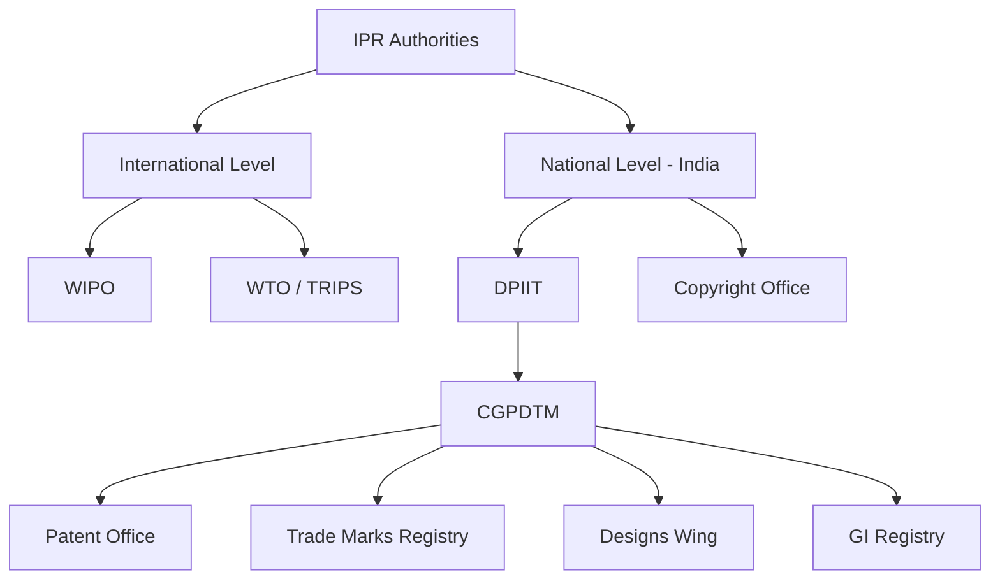

# Chapter 5: IPR Authorities

---

## What are IPR Authorities?

IPR authorities are organizations and government bodies responsible for the **administration, registration, examination, protection, and enforcement** of intellectual property rights. They operate at two levels:

---

## International Authorities

### WIPO (World Intellectual Property Organization)
- **Established:** 1967
- **HQ:** Geneva, Switzerland
- **Status:** Specialized agency of the United Nations

**Functions:**
- Develops international IP frameworks
- Administers international IP treaties
- Provides IP-related information and training
- Supports developing countries
- Facilitates international cooperation

**Important WIPO Systems:**
- **PCT** – Patent Cooperation Treaty
- **Madrid System** – International trademark registration
- **Hague System** – International registration of industrial designs

### WTO and TRIPS
- **WTO** – Administers international trade framework including TRIPS
- **TRIPS** – Trade-Related Aspects of Intellectual Property Rights (since **1995**)
- Establishes **minimum standards** of IP protection for all WTO members

**TRIPS Covers:** Copyright, Trademarks, GIs, Industrial Designs, Patents, Trade Secrets, Integrated Circuit Layout Designs

---

## Indian IPR Authorities

### DPIIT (Department for Promotion of Industry and Internal Trade)
- Policy and administration of industrial property in India
- Oversees CGPDTM and Copyright Office

### CGPDTM (Controller General of Patents, Designs & Trade Marks)
- Under DPIIT
- Administers: **Patents, Designs, Trade Marks, Geographical Indications**
- **Functions:** Examination of applications, Registration/grant of IP rights, Maintaining IP records, Publication of IP information

### Indian Patent Office
- Receives, examines, publishes, and grants patents
- **Locations:** Delhi, Mumbai, Kolkata, Chennai

### Trade Marks Registry
- Receives and examines trademark applications
- Handles opposition proceedings and registers trademarks
- Protects: Brand names, Logos, Symbols, Service marks

### Designs Wing
- Administers industrial design registration
- Protects: Visual appearance of industrial products

### Geographical Indications Registry
- Administers GI registration
- **Examples:** Darjeeling Tea, Kanchipuram Silk, Banarasi Sarees, Alphonso Mango

### Copyright Office
- Under DPIIT
- Maintains the **Register of Copyrights**
- Protects: Literary, Artistic, Musical works, Films, Sound recordings, Computer programs

### IPAB — Historical Note ⚠️
- Intellectual Property Appellate Board was abolished by **Tribunals Reforms Act, 2021**
- Its functions were transferred to **High Courts**
- **Exam Point:** IPAB is NO LONGER operational

---

## Summary Table

| Authority | Level | Major Role |
|---|---|---|
| WIPO | International | Global IP cooperation and treaties |
| WTO | International | TRIPS framework |
| DPIIT | India | Policy and administration |
| CGPDTM | India | Patents, Designs, Trademarks, GIs |
| Patent Office | India | Patent administration |
| Trade Marks Registry | India | Trademark administration |
| Designs Wing | India | Industrial design registration |
| GI Registry | India | GI registration |
| Copyright Office | India | Copyright registration |
