# Patents

## 1. What is a Patent?

**Definition**
A patent is a **statutory right** granted by the **government** to an **inventor** for an **invention** that satisfies the legal requirements of **patentability**.

The patent gives the **patentee** an **exclusive right** to prevent others from:
* **Making**
* **Using**
* **Selling**
* **Offering for sale**
* **Importing**
the patented **product**, or from **using the patented process**, subject to the **Patents Act**.

**Simple meaning**
Think of a patent as:
> Government gives an inventor legal control over an invention for a limited period, in exchange for disclosure of the invention.

**Example**
Suppose Aryan invents a **new battery technology**.
If it satisfies patentability requirements and gets patented:
**Aryan → gets patent → others cannot commercially make/use/sell/import the patented invention without authorization, subject to the law.**

## 2. Basic Patent Concept — Diagram
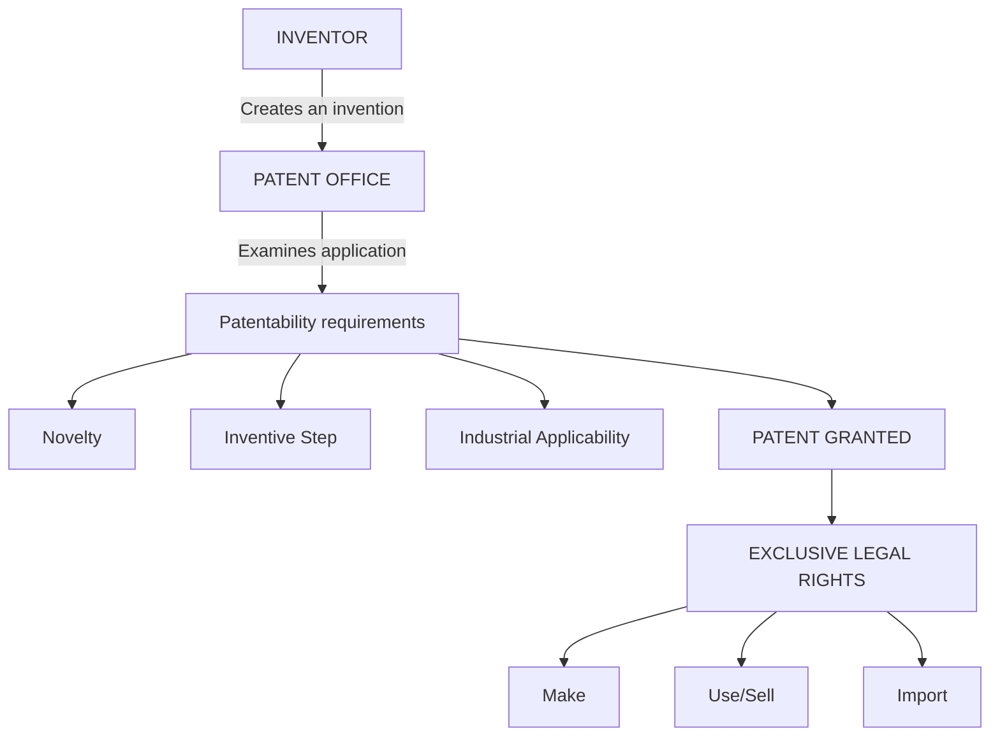

## 3. Why are Patents Important?
The main purpose of patents is to **encourage technological innovation**.
Their benefits can be understood from three perspectives:

### A. For Inventors
1. **Legal Protection:** The inventor gets legal protection against unauthorized exploitation of the patented invention.
2. **Commercial Opportunity:** The invention can be **commercialized** and used to generate revenue.
3. **Recognition:** The patent provides formal recognition of the inventor's innovation.
4. **Licensing Income:** The patent owner can **license** the technology to another company and receive payment/royalties.

**Example**
A company develops a new battery technology. Instead of manufacturing everything itself, it can:
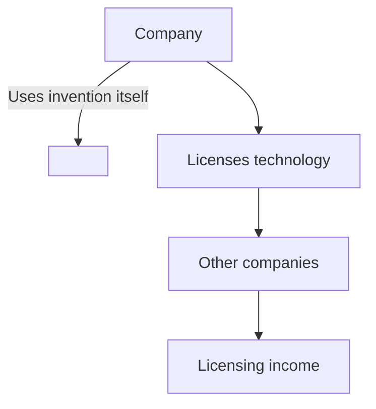

### B. For Industry
Patents provide:
* **Competitive advantage**
* **Investment incentive**
* **Technology commercialization**
* **Technology licensing**

**Simple example**
Company A develops a patented manufacturing technology. Company B wants to use it. Company B can obtain a **license** from Company A. Thus, the patent can encourage **commercialization and investment**.

### C. For Society
Patents:
* **Encourage innovation**
* **Promote technological development**
* **Increase publicly available technical knowledge**

**Why does patent disclosure help society?**
An inventor has to disclose technical information about the invention as part of the patent system. Therefore:
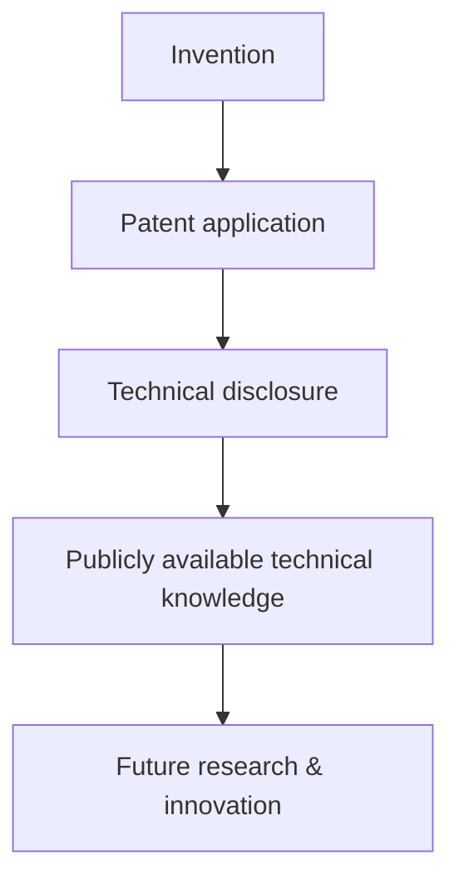

> ⭐️ **Exam keyword:** Patents attempt to balance **private rights of inventors** with the **public interest**.

---

## 4. What Can a Patent Protect?
A patent can protect a **technical invention**. The slides identify three important categories.

### 4.1 Product Invention
A **new technical product**.
*Example:* A **new type of battery** with a novel technical configuration.
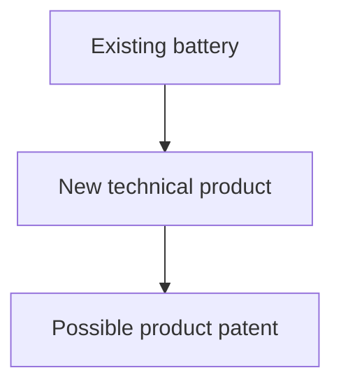

### 4.2 Process Invention
A **new technical process** for producing something.
*Example:* A new industrial method for **manufacturing a chemical**. The invention is not necessarily the final product itself; it may be the **technical method/process** used to produce it.

### 4.3 Improvement
A **technical improvement to an existing technology**, provided that it satisfies the **patentability requirements**.

*Example:*
Existing battery:
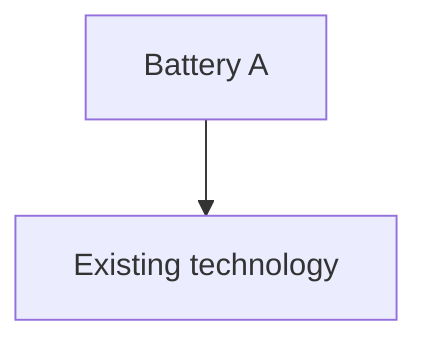
Inventor develops:
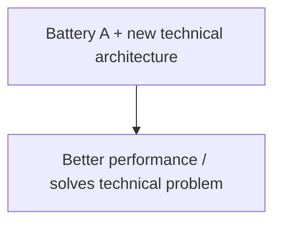
Such an improvement may potentially be patentable if it satisfies the legal requirements.

**Important distinction**
A **mere cosmetic change** is not automatically an inventive technical improvement.
For example: *Changing the **external colour** of a phone generally would not constitute an **inventive technical step**.*

---

## 5. Patentability Requirements ⭐️⭐️⭐️
This is one of the **most important exam topics**. For an invention to generally qualify for patent protection in India, it must satisfy key requirements.

**Remember:** N-I-I-E
* **N** → Novelty
* **I** → Inventive Step
* **I** → Industrial Applicability
* **E** → Not Excluded Subject Matter

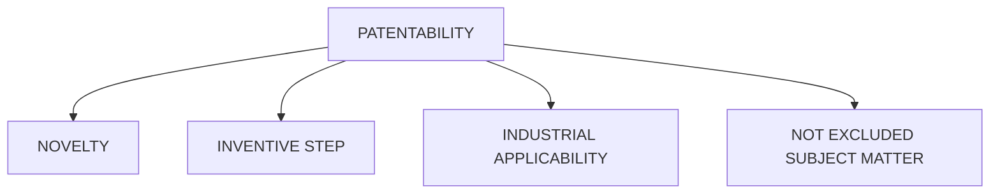

### 6. Requirement 1 — Novelty
**Meaning**
The invention must be **new**. It should **not already form part of the prior art**.

**Easy definition for exam**
> Novelty means that the invention must be new and must not have already been publicly disclosed as part of the prior art.

**What is Prior Art?**
**Prior art** means existing knowledge or information relevant to the invention that was available before the relevant **filing/priority date**, subject to the applicable legal rules. Examples include:
* Existing patents
* Research papers
* Books
* Websites
* Conference papers
* Public demonstrations
* Existing products
* Public use

**Diagram**
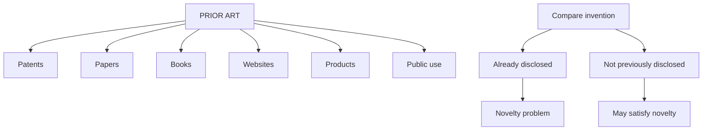

**Simple Example of Novelty**
Suppose a researcher develops Machine X in 2026. The same machine was already publicly disclosed before the relevant filing/priority date. Then, the invention **may lack novelty**.

> ⭐️ **Important keyword:** **Publicly disclosed**. This is much more useful in an exam answer than simply writing "it should be new."

### 7. Requirement 2 — Inventive Step
**Meaning**
An invention should not be merely an **obvious modification of existing knowledge**. It should involve a sufficient **technical advance or economic significance** and should not be **obvious to a person skilled in the art**, as reflected in the applicable law.

**Easy exam definition**
> Inventive step means that the invention should not be obvious to a person skilled in the relevant field and should involve a technical advance or economic significance as required by law.

**Simple Example**
Imagine an existing phone has a standard battery.
* **Case 1 — Simple change:** Existing phone + change external colour → Not a technical invention. This is generally **not an inventive technical step**.
* **Case 2 — Technical improvement:** Existing battery + new battery architecture → solves recognized technical problem → potentially inventive. Whether it actually satisfies the **inventive-step requirement** depends on the facts and applicable legal standards.

### 8. Novelty vs Inventive Step ⭐️
This distinction is extremely important.

| **Novelty** | **Inventive Step** |
| :--- | :--- |
| Asks: **Is it new?** | Asks: **Is it non-obvious?** |
| Concerned with **prior disclosure** | Concerned with **obviousness** |
| Invention should not already be known | Invention should not be an obvious modification |
| Example: Same machine already publicly disclosed | Example: Combining known features in an obvious way |

> **Easy memory trick:** Novelty = **NEW**, Inventive Step = **NOT OBVIOUS**

### 9. Requirement 3 — Industrial Applicability
**Meaning**
The invention must be capable of being:
* **Made in an industry**, or
* **Used in an industry**

The key idea is that it should have a **practical industrial application**, rather than being merely theoretical.

**Examples**
Potentially industrially applicable inventions include: Manufacturing process, Medical device, Agricultural machine, Electronic circuit, Industrial chemical process.

**Example**
Suppose someone proposes a theoretical formula that has no practical industrial application. That may not satisfy the requirement. But, a **new machine that can actually be manufactured and used in agriculture can potentially satisfy industrial applicability.**

### 10. Requirement 4 — Must Not Be Excluded Subject Matter
Even if an invention is Novel, Inventive, and Industrially applicable, it still cannot receive a patent if it falls within **subject matter excluded by the Patents Act**.

**Exam sentence**
> The invention must **not fall under excluded subject matter** under the relevant provisions of the Patents Act.

### 11. Complete Patentability Example ⭐️
Suppose a researcher invents a new agricultural machine. We test:
* **Step 1 — Novelty:** Was the same invention already publicly disclosed? No → passes novelty
* **Step 2 — Inventive Step:** Is it more than an obvious modification for a person skilled in the art? Yes → potentially passes inventive step
* **Step 3 — Industrial Applicability:** Can it be manufactured and used in agriculture? Yes → passes industrial applicability
* **Step 4 — Excluded Subject Matter:** Is it excluded by the Patents Act? No → passes this requirement

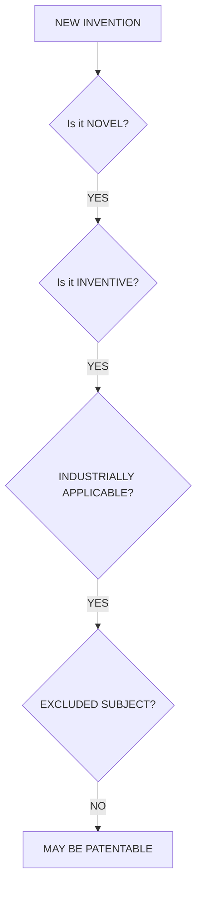
**Important:** Meeting these general requirements does not by itself guarantee grant; the application must undergo the applicable legal examination and procedures.

---

## 12. Indian Patent Law — Historical Background
India's patent system developed during the **colonial period** and subsequently underwent major reforms.

### Important Years to Memorize
| **Year** | **Important Event** |
| :--- | :--- |
| **1856** | Early Indian patent legislation |
| **1911** | Indian Patents and Designs Act |
| **1970** | Patents Act enacted |
| **1972** | Patents Act came into force |
| **1999** | Major amendment |
| **2002** | Major amendment |
| **2005** | Major amendment; important expansion of product patent protection |

> ⭐️ **Most important:** The current Indian patent regime is primarily based on the **Patents Act, 1970, as amended from time to time.**

## 13. Patents Act, 1970
The **Patents Act, 1970** is the principal legislation governing **patents in India**.

**Objectives of the Patents Act, 1970**
The Act aims to:
1. **Encourage inventions**
2. **Promote technological development**
3. **Provide patent protection**
4. **Regulate patent administration**
5. **Balance private rights with public interest**

## 14. Areas Covered by the Patents Act
The slides identify the following areas: Patent applications, Patentability, Specifications, Examination, Grant, Rights of patentees, Opposition, Revocation, Infringement, Patent agents. These together represent the major stages/issues in the patent system.

## 15. Why Was the Patents Act, 1970 Important?
The 1970 Act represented a **major restructuring** of India's patent system.

**Major characteristics**
1. **Domestic technological development:** The Act focused on promoting domestic technological development.
2. **Limited product patent protection in certain sectors:** Historically, product patent protection was limited in certain sectors, particularly: Pharmaceuticals, Food.
3. **Greater emphasis on process patents:** There was stronger emphasis on **process patents** in those sectors.
4. **Compulsory licensing:** The Act contained provisions relating to **compulsory licensing**.
5. **Public interest:** The Act included provisions addressing **public interest**.

## 16. Process Patent vs Product Patent
This distinction is important for understanding the historical background.

* **Product Patent:** Protects the **product itself**. Example: A new pharmaceutical compound.
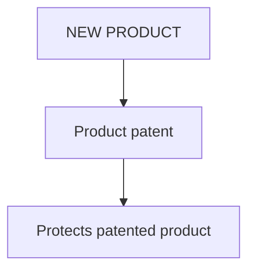

* **Process Patent:** Protects the **method/process used to produce something**. Example: A new method of manufacturing a chemical.
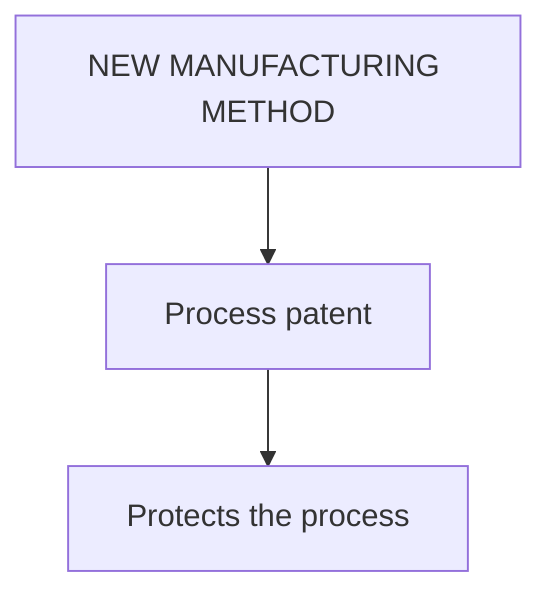

> **Easy difference:** Product = **WHAT** is invented, Process = **HOW** it is made

## 17. TRIPS and Indian Patent Law
India's obligations under the **TRIPS Agreement** led to substantial amendments to the Indian patent regime. The slides connect India's patent-law reforms particularly with **1999, 2002, and 2005**.

## 18. 2002 Amendment to the Patents Act
The **Patents (Amendment) Act, 2002** was an important step toward bringing Indian patent law into greater conformity with India's **TRIPS obligations**.

Major developments included:
1. **Strengthening patent examination provisions**
2. **Changes in patent terms and procedures**
3. **18-month publication:** The amendment introduced **18-month publication of applications**. (This is a very important exam keyword.)
4. **Changes concerning opposition**
5. **International patent filing framework**
6. **Patent rights and procedures**

## 19. 2005 Amendment ⭐️⭐️⭐️
Even though your syllabus may specifically mention **1970 and 2002**, your slides emphasize that you should know the importance of the **2005 amendment**.

**Major Change:** India moved to a system providing **product patent protection** in areas where **TRIPS required it**.
**Particularly important example:** **Pharmaceutical products** could receive **product patent protection**, subject to the requirements and exclusions under the Patents Act.

**Why was the 2005 Amendment Important?** Because India had to comply with its obligations under the **TRIPS Agreement**.

So the broad historical progression can be remembered as:
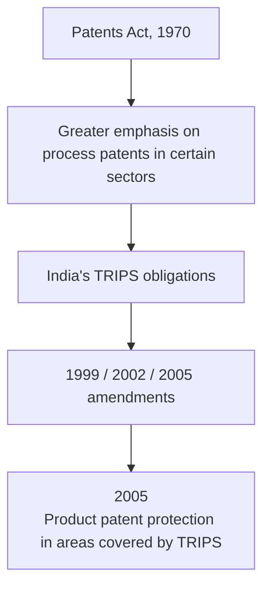

## 20. 1970 vs 2002 vs 2005 — ⭐️ VERY IMPORTANT

| **Aspect** | **1970** | **2002** | **2005** |
| :--- | :--- | :--- | :--- |
| Main significance | **Major restructuring** of patent system | Greater conformity with **TRIPS** | Important expansion of **product patent protection** |
| Focus | Domestic technological development | Patent procedures and examination | Product patents in areas covered by TRIPS |
| Pharmaceuticals | Historically limited product-patent protection | Further reforms | **Product patent protection** introduced in relevant areas |
| Publication | — | **18-month publication** | — |
| Opposition | Patent-law framework included opposition | **Changes concerning opposition** | Further regime operating under amended law |
| International framework | — | Recognition of **international patent filing framework** | Operated within TRIPS-compliant framework |

## 21. One Complete Timeline for the Exam ⭐️
Memorize this:

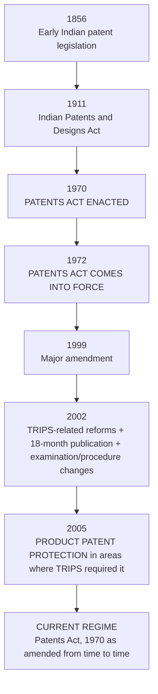

## 🧠 Ultimate Mindmap: Patents
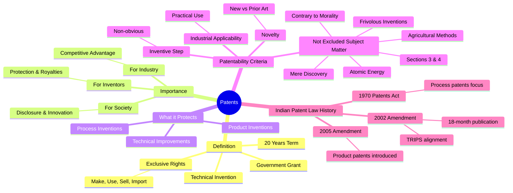
