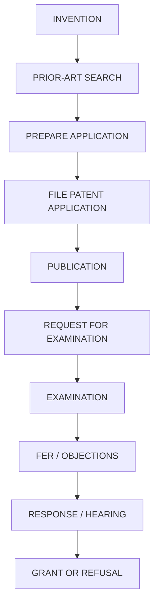
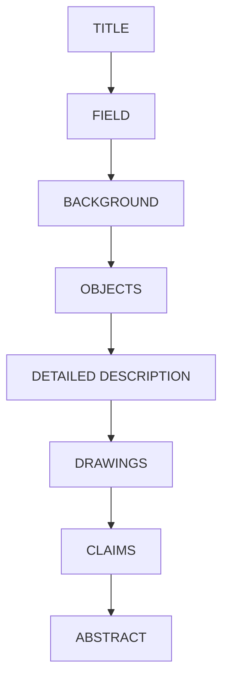
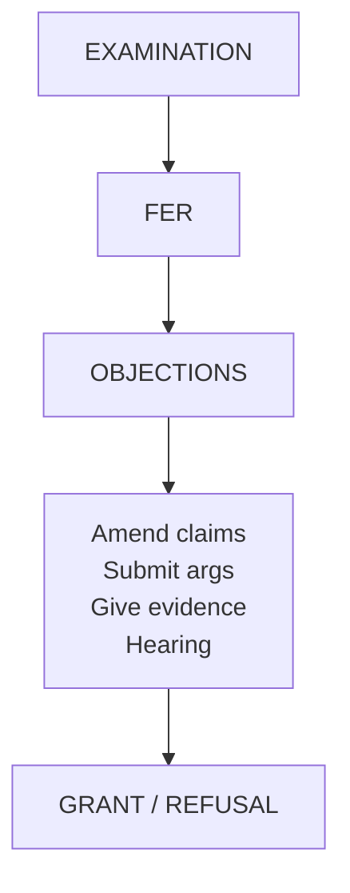
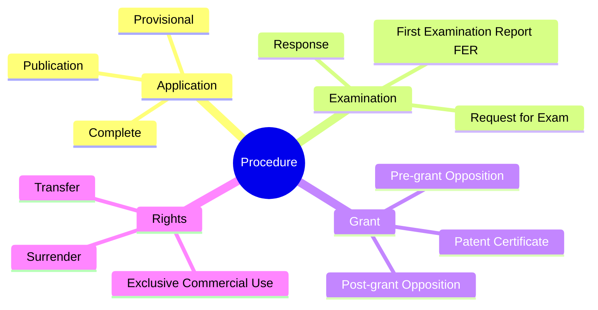

# Patents: Protectable Subject Matter, Procedure, Rights, and Revocation

## 1. PATENTABLE INVENTION
**What is a Patentable Subject Matter?**
A **patentable invention** is generally an invention that satisfies the required conditions for patent protection.

**5 Things to Remember**
A patentable invention generally must:
1. **Be new**
2. **Involve an inventive step**
3. **Be capable of industrial application**
4. **Fall within patentable subject matter**
5. **Not be excluded by the Patents Act**

**Easy Memory Trick**
Remember: **N-I-I-S-N**
* **N** → New
* **I** → Inventive step
* **I** → Industrial application
* **S** → Subject matter
* **N** → Not excluded

Or simply:
> **NEW + INVENTIVE + INDUSTRIAL + ALLOWED**

**Examples of Patentable Inventions**
According to the slide:
* New medical device
* Improved industrial machine
* New manufacturing process
* New technical apparatus
* Innovative engineering technology
* Certain biotechnology inventions, subject to statutory exclusions

**Simple Example**
Suppose someone develops a **new medical device** that solves a technical problem.
If it is:
* **new**
* has an **inventive step**
* has **industrial application**
* is within **patentable subject matter**
* and is **not excluded**
→ it may qualify as a **patentable invention**.

---

## 2. NON-PATENTABLE INVENTIONS
**Basic Idea**
> Not every new idea qualifies for a patent.

Indian patent law contains **statutory exclusions** under **Sections 3 and 4** of the Patents Act.

**Memory Trick**
Think:
> **Section 3 = Things that are NOT inventions**
> **Section 4 = Atomic Energy**

**Important Examples of Non-Patentable Subject Matter**
The slide lists:
1. **Frivolous inventions:** These are inventions falling within the statutory exclusion described in the slide.
2. **Inventions contrary to public order or morality:** If an invention falls within this exclusion, it is not patentable.
3. **Certain discoveries:** A mere discovery is not automatically a patentable invention.
4. **Certain new forms or uses of known substances:** Certain new forms or uses of known substances are excluded.
5. **Methods of agriculture or horticulture:** These methods are listed as non-patentable.
6. **Medical, surgical, curative, prophylactic or other treatment methods:** Methods of treating people/conditions are included in the exclusion.
7. **Plants and animals:** Plants and animals are excluded, **except certain microorganisms**.
8. **Mathematical methods:** A mathematical method is excluded.
9. **Business methods:** Business methods are excluded.
10. **Computer program per se:** A computer program per se is listed as excluded.
11. **Algorithms:** Algorithms are excluded.
12. **Traditional knowledge-related subject matter:** Traditional knowledge-related subject matter is excluded.

---

## 3. SECTION 3 — IMPORTANT EXCLUSIONS
**What is Section 3?**
> **Section 3 identifies inventions that are not inventions within the meaning of the Act.**

This is an important exam statement.

**Section 3(c)**
* **Meaning:** Mere discovery of a scientific principle or formulation of an abstract theory is excluded.
* **Simple Example:** Suppose a scientist discovers a **new scientific principle**. The mere discovery itself is not treated as an invention under this exclusion.
* **Keyword:** Mere discovery → Scientific principle / Abstract theory

**Section 3(d)**
* Section 3(d) concerns: **Certain new forms of known substances that do not satisfy the required enhanced efficacy standard.**
* **Easy Understanding:** Suppose a substance is already known. Someone creates a **new form** of that known substance. The new form does not automatically qualify merely because it is a different form. According to the slide, it must satisfy the required **enhanced efficacy standard**.
* **Memory Trick:** 3(d) = New Form + Known Substance + Enhanced Efficacy

**Section 3(i)**
* Section 3(i) concerns: **Certain medical or treatment methods.**
* The slide specifically summarizes this as: Certain medical or treatment methods → excluded.
* **Memory Trick:** 3(i) → Treatment (Think: **i = intervention/treatment**)

**Section 3(k)**
*This is especially important for a technical/CS student.*
* Section 3(k) includes:
  * Mathematical method
  * Business method
  * Computer programme per se
  * Algorithms
* **Memory Trick:** 3(k) = **M-B-C-A**
  * **M** → Mathematical method
  * **B** → Business method
  * **C** → Computer programme per se
  * **A** → Algorithms
* **Very Easy Recall:** Think: **Math + Business + Computer Program + Algorithm**

---

## 7. SECTION 4 — ATOMIC ENERGY
**Main Rule**
> Certain inventions relating to **atomic energy** are excluded from patentability.

The slide states that inventions relating to atomic energy falling within the relevant provisions of the **Atomic Energy Act** are **not patentable**.

**Why?**
According to the slide, atomic energy is considered a matter of:
* **National security**
* **Strategic importance**
* **Public interest**

**Memory Trick**
Atomic Energy = **NSP**
* **N** → National security
* **S** → Strategic importance
* **P** → Public interest

---

## 8. PATENT APPLICATION PROCESS
This is a very important diagram to remember.

**Overall Flow**


**One-Line Memory Trick**
**I → S → P → F → P → R → E → F → R → G**
Or remember the story:
> Invent → Search → Prepare → File → Publish → Request → Examine → Objections → Respond → Grant/Refusal

---

## 9. STEP 1 — IDENTIFY THE INVENTION
Before filing, identify the important technical aspects of the invention.
**Ask 4 Main Questions:**
1. **What is new?** Identify the new aspect of the invention.
2. **What problem does it solve?** Identify the technical problem being solved.
3. **How does it work?** Explain its working.
4. **What technical advantage does it provide?** Identify the technical benefit/advantage.

**What Should Be Documented?**
Maintain records of:
* Research
* Experiments
* Drawings
* Technical results
* Development dates

**Memory Trick**
**R-E-D-T-D** (Research, Experiments, Drawings, Technical results, Development dates)

**VERY IMPORTANT**
> Avoid unnecessary **public disclosure before filing**, because public disclosure can affect **novelty**.

**Easy Example**
Suppose you invent a new machine. Before filing, you unnecessarily publicly disclose details of it. According to the slide, this can affect its **novelty**.
Therefore:
> **Identify + Document + Avoid unnecessary public disclosure**

---

## 10. STEP 2 — PATENT SEARCH
**What is a Prior-Art Search?**
A **prior-art search** is conducted to determine whether **similar inventions already exist**.
In simple words:
> Before applying for a patent, check whether someone has already invented something similar.

**Search Sources**
According to the slide, search may involve:
* Patent databases
* Research papers
* Technical journals
* Products
* Conference publications
* Internet sources

**Objectives of Patent Search**
There are 4 important objectives:
1. **Determine novelty:** Find out whether the invention is actually new.
2. **Identify similar inventions:** Find existing inventions that are similar.
3. **Refine patent claims:** Use the search results to improve/refine the claims.
4. **Reduce the risk of rejection:** Finding prior art before filing can help reduce the risk of rejection.

**Easy Example**
Imagine: You invent a **self-cooling laptop stand**. Before filing, you search: Patent databases + research papers + products + journals + Internet. Suppose you discover a very similar existing invention. You can then reconsider/refine your **patent claims** before filing.

---

## 11. STEP 3 — FILING THE APPLICATION
The inventor/applicant files a patent application with the Indian Patent Office.

**Application May Contain:**
* **Applicant information:** Applicant details, Inventor details
* **Invention information:** Title of invention, Specification, Claims, Drawings (where applicable), Abstract
* **Administrative requirements:** Required forms and fees

## 12. TYPES OF APPLICATIONS
The slide gives these types:
1. Ordinary application
2. Convention application
3. PCT national phase application
4. Divisional application
5. Patent of addition

**Memory Trick**
**O-C-P-D-P** (Ordinary, Convention, PCT national phase, Divisional, Patent of addition)

---

## 13. PROVISIONAL SPECIFICATION
**What is it?**
A **provisional specification** is used when:
* the invention has reached a stage where the applicant wants to establish an **early priority date**
* but the invention is **not yet ready for a complete specification**

**In Simple Words**
> You have developed the invention enough to describe it, but you are **not yet ready with the complete specification**. So, a provisional specification helps establish the **priority date**.

**Purpose**
A provisional specification:
1. **Establishes priority date:** This is the main purpose.
2. **Allows additional time to develop the invention:** The applicant gets additional time to develop the invention.
3. **Helps defer preparation of the complete specification:** The complete specification can be prepared later.

**VERY IMPORTANT**
A provisional specification:
> **Is NOT itself a granted patent.**
And:
> A **complete specification** must generally be filed within **12 months** from the provisional filing date.

**Memory Trick**
**PROVISIONAL = PRIORITY + TIME**
And remember: **12 MONTHS**

## 14. PROVISIONAL VS COMPLETE SPECIFICATION
This comparison is highly exam-friendly.

| **Feature** | **Provisional Specification** | **Complete Specification** |
| :--- | :--- | :--- |
| **Purpose** | Establish **priority** | Fully disclose invention and **define protection** |
| **Detailed disclosure** | **Limited** | **Detailed** |
| **Claims** | Not required in the same manner as complete specification | **Required** |
| **Patent grant** | Cannot directly result in grant | Basis for **examination and grant** |
| **Follow-up** | Complete specification generally within **12 months** | **Examination and grant process** |
| **Priority** | Establishes **priority date** | May claim priority from provisional |

**Easiest Way to Understand**
* **Provisional:** "I have my invention and want to establish my **priority**, but I'm not completely ready."
* **Complete:** "Here is the **full invention**, its details, and the **claims defining protection**."

---

## 15. COMPLETE SPECIFICATION
**Definition**
> A **complete specification** fully describes the invention and defines the **scope of protection sought**.

This is an important definition to write in an exam.

**Generally Contains:**
1. Title
2. Field of invention
3. Background
4. Objects
5. Detailed description
6. Drawings, where necessary
7. Claims
8. Abstract

**Memory Trick**
**T-F-B-O-D-D-C-A**
Don't try to memorize the letters separately. Think of the logical order:


## 16. MOST IMPORTANT PART — CLAIMS
The slide specifically highlights:
> **Claims define the legal scope of patent protection.**

**What does this mean?**
Claims tell us **what exactly is being protected** by the patent.

**Simple Example**
Suppose your invention is a new machine. The complete specification may explain: how the machine works, its background, its components, drawings, technical details. But the **claims** define the **legal scope of protection**.

**Exam Keyword**
> Claims = Legal scope of patent protection
> ⭐️ **MEMORIZE THIS EXACTLY.**

---

## 17. PUBLICATION OF PATENT APPLICATION
After filing:
> A patent application is generally published after **18 months** from the relevant **filing/priority date**, subject to applicable rules and exceptions.

**Main Number: 18 MONTHS**

**What Does Publication Provide?**
Publication provides:
1. **Public disclosure of the application**
2. **Technical information**
3. **Transparency of the patent system**

**Memory Trick**
Publication = **P-T-T** (Public disclosure, Technical information, Transparency)

**Early Publication**
An applicant can, subject to the law and prescribed procedure, request: **Early publication**.

**Important distinction**
* Normal/general publication: **18 months**
* But an applicant may request: **Early publication** (subject to the applicable law and procedure).

---

## 18. REQUEST FOR EXAMINATION — RFE
**Important Concept**
Filing a patent application **does NOT automatically mean immediate substantive examination**.
The applicant must submit a:
> **Request for Examination (RFE)**
within the **prescribed time period**.

**What Does Examination Check?**
The examination checks:
* Novelty
* Inventive step
* Industrial applicability
* Compliance with the Patents Act
* Sufficiency of disclosure
* Clarity and support of claims

**Memory Trick**
**N-I-I-C-S-C** (Novelty, Inventive step, Industrial applicability, Compliance with Patents Act, Sufficiency of disclosure, Clarity/support of claims)

---

## 19. FIRST EXAMINATION REPORT — FER
**What is FER?**
After examination, the Patent Office may issue a:
> **First Examination Report (FER)**

The FER may contain **objections** regarding the patent application.

**FER May Raise Objections Regarding:**
* Novelty
* Inventive step
* Clarity
* Claim drafting
* Sufficiency of disclosure
* Formal requirements
* Patentability exclusions

## 20. WHAT CAN THE APPLICANT DO AFTER FER?
The applicant may:
1. **Amend claims:** Modify the claims to address objections.
2. **Submit arguments:** Explain why the invention satisfies the requirements.
3. **Provide evidence:** Provide supporting evidence.
4. **Request a hearing:** The applicant can request a **hearing**.

**Easy Flow**


---

## 21. GRANT OF PATENT
**When is a Patent Granted?**
If all requirements are satisfied:
> **Patent is Granted**

**After Grant**
The patent is:
1. **Entered in the register**
2. **Published in the official record**
3. **Enforceable subject to the provisions of the law**

## 22. PATENT TERM
For most patents in India, according to the slide:
> **20 YEARS FROM THE FILING DATE**

This is an extremely important number.

**Memory Trick**
> **Patent = 20 years**

**PCT National Phase**
For certain **PCT national phase applications**, the term is calculated from the:
> **International filing date**
as provided by law.

---

## 28. THE COMPLETE STORY — ONE BIG DIAGRAM
This combines the patent invention/application slides into one easy mental map.

```mermaid
flowchart TD
    A[PATENT INVENTION] --> B{Is it patentable?}
    
    B --> C[CONDITIONS]
    B --> D[EXCLUSIONS]
    
    C --> C1[New / Novelty\nInventive Step\nIndustrial Application]
    D --> D1[Section 3\nSection 4\nAtomic Energy]
    
    C1 --> E[IDENTIFY INVENTION]
    E --> F[PRIOR-ART SEARCH]
    F --> G[PREPARE APPLICATION]
    G --> H[FILE APPLICATION]
    H --> I[PUBLICATION\n(18 months)]
    I --> J[RFE\nRequest for Examination]
    J --> K[EXAMINATION]
    K --> L[FER\nFirst Examination Report]
    
    L --> M[Objections]
    L --> N[No issue]
    
    M --> O[Amend / Arguments / Evidence / Hearing]
    O --> P[GRANT / REFUSAL]
    N --> P
    
    P --> Q[PATENT GRANTED]
    Q --> R[20 YEARS FROM FILING DATE]
```

---

## 30. MOST IMPORTANT SECTION NUMBERS
**Section 3**
> Identifies inventions that are **not inventions within the meaning of the Act.**

**Important subsections from your slides:**
| **Section** | **What to remember** |
| :--- | :--- |
| **3(c)** | Scientific principle / abstract theory |
| **3(d)** | New form of known substance + enhanced efficacy requirement |
| **3(i)** | Certain medical/treatment methods |
| **3(k)** | Mathematical + Business + Computer programme per se + Algorithms |
| **4** | Atomic energy |

**Memory Trick**
* **3C** → Discovery
* **3D** → Drug/substance form
* **3I** → Treatment
* **3K** → Math/Business/Computer/Algorithm
* **4** → Atomic


## 🧠 Ultimate Mindmap: Patent Procedure

