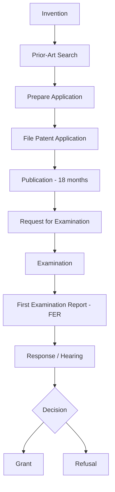
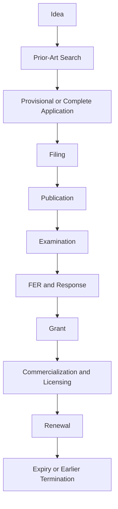

# Chapter 7: Patent Procedure and Rights

---

## Patent Application Process

---

## Steps in Detail

### Step 1: Identify the Invention
- What is new? What problem does it solve? What is the technical advantage?
- **Document:** Research, experiments, drawings, technical results, development dates
- ⚠️ **Avoid unnecessary public disclosure before filing** — it can affect novelty

### Step 2: Patent Search (Prior-Art Search)
- Search patent databases, research papers, technical journals, products, conference publications
- **Objectives:** Determine novelty, identify similar inventions, refine claims, reduce rejection risk

### Step 3: File the Application
Filed at the **Indian Patent Office** with:
- Applicant/Inventor details, Title of invention
- Specification, Claims, Drawings (if applicable), Abstract
- Required forms and fees

**Types of Applications:**
- Ordinary application
- Convention application
- PCT national phase application
- Divisional application
- Patent of addition

### Step 4: Provisional vs Complete Specification

| Feature | Provisional Specification | Complete Specification |
|---|---|---|
| **Purpose** | Establish priority date | Fully disclose invention and define protection |
| **Disclosure** | Limited | Detailed |
| **Claims** | Not required in same manner | Detailed and required |
| **Patent grant** | Cannot directly result in grant | Basis for examination and grant |
| **Follow-up** | Complete spec within **12 months** | Examination and grant process |

> **Most Important Part of Complete Specification = CLAIMS** (define the legal scope of protection)

### Step 5: Publication
- Patent application published after **18 months** from relevant filing/priority date
- Provides: Public disclosure, Technical information, Transparency
- Early publication can be requested by applicant

### Step 6: Request for Examination (RFE)
- Filing application does **NOT** mean automatic examination
- Applicant must submit **RFE** within prescribed time
- Examination checks: Novelty, Inventive step, Industrial applicability, Compliance, Sufficiency of disclosure

### Step 7: First Examination Report (FER)
- Patent Office issues FER with objections (if any) regarding: Novelty, Inventive step, Clarity, Claim drafting, Formal requirements
- Applicant may: Amend claims, Submit arguments, Provide evidence, Request a hearing

### Step 8: Grant of Patent
If all requirements satisfied → **Patent is granted**
- Entered in the register
- Published in official record
- Enforceable subject to law

**Patent Term:** **20 years** from the filing date (for most patents in India)

---

## Rights Conferred on a Patentee

**Product Patent — Patentee can prevent unauthorized:**
- Making, Using, Offering for sale, Selling, or **Importing** the patented product in India

**Process Patent — Patentee can prevent unauthorized:**
- Use of the patented process and dealings with products directly obtained by that process

**Commercial Rights:**
- Commercialize, License, or Assign the patent
- Use it as a business asset
- Enter technology-transfer agreements
- Seek legal remedies against infringement

> **Important:** Patent rights are exclusive but **NOT absolute** — subject to statutory limitations, exceptions, and public-interest provisions.

---

## Transfer of Patent

### Assignment vs Licensing

| Feature | Assignment | Licensing |
|---|---|---|
| **Ownership** | Transferred to assignee | Retained by owner |
| **Control** | Passes to assignee | Remains with owner |
| **Payment** | Lump sum or other consideration | Royalty/fee |
| **Example** | Sale of patent | Permission to manufacture |
| **Result** | New owner | Licensee gets permitted rights |

### Types of Licenses
- **Exclusive License** – Only one licensee gets specified rights
- **Non-Exclusive License** – Multiple licensees may receive rights
- **Voluntary License** – Granted voluntarily by owner
- **Compulsory License** – Granted under statutory conditions without owner's permission

---

## Compulsory Licensing

Allows a third party to use a patent **without the owner's voluntary permission** under statutory conditions.

**Conditions in Indian law:**
- Reasonable requirements of the public not being satisfied
- Invention not available at a reasonably affordable price
- Patent not being sufficiently worked in India

> **Purpose:** Balance → Patent Rights ↔ Public Interest

---

## Surrender vs Revocation

| | Surrender | Revocation |
|---|---|---|
| **Initiated by** | Patentee (voluntary) | Third party / Court |
| **Meaning** | Patentee gives up the patent | Patent is cancelled |
| **Grounds** | None required | Lack of novelty, fraud, insufficient disclosure, etc. |

**Who can seek Revocation?** Under current law, revocation proceedings can be brought before the **High Court**.

> **Note:** IPAB was abolished in 2021. High Courts now handle IP appellate and revocation functions.

---

## Patent Lifecycle

---

## Patent vs Trade Secret

| Feature | Patent | Trade Secret |
|---|---|---|
| **Protection** | Statutory | Confidentiality-based |
| **Disclosure** | Application is published | Must remain secret |
| **Duration** | Generally 20 years | Potentially indefinite |
| **Registration** | Required | No registration |
| **Risk** | Expires | Lost if secrecy is lost |
| **Example** | New manufacturing technology | Confidential formula/process |
