# Rights, Transfer, Licensing, Surrender & Revocation

## 1. RIGHTS CONFERRED ON A PATENTEE
**Basic Idea**
A patent gives the **patentee exclusive rights**, but these rights are **subject to statutory limitations**.

⭐️ **Exam line**
> A patent gives the patentee exclusive rights, subject to statutory limitations.

Think:
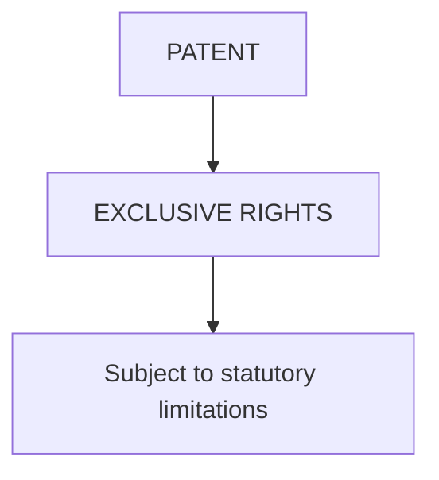

## 2. PRODUCT PATENT
For a **product patent**, the patentee can prevent unauthorized:

**M — U — O — S — I**
1. **Making**
2. **Using**
3. **Offering for sale**
4. **Selling**
5. **Importing**
of the **patented product in India**.

⭐️ **Important exam wording**
> The patentee can prevent unauthorized **making, using, offering for sale, selling, and importing** of the patented product in India.

**Memory Trick**
Remember: **MUOSI**
* **M**aking
* **U**sing
* **O**ffering for sale
* **S**elling
* **I**mporting

**Simple Example**
Suppose Company A owns a patent for a particular machine. Another company cannot, without authorization: make that patented machine, use it, offer it for sale, sell it, or import it into India, subject to the applicable statutory limitations.

## 3. PROCESS PATENT
For a **process patent**, the patentee can prevent:
**Unauthorized use of the patented process** and certain dealings with **products directly obtained by that process**.

⭐️ **Exam line**
> In a process patent, the patentee can prevent **unauthorized use of the patented process** and certain dealings with **products directly obtained by that process**.

**Simple Example**
Imagine a company has patented a particular manufacturing process. Another company uses that patented process without authorization. The process-patent rights can be used to prevent that unauthorized use and certain dealings with products directly obtained by that process.

## 4. PRODUCT PATENT vs PROCESS PATENT

| Product Patent | Process Patent |
| :--- | :--- |
| Protects the **product** | Protects the **process** |
| Covers unauthorized **making, using, offering for sale, selling, importing** of patented product in India | Covers unauthorized **use of patented process** |
| Also concerns the **patented product** | Also concerns certain dealings with products **directly obtained by that process** |

⭐️ **Memory Trick**
* **PRODUCT** → What is made
* **PROCESS** → How it is made

---

## 5. COMMERCIAL RIGHTS OF A PATENTEE
A patentee can generally:

1. **Commercialize the invention:** The patentee can use the invention commercially.
2. **License the patent:** The patentee can give another party permission to use the patent.
3. **Assign the patent:** The patentee can transfer ownership of the patent.
4. **Use the patent as a business asset:** The patent can be treated as a business asset.
5. **Enter into technology-transfer agreements:** The patentee can enter into agreements for technology transfer.
6. **Seek legal remedies against infringement:** The patentee can seek legal remedies when infringement occurs.

**Easy Memory Trick**
**C-L-A-B-T-L**
* **C** → Commercialize
* **L** → License
* **A** → Assign
* **B** → Business asset
* **T** → Technology-transfer agreements
* **L** → Legal remedies

Or remember the story:
> Use it → License it → Sell ownership → Treat as asset → Transfer technology → Take legal remedy

## 6. VERY IMPORTANT — PATENT RIGHTS ARE NOT ABSOLUTE
This is specifically highlighted in the slide.
> **Patent rights are exclusive but not absolute.**

They are subject to:
* Statutory limitations
* Exceptions
* Public-interest provisions

⭐️ **Write this in the exam**
> Patent rights are **exclusive but not absolute** and are subject to **statutory limitations, exceptions, and public-interest provisions.**

**Memory Trick**
**E ≠ A** (Exclusive ≠ Absolute)
This is a very easy point to remember.

---

## 7. TRANSFER OF PATENT
The slide says:
> **Patent ownership can be transferred.**

There are two main methods shown:
1. **Assignment**
2. **Licensing**
This distinction is extremely important.

## 8. ASSIGNMENT
**Meaning**
**Assignment** means transfer of **ownership** from one **person/entity** to another.

**Key idea:**
**OWNERSHIP MOVES**
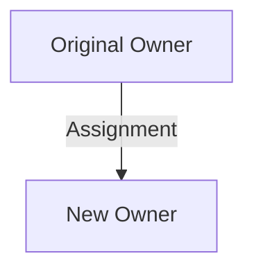

**Example from the slide**
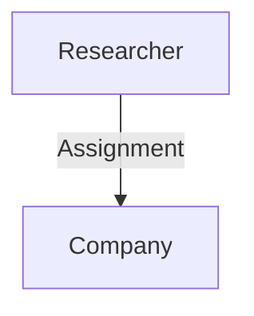
The: **Company becomes the patent owner.**

**Simple Understanding**
Suppose a researcher owns a patent. The researcher transfers the patent ownership to Company A. After assignment: **Company A becomes the patent owner.**

⭐️ **Keyword**
> Assignment = Transfer of ownership

## 9. LICENSING
**Meaning**
**Licensing** means the owner permits another party to **use the patent** while retaining ownership.

**Key idea:**
**OWNERSHIP STAYS**
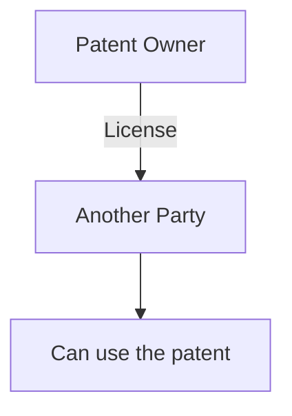
But:
> The original owner **retains ownership**.

**Example from the slide**
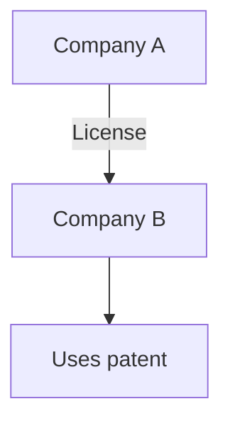
Company B pays: **Royalties or another agreed consideration.**

## 10. ASSIGNMENT vs LICENSING
This is one of the **most important tables to memorize.**

| Feature | Assignment | Licensing |
| :--- | :--- | :--- |
| **Ownership** | **Transferred** | **Retained by owner** |
| **Control** | Generally passes to **assignee** | Remains with **owner**, subject to licence |
| **Payment** | **Lump sum / other consideration** | **Royalty / fee / other consideration** |
| **Example** | **Sale of patent** | **Permission to manufacture** |
| **Result** | **New owner** | Licensee gets **permitted rights** |

🔥 **Simplest Difference**
* **Assignment:** I give you the patent.
* **Licensing:** I keep the patent, but I allow you to use it.

**Memory Trick**
* **ASSIGN = AWAY:** Ownership goes **away** from the original owner.
* **LICENSE = LET:** Owner **lets** someone use it.

---

## 11. TYPES OF PATENT LICENSES
The slide gives **4 types.**

**1. EXCLUSIVE LICENSE**
Only **one licensee** receives the specified rights.
* **Easy example:** Company A owns a patent. Company B receives the **exclusive license** for specified rights. → Company B is the **only licensee** receiving those specified rights.
* **Keyword:** Exclusive = One licensee

**2. NON-EXCLUSIVE LICENSE**
**Multiple licensees** may receive rights.
* **Easy example:** Company A owns a patent. It gives rights to: Company B, Company C, Company D. Multiple licensees can receive rights.
* **Keyword:** Non-exclusive = Multiple licensees

**3. VOLUNTARY LICENSE**
A license granted **voluntarily by the patent owner.**
* **Easy example:** Patent owner decides: "I will allow Company B to use my patent." That is a **voluntary license**.
* **Keyword:** Voluntary = Owner voluntarily grants

**4. COMPULSORY LICENSE**
A **compulsory license** is granted under **statutory conditions** by the **competent authority.**
This is different from a voluntary license.
* **Voluntary:**
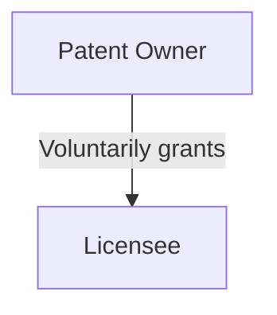
* **Compulsory:**
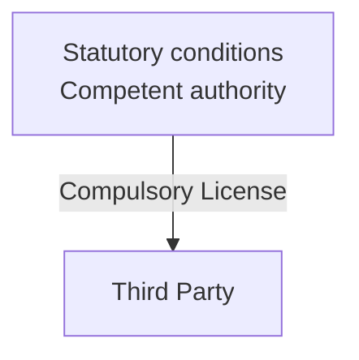

## 15. PURPOSE OF LICENSING
The slide lists **4 purposes:**
1. **Commercialization:** Helps turn the invention into a commercial activity.
2. **Technology transfer:** Allows technology to be transferred through licensing arrangements.
3. **Wider market access:** Allows the invention to reach a wider market.
4. **Revenue generation:** The patent owner can generate revenue through licensing.

**Memory Trick**
**C-T-M-R** (Commercialization, Technology transfer, Market access, Revenue)
Think:
> License → Commercialize → Transfer → Market → Revenue

---

## 16. COMPULSORY LICENSING
**Definition**
The slide gives a very important definition:
> **Compulsory licensing** allows a third party to use a patented invention under **statutory conditions without the voluntary permission** of the patent owner.

⭐️ **Memorize this structure**
> Third party + patented invention + statutory conditions + without voluntary permission

**Indian Law**
The slide specifically states:
> **Indian law** provides for compulsory licensing under specified conditions.

## 17. FACTORS FOR COMPULSORY LICENSING
The slide gives **3 factors.**
1. **Reasonable requirements of the public not being satisfied:** The public's reasonable requirements are not being adequately satisfied.
2. **Invention not available at a reasonably affordable price:** The invention is not available at a price that is **reasonably affordable**.
3. **Patent not being sufficiently worked in India:** The patent is not being **sufficiently worked in India**.

**Memory Trick**
**P-A-W**
* **P** → Public requirements not satisfied
* **A** → Affordable price not available
* **W** → Worked insufficiently in India

Think:
> **PUBLIC → PRICE → WORK**

## 18. PURPOSE OF COMPULSORY LICENSING
The slide gives one central purpose:
To balance:
> **Patent Rights ↔ Public Interest**

This is a very important conceptual point.


⭐️ **Exam answer**
> The purpose of compulsory licensing is to **balance patent rights with public interest.**

---

## 19. SURRENDER OF PATENT
**Meaning**
A patentee may:
> **Voluntarily offer to surrender a patent.**

Key word:
> **VOLUNTARILY**

## 20. GENERAL PROCESS OF SURRENDER
The slide gives this exact flow:
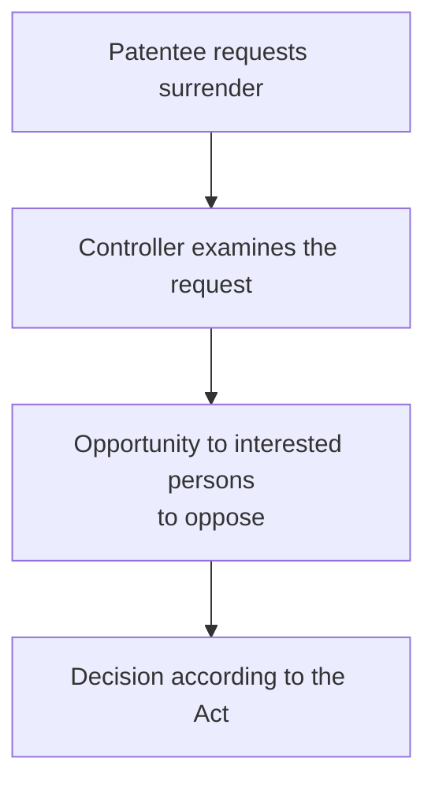
Let's understand each step:
* **Step 1 — Patentee Requests Surrender:** The **patentee** makes a request to surrender the patent.
* **Step 2 — Controller Examines the Request:** The **Controller** examines the surrender request.
* **Step 3 — Opportunity to Interested Persons to Oppose:** Interested persons are given an: **Opportunity to oppose** the surrender.
* **Step 4 — Decision:** A: **Decision according to the Act** is made.

## 21. SURRENDER vs REVOCATION
⭐️ **Very important distinction.**
The slide explicitly says:
> **Surrender is different from revocation.**

* **Surrender:** Initiated by patentee
* **Revocation:** Patent is cancelled under statutory grounds/procedure

**Memory Trick**
* **SURRENDER = SELF:** The **patentee itself** initiates it.
* **REVOCATION = REMOVAL:** The patent is **cancelled** under the applicable statutory grounds/procedure.

**Comparison**
| Surrender | Revocation |
| :--- | :--- |
| **Initiated by patentee** | Patent is **cancelled under statutory grounds/procedure** |
| Patentee **voluntarily offers** to surrender | Cancellation occurs through the relevant **statutory process** |

---

## 22. REVOCATION OF PATENT
**What is Revocation?**
The slide defines it simply:
> **Revocation means cancellation of a granted patent.**

And:
> A patent may be revoked under **specified statutory grounds.**

⭐️ **Exam definition**
> **Revocation is the cancellation of a granted patent under specified statutory grounds.**

## 23. GROUNDS FOR REVOCATION
The slide lists **8 possible grounds.**
1. **Lack of novelty:** The patent lacks **novelty**.
2. **Lack of inventive step:** The patent lacks an **inventive step**.
3. **Lack of patentable subject matter:** The subject matter is not **patentable**.
4. **Wrongful obtaining:** The patent was **wrongfully obtained**.
5. **Insufficient disclosure:** The disclosure is **insufficient**.
6. **Claims not sufficiently based on the specification:** The claims are not sufficiently based on the **specification**.
7. **Fraud or misrepresentation:** The patent was obtained through: **Fraud or misrepresentation** in appropriate circumstances.
8. **Failure to comply with statutory requirements:** The required **statutory requirements** were not complied with.

## 24. REVOCATION MEMORY TRICK
There are 8 points: **N-I-P-W-I-C-F-S**
* **N** → Lack of **Novelty**
* **I** → Lack of **Inventive step**
* **P** → Lack of **Patentable subject matter**
* **W** → **Wrongful obtaining**
* **I** → **Insufficient disclosure**
* **C** → **Claims not sufficiently based on specification**
* **F** → **Fraud/misrepresentation**
* **S** → Failure to comply with **Statutory requirements**

**Easier conceptual memory**
Think:
> **Patent is revoked if the invention isn't validly patentable, wasn't properly obtained, wasn't properly disclosed/claimed, or statutory requirements weren't followed.**

## 25. WHO CAN SEEK REVOCATION?
The slide says:
> Under the **current legal framework**, revocation proceedings may be brought before the **High Court** in accordance with the **Patents Act**.

⭐️ **Exam line**
> Under the current legal framework, **revocation proceedings may be brought before the High Court** in accordance with the **Patents Act**.

## 26. IMPORTANT HISTORICAL NOTE — IPAB
This part is specifically given in your slide and is important because older study material may differ.
* **Older textbooks** may describe: **IPAB** as the forum for certain **revocation matters**.
* But: **IPAB was abolished in 2021.**

**After abolition**
The slide states:
> Relevant **IP appellate and revocation functions** were transferred primarily to **High Courts**, subject to the **specific statutory provision**.

⭐️ **Exam Memory**
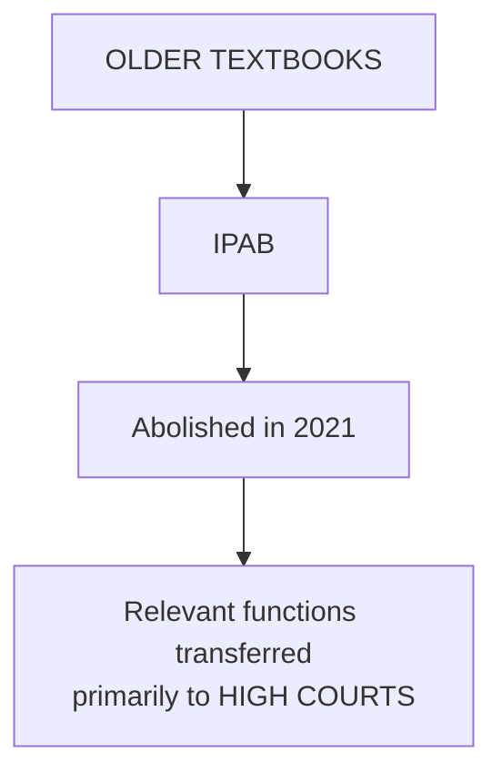

**Key sentence**
> **IPAB was abolished in 2021, and relevant IP appellate and revocation functions were transferred primarily to High Courts, subject to the specific statutory provision.**

---

## 27. COMPLETE CONCEPT MAP
Now connect **ALL 9 slides:**

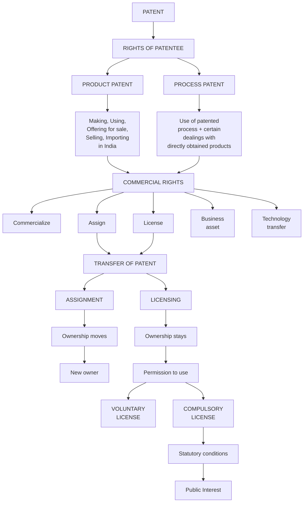

Then:
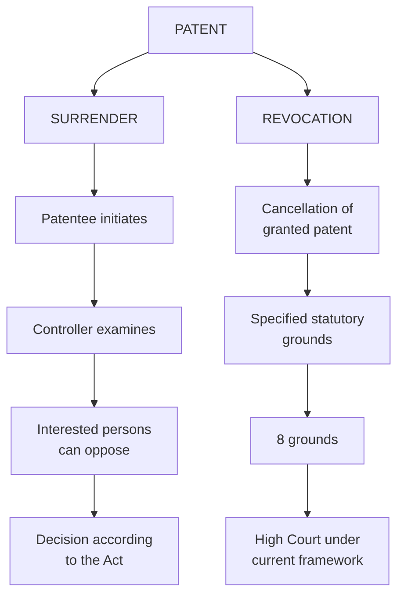

## 28. THE BIGGEST CONFUSION — ASSIGNMENT, LICENSING, SURRENDER, REVOCATION
Memorize this table:

| Concept | What happens? | Main keyword |
| :--- | :--- | :--- |
| **Assignment** | Ownership is **transferred** | **OWNERSHIP MOVES** |
| **Licensing** | Another party gets permission to use while owner **retains ownership** | **USE, NOT OWNERSHIP** |
| **Surrender** | Patentee **voluntarily offers** to give up patent | **PATENTEE INITIATES** |
| **Revocation** | Granted patent is **cancelled** under statutory grounds/procedure | **CANCELLATION** |

🔥 **Four-word memory trick**
* **Assignment** = TRANSFER
* **Licensing** = PERMISSION
* **Surrender** = VOLUNTARY
* **Revocation** = CANCELLATION

## 29. TYPES OF LICENSE — SUPER EASY
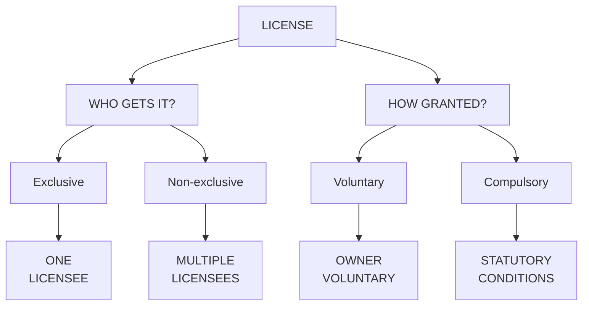

**Memorize:**
* **Exclusive** → One
* **Non-exclusive** → Multiple
* **Voluntary** → Owner voluntarily grants
* **Compulsory** → Statutory conditions + competent authority

## 30. COMMERCIALIZATION — WHAT CAN THE PATENTEE DO?
Remember: **C-L-A-B-T-L**
* **C** → Commercialize invention
* **L** → License patent
* **A** → Assign patent
* **B** → Business asset
* **T** → Technology-transfer agreements
* **L** → Legal remedies against infringement

---

## 34. HIGH-SCORING EXAM ANSWER: "RIGHTS OF A PATENTEE"
If asked for a **5-mark/long answer**, structure it like this:

**Rights of a Patentee**
A patent gives the patentee **exclusive rights**, subject to **statutory limitations**.

For a **product patent**, the patentee can prevent unauthorized **making, using, offering for sale, selling and importing** of the patented product in India.

For a **process patent**, the patentee can prevent unauthorized **use of the patented process** and certain dealings with **products directly obtained** by that process.

The patentee can generally:
1. **Commercialize** the invention.
2. **License** the patent.
3. **Assign** the patent.
4. **Use** the patent as a **business asset**.
5. **Enter** into **technology-transfer agreements**.
6. **Seek legal remedies** against infringement.

However, patent rights are **exclusive but not absolute** and are subject to **statutory limitations, exceptions and public-interest provisions**.

## 35. HIGH-SCORING ANSWER: "ASSIGNMENT VS LICENSING"
**Assignment** is the **transfer of patent ownership** from one person/entity to another. The ownership generally passes to the **assignee**.

**Licensing**, on the other hand, allows another party to **use the patent while the owner retains ownership**. The licensee may provide **royalties, fees or other agreed consideration**.

Then draw:
```text
ASSIGNMENT
Owner --------> New Owner
         OWNERSHIP TRANSFERRED

LICENSING
Owner --------> Licensee
         PERMISSION TO USE
         |
      Owner keeps ownership
```
This diagram makes the difference immediately clear.

## 36. HIGH-SCORING ANSWER: "COMPULSORY LICENSING"
**Compulsory licensing** allows a **third party** to use a patented invention under **statutory conditions without the voluntary permission of the patent owner**. Indian law provides for compulsory licensing under specified conditions.

Factors can include:
1. **Reasonable requirements** of the public not being satisfied
2. Invention not available at a **reasonably affordable price**
3. Patent not being **sufficiently worked in India**

Its purpose is to balance:
> **Patent Rights ↔ Public Interest**

## 37. HIGH-SCORING ANSWER: "SURRENDER OF PATENT"
**Surrender of patent** occurs when a **patentee voluntarily offers to surrender a patent.**

**Process:**
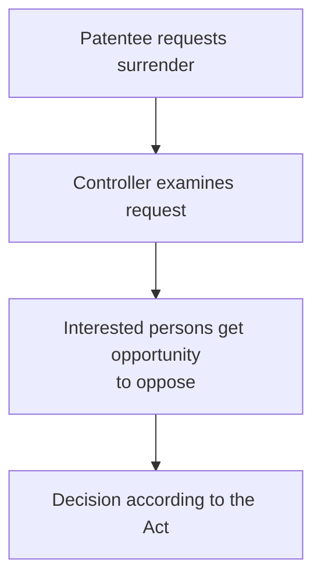

**Important distinction:**
**Surrender is initiated by the patentee**, whereas **revocation involves cancellation of the patent under statutory grounds/procedure.**

## 38. HIGH-SCORING ANSWER: "REVOCATION OF PATENT"
**Revocation means cancellation of a granted patent.** A patent may be revoked under **specified statutory grounds.**

Possible grounds include:
* Lack of novelty
* Lack of inventive step
* Lack of patentable subject matter
* Wrongful obtaining
* Insufficient disclosure
* Claims not sufficiently based on the specification
* Fraud or misrepresentation
* Failure to comply with statutory requirements

Under the **current legal framework**, revocation proceedings may be brought before the **High Court** in accordance with the Patents Act.

---

## 39. ⭐️ FINAL 2-MINUTE REVISION SHEET

**PATENTEE RIGHTS**
* **Exclusive but not absolute**
* **Product:** M-U-O-S-I (Making → Using → Offering for sale → Selling → Importing)
* **Process:** Use patented process + certain dealings with directly obtained products

**COMMERCIAL RIGHTS**
* **C-L-A-B-T-L** (Commercialize → License → Assign → Business asset → Technology transfer → Legal remedies)

**TRANSFER**
* **Assignment:** Ownership transferred
* **Licensing:** Ownership retained + permission to use

**LICENSE TYPES**
* **Exclusive** → One
* **Non-exclusive** → Multiple
* **Voluntary** → Owner voluntarily grants
* **Compulsory** → Statutory conditions

**LICENSING PURPOSE**
* **C-T-M-R** (Commercialization → Technology transfer → Market access → Revenue)

**COMPULSORY LICENSING**
* **Factors:** P-A-W (Public requirements not satisfied, Affordable price not available, Not sufficiently Worked in India)
* **Purpose:** Patent Rights ↔ Public Interest

**SURRENDER**
* **Patentee voluntarily initiates**
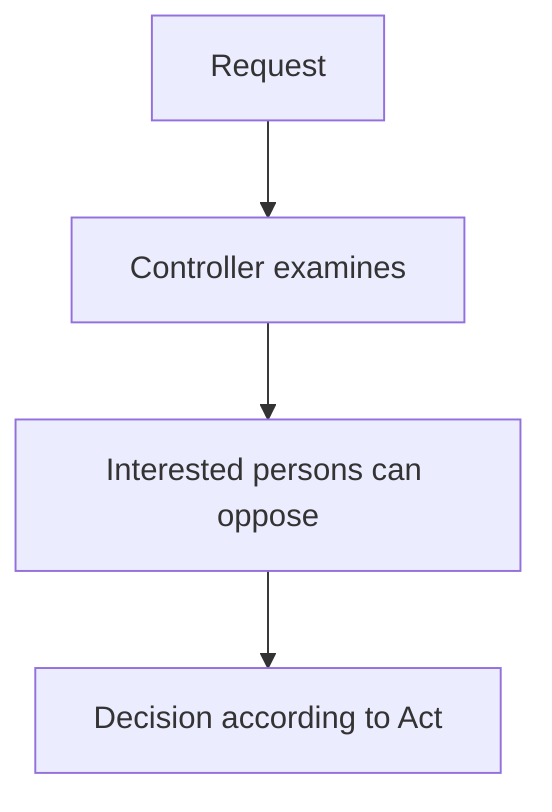

**REVOCATION**
* **Cancellation of granted patent**
* **Grounds:** N-I-P-W-I-C-F-S (Novelty, Inventive step, Patentable subject matter, Wrongful obtaining, Insufficient disclosure, Claims/specification, Fraud/misrepresentation, Statutory requirements)
* **Current framework shown:** High Court
* **Historical:** IPAB → abolished in 2021

---

## 🧠 THE ONE MEMORY STORY
If you remember only **one story**, remember this:

A **PATENT** gives exclusive rights, but they are **NOT absolute**.

The patentee can:
**Make/stop making, use, offer for sale, sell, import a product**, or protect the use of a **process**.

Then the patent can become a business asset:
**Commercialize → License → Assign → Transfer technology → Seek legal remedies.**

If ownership changes:
**ASSIGNMENT** = ownership moves.

If only permission is given:
**LICENSING** = ownership stays.

Licensing can be:
**Exclusive / Non-exclusive / Voluntary / Compulsory.**

Compulsory licensing exists under:
**Statutory conditions**, balancing **Patent Rights ↔ Public Interest**.

Finally, the patent can be:
**Surrendered** → patentee voluntarily initiates
or
**Revoked** → granted patent is cancelled under statutory grounds/procedure.

And for revocation:
* **Current framework** → High Court
* **Old textbooks** → IPAB
* **IPAB abolished in 2021**

That is the complete conceptual structure of all 9 slides you attached.


## 🧠 Ultimate Mindmap 1: Rights of a Patentee
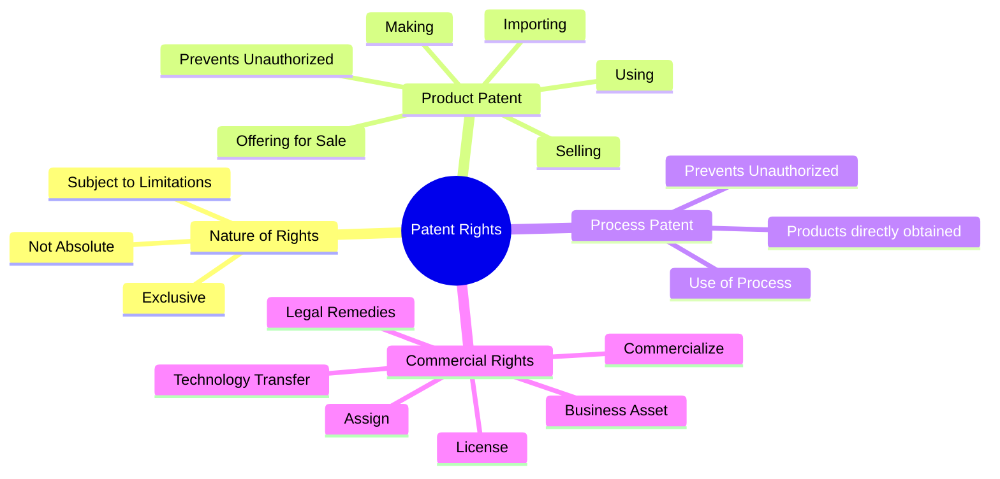

## 🧠 Ultimate Mindmap 2: Transfer & Licensing
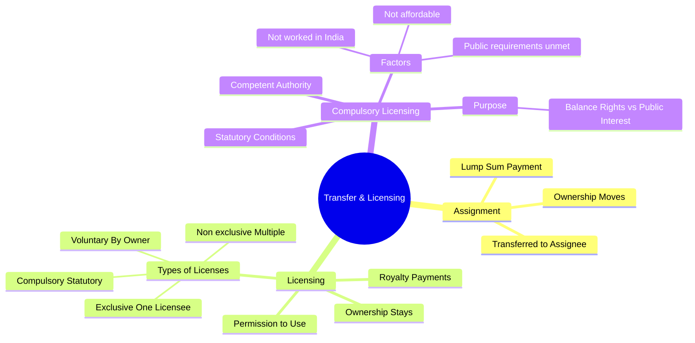

## 🧠 Ultimate Mindmap 3: Surrender & Revocation
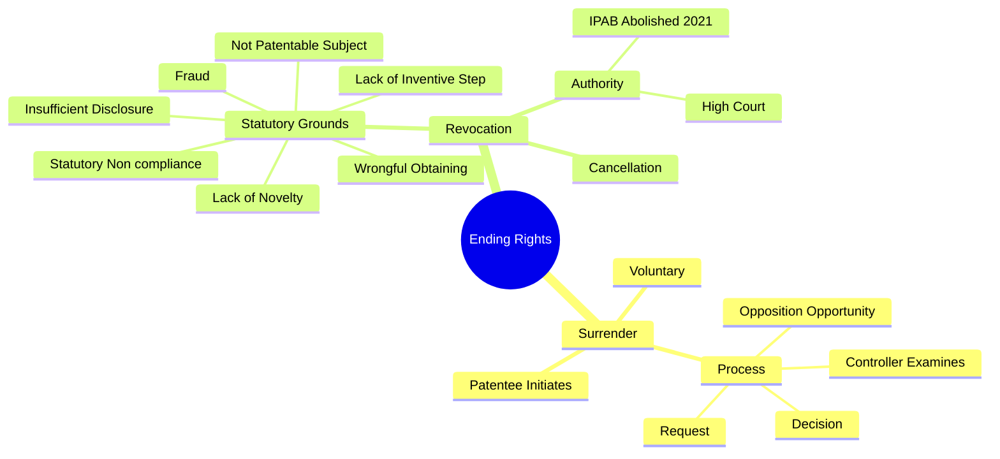
