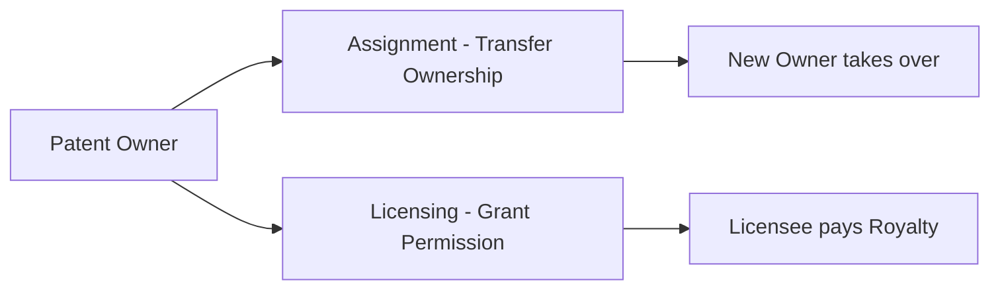
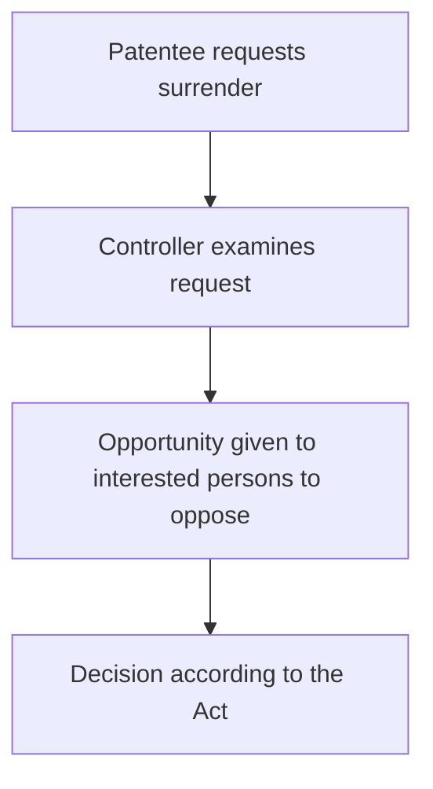

# Chapter 8: Rights, Transfer, Licensing, Surrender & Revocation

---

## Rights Conferred on a Patentee

A patent gives the patentee **exclusive rights**, subject to statutory limitations.

### Product Patent Rights
The patentee can prevent unauthorized:
- **Making** the patented product
- **Using** the patented product
- **Offering for sale** the patented product
- **Selling** the patented product
- **Importing** the patented product in India

### Process Patent Rights
- Prevent unauthorized **use of the patented process**
- Prevent dealings with products directly obtained by that process

### Commercial Rights
- Commercialize, License, or Assign the patent
- Use as a business asset
- Enter technology-transfer agreements
- Seek legal remedies against infringement

> ⚠️ Patent rights are **exclusive but NOT absolute** — subject to statutory limitations, exceptions, and public-interest provisions.

---

## Transfer of Patent Ownership

Patent ownership can be transferred in two main ways:

### Assignment vs Licensing

| Feature | Assignment | Licensing |
|---|---|---|
| **Ownership** | Transferred to assignee | Retained by original owner |
| **Control** | Passes to assignee | Owner retains control |
| **Payment** | Lump sum / other consideration | Royalty / fee |
| **Example** | Sale of patent rights | Permission to manufacture |
| **Result** | New owner | Licensee gets permitted rights |

---

## Types of Patent Licenses

| License Type | Meaning |
|---|---|
| **Exclusive License** | Only one licensee receives specified rights |
| **Non-Exclusive License** | Multiple licensees may receive rights |
| **Voluntary License** | Granted voluntarily by the patent owner |
| **Compulsory License** | Granted under statutory conditions without owner's permission |

**Purpose of Licensing:**
- Commercialization
- Technology transfer
- Wider market access
- Revenue generation

---

## Compulsory Licensing

Allows a **third party to use a patented invention** without the voluntary permission of the patent owner, under statutory conditions.

**Indian law allows compulsory licensing when:**
- Reasonable requirements of the public are **not being satisfied**
- Invention is **not available at reasonably affordable price**
- Patent is **not being sufficiently worked** in India

> **Purpose:** Balance → Patent Rights ↔ Public Interest

---

## Surrender of Patent

A patentee may **voluntarily offer to surrender** a patent.

> **Surrender = Initiated by the patentee (voluntary)**

---

## Revocation of Patent

Revocation means **cancellation of a granted patent** under specified statutory grounds.

**Possible grounds for revocation:**
- Lack of novelty
- Lack of inventive step
- Lack of patentable subject matter
- Wrongful obtaining
- Insufficient disclosure
- Claims not based on specification
- Fraud or misrepresentation
- Failure to comply with statutory requirements

**Who can seek revocation?**
Under current law, revocation proceedings are brought before the **High Court** in accordance with the Patents Act.

> ⚠️ **IPAB was abolished in 2021.** High Courts now handle IP appellate and revocation matters.

---

## Surrender vs Revocation

| | Surrender | Revocation |
|---|---|---|
| **Who initiates** | Patentee (voluntary) | Court / Third party |
| **Meaning** | Patentee gives up the patent | Patent is cancelled |
| **Grounds needed** | None (voluntary) | Yes (statutory grounds) |

---

## Patent Agent

A patent agent is a person **registered under Indian patent law** authorized to perform specified professional activities before the Patent Office.

**Functions:**
- Prepare and file patent applications
- Draft specifications and claims
- Communicate with Patent Office
- Respond to examination objections
- Represent applicants in permitted proceedings

### Patent Agent vs Advocate/Lawyer

| Patent Agent | Advocate/Lawyer |
|---|---|
| Patent drafting and filing | Litigation and court proceedings |
| Patent prosecution | Legal opinions |
| Representation before Patent Office | Patent infringement suits |
