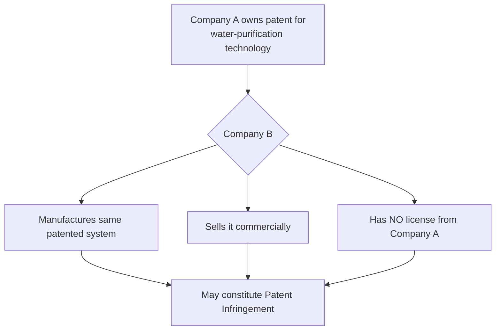

# Chapter 9: Patent Infringement

---

## What is Patent Infringement?

Patent infringement occurs when a person **performs an act that falls within the scope of the patent rights** without authorization and contrary to the Patents Act.

**Examples of Infringement:**
- Unauthorized manufacturing of a patented product
- Unauthorized selling of a patented product
- Unauthorized use of a patented process
- Unauthorized importing of a patented product

---

## Types of Patent Infringement

| Type | Description |
|---|---|
| **Direct Infringement** | Direct unauthorized performance of an act covered by the patent |
| **Indirect/Contributory** | Third party facilitates infringement (depends on applicable law and facts) |
| **Literal Infringement** | Accused product/process falls within the exact wording of the patent claims |
| **Doctrine of Equivalents** | Equivalent technical features considered (varies by jurisdiction) |

---

## Infringement Example

> **Key Principle:** Patent protection is determined primarily by the **CLAIMS** in the patent.

---

## Action for Patent Infringement

A patent infringement action is filed before a **competent court having jurisdiction** (currently, the High Court under the Patents Act framework).

**Patentee may seek:**
- **Injunction** – Stop the infringement
- **Damages** – Financial compensation
- **Account of profits** – Profits earned by the infringer
- Other appropriate relief

**Purpose:**
- Stop infringement
- Compensate the patent owner
- Protect the commercial value of the patent

---

## Defenses in Patent Infringement

A defendant may challenge infringement or the validity of the patent:

- Patent is **invalid**
- **No infringement** occurred
- Accused product/process does **not fall within the claims**
- A **statutory exception** applies
- Patent rights are **exhausted** (where applicable)
- Other defenses recognized by the Patents Act

> **Patent infringement litigation involves both:**
> **Infringement Analysis + Patent Validity Analysis**

---

## Why Patents Are Important for Inventors

| For Inventors | For Industry | For Society |
|---|---|---|
| Legal protection | Competitive advantage | Encourages innovation |
| Commercial opportunity | Investment incentive | Promotes tech development |
| Recognition | Technology commercialization | Patent disclosure adds to public knowledge |
| Licensing income | Technology licensing | |

---

## Advantages and Limitations of Patents

### Advantages
- Legal protection for inventions
- Technology licensing opportunities
- Market differentiation and competitive advantage
- Commercialization income
- Attracts investment

### Limitations
- Patent application can be **expensive**
- Patent prosecution can take **time**
- Protection is **territorial**
- Protection has a **limited term** (20 years)
- Patent details are **publicly disclosed**
- Enforcement can involve **litigation costs**
- Patentability is **not guaranteed** merely by filing

---

## Patent vs Copyright (Quick Comparison)

| Feature | Patent | Copyright |
|---|---|---|
| **Protects** | Inventions | Creative expression |
| **Example** | New technical device | Software source code |
| **Main requirement** | Novelty + Inventive step + Industrial applicability | Originality/eligibility |
| **Registration** | Required | Not required for existence |
| **Term** | 20 years | Life + 60 years (for most works) |
| **Focus** | Technical solution | Expression |
