# Patent Infringement, Agents, Software Patents & Lifecycle

## 1. Patent Infringement
**What is Patent Infringement?**
**Patent infringement** occurs when a person performs an act that:
1. Falls within the **scope of patent rights**
2. Is done **without authorization**
3. Is contrary to the **Patents Act**

**Easy definition for exam**
> **Patent infringement** means performing an **unauthorized act** that falls within the **scope of the patent rights**, contrary to the **Patents Act**.

**Examples**
Unauthorized:
*   **Manufacturing** a patented product
*   **Selling** a patented product
*   **Using** a patented process
*   **Importing** a patented product

🧠 **Memory Trick**
Remember: **M-S-U-I**
**M**anufacture → **S**ell → **U**se → **I**mport
All are examples of potentially unauthorized acts involving a patent.

## 2. Types of Patent Infringement
There are four concepts in your slide:

**A. Direct Infringement**
This is when someone directly performs an **unauthorized act covered by the patent**.
*   **Simple example:** Company A has a patent for a water-purification system. Company B manufactures that patented system without authorization. → **Direct infringement situation**

**B. Indirect / Contributory Situations**
A **third party** may be involved in activities that **facilitate infringement**, depending on the **applicable law and facts**.
*   **The important idea is:** The third party may not necessarily perform the final infringing act itself, but may be involved in **facilitating infringement**.

**C. Literal Infringement**
The accused **product/process falls within the wording of the patent claims**.
*   **In simple words:** **Patent claim wording → accused product/process**. If the relevant features fall within the claim wording, it can constitute **literal infringement**.

**D. Doctrine of Equivalents**
In some jurisdictions, **equivalent technical features** may also be considered.
*   For **Indian patent litigation**, the analysis must be based on **Indian law and the specific judicial approach**.

🧠 **Easy distinction**

| Concept | Easy meaning |
| :--- | :--- |
| **Direct** | Person directly performs the covered act |
| **Indirect/Contributory** | Third party facilitates infringement |
| **Literal** | Product/process falls within the actual claim wording |
| **Equivalents** | Equivalent technical features may be considered in some jurisdictions |

## 3. Patent Infringement — Example
Suppose:
*   Company A owns a patent for a particular **water-purification technology**.
*   Company B:
    *   Manufactures the same patented system
    *   Sells it commercially
    *   Has no license from Company A

If Company's B's activity falls within the **scope of the patent claims**, it may constitute **infringement**.

**Important principle ⭐️**
> **Patent protection is determined primarily by the claims.**

🧠 **Remember**
**Claims = Boundary of Patent Protection**

Think:
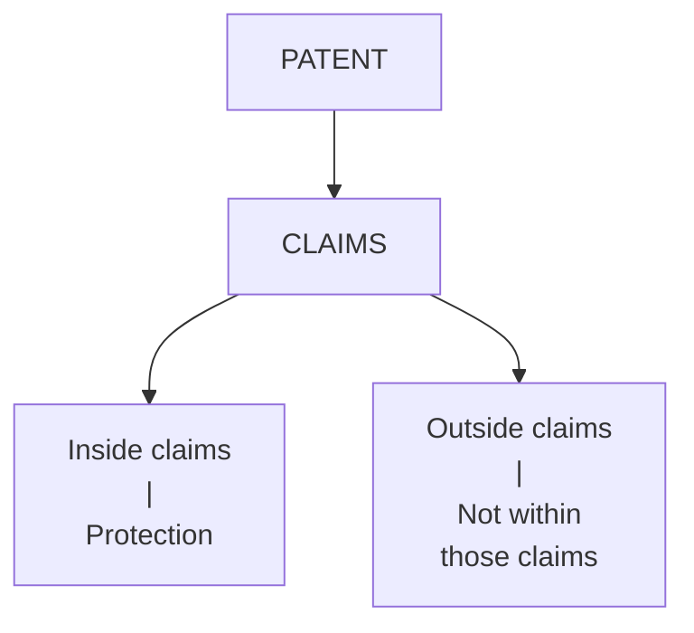

So in an infringement question, don't simply ask: *"Does it look similar?"*
Ask: **"Does the accused activity fall within the scope of the patent claims?"**

## 4. Action for Patent Infringement
A patent infringement action is generally filed before a competent court having jurisdiction.
The slide states that patent infringement suits are heard by the **High Court** under the current framework where applicable.

**What can the patentee seek?**
The patentee may seek:
1.  **Injunction**
2.  **Damages**
3.  **Account of profits**
4.  **Other appropriate relief**

**Meaning in simple language**
*   **Injunction:** Court order intended to **stop infringement**.
*   **Damages:** Monetary compensation for the patent owner.
*   **Account of profits:** Seeking an accounting of profits associated with the infringement.
*   **Other appropriate relief:** Other relief considered appropriate in the circumstances.

**Purpose**
The purpose is to:
*   **Stop** infringement
*   **Compensate** the patent owner
*   **Protect** the commercial value of the patent

🧠 **Memory Trick**
**S-C-P**
**S**top, **C**ompensate, **P**rotect

## 5. Defenses in Patent Infringement
A defendant can challenge:
*   The **infringement**, or
*   The **validity of the patent**

**Possible issues**
1.  **Patent is invalid:** The defendant may challenge whether the patent itself is valid.
2.  **No infringement occurred:** The defendant may argue that their activity does **not infringe** the patent.
3.  **Product/process does not fall within claims:** The accused product or process may be outside the **scope of the claims**.
4.  **Statutory exception applies:** A relevant **statutory exception** may apply.
5.  **Patent rights are exhausted:** **Patent rights may be exhausted**, where applicable.
6.  **Other defenses:** Other defenses recognized by the **Patents Act** may also apply.

⭐️ **Very Important**
Patent infringement litigation involves:
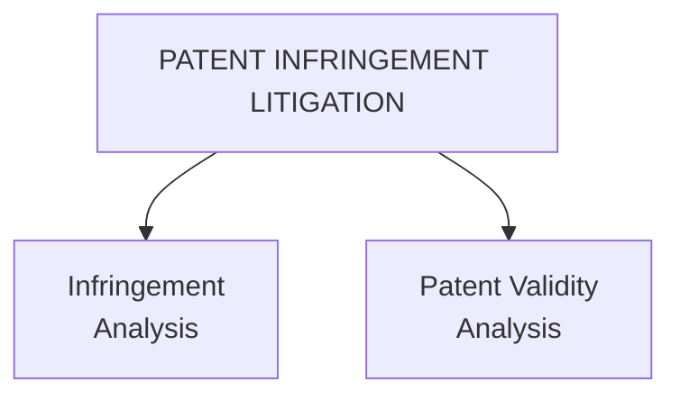

So there are **two major questions:**
*   **Question 1:** Was the patent infringed?
*   **Question 2:** Is the patent valid?

🧠 **Memory Trick**
**I + V**
**I** = Infringement
**V** = Validity

---

## 6. Patent Agents
**What is a Patent Agent?**
A **patent agent** is a person who is:
*   **Registered** under Indian patent law
*   **Authorized** to perform specified professional activities before the **Patent Office**

**Simple definition**
> A **patent agent** is a registered person authorized to perform specified professional activities before the **Patent Office**.

**Functions of a Patent Agent**
A patent agent can:
1.  **Prepare** patent applications
2.  **Draft** specifications
3.  **File** applications
4.  **Communicate** with the Patent Office
5.  **Respond** to examination objections
6.  **Represent** applicants in permitted proceedings

🧠 **Memory Trick**
**P-D-F-C-R-R**
**P**repare, **D**raft, **F**ile, **C**ommunicate, **R**espond, **R**epresent

## 7. Qualification of Patent Agent
A person seeking registration as a patent agent must satisfy the **statutory eligibility** requirements.
Broadly, the slide lists:

1.  **Citizenship:** Being a **citizen of India**, subject to statutory requirements.
2.  **Age:** Meeting the prescribed **age requirements**.
3.  **Technical qualification:** Possessing the required **scientific/technical qualifications**.
4.  **Examination / statutory route:** Passing the prescribed **patent-agent examination** or satisfying the applicable **statutory route**.

**Important**
The exact eligibility requirements should be checked against the **current Patents Act and Patent Rules**, because the rules have been **amended over time**.

🧠 **Memory Trick**
**C-A-T-E**
**C**itizenship, **A**ge, **T**echnical qualification, **E**xamination/statutory route

## 8. Patent Agent vs Advocate/Lawyer
This is an important comparison.

| Patent Agent | Advocate/Lawyer |
| :--- | :--- |
| Patent drafting | Litigation |
| Patent filing | Court proceedings |
| Patent prosecution | Legal opinions |
| Representation before Patent Office | Patent infringement suits |

**Easy understanding**
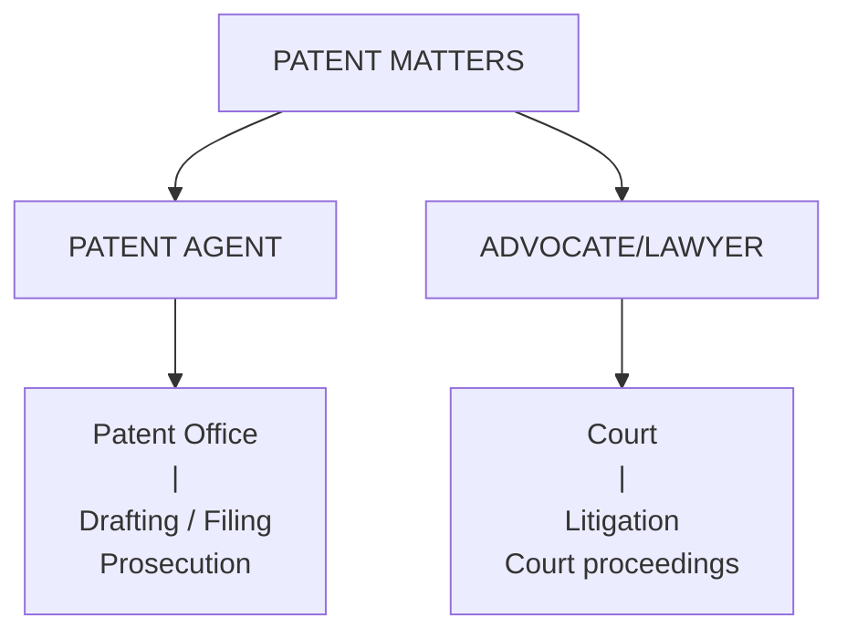

🧠 **One-line memory**
*   **Patent Agent** → Patent Office
*   **Lawyer** → Court/Litigation

---

## 9. Patents and Computer Programs
**Section 3(k)**
Your slide specifically mentions:
**Indian Patent Act — Section 3(k)**

It excludes from patentability:
*   **Mathematical method**
*   **Business method**
*   **Computer programme per se**
*   **Algorithms**

**Therefore**
A **computer program merely as such** is generally **not patentable in India**.

However, the analysis becomes more nuanced when software is associated with a:
**Technical effect or technical contribution**

🧠 **Exam line**
> Under **Section 3(k)**, mathematical methods, business methods, computer programmes **per se**, and algorithms are excluded from patentability; however, software associated with a **technical effect or technical contribution** requires a more nuanced analysis.

## 10. Software Copyright vs Software Patent
This distinction is extremely important.

**Copyright**
Copyright protects the **expression of software**.
Examples: **Source code**, **Object code**, **Program documentation**

So:
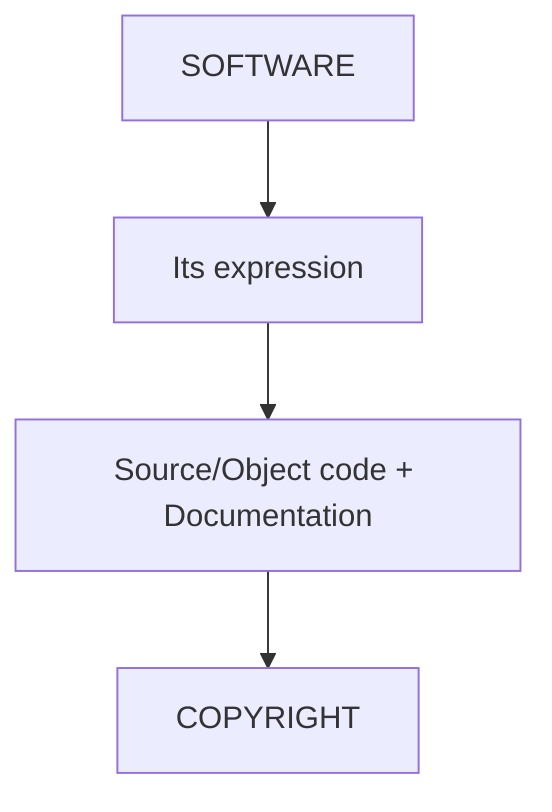

**Patent**
A patent may potentially protect an eligible **technical invention involving software**, provided:
*   It satisfies the **Patents Act**
*   It is **not excluded**

**Example**
*   **Source code of an application** → **Copyright**
*   But: **Novel technical system implemented using software** that provides a qualifying **technical contribution** → May potentially be **patentable**, subject to **examination and Section 3(k)**.

## 11. Computer Program — Examples

**Generally NOT Patentable**
According to the slide:
*   **Mathematical algorithm alone**
*   **Business method alone**
*   **Abstract software logic**
*   **Computer program per se**

**Potentially Patentable**
A software-related invention may be considered for patent protection when it:
1.  Demonstrates an eligible **technical contribution/effect**
2.  Satisfies **all patentability requirements**

Examples from the slide:
*   **Technical control of an industrial machine**
*   **Improved functioning of a communication system**
*   **Technical improvement in computer hardware performance**

⭐️ **Important**
Patentability depends on: **Actual claims + technical substance**
It does **not** depend merely on adding words such as: *"computer implemented"*

🧠 **Memory Trick**
Don't memorize "software = patentable." Remember:
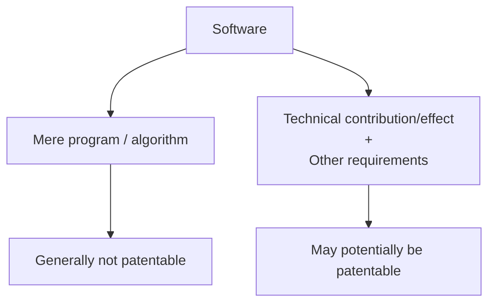

## 12. Patentability of AI-Based Inventions
AI is relevant to modern patent law.

**Possible patent-related areas**
The slide identifies:
1.  **AI-controlled industrial systems**
2.  **Novel hardware architecture**
3.  **Technical image-processing systems**
4.  **AI-based signal-processing techniques**
5.  **Technical improvements in computing systems**

**Potentially problematic**
The slide lists:
*   **Mathematical model alone**
*   **Algorithm alone**
*   **Abstract AI concept**
*   **Business method implemented using software**

**Key Principle ⭐️**
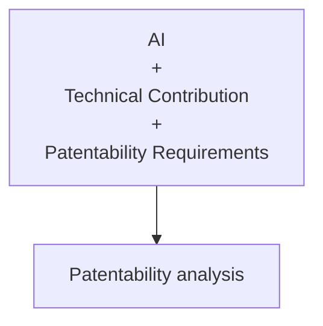

🧠 **Memory Trick**
**AI ≠ automatically patentable**
Remember:
> **AI + Technical Contribution + Patentability Requirements**

---

## 13. Patent Lifecycle
This is one of the easiest things to score marks on if you remember the sequence.

**Flow**
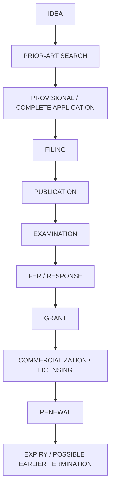

**What is the overall idea?**
You start with an **idea**, investigate existing **prior art**, prepare and **file** the application, go through **publication and examination**, respond to examination objections, and if requirements are satisfied, obtain **grant**.
After grant: **Commercialization / Licensing → Renewal → Expiry / possible earlier termination**

🧠 **Memory Trick**
**I-P-A-F-P-E-F-G-C-R-E**
Idea → Search → Apply → File → Publish → Examine → Respond → Grant → Commercialize → Renew → Expire

## 14. Complete Patent Process — Smart Irrigation Example
Suppose a researcher develops a **new irrigation controller**.
The slide gives the complete example in **9 steps**.

*   **Step 1 — Identify:** Identify the **technical invention**.
*   **Step 2 — Search:** Conduct a **prior-art search**.
*   **Step 3 — Provisional:** File a **provisional specification**.
*   **Step 4 — Develop:** Develop and **finalize the invention**.
*   **Step 5 — Complete:** File the **complete specification** within the prescribed period.
*   **Step 6 — Examination:** Request **examination**.
*   **Step 7 — Response:** Respond to **examination objections**.
*   **Step 8 — Grant:** Patent is **granted if requirements are satisfied**.
*   **Step 9 — Commercialize:** **Commercialize or license** the technology.

🧠 **Memory Trick**
**I → S → P → D → C → R → R → G → C**
Identify → Search → Provisional → Develop → Complete → Request → Respond → Grant → Commercialize

---

## 15. Patent vs Copyright

| Feature | Patent | Copyright |
| :--- | :--- | :--- |
| **Protects** | Invention | Creative expression |
| **Example** | New technical device | Software source code |
| **Main requirement** | Novelty + inventive step + industrial applicability | Originality/eligibility |
| **Registration** | Required for patent rights | Not required for existence |
| **Typical term** | 20 years | Life + 60 years for many works |
| **Focus** | Technical solution | Expression |

**Simplest distinction**
*   **Patent** = Technical invention
*   **Copyright** = Creative expression

## 16. Patent vs Trade Secret

| Feature | Patent | Trade Secret |
| :--- | :--- | :--- |
| **Protection** | Statutory | Confidentiality-based |
| **Disclosure** | Patent application is published | Must remain secret |
| **Duration** | Generally 20 years | Potentially indefinite |
| **Registration** | Required | No registration |
| **Risk** | Expires | Lost if secrecy is lost |
| **Example** | New manufacturing technology | Confidential formula/process |

**Key conceptual difference**
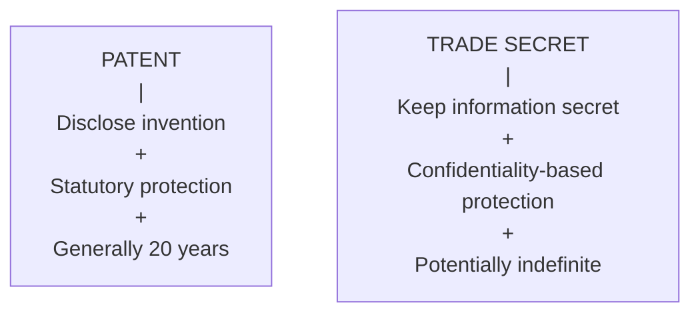

🧠 **Memory Trick**
*   **Patent** = Publish + Protect
*   **Trade Secret** = Secret + Protect

---

## 17. Advantages of Patenting
The slide divides advantages into **three groups**.

**A. For Inventors**
1.  **Legal protection:** Provides **legal protection** for the invention.
2.  **Commercialization:** Helps with **commercialization**.
3.  **Licensing opportunities:** Creates **licensing opportunities**.
4.  **Recognition:** Provides **recognition**.
5.  **Technology licensing:** Enables **technology licensing**.
6.  **Market differentiation:** Can provide **market differentiation**.

**B. For Companies**
*   **Competitive advantage**
*   **Investment attraction**

**C. For Society**
*   **Technical knowledge is disclosed**
*   **Innovation is encouraged**
*   **New technologies can be developed**

🧠 **Memory Structure**
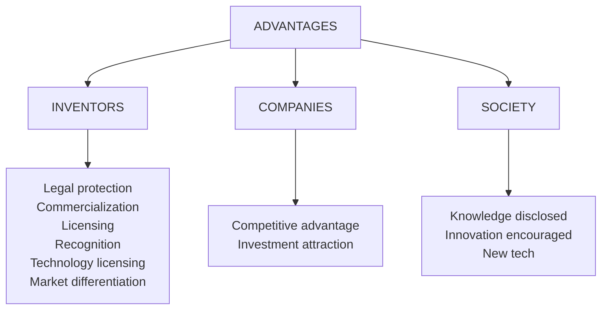

## 18. Limitations of Patents
The slide lists **7 limitations.**
1.  **Cost:** Patent application can be expensive.
2.  **Time:** Patent prosecution can take time.
3.  **Territorial nature:** Patent protection is territorial.
4.  **Limited term:** Patent protection has a limited term.
5.  **Public disclosure:** Patent details are publicly disclosed.
6.  **Enforcement costs:** Enforcement can involve **litigation costs**.
7.  **No guarantee:** Patentability is **not guaranteed** merely by filing an application.

🧠 **Memory Trick**
Remember: **C-T-T-L-D-L-G**
Cost, Time, Territorial, Limited term, Disclosure, Litigation costs, Guarantee — No guarantee

---

## 🔥 COMPLETE REVISION SHEET
If you have very little time before the exam, remember these **core points.**

**1. Patent Infringement**
*   **Unauthorized act + within scope of patent rights + contrary to Patents Act**
*   Examples: **Manufacture → Sell → Use → Import**

**2. Types**
*   Direct, Indirect/Contributory, Literal, Doctrine of Equivalents

**3. Main infringement principle**
*   Patent protection is determined primarily by the **claims**.

**4. Remedies / Action**
*   Patentee may seek: **Injunction + Damages + Account of profits + Other appropriate relief**
*   Purpose: **Stop + Compensate + Protect**

**5. Defenses**
*   Invalid patent, No infringement, Outside claims, Statutory exception, Exhaustion, Other statutory defenses
*   And remember: **Infringement Analysis + Patent Validity Analysis**

**6. Patent Agent**
*   Registered + authorized before **Patent Office**
*   Functions: **Prepare → Draft → File → Communicate → Respond → Represent**

**7. Patent Agent Qualification**
*   **Citizenship + Age + Technical qualification + Examination/statutory route**

**8. Agent vs Lawyer**
*   **Patent Agent** → Patent Office
*   **Advocate/Lawyer** → Litigation/Court

**9. Software & Patents**
*   **Section 3(k)** generally excludes: Mathematical method, Business method, Computer programme per se, Algorithm
*   But software associated with: **Technical effect / technical contribution** requires a more nuanced analysis.

**10. Copyright vs Patent**
*   **SOURCE CODE** → COPYRIGHT → Expression
*   **TECHNICAL INVENTION** → PATENT → Technical solution

**11. Software Examples**
*   **Generally not patentable:** Mathematical algorithm alone, Business method alone, Abstract software logic, Computer program per se
*   **Potentially patentable:** Technical control of industrial machine, Improved communication-system functioning, Technical improvement in computer hardware performance
*   **Key:** Actual claims + technical substance, not merely saying "computer implemented."

**12. AI Inventions**
*   **Formula:** AI + Technical Contribution + Patentability Requirements

**13. Patent Lifecycle**
*   IDEA → PRIOR-ART SEARCH → PROVISIONAL / COMPLETE APPLICATION → FILING → PUBLICATION → EXAMINATION → FER / RESPONSE → GRANT → COMMERCIALIZATION / LICENSING → RENEWAL → EXPIRY / POSSIBLE EARLIER TERMINATION

**14. Three-Way Comparison**
*   **Patent:** Protects Invention, Technical solution, Required registration, Published disclosure, 20 years, Expires
*   **Copyright:** Protects Expression, Creative expression, Not required registration, Life + 60 years
*   **Trade Secret:** Protects Confidential information, Secrecy, No registration, Must remain secret, Potentially indefinite, Secrecy lost

🧠 **Ultimate memory trick**
*   **PATENT = TECHNICAL + PUBLIC + LIMITED**
*   **COPYRIGHT = EXPRESSION**
*   **TRADE SECRET = SECRET + POTENTIALLY INDEFINITE**

---

## ⭐️ 30-SECOND MASTER MAP
Everything in these slides can be mentally connected like this:
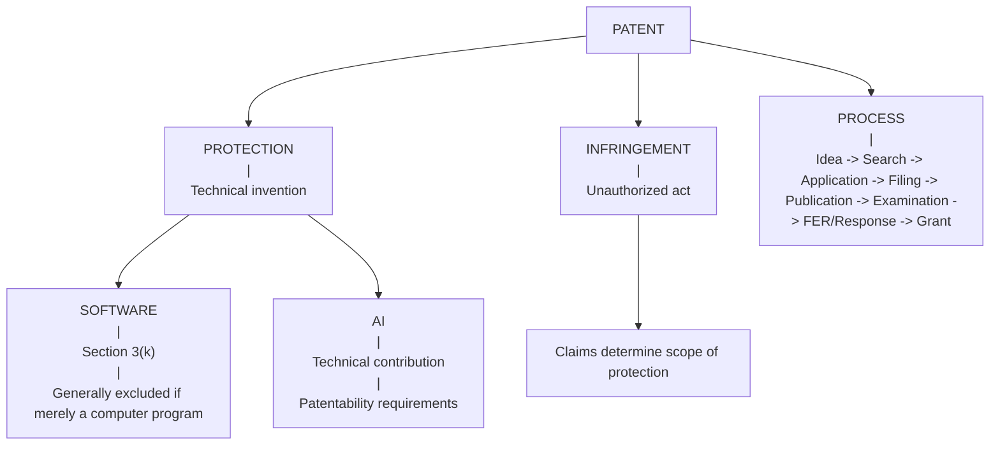

## 🧠 Final Memory Story
Imagine you invent a new technical irrigation controller.

1.  You have an **IDEA**.
2.  You perform a **PRIOR-ART SEARCH**.
3.  You file a **PROVISIONAL/COMPLETE APPLICATION**.
4.  You complete and **FILE** it.
5.  It gets **PUBLISHED**.
6.  It goes through **EXAMINATION**.
7.  You answer the **FER/objections**.
8.  If requirements are satisfied → **GRANT**.
9.  You **COMMERCIALIZE/LICENSE** it.
10. You maintain it through **RENEWAL** until **EXPIRY** or possible earlier termination.

Then imagine Company B copying your patented system:
**Manufacture + Sell + No authorization + Within patent claims → possible infringement.**

You can seek:
**Injunction + Damages + Account of profits + Other relief.**

Company B can raise defenses such as:
**Invalidity + No infringement + Outside claims + Statutory exception + Exhaustion + Other defenses.**

Meanwhile:
*   **Source code → Copyright**
*   **Technical invention involving software → may potentially be Patent**
*   **Mathematical method / business method / computer program per se / algorithm → excluded under Section 3(k)**

And finally:
*   **Patent = technical invention**
*   **Copyright = expression**
*   **Trade secret = secrecy**

That gives you the complete conceptual structure of all 18 slides!

## 🧠 Ultimate Mindmap 1: Patent Infringement
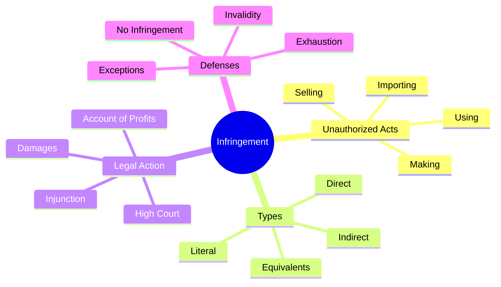

## 🧠 Ultimate Mindmap 2: Patent Agents
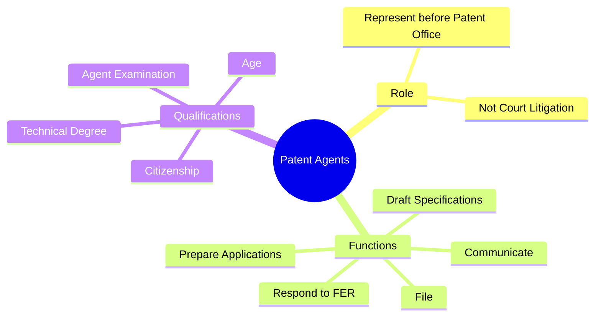

## 🧠 Ultimate Mindmap 3: Software and AI Patents
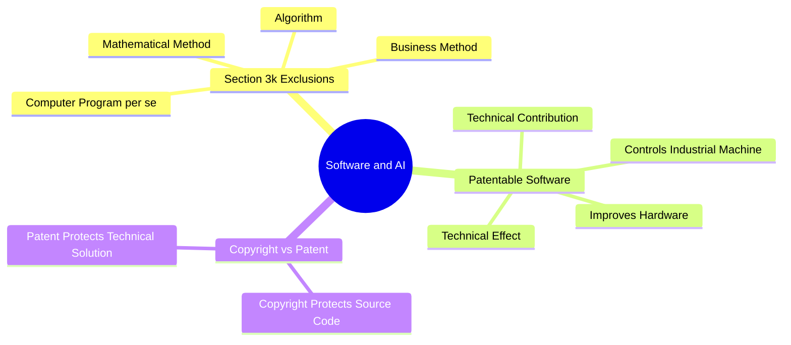

## 🧠 Ultimate Mindmap 4: Patent Lifecycle
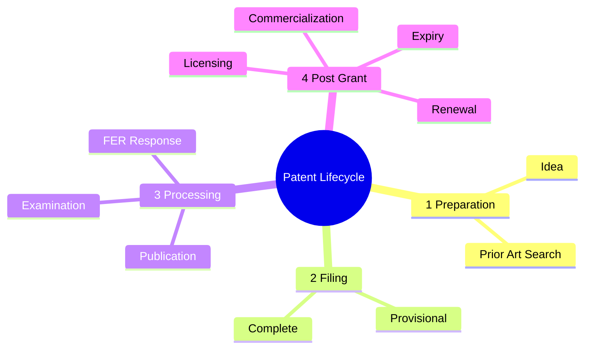
