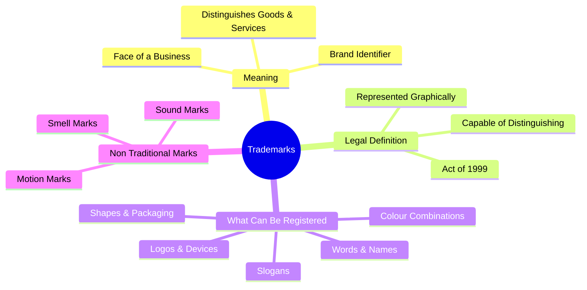
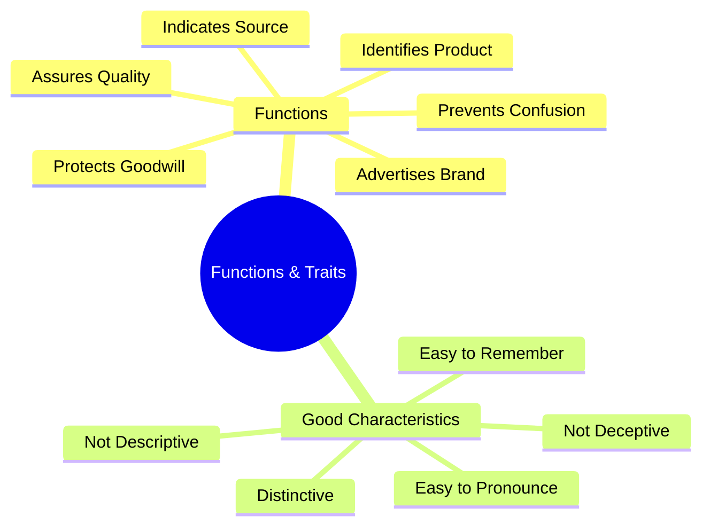

# Introduction and Meaning of Trademarks

**Easy + Structured + Exam-Oriented Notes**

Welcome to the Trademarks section! I have structured this to be extremely easy to remember.
> **Exam strategy:** Always remember the **bold keywords** and use the **Functions (I-S-Q-G-A)** memory trick for your answers!

---

## 1. What is a Trademark? (Simple Meaning)

A **Trademark** is a unique identifier that helps consumers distinguish the goods or services of one business from those of another.

**In simple words:**
> A trademark is a **"brand identifier"**. It tells the customer **"who made this product"** or **"who provides this service"**.

**Examples:**
*   **Name:** "Google", "Tata"
*   **Logo:** The Apple logo 🍎, The Nike Swoosh ✔️
*   **Slogan:** "I'm Lovin' It" (McDonald's)
*   **Shape:** The unique shape of a Coca-Cola glass bottle.

🧠 **Memory Trick**
Think of a Trademark as the **Face of a Business**. Just like a face helps you recognize a person, a trademark helps you recognize a brand.

---

## 2. Legal Definition (Indian Trade Marks Act, 1999)

This is the exact legal definition under **Section 2(1)(zb)** of the Trade Marks Act, 1999. If you write this in the exam, you will get full marks.

> A "trade mark" means a mark capable of being **represented graphically** and which is capable of **distinguishing the goods or services** of one person from those of others.

It may include:
*   Shape of goods
*   Their packaging
*   Combination of colours

⭐️ **The 3 Golden Rules of a Legal Trademark:**
1.  It must be a **mark**.
2.  It must be **capable of being represented graphically** (you can draw it or put it on paper).
3.  It must be **capable of distinguishing** your goods/services from others (it must be distinctive).

---

## 3. What Can Be Registered as a Trademark?

Almost anything that helps a customer identify a brand can be a trademark.

| Type of Mark | Example |
| :--- | :--- |
| **Word Mark** | "Infosys", "Microsoft" |
| **Device / Logo** | The Twitter Bird, The Mercedes Star |
| **Slogan** | "Just Do It" (Nike) |
| **Letter / Number** | "3M", "IBM" |
| **Shape Mark** | The Toblerone chocolate triangle shape |
| **Packaging** | The unique wrapping of a Cadbury chocolate |
| **Combination of Colours** | The specific Red and Yellow used by McDonald's |

---

## 4. Non-Traditional Trademarks

Modern law now recognizes trademarks that aren't just visual. These are called **Non-Traditional Trademarks**.

1.  **Sound Marks:** A unique sound that instantly reminds you of a brand.
    *   *Example:* The MGM Lion roar, the Netflix "Ta-dum" intro sound, the Nokia ringtone.
2.  **Smell (Olfactory) Marks:** A unique scent applied to a product (very rare, but possible in some countries).
    *   *Example:* Plumeria blossom scented embroidery thread (USA).
3.  **Motion Marks:** A specific animation or moving sequence.
    *   *Example:* The 20th Century Fox animated searchlights.

---

## 5. Functions / Purpose of a Trademark

Why do businesses use trademarks? What do they actually do?

**1. Identifies the Source**
It tells the consumer exactly where the product comes from.
*(If it has an Apple logo, it came from Apple).*

**2. Assures Quality**
Consumers associate a trademark with a certain level of expected quality.
*(People trust the Tata logo to mean durability and trust).*

**3. Advertises the Product**
Trademarks act as a silent salesperson. A good logo sells the product by itself.

**4. Protects Goodwill**
It protects the reputation the business has worked hard to build.

**5. Prevents Consumer Confusion**
It stops competitors from using a similar name to trick your customers.

🧠 **Memory Trick: I-S-Q-G-A**
*   **I**dentifies the product
*   **S**ource indicator
*   **Q**uality assurance
*   **G**oodwill protection
*   **A**dvertises the brand

---

## 6. Characteristics of a Good Trademark

If you are a trademark lawyer, what kind of mark should you advise a company to choose?

1.  **Distinctive:** It should be unique, not common. (e.g., "Apple" for computers is highly distinctive).
2.  **Easy to Pronounce & Remember:** "Sony" is much better than "XylophonicalTech".
3.  **Not Descriptive:** It should NOT just describe the product. (You cannot trademark "Sweet Chocolate" for selling chocolate).
4.  **Visually Appealing:** A good logo attracts customers.
5.  **Not Deceptive:** It shouldn't lie to the customer. (You can't name a synthetic shirt "Pure Cotton").

---

## 7. HIGH-SCORING EXAM ANSWER: "Explain the Meaning and Functions of a Trademark"

**Meaning:**
A trademark is a unique identifier used by a business to distinguish its goods or services from those of competitors. Under the Trade Marks Act, 1999, it is defined as a mark capable of being **represented graphically** and capable of **distinguishing the goods or services** of one person from those of others. It includes words, logos, shapes, packaging, and colour combinations.

**Functions:**
The primary functions of a trademark are:
1.  **Identification:** It identifies the product and its origin/source.
2.  **Quality Guarantee:** It assures consumers that the product meets a consistent standard of quality.
3.  **Advertisement:** It serves as a powerful marketing and advertising tool.
4.  **Goodwill Protection:** It safeguards the commercial reputation and goodwill of the business.
5.  **Prevention of Deception:** It prevents the public from being confused or deceived by identical or similar marks used by rivals.

In conclusion, a trademark is the foundation of brand identity and consumer trust.

---

## 🧠 Ultimate Mindmap 1: Meaning & Elements of Trademarks

## 🧠 Ultimate Mindmap 2: Functions & Characteristics

