# TRADEMARK LAW — INTRODUCTION & MEANING OF TRADEMARKS

## 1. Introduction to Trademark Law

**What is the main purpose?**
**Trademark law** protects the rights of **trademark owners** and also protects **consumers** from being deceived.

The basic idea is:
> **A genuine business should get the benefit of the reputation it has created, and another business should not deceptively use that reputation.**

**Main Objectives**
Remember: **O–C–M–D**
*   **O → Owner Protection** — protects the rights of the genuine trademark owner.
*   **C → Consumer Protection** — prevents customers from being confused or deceived.
*   **M → Market Competition** — prevents unfair monopoly and promotes a dynamic market.
*   **D → Deception Prevention** — stops businesses from deceptively using another business's **logo, name, or mark**.

**Simple Example**
Suppose **Company A** becomes famous for a particular logo.
Then **Company B** starts using a very similar logo to make customers believe that its products belong to Company A.

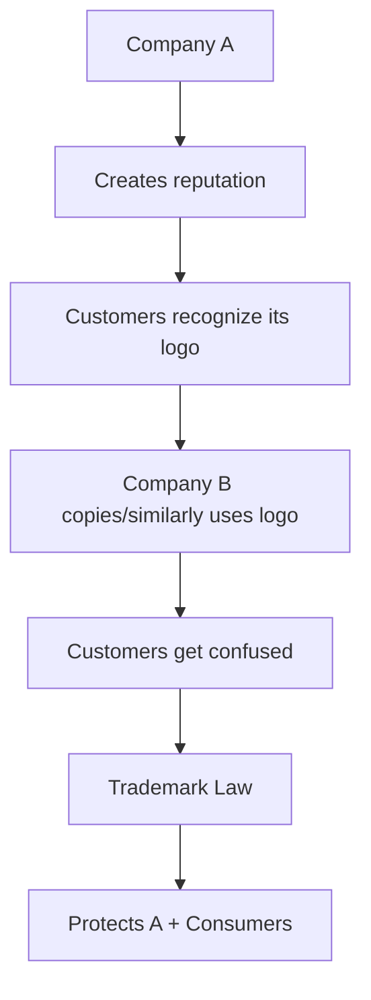

Therefore, trademark law prevents a business from **free-riding on the customer base/reputation created by another business.**

---

## 2. Why is Trademark Law Important?

Trademark law tries to maintain a **balance**:

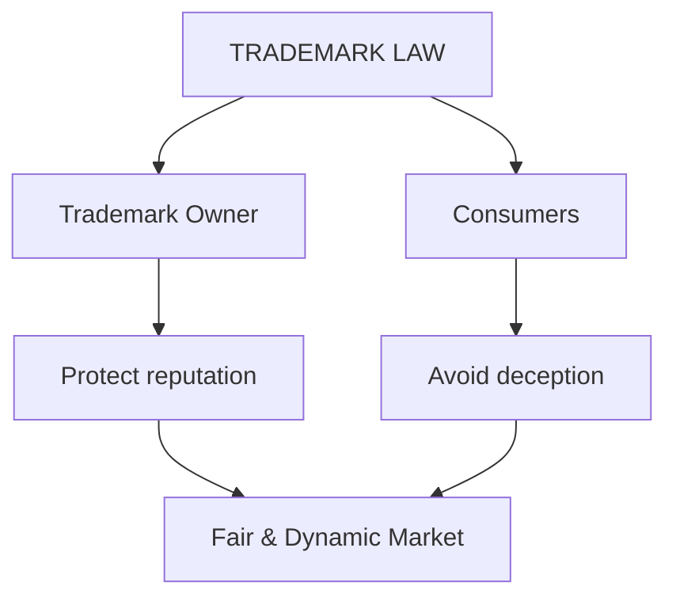

**In simple words:**
A business that has genuinely built a **customer base and reputation** should be able to protect it.
Another business should **not deceptively use the same/similar mark** to obtain customers unfairly.

---

## 3. Development of Trademark Law in India

The Indian trademark law developed through different stages:

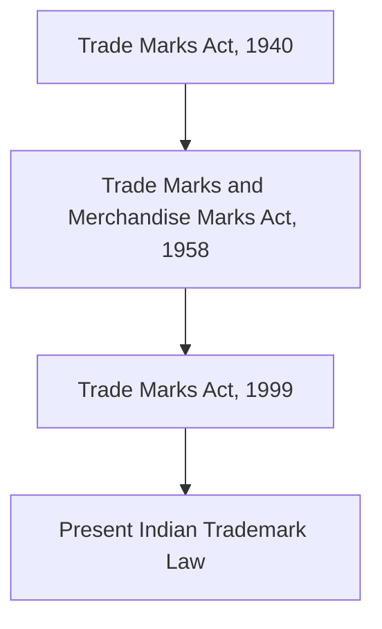

**Important Acts**
| Year | Law |
| :--- | :--- |
| **1940** | **Trade Marks Act, 1940** |
| **1958** | **Trade Marks and Merchandise Marks Act, 1958** |
| **1999** | **Trade Marks Act, 1999** |

**Exam Point ⭐**
The **Trade Marks Act, 1940** was replaced by the **Trade Marks and Merchandise Marks Act, 1958**, which was eventually replaced by the present **Trade Marks Act, 1999**.

The law has also undergone **amendments** and **new rules** over time.

**Memory Trick**
**40 → 58 → 99**
> "40 started → 58 changed → 99 current."

---

## 4. Meaning of Trademark

A **trademark** is a **name, word, sign, symbol, logo, picture, slogan, or other distinctive indicator** that helps distinguish the goods or services of one business from those of other businesses.

**Simplest Definition for Exam**
> **A trademark is a distinctive mark used to identify and distinguish the goods or services of one enterprise from those of other enterprises.**

**Core Function**
The most important function of a trademark is:
**DISTINCTION**

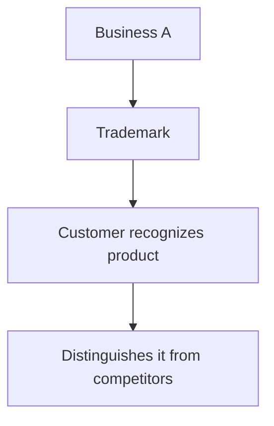

For example:
**Apple** → helps consumers distinguish Apple's products from products of competing companies.

---

## 5. Why Do Businesses Use Trademarks?

A trademark makes it easier for customers to **recognize and identify** a product or service.

**Without Trademark**


**With Trademark**
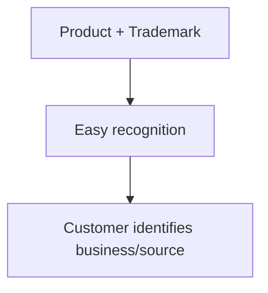

Therefore, trademarks make **marketing and identification** of goods/services easier.

---

## 6. Rights of Trademark Owner

A trademark is a form of **property right**.

The law protects this right.

The owner can generally prevent competitors from **unauthorised use** of the protected mark in ways covered by trademark law.

**Example**
Suppose Company A owns a trademark **"XYZ"** for its products.
If Company B starts using **XYZ** deceptively for similar goods, Company A can seek legal protection against such unauthorised use.

---

## 7. Trademark as a Marketing Tool

A trademark is also an important **marketing tool**.

A distinctive trademark can:
*   Help customers **recognize** a product.
*   Build **reputation**.
*   Create **customer association**.
*   Help differentiate products from competitors.
*   Increase the **commercial value** of the business.

**Simple Chain**
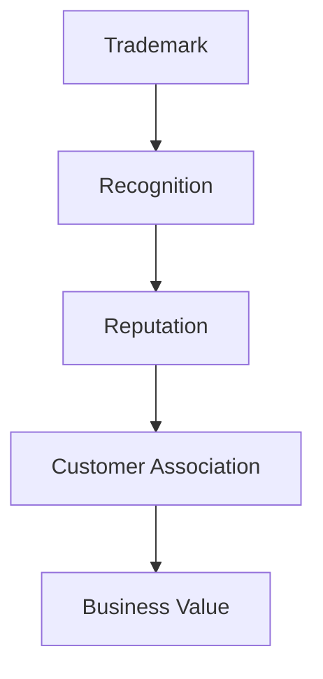

---

## 8. Trademark vs Brand

This is an important distinction.

The terms **brand** and **trademark** are sometimes confused, but they are not exactly the same.

**Easy Understanding**
**Brand** = overall identity/image associated with a business or product.
**Trademark** = legally recognizable **distinctive sign/indicator** used to distinguish goods/services.

The pasted material makes the relationship:
> **A trademark is not always a brand, but a brand is always a trademark.**

**Exam Table**
| Brand | Trademark |
| :--- | :--- |
| Represents the **overall identity/reputation** associated with a product/business | Represents a **distinctive sign/indicator** |
| More related to **marketing and consumer perception** | More directly connected with **legal protection** |
| Can involve name, image, reputation, etc. | Can be **name, word, logo, picture, slogan**, etc. |
| Trademark has a specific legal significance | Has a broader legal role in distinguishing goods/services |

**Memory Trick**
> **Brand = Business Identity**
> **Trademark = Legal Distinctive Mark**

---

## 9. Forms of Trademark

A trademark does not have to be only a name.

It may include:
*   **Word**
*   **Name**
*   **Logo**
*   **Symbol**
*   **Picture mark**
*   **Slogan**
*   Other **distinctive signs/indicators**

**Example**
```text
"ABC"          →  Word/Name
[Logo]         →  Logo
"Just Do..."   →  Slogan
Picture/Symbol →  Picture mark
```
The common feature is that it helps **distinguish the source** of goods/services.

---

## 10. Trademark as Property

A trademark is a **property right** protected by law.

The **use of a mark** and its **registration** can establish/provide legal rights and title according to the applicable law.

**Important Concept**
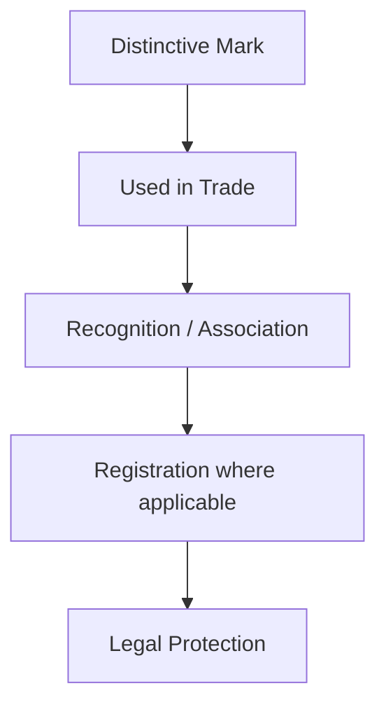

**Key Point**
A trademark gives **distinctiveness** to a product.
It allows consumers to associate the product with a particular **trade origin/business**.

---

## 11. Trade Origin — Very Easy Meaning

**Trade origin** means the business/source from which the goods or services come.

For example:
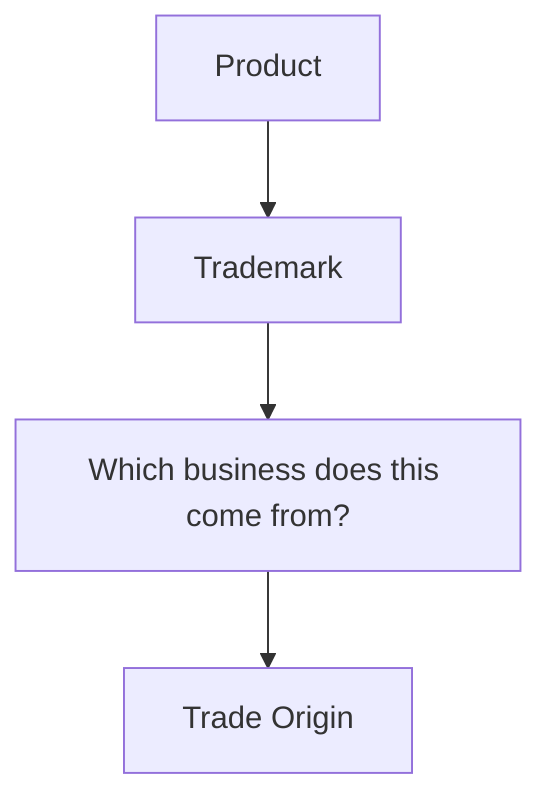
If you see a familiar trademark on a product, you can identify the business associated with that product.

---

## 12. Simple Example — Apple

Suppose the word **"Apple"** is used by a company for its products.

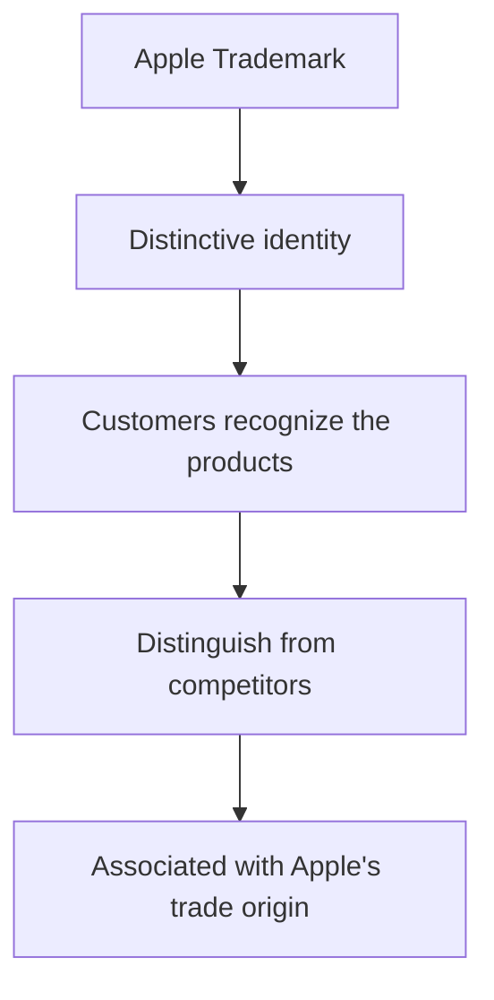
Thus, the trademark provides **distinctiveness** and helps consumers distinguish the company's products from competitors' products.

---

## 13. Complete Concept in One Diagram

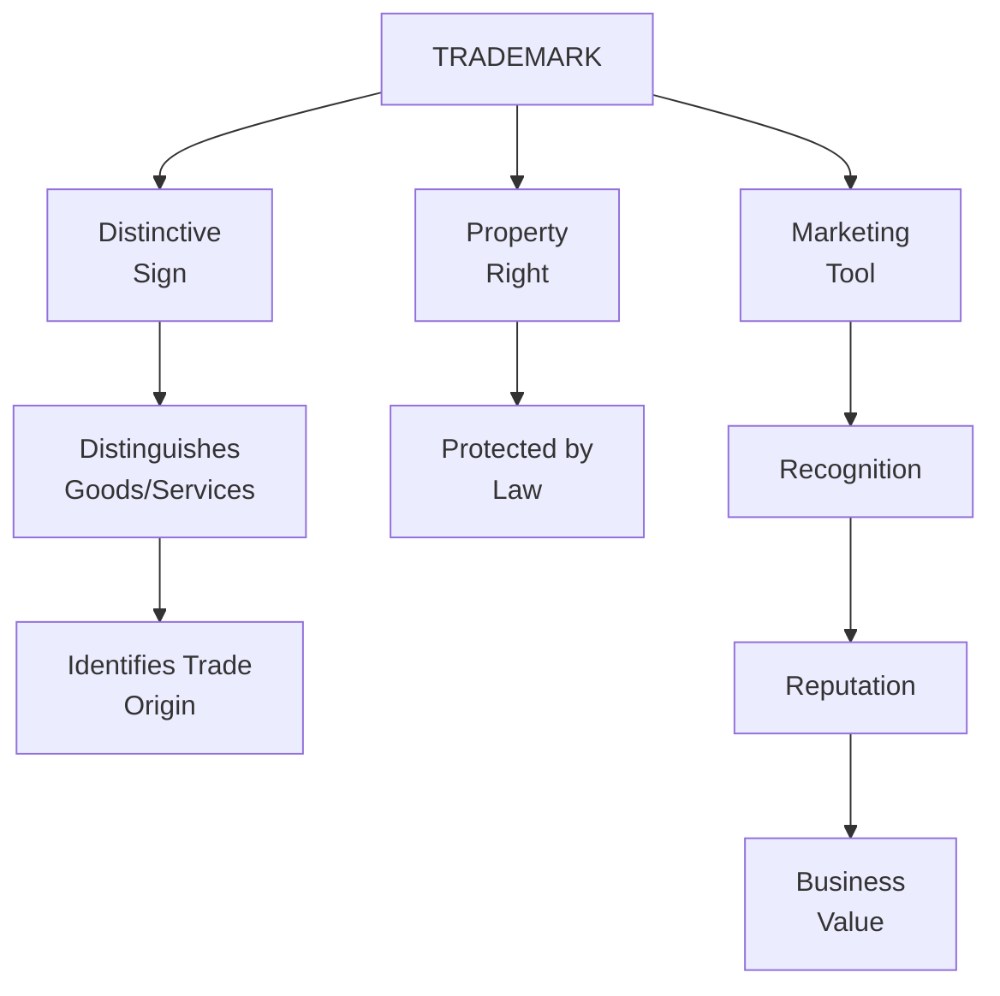

---

## 14. Full-Marks Answer — "What is a Trademark?"

If this comes directly in the exam, write:

> A **trademark** is a **distinctive name, word, sign, symbol, logo, picture, slogan** or other indicator used to distinguish the **goods or services of one enterprise from those of other enterprises**. It helps consumers **identify and recognize the trade origin** of goods or services. A trademark is also a **property right protected by law**, and the owner can seek protection against **unauthorised use** by competitors. It is an important **marketing tool** because it helps create recognition, reputation and customer association. For example, the use of the word **"Apple"** distinguishes Apple's products from those of competing businesses.

---

## 15. Full-Marks Answer — "Objectives of Trademark Law"

> The main objective of **trademark law** is to protect the rights of **trademark owners** while also protecting **consumers from deception and confusion**. It prevents businesses from deceptively using another entity's **name, logo or mark** to take advantage of the reputation and customer base created by that entity. It therefore promotes **fair competition, market dynamism and consumer protection** while preventing unfair exploitation of established trademarks.

---

## 🧠 Last-Minute Memory Sheet

Remember just these **5 keywords**:

**Trademark = D–P–M–C–O**
*   **D** → Distinctiveness
*   **P** → Property Right
*   **M** → Marketing Tool
*   **C** → Consumer Protection
*   **O** → Owner Protection

And for Indian history:
**40 → 58 → 99**
**1940 → 1958 → 1999**

If you remember these two lines, you can reconstruct almost the entire answer:
> **Trademark = Distinctive sign + Property right + Marketing tool.**
> 
> **Trademark Law = Protect owner + Protect consumer + Prevent deception + Maintain fair/dynamic market.**


## 🧠 Ultimate Mindmap 1: Meaning & Features
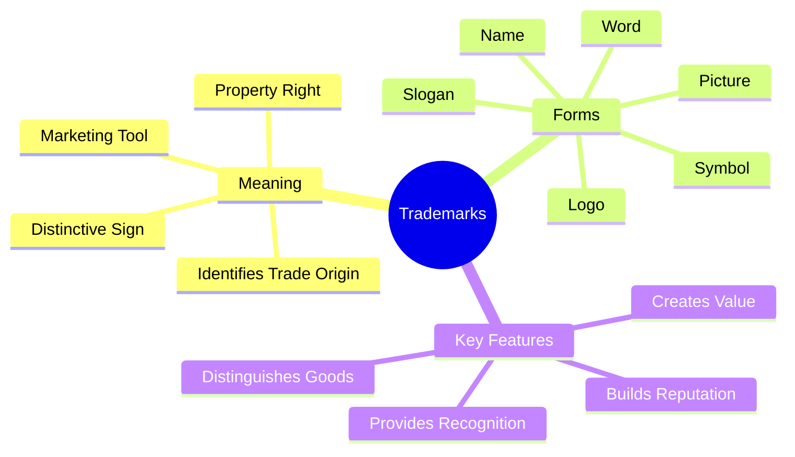

## 🧠 Ultimate Mindmap 2: Law & Objectives
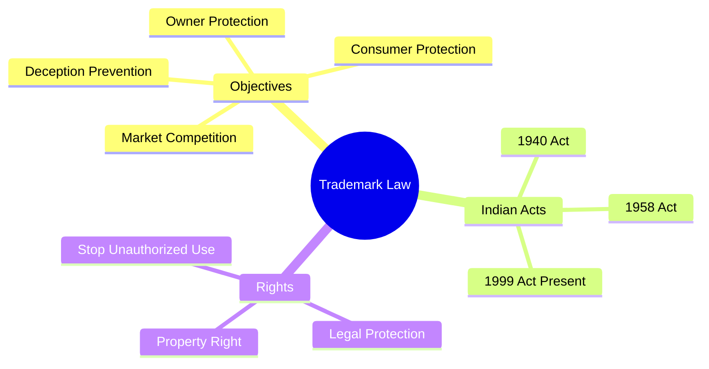
