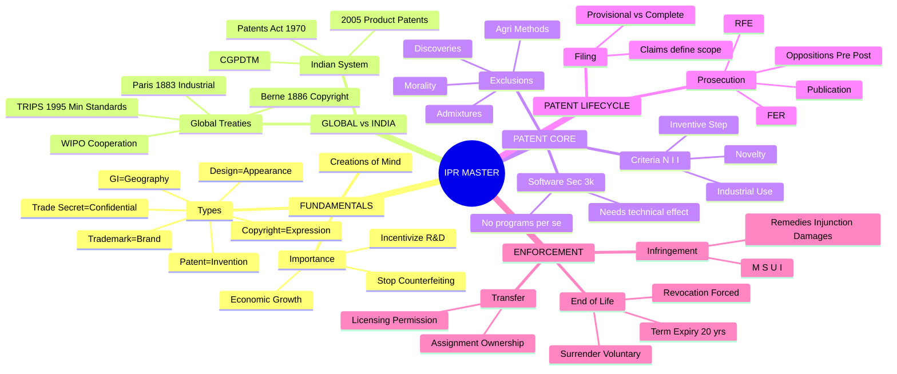

# 🌟 The Ultimate IPR Master Summary

This document is your **single source of truth** for the entire Intellectual Property Rights syllabus. It condenses all 9 chapters into high-yield, exam-oriented bullet points and connected memory maps.

---

## 🗺️ 1. The 60-Second Master Syllabus Map

```mermaid
flowchart TD
    A[INTELLECTUAL PROPERTY RIGHTS]
    
    A --> B[1. BASICS & TYPES]
    A --> C[2. HISTORY & AUTHORITIES]
    A --> D[3. PATENTS IN-DEPTH]
    A --> E[4. INFRINGEMENT & POST-GRANT]

    %% Section 1
    B --> B1[Types of IPR]
    B1 --> |Invention| P[Patent]
    B1 --> |Expression| CR[Copyright]
    B1 --> |Brand| TM[Trademark]
    B1 --> |Appearance| ID[Industrial Design]
    B1 --> |Place| GI[Geographical Indication]
    B1 --> |Confidential| TS[Trade Secret]

    %% Section 2
    C --> C1[International]
    C1 --> |1883| Paris[Paris Conv. - Industrial]
    C1 --> |1886| Berne[Berne Conv. - Copyright]
    C1 --> |1967| WIPO[WIPO - Cooperation]
    C1 --> |1995| TRIPS[TRIPS - Min. Standards]
    
    C --> C2[India]
    C2 --> |Admin| CGPDTM[CGPDTM under DPIIT]
    C2 --> |1970| PatAct[Patents Act 1970]

    %% Section 3
    D --> D1[Patentability]
    D1 --> NII[Novelty + Inventive Step + Industrial App]
    D --> D2[Not Patentable]
    D2 --> Sec3[Sec 3 & 4 Exclusions]
    D --> D3[Procedure]
    D3 --> Proc[File -> Publish -> Examine -> Grant]

    %% Section 4
    E --> E1[Transfer]
    E1 --> Trans[Assignment & Licensing]
    E --> E2[Ending Rights]
    E2 --> End[Revocation & Surrender]
    E --> E3[Infringement]
    E3 --> Inf[Direct/Indirect -> Injunction/Damages]
```

---

## 📚 2. Chapter-by-Chapter Core Concepts

### Chapter 1 & 3: Basics and Types of IPR
*   **What is IP?** Creations of the human mind (intangible assets).
*   **What is IPR?** Legal rights protecting those creations.
*   **Characteristics:** Intangible, Exclusive, Territorial, Limited duration (mostly), Transferable, Commercial value.
*   **The Big Types:**
    *   **Patent (20 years):** Protects **Inventions** (e.g., New EV battery). Focuses on technical functionality.
    *   **Trademark (10 yrs, renewable):** Protects **Brand Identity** (e.g., Apple logo). Prevents consumer confusion.
    *   **Copyright (Life + 60 yrs):** Protects **Creative Expression** (e.g., Software code, books). No registration needed for existence. Protects expression, *not* ideas.
    *   **Industrial Design (10+5 = 15 yrs):** Protects **Visual Appearance** (e.g., Coca-Cola bottle shape). Does *not* protect technical functions.
    *   **Geographical Indication (GI):** Protects goods tied to a **Geographical Origin** (e.g., Darjeeling Tea).
    *   **Trade Secret:** Protects **Confidential Info** (e.g., Coke formula). Lasts as long as it's secret.

### Chapter 4: Importance of IPR
*   **Why do we need it?** Encourages R&D, rewards creators, prevents unauthorized copying (piracy/counterfeiting), allows commercialization (licensing/royalties).
*   **Startups:** IPR helps build valuation, attract investment, and maintain competitive advantage.
*   **Piracy vs. Counterfeiting:** Piracy = copying creative works (Copyright). Counterfeiting = faking branded physical goods (Trademark).
*   **Digital Era:** Essential for protecting software, AI, databases, and digital content which are easy to copy.

### Chapter 2 & 5: History and IPR Authorities
*   **Global Timeline:**
    *   **1624 Statute of Monopolies:** England; early patent principles.
    *   **1710 Statute of Anne:** Early copyright law (protecting authors).
    *   **1883 Paris Convention:** Industrial Property. Introduced *National Treatment* & *Right of Priority*.
    *   **1886 Berne Convention:** Copyrights. Introduced *Automatic Protection*.
    *   **1967 WIPO:** UN agency for global IP cooperation. Administers PCT (Patents), Madrid (Trademarks), Hague (Designs).
    *   **1995 TRIPS (WTO):** Established *minimum standards* for IP protection globally.
*   **Indian Timeline & Authorities:**
    *   **1856:** First Indian Patent Law.
    *   **1970 Patents Act:** Major framework (originally excluded product patents in pharma).
    *   **2005 Amendment:** Introduced product patents for pharma/chemicals to comply with TRIPS.
    *   **DPIIT:** Policy level in India.
    *   **CGPDTM:** Administers Patents, Designs, Trademarks, and GI. (IPAB is abolished).

### Chapter 6: Patents (In-Depth)
*   **Definition:** Exclusive right for a technical invention.
*   **The N+I+I Test (Requirements):**
    1.  **Novelty:** Must be completely new.
    2.  **Inventive Step:** Non-obvious to an expert.
    3.  **Industrial Applicability:** Can be made/used in industry.
*   **Non-Patentable Inventions (Sec 3 & 4):**
    *   Frivolous/against natural laws (perpetual motion).
    *   Against public morality/health.
    *   Mere discovery of a scientific principle or living thing.
    *   Mere admixture resulting only in aggregation of properties.
    *   Agricultural/horticultural methods.
    *   Atomic energy inventions (Sec 4).

### Chapter 7: Patent Procedure
*   **The Lifecycle Flow:**
    `Idea → Prior Art Search → File Provisional/Complete Spec → Publication (18 months) → Request for Examination (RFE) → First Examination Report (FER) → Reply → Grant`
*   **Specifications:**
    *   **Provisional:** Secures priority date when invention is not fully finalized.
    *   **Complete:** Full technical details and legal *claims*. Claims define the exact boundaries of protection.
*   **Oppositions:**
    *   **Pre-Grant:** Anyone can oppose *before* grant.
    *   **Post-Grant:** Only an "interested person" can oppose within 1 year *after* grant.

### Chapter 8: Rights, Transfer & Revocation
*   **Transfer of Rights:**
    *   **Assignment:** Transfer of *ownership* (Total or Partial). Must be in writing.
    *   **Licensing:** Granting *permission* to use without losing ownership. Types: Voluntary, Statutory, Compulsory (granted by govt for public interest).
*   **Ending of Rights:**
    *   **Surrender:** Patentee voluntarily returns the patent to the office.
    *   **Revocation:** Cancellation of the patent by an authority (High Court). Reasons: Invalidity, non-working, obtained wrongfully, or threat to state security.

### Chapter 9: Patent Infringement & Software Patents
*   **Infringement:** Unauthorized Manufacture, Sell, Use, or Import (M-S-U-I) within the scope of the claims.
*   **Types:** Direct (doing it yourself), Indirect (facilitating), Literal (exact match to claims), Doctrine of Equivalents.
*   **Defenses:** Arguing the patent is invalid (Infringement + Validity analysis go together), or your product falls outside the claims.
*   **Remedies:** Injunction (Stop), Damages (Compensate), Account of Profits.
*   **Patent Agents:** Draft, file, and prosecute applications before the Patent Office (Lawyers go to Court).
*   **Software & AI (Section 3(k)):** Computer programs *per se*, mathematical/business methods, and algorithms are generally excluded. However, software with a **technical effect/contribution** (e.g., controlling a machine) may be patentable.

---

## 🧠 3. The Ultimate Synthesis Mindmap

---
**💡 Final Advice for Exams:**
Always structure your answers with:
1. **Definition**
2. **Key Elements/Requirements**
3. **Real-world Example** (e.g., Smartphone = Patent for tech, Copyright for code, Trademark for logo, Design for shape)
4. **Mermaid Diagram / Flowchart** (Use the ones above!)
