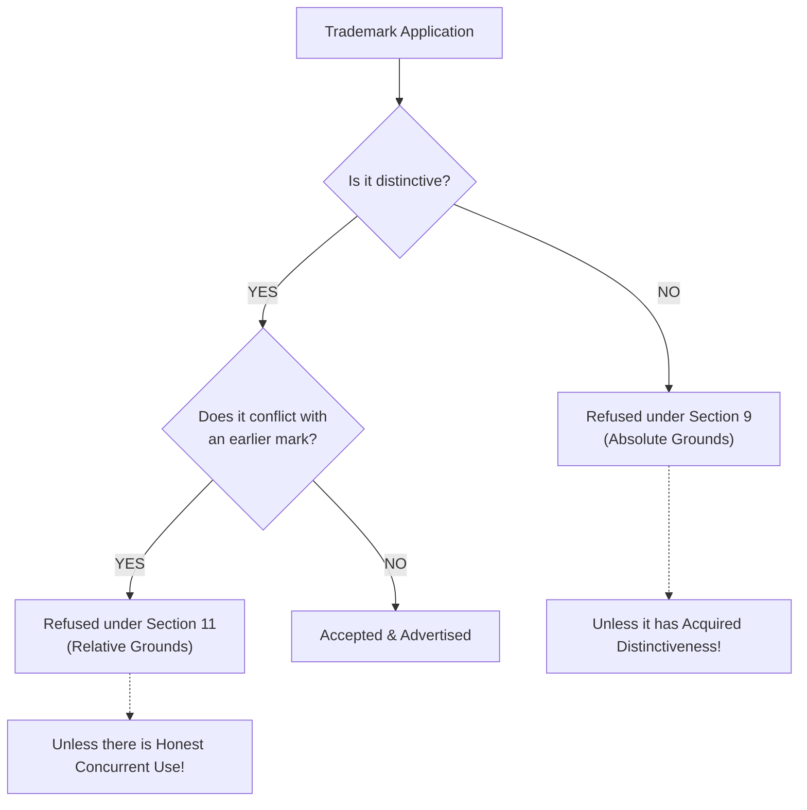
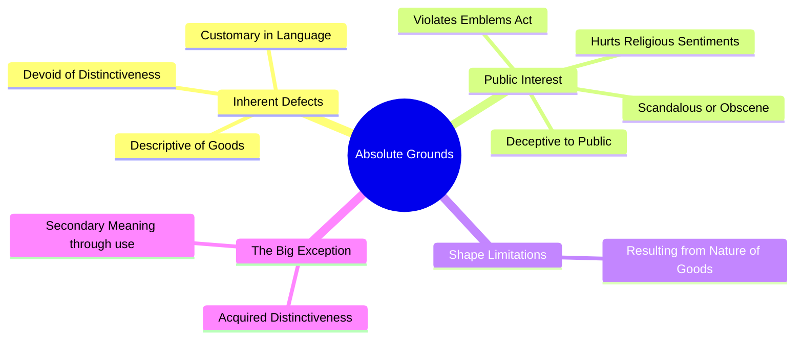
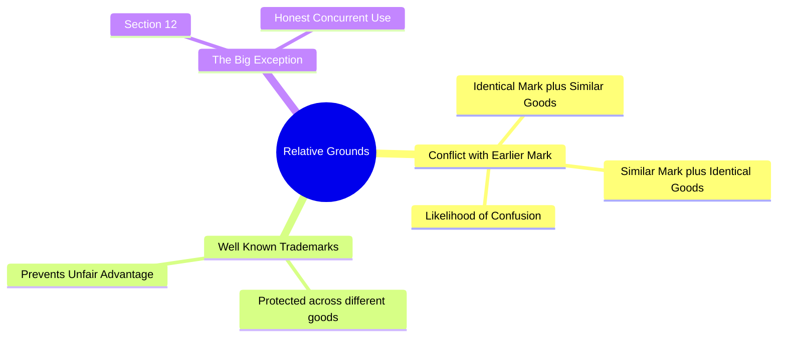

# Grounds for Refusal of Registration of Trademarks

**Easy + Structured + Exam-Oriented Notes**

When you apply to register a trademark, the Registrar can reject your application. The **Trade Marks Act, 1999** divides the reasons for rejection into two main categories:
1.  **Absolute Grounds** (Section 9)
2.  **Relative Grounds** (Section 11)

> **Exam Strategy:** If a question asks about refusal, you MUST mention **Section 9** and **Section 11**.

---

## 1. Absolute Grounds for Refusal (Section 9)

**What does it mean?**
"Absolute grounds" refer to defects **within the trademark itself**. The mark is inherently incapable of being a valid trademark.

Under **Section 9(1)**, a trademark will be refused registration if it falls into any of these 3 categories:

**A. Devoid of Distinctive Character**
The mark is too generic and cannot distinguish your goods from others.
*   *Example:* You cannot trademark the word "APPLE" for selling real apples.

**B. Descriptive Marks**
The mark merely describes the kind, quality, quantity, intended purpose, or geographical origin of the goods.
*   *Example:* You cannot trademark "SWEET" for chocolates, or "DELHI SWEETS" for sweets made in Delhi.

**C. Customary Marks**
The mark consists exclusively of words or indications that have become customary in the current language or in the established practices of the trade.
*   *Example:* You cannot trademark "XEROX" for photocopying services if it has become a generic term, or drawing a standard "plug" symbol for electrical goods.

### ⭐️ The "Acquired Distinctiveness" Exception!
There is a massive exception to Section 9(1).
A mark that is descriptive or lacks distinctiveness **CAN be registered** if, before the date of application, it has **acquired a distinctive character as a result of the use made of it**.
*   *Example:* "Reliance" is a normal English dictionary word. But through massive continuous use, it has acquired a "secondary meaning" and points to Mukesh Ambani's company. Therefore, it is registered.

### Other Absolute Grounds [Section 9(2) & 9(3)]
A mark shall also be refused if:
*   It is of such a nature as to **deceive the public** or cause confusion.
*   It contains or comprises any matter likely to hurt **religious susceptibilities**.
*   It comprises **scandalous or obscene matter**.
*   Its use is prohibited under the **Emblems and Names (Prevention of Improper Use) Act, 1950** (e.g., you cannot use the Indian National Flag or the Ashok Chakra).
*   It consists exclusively of the **shape of goods** which results from the nature of the goods themselves (e.g., a standard round ball shape for a football).

🧠 **Memory Trick for Section 9:**
**D-D-C + D-R-O-E-S**
*   **D**evoid of distinctiveness
*   **D**escriptive
*   **C**ustomary
*   **D**eceptive
*   **R**eligious hurt
*   **O**bscene
*   **E**mblems Act
*   **S**hape (natural shape)

---

## 2. Relative Grounds for Refusal (Section 11)

**What does it mean?**
"Relative grounds" refer to conflicts with **pre-existing rights of third parties**. The mark might be perfectly distinctive, but someone else already owns a similar mark!

Under **Section 11**, a trademark shall not be registered if:

**1. Identical Mark + Similar Goods = Confusion**
If the mark is **identical** with an earlier trade mark and the goods/services are **similar**, causing a likelihood of confusion on the part of the public.

**2. Similar Mark + Identical Goods = Confusion**
If the mark is **similar** to an earlier trade mark and the goods/services are **identical**, causing a likelihood of confusion.

**3. Identical/Similar Mark + Different Goods (Well-Known Trademark)**
If the earlier trademark is a **Well-Known Trademark** in India, you cannot use a similar mark even for completely different goods, because it would take unfair advantage of or be detrimental to the distinctive character or repute of the earlier trademark.
*   *Example:* You cannot register "TATA" for selling shoes, even if Tata doesn't sell shoes. "TATA" is a well-known mark.

### The "Honest Concurrent Use" Exception! (Section 12)
If two people have been using identical or similar trademarks completely honestly and independently of each other for a long time, the Registrar may permit **both** of them to register the mark, subject to certain conditions.

---

## 3. Absolute vs Relative Grounds (The Ultimate Comparison)

This is the most common exam question.

| Feature | Absolute Grounds (Section 9) | Relative Grounds (Section 11) |
| :--- | :--- | :--- |
| **Focus** | Inherent defect in the **mark itself**. | Conflict with **another person's existing mark**. |
| **Reason for refusal** | Mark is not distinctive, or is descriptive/customary. | Mark is too similar to an earlier trademark, causing confusion. |
| **Who objects?** | Usually the **Trademark Registry** during examination. | Usually the **Owner of the earlier trademark** during opposition. |
| **Exception/Defense** | **Acquired Distinctiveness** (Secondary meaning through long use). | **Honest Concurrent Use** (Both used it honestly for a long time). |
| **Example** | Rejecting "Best Laptops" for laptops. | Rejecting "Adibas" for shoes because "Adidas" already exists. |

---

## 4. Flowchart of Refusal

---

## 5. Full-Marks Exam Answers

### Q: "Explain the Absolute Grounds for refusal of a trademark."
> Under **Section 9 of the Trade Marks Act, 1999**, a trademark can be refused registration on absolute grounds if the defect lies in the mark itself. A mark will be refused if it is **devoid of any distinctive character**, if it merely **describes** the quality, quantity, or geographical origin of the goods, or if it has become **customary** in the current language. Furthermore, marks that are **deceptive**, hurt **religious feelings**, contain **obscene matter**, or violate the **Emblems and Names Act** are also refused. 
> **Exception:** A descriptive mark may still be registered if it has **acquired a distinctive character** (secondary meaning) as a result of its long and continuous use before the date of application.

### Q: "Explain the Relative Grounds for refusal of a trademark."
> Under **Section 11 of the Trade Marks Act, 1999**, a trademark can be refused registration on relative grounds if it conflicts with an earlier existing trademark. A mark will be refused if it is **identical or similar** to an earlier trademark, and the goods or services are also identical or similar, resulting in a **likelihood of confusion** among the public. Additionally, if the earlier mark is a **well-known trademark** in India, a similar mark cannot be registered even for completely different goods. 
> **Exception:** Under Section 12, the Registrar may allow registration in cases of **honest concurrent use** by two independent parties.

---

## 🧠 Ultimate Mindmap 1: Absolute Grounds (Section 9)

## 🧠 Ultimate Mindmap 2: Relative Grounds (Section 11)

