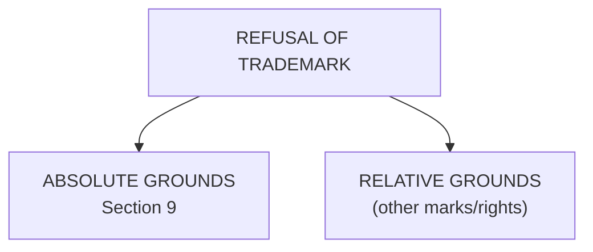
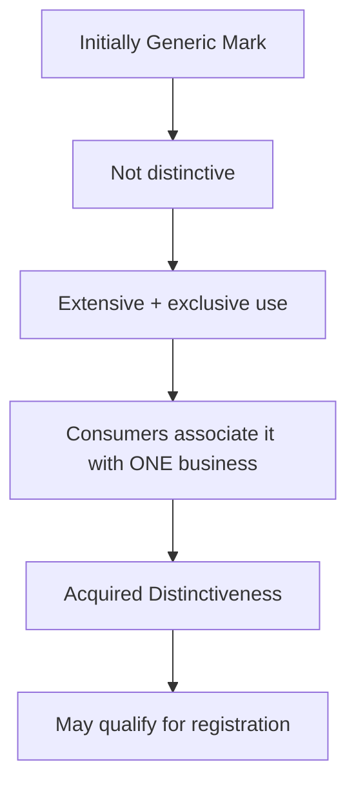
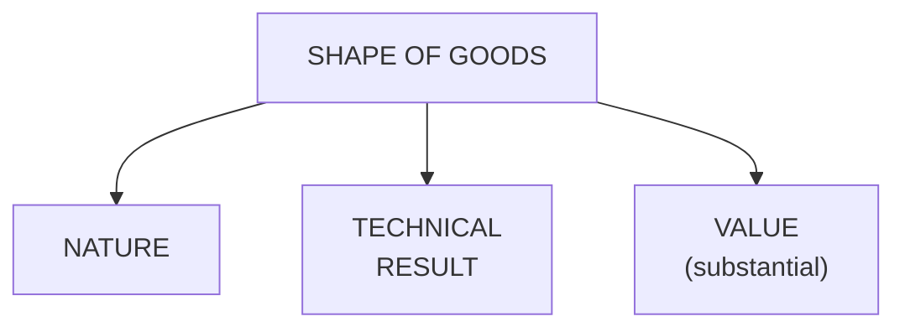
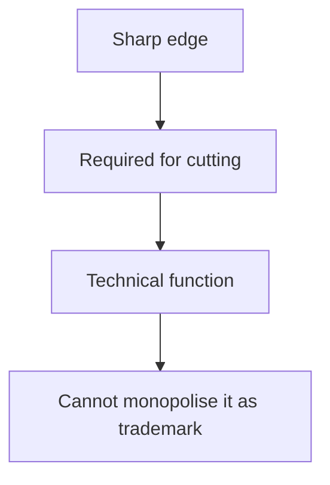
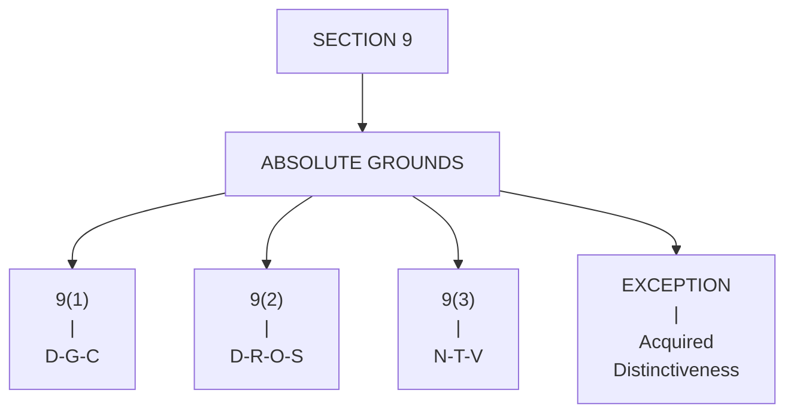
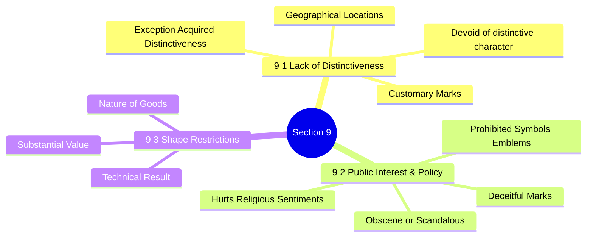

# Grounds for Refusal of Registration of Trademarks

A trademark application can be refused on **two broad grounds**:

**Easy Difference**
*   **Absolute grounds** → Problem is with the **trademark itself**.
*   **Relative grounds** → Problem arises because of its **conflict with an existing trademark/right**.

🧠 **Memory:**
*   **Absolute = Alone problem**
*   **Relative = Relation/conflict with another mark**

*The content provided mainly explains Absolute Grounds under Section 9.*

---

## 1. Devoid of Distinctive Character — Section 9(1)(a)

A trademark must be capable of **distinguishing** one business's goods/services from those of others.
If a mark has **no distinctive character**, it cannot normally be registered.

**Simple Example**
Suppose someone wants to register:
> **"MILK"** for ordinary milk products.

"Milk" directly describes the product and does not sufficiently distinguish one trader's milk from another's.

**Remember**
**No distinctiveness → No registration**

---

## 2. Geographical Locations — Section 9(1)(b)

A **geographical name/location** generally cannot be registered as a trademark when it fails the distinctiveness test.

**Why?**
A geographical name may merely indicate the **place of origin** of the goods rather than distinguish one particular business.

For example:
> **"Delhi"** for a product may simply indicate that the product comes from Delhi.

It does not necessarily identify one particular trader.

**Why should everyone be allowed to use it?**
Geographical names are generally **generic/common terms**, so other traders should also be free to use them.
Restricting them could interfere with the **freedom of trade under Article 19(1)(g)** of the Constitution.

🧠 **Memory**
**Place name → Common to traders → No monopoly**

---

## 3. Customary Words and Marks — Section 9(1)(c)

Words or marks that have become **customary in contemporary language or trade practice** cannot normally be registered.

**Why?**
Because granting exclusive rights over a common/customary term would **dilute its distinctiveness** and unfairly restrict other traders.

**Example**
Suppose Company X wants to trademark:
> **"Laptop"** for laptops.

The word **laptop** is a generic/customary term used throughout the market.
If X gets exclusive trademark rights over "Laptop", other laptop manufacturers could face restrictions on using an ordinary term needed for their trade.
This can interfere with their **right to trade under Article 19(1)(g)**.

🧠 **Memory**
**Common word → Everyone needs it → Cannot monopolise it**

---

## 4. Acquired Distinctiveness / Secondary Meaning

This is an **important exception/concept** connected with Section 9.

A mark may initially lack **inherent distinctiveness**, but extensive and continuous use can cause consumers to associate that mark specifically with **one particular business**.

This is called:
*   **Acquired distinctiveness**
*   **Secondary meaning**
*   **Doctrine of secondary meaning**

**Simple Idea**

**Example**
Imagine a common word **"X"** initially has no distinctive character.
After many years of **extensive use and promotion**, consumers begin to think:

> **"X = Company A"**

The word has now developed a **secondary meaning**.

**Important Point**
Such a mark:
*   **Lacks inherent distinctiveness initially**
*   **Gains distinctiveness through use**
*   **Becomes associated with a particular business in the consumer market**

These are referred to in the material as **secondary trademarks**.

🧠 **Memory Trick**
**Born ordinary → Used extensively → Becomes special**

---

## 5. Deceitful Marks — Section 9(2)(a)

A mark cannot be registered if it is **deceitful** or likely to **deceive/confuse consumers**.

The basic concern is:
> Will consumers mistakenly believe that this product is connected with an existing trademark/business?

**Example: Parle C vs Parle G**
Suppose someone tries to register:
> **"Parle C"**
> for biscuits.

Consumers could potentially associate it with the established **Parle** brand and become confused.
Therefore, such a mark may be refused because of its **deceptive/confusing character**.

**Effect**
Deceptive use can:
*   **Confuse customers**
*   Harm the **market value/reputation** of the genuine trademark owner
*   Give an **unfair advantage** to another business

🧠 **Memory**
**Deceive → Confuse → Refuse**

---

## 6. Marks Hurting Religious Sentiments — Section 9(2)(b)

A trademark cannot be registered if its use is likely to **hurt the religious sentiments or beliefs of any class or section of citizens of India.**

The provision is connected with protection of **religious beliefs**, with the material referring to **Article 25** of the Constitution.

**Simple Example**
Suppose a company tries to use a mark containing a representation that is seriously offensive to the religious beliefs of a community.
Such a mark may be **refused registration**.

🧠 **Memory**
**Religious belief hurt → Registration refused**

---

## 7. Obscene / Scandalous Material — Section 9(2)(c)

A trademark containing **scandalous or obscene matter** cannot be registered.

**Simple Example**
Suppose a company applies for a trademark containing **obscene material**.

Even if the mark has some commercial/brand value, it can still be refused because of its **obscene or scandalous nature**.

The material connects this restriction with **public order and constitutional morality**, and gives reference to obscenity under **Section 294 of the Bharatiya Nyaya Sanhita, 2023**.

**Key Point**
> Commercial value does not automatically make an obscene mark registrable.

🧠 **Memory**
**Obscene → Against public standards → Refused**

---

## 8. Prohibited Symbols and Signs — Section 9(2)(d)

A trademark cannot be registered if it contains a **symbol or sign whose commercial use is prohibited by law**, including under the **Emblems and Names (Prevention of Improper Use) Act, 1950**.

**Examples mentioned**
*   **Indian National Emblem / Lion Capital**
*   **Indian National Flag**

These symbols represent **national pride** and should not be appropriated by commercial entities for private commercial benefit where prohibited by law.

**Purpose**
To prevent businesses from obtaining exclusive commercial rights over **national symbols/signs**.

🧠 **Memory**
**National symbol ≠ Private commercial monopoly**

---

## 9. Shape of Goods — Section 9(3)

Even the **shape** of a product can sometimes function as a trademark.
However, certain shapes **cannot be registered**.

Section 9(3) identifies **three categories**.

**Memory Trick: N–T–V**
*   **N** = Nature
*   **T** = Technical result
*   **V** = Value

### A. Shape Resulting From Nature of Goods
A shape cannot be registered if it results from the **nature of the goods themselves**.

**In simple terms:**
> If the shape is naturally/inherently required by what the product is, one trader should not get an exclusive trademark over that shape.

**Example**
A basic **cardboard box** has a shape arising from the nature/function of the product.
A trader cannot simply claim that ordinary inherent shape as its exclusive trademark.

🧠 **Remember**
**Product's nature determines shape → No monopoly**

### B. Shape Necessary to Obtain a Technical Result
A shape cannot be registered when it is **necessary to obtain a technical result**.

**Example: Knife**
A knife needs a **sharp edge** to perform its cutting function.
Therefore, a trader cannot claim exclusive trademark rights over a shape/feature that is **technically necessary** to achieve that result.

🧠 **Remember**
**Technical necessity → No trademark monopoly**

### C. Shape Giving Substantial Value to Goods
A shape is also excluded when it gives **substantial value to the goods** in the circumstances described by Section 9(3).

The idea is that a feature that is **intrinsic to the product's use/value**, rather than functioning merely as a distinctive badge of origin, should not be monopolised through trademark law.

**Example from the material**
For a **knife**, sharpness is:
*   **Intrinsic** to the product's function, and
*   Gives **substantial value/utility** to the product.

Therefore, such a feature cannot simply be claimed as a trademark.

🧠 **Remember**
**Intrinsic value/function → No trademark monopoly**

---

## Complete Section 9 Summary

| Provision | Ground for Refusal | Easy Meaning |
| :--- | :--- | :--- |
| **9(1)(a)** | **Devoid of distinctive character** | Cannot distinguish the business |
| **9(1)(b)** | **Geographical locations** | Place name generally lacks distinctiveness |
| **9(1)(c)** | **Customary words/marks** | Common market terms cannot be monopolised |
| **9(1)(c) Proviso** | **Acquired distinctiveness** | Extensive use can create secondary meaning |
| **9(2)(a)** | **Deceitful** | Deceives/confuses consumers |
| **9(2)(b)** | **Religious sentiments** | Hurts religious beliefs/sentiments |
| **9(2)(c)** | **Obscene/scandalous** | Contains prohibited obscene/scandalous matter |
| **9(2)(d)** | **Prohibited symbols/signs** | Legally protected symbols cannot be commercially appropriated |
| **9(3)** | **Shape of goods** | Certain functional/intrinsic shapes cannot be monopolised |

---

## 🧠 SUPER-EASY MEMORY TRICK

For **Section 9**, remember:

**D–G–C–A–D–R–O–S–S**
*   **D** → **Distinctiveness** absent
*   **G** → **Geographical** locations
*   **C** → **Customary** words
*   **A** → **Acquired distinctiveness**
*   **D** → **Deceitful** marks
*   **R** → **Religious** sentiments
*   **O** → **Obscenity**
*   **S** → **Symbols/signs** prohibited
*   **S** → **Shape** restrictions

For shape specifically:
**NTV = Nature – Technical – Value**

---

## ⭐ 30-Second Revision

**Core principle:**
> **A trademark should be distinctive, non-deceptive, non-offensive, legally permissible, and should not give one trader a monopoly over common or technically necessary features.**

That single principle ties almost all the **Section 9 absolute grounds** together.

## 🧠 Ultimate Mindmap: Absolute Grounds (Section 9)

