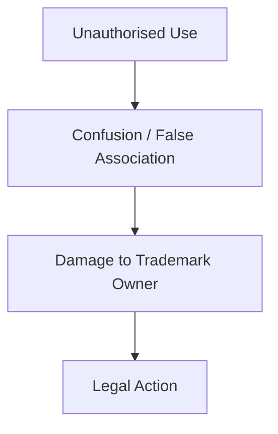
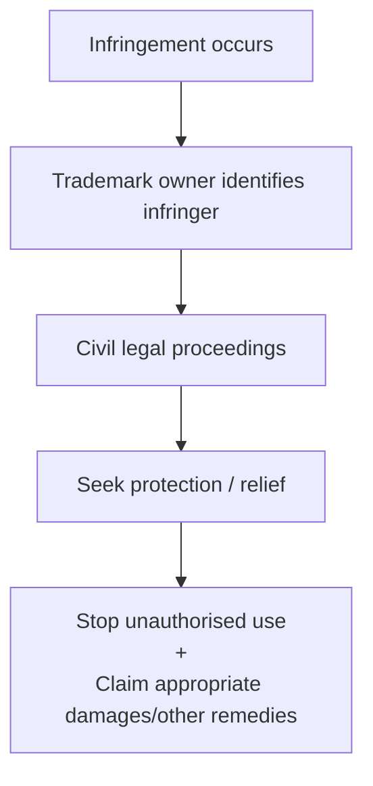
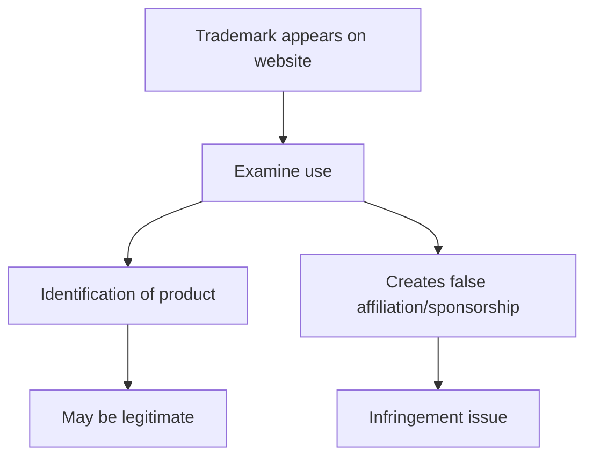
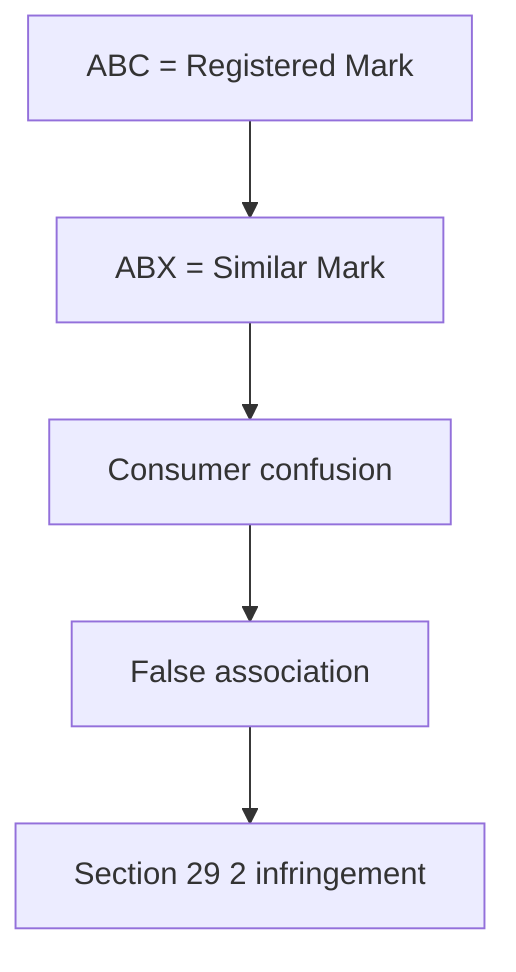
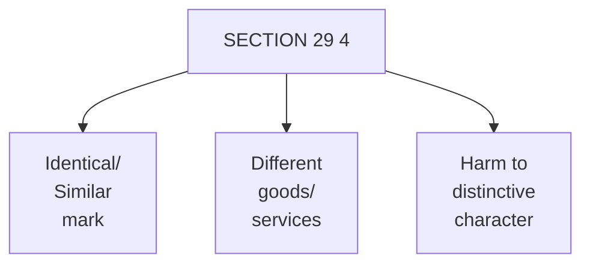
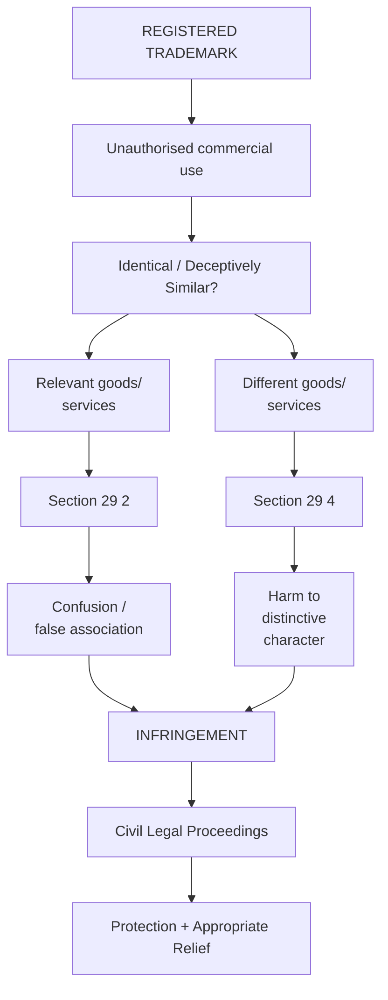
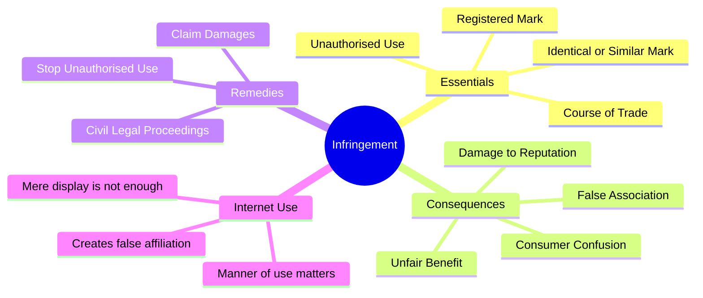
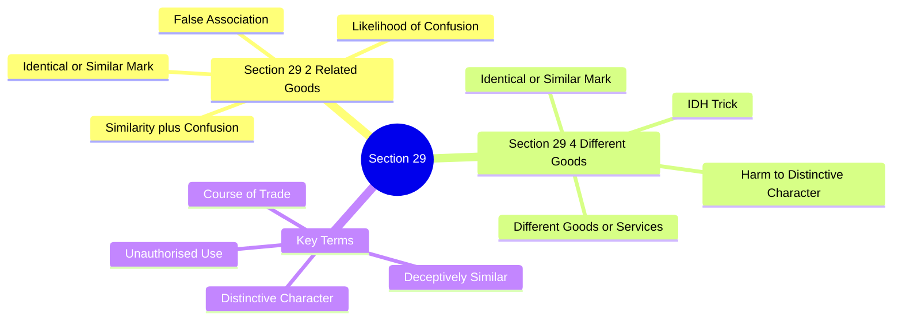

# INFRINGEMENT OF TRADEMARKS & ACTION AGAINST INFRINGEMENT

## 1. What is Trademark Infringement?

**Trademark infringement** means the **unauthorised use of a registered trademark** by a person who is **not the registered proprietor** or an **authorised/permitted user**, in a manner prohibited by trademark law.

**Simple Definition for Exam ⭐**
> **Trademark infringement** occurs when an unauthorised person, in the course of trade, uses a mark that is **identical with or deceptively similar to a registered trademark**, in relation to the goods or services for which the trademark is registered, in circumstances covered by the law.

**Basic Idea**

```mermaid
flowchart TD
    A[Registered Trademark] --> B[Unauthorised Person]
    B --> C["Uses identical / deceptively similar mark"]
    C --> D["Consumer confusion / association"]
    D --> E[INFRINGEMENT]
```

---

## 2. Who Can Infringe?

In the basic situation, infringement occurs when the person using the mark is:
*   **Not the registered proprietor**, and
*   **Not an authorised/permitted user**, and
*   Uses the mark **in the course of trade**.

**Example**
Suppose **A owns a registered trademark "ABC"** for shoes.

B, without permission, starts selling shoes using:
> **"ABC"**

or a **deceptively similar mark**.
This may constitute **trademark infringement**.

---

## 3. Why is Trademark Infringement Important?

Trademark infringement can:
*   **Confuse consumers**
*   Create a **false impression of association**
*   Damage the **reputation/value** of the genuine trademark
*   Allow another business to obtain an **unfair benefit** from the established mark

**Easy Chain**

---

## 4. Action Against Infringement

After infringement, the trademark owner/proprietor can initiate **civil legal proceedings** against the infringing party.

The purpose is essentially to:
*   **Stop unauthorised use** of the trademark
*   Protect the owner's trademark rights
*   Seek relief for **damage/loss caused by infringement**

**Simple Flow**

**Exam Keyword:** Infringement provides a **statutory remedy** to the registered trademark owner/proprietor.

---

## 5. Trademark Infringement on the Internet 🌐

The same principles apply to **online use** of trademarks.

However, merely mentioning or displaying another company's trademark online does **not automatically mean infringement**. The **manner and purpose of use** must be examined.

**Example: Microsoft**
Suppose a person creates a website discussing her expertise with **Microsoft software**.

She may refer to **Microsoft's trademarks** to identify the relevant products/software.

But if she uses the Microsoft marks in a way that makes visitors believe:
> **"This website is affiliated with or sponsored by Microsoft."**

then there can be a trademark infringement issue.

**Key Principle ⭐**
> **It is not merely the presence of the trademark online, but HOW the trademark is used that matters.**

---

## 6. Section 29 — Trade Marks Act, 1999

**Section 29** deals with **infringement of registered trademarks**.

The central idea is that unauthorised use of an **identical or deceptively similar mark**, in circumstances specified by the Act, can amount to infringement.

---

## 7. Section 29(2)

Under **Section 29(2)**, infringement can arise where:
*   The impugned mark is **identical or similar** to the registered trademark, and
*   Its use is **likely to cause confusion** among consumers, or
*   It creates a **false impression of association** with the registered trademark.

**Example**
Registered trademark:
> **"ABC"**

Another trader uses:
> **"ABX"**

for related goods in circumstances where consumers may think that ABX is connected with ABC.

🧠 **Memory**
**29(2) = Similarity + Confusion**

---

## 8. Section 29(4) — Important Difference

Section **29(4)** deals with a situation where the allegedly infringing mark is used for **different goods or services**.

The three conditions mentioned in your material are:
**I–D–H**
*   **I** → **Identical or Similar**
*   **D** → **Different goods/services**
*   **H** → **Harm to distinctive character**

**Example**
Suppose **ABC** is a famous registered trademark for electronics.
Another business uses an **identical/similar ABC mark** for a completely different category of goods.

If that use **harms the distinctive character** of the registered trademark, Section 29(4) may become relevant.

**Key Point**
> **Different goods/services do not automatically eliminate trademark infringement.**

This is an important distinction from the ordinary situation involving the same or related goods/services.

---

## 9. Section 29(2) vs Section 29(4)

| Section 29(2) | Section 29(4) |
| :--- | :--- |
| Mark is **identical/similar** | Mark is **identical/similar** |
| Goods/services are within the relevant registered context | **Different goods/services** |
| Focus includes **likelihood of confusion / association** | Focus includes **harm to distinctive character** |
| Think **consumer confusion** | Think **dilution/distinctiveness** |

🧠 **Super Memory Trick**
**29(2) → Same/related market → CONFUSION**
**29(4) → Different market → DISTINCTIVENESS HARM**

---

## 10. Important Terms You Should Write Correctly

**Identical**
The mark is essentially **the same** as the registered trademark.

**Deceptively Similar**
The mark is sufficiently similar that its use may **deceive or confuse consumers**.

**Unauthorised Use**
Use by someone who is **not entitled/authorised** to use the trademark.

**Course of Trade**
Use connected with **commercial/business activity**.

**Distinctive Character**
The ability of a trademark to **distinguish the goods/services of one business from others**.

---

## 11. Complete Diagram for Revision

---

## 🧠 1-Minute Memory Trick

Remember **U–I–C–A–D**:

*   **U** → **Unauthorised** use
*   **I** → **Identical / similar** mark
*   **C** → **Confusion** of consumers
*   **A** → **False Association**
*   **D** → **Distinctiveness** harmed

And remember:
**29(2) = CONFUSION**
**29(4) = DIFFERENT GOODS + DISTINCTIVENESS HARM**

---

## ⭐ Exam-Ready Short Answer

> **Trademark infringement** means the **unauthorised use of a registered trademark** by a person who is **not the registered proprietor or authorised user**, in the course of trade, in circumstances covered by the Trade Marks Act, 1999. Under **Section 29**, use of an **identical or deceptively similar mark** may constitute infringement. **Section 29(2)** particularly deals with situations involving **likelihood of confusion or false association** among consumers. **Section 29(4)** covers use of an identical or similar mark in relation to **different goods or services**, where such use causes **harm to the distinctive character** of the registered trademark. The trademark owner can initiate **civil legal proceedings** to restrain unauthorised use and seek appropriate legal relief, including **damages** where applicable.

## 🧠 Ultimate Mindmap 1: The Core of Infringement

## 🧠 Ultimate Mindmap 2: Section 29 Breakdown

