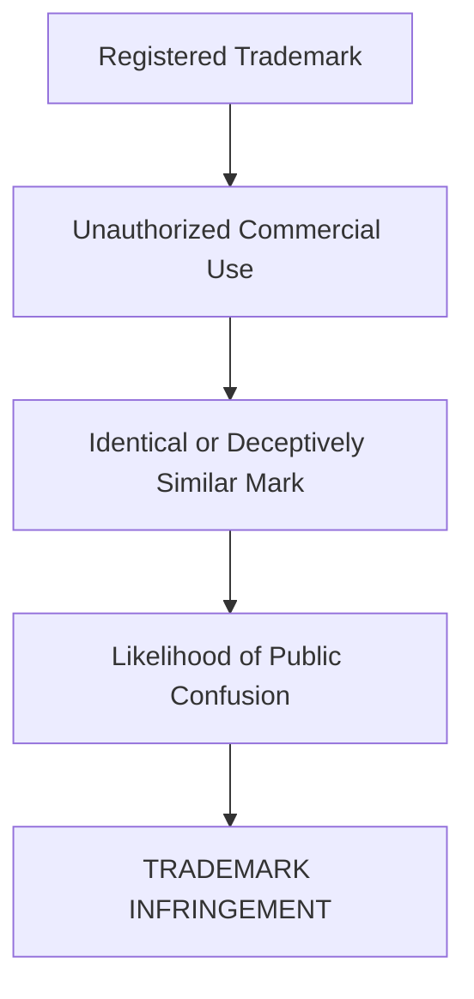
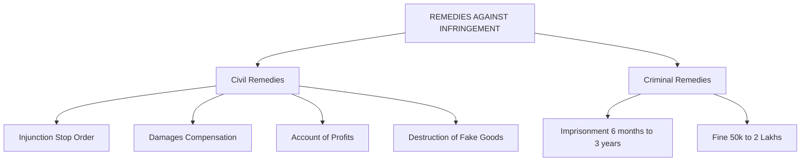
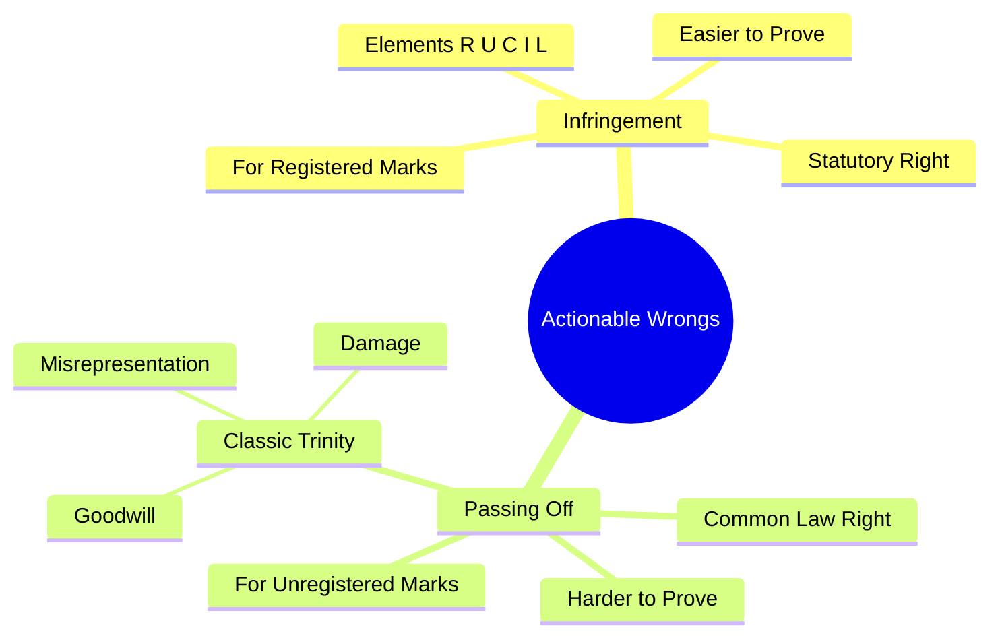
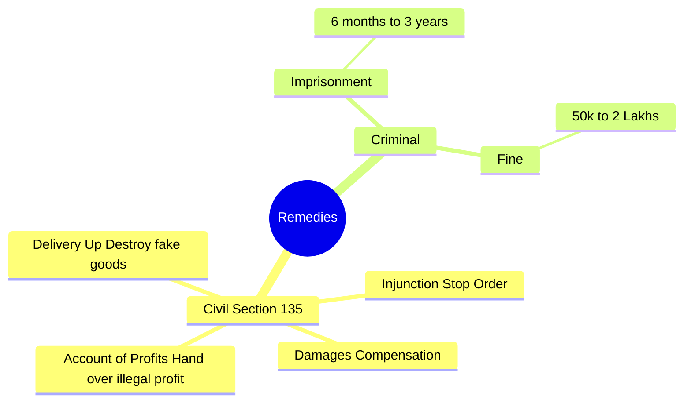

# Infringement of Trademarks & Action Against Infringement

**Easy + Structured + Exam-Oriented Notes**

When someone copies or misuses your trademark, you need to take legal action. The **Trade Marks Act, 1999** provides strict rules for what constitutes infringement and what remedies you can seek.

> **Exam Strategy:** The most frequently asked question in this topic is the difference between **Infringement** and **Passing Off**. Make sure you memorize the comparison table perfectly!

---

## 1. What is Trademark Infringement? (Section 29)

**Meaning**
Trademark infringement occurs when an unauthorized person uses a mark that is **identical or deceptively similar** to a **registered trademark** in relation to goods or services in a way that causes confusion in the minds of the public.

**Key Rule:**
> You can only sue for **Infringement** if your trademark is **REGISTERED** under the Trade Marks Act, 1999.

### Essential Elements of Infringement
To prove infringement, you must show:
1.  **Registered Mark:** The plaintiff's mark must be a valid, registered trademark.
2.  **Unauthorized Use:** The defendant must be using the mark without permission.
3.  **Course of Trade:** The defendant must be using it commercially (in the course of trade).
4.  **Identical / Deceptively Similar:** The defendant's mark must be identical or deceptively similar to the registered mark.
5.  **Likelihood of Confusion:** The use must be likely to confuse the public into thinking the defendant's goods come from the plaintiff.

🧠 **Memory Trick for Elements:** **R-U-C-I-L**
*   **R**egistered
*   **U**nauthorized
*   **C**ommercial trade
*   **I**dentical/Similar
*   **L**ikelihood of confusion

---

## 2. What is "Passing Off"? (Section 27)

What happens if someone copies your trademark, but you **never registered it**? You cannot sue for infringement. Instead, you sue for **Passing Off**.

**Meaning**
Passing off is a common law tort. It means **"nobody has the right to represent his goods as the goods of somebody else."**

### Essential Elements of Passing Off (The "Classic Trinity")
To win a passing off case, you must prove three things (known as the Classic Trinity):
1.  **Goodwill / Reputation:** Your goods/services have established goodwill in the market.
2.  **Misrepresentation:** The defendant is deceiving the public into believing their goods are yours.
3.  **Damage:** You have suffered (or are likely to suffer) financial damage because of this misrepresentation.

---

## 3. Infringement vs. Passing Off ⭐️

This is the most important distinction in Trademark law.

| Feature | Infringement | Passing Off |
| :--- | :--- | :--- |
| **Registration** | Applies ONLY to **Registered** Trademarks. | Applies to **Unregistered** Trademarks. |
| **Type of Right** | Statutory Right (under Trade Marks Act, 1999). | Common Law Right (Tort). |
| **Burden of Proof** | Easier to prove. You just show the registration certificate and the copied mark. | Harder to prove. You must prove your **Goodwill**, the **Misrepresentation**, and the **Damage**. |
| **Focus** | Protecting the trademark itself as a property right. | Protecting the goodwill/reputation of the business from deceit. |
| **Use of Mark** | The defendant must be using the identical/similar mark exactly as a trademark. | The defendant's overall presentation/packaging is deceiving the public. |

🧠 **Memory Trick:**
> **Infringement = Registered + Statutory**
> **Passing Off = Unregistered + Goodwill + Common Law**

---

## 4. Actions and Remedies Against Infringement

If someone infringes your trademark (or passes off their goods as yours), you can take legal action. The court can grant two main types of remedies: **Civil** and **Criminal**.

### A. Civil Remedies (Section 135)
When you file a civil suit in the District Court or High Court, you can ask for:

1.  **Injunction:** A court order forcing the defendant to **STOP** using the trademark immediately. (This can be a temporary injunction during the trial, or a permanent injunction at the end).
2.  **Damages:** Monetary compensation paid to you for the financial loss you suffered because of the infringement.
3.  **Account of Profits:** Instead of damages, you can ask the court to force the defendant to hand over all the **profits** they illegally made by using your trademark. *(Note: You can ask for Damages OR Account of Profits, not both).*
4.  **Delivery Up / Destruction:** The court orders the defendant to hand over all the fake goods, labels, and packaging to you so they can be destroyed.

### B. Criminal Remedies (Sections 103, 104)
Trademark infringement is also a crime! Falsifying a trademark or selling goods with a false trademark can lead to:
*   **Imprisonment:** Not less than 6 months, extending up to 3 years.
*   **Fine:** Not less than ₹50,000, extending up to ₹2,00,000.

🧠 **Memory Trick for Civil Remedies:** **I-D-A-D**
*   **I**njunction
*   **D**amages
*   **A**ccount of Profits
*   **D**elivery Up (Destruction)

---

## 5. Full-Marks Exam Answer

### Q: "Distinguish between Infringement and Passing Off, and state the remedies available to a trademark owner."
> **Infringement** is a statutory remedy under the Trade Marks Act, 1999, available exclusively for **registered trademarks**. It occurs when an unauthorized person uses an identical or deceptively similar mark in the course of trade. In contrast, **Passing Off** is a common law tort used to protect the goodwill of **unregistered trademarks**. To succeed in passing off, the plaintiff must prove the "Classic Trinity": Goodwill, Misrepresentation, and Damage.
> 
> If a trademark is infringed, the owner can seek **Civil Remedies** under Section 135, which include an **Injunction** (to stop the unauthorized use), **Damages** or an **Account of Profits** (monetary compensation), and the **Delivery Up** of the infringing labels/goods for destruction. Additionally, the owner can seek **Criminal Remedies**, as falsifying a trademark is punishable by imprisonment ranging from 6 months to 3 years and a fine between ₹50,000 and ₹2,00,000.

---

## 🧠 Ultimate Mindmap: Infringement vs Passing Off

## 🧠 Ultimate Mindmap: Remedies

