# Remedies for Infringement of Trademarks

When a trademark is infringed, the owner can seek **legal remedies** against the infringer.

There are **two main categories**:
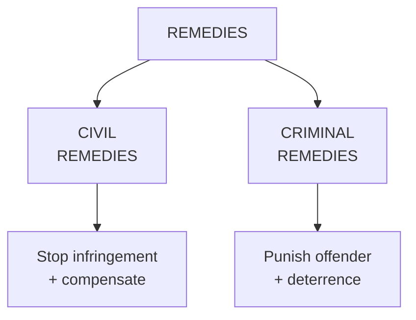

🧠 **Memory:**
*   **Civil = Stop + Recover**
*   **Criminal = Punish**

---

## PART A — CIVIL REMEDIES

Civil remedies for **trademark infringement and passing off** generally include:
1.  **Injunction**
2.  **Permanent injunction**
3.  **Damages**
4.  **Rendition of accounts**
5.  **Anton Piller Order**
6.  **Mareva Injunction**
7.  **John Doe Order**
8.  **Norwich Pharmacal Order**

🧠 **Memory Trick**
**I–D–A–M–J–N**
> **I**njunction → **D**amages → **A**nton Piller → **M**areva → **J**ohn Doe → **N**orwich Pharmacal

---

### 1. Injunction
An **injunction** is a court order that either:
*   **Stops** a person from doing something, or
*   **Requires** a person to do something.

It can also maintain the **status quo** while the dispute is being decided.

**Two Types**
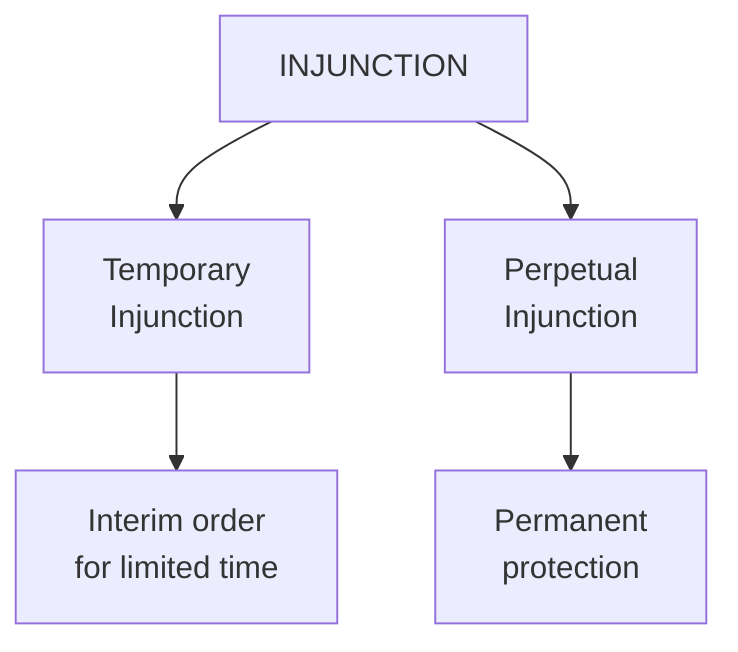

**A. Temporary Injunction**
A **temporary/interim injunction** operates for a specified period or until further order.
It is provided under **Order 39 Rules 1 & 2 of the CPC**.

**Example:**
A court temporarily orders B:
> "Do not use the disputed trademark until the case is decided."

**B. Perpetual Injunction**
A **perpetual injunction** is a **permanent injunction** granted when the suit is finally decreed.

**Example:**
After deciding the case in favour of A, the court permanently restrains B from using A's trademark.

🧠 **Remember**
*   **Temporary** = Till case/proceeding
*   **Perpetual** = Permanent

---

### 2. Damages
The trademark owner may claim **damages** for the loss suffered because of infringement.

The basic reasoning is:
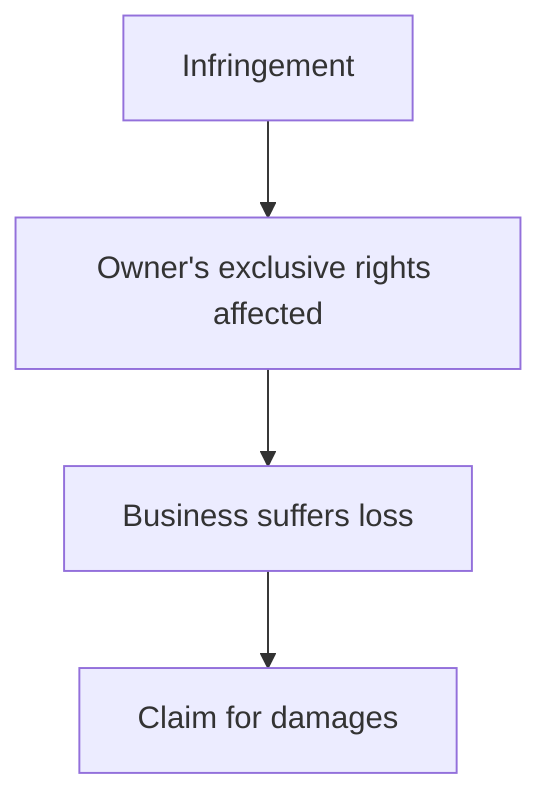

**Example**
A owns a registered trademark.
B sells counterfeit products using A's mark.
A loses sales and suffers business loss.
→ **A may seek damages.**

---

### 3. Rendition of Accounts
**Rendition of accounts** means requiring the infringer to provide an **account of profits/business transactions** arising from the infringement.

The purpose is to determine the financial benefit/profit associated with the wrongful use.

The court may also order **delivery or removal** of infringing products.

**Example**
B earned ₹5 lakh by selling goods using A's trademark.
The court may require disclosure/accounting of those profits as part of the relief sought.

🧠 **Remember**
*   **Damages** = Owner's loss
*   **Rendition of accounts** = Infringer's profits/accounts

---

### 4. Anton Piller Order
An **Anton Piller Order** is a court order used to preserve evidence/goods relevant to an infringement action.

Under **Section 135 of the Trade Marks Act, 1999**, the court may appoint a **Local Commissioner** to take steps concerning infringing goods/material, including **sealing goods** as ordered by the court.

**Simple Example**
Suppose B is secretly manufacturing counterfeit Nike-type products.
There is a risk that evidence will be destroyed or removed.
The court may appoint a **Local Commissioner** to secure/seal the relevant goods.

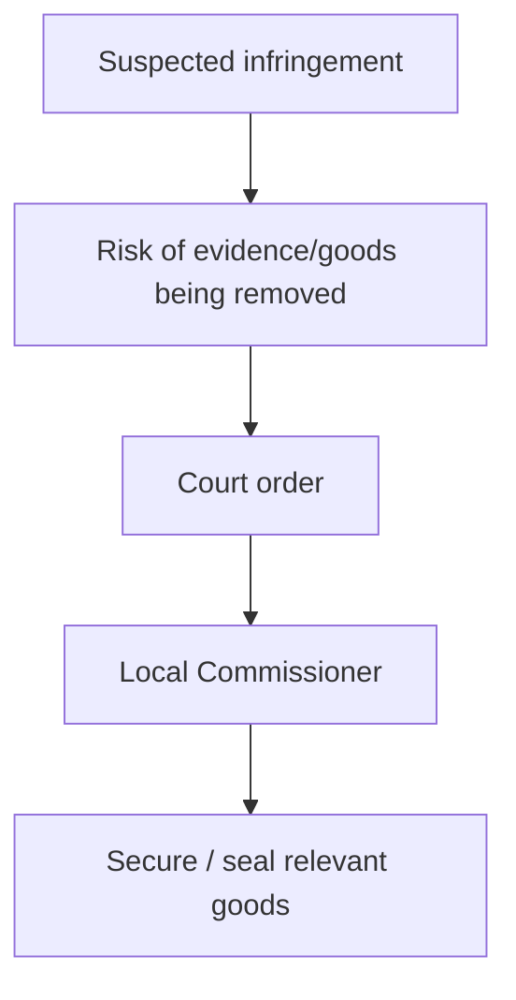

🧠 **Memory**
**Anton Piller = Preserve Evidence**

---

### 5. Mareva Injunction
A **Mareva injunction** is essentially an **asset-freezing remedy**.

It prevents the defendant from **disposing of or removing disputed assets**, particularly where there is a concern that the defendant may take assets outside the court's jurisdiction and make a future judgment ineffective.

In India, the concept is sometimes associated with **attachment before judgment under Order XXXVIII Rule 5 CPC**.

**Example**
B is being sued for trademark infringement.
A has a legitimate concern that B may transfer/remove his assets from the jurisdiction before judgment.

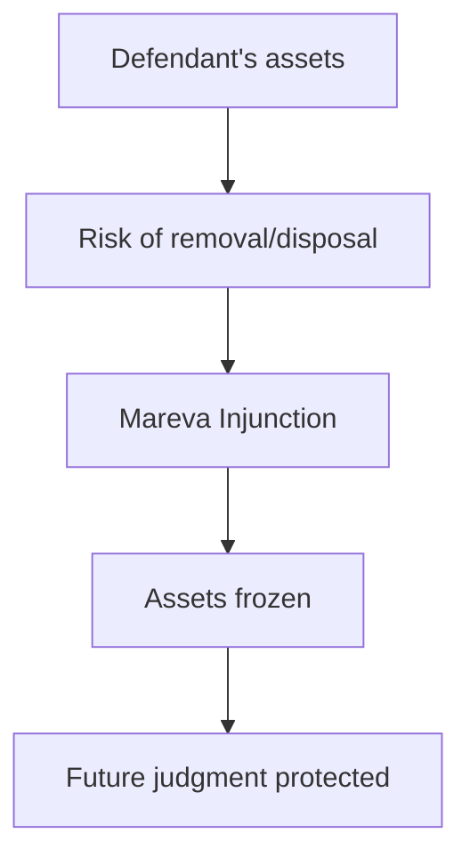

🧠 **Memory**
**Mareva = Money/Assets Frozen**

---

### 6. John Doe Order
A **John Doe Order** is used where the infringer is **unknown or anonymous**, but there is a reasonable apprehension of infringement.

The court can issue an order against **unknown persons** to prevent the anticipated infringement.

**Example**
Suppose a company knows that unknown sellers are going to sell counterfeit products during a large event, but their identities are not yet known.
The court may issue an order against **unknown infringers**.

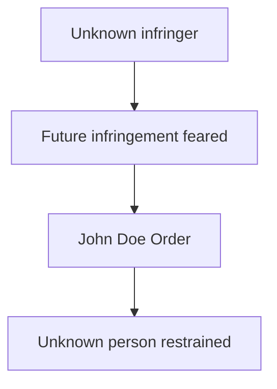

🧠 **Memory**
**John Doe = Don't know WHO**

---

### 7. Norwich Pharmacal Order
A **Norwich Pharmacal Order** is directed against a **third party** who has information about the wrongdoing.

The third party may be required to **disclose relevant information/documents** that can help identify the wrongdoer or establish the case.

**Example**
Suppose an unknown person is selling counterfeit products online.
The platform/payment provider may possess information that can help identify that person.
A court may require the relevant third party to **disclose information**, subject to the legal requirements.

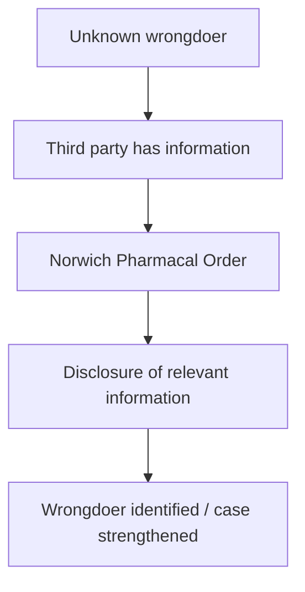

🧠 **Memory**
**Norwich = "Tell me WHO"**

---

### 🔥 Important Difference: John Doe vs Norwich Pharmacal

| John Doe | Norwich Pharmacal |
| :--- | :--- |
| Used against **unknown infringer** | Used against a **third party** |
| Purpose → **restrain/prevent** infringement | Purpose → **obtain information** |
| "Don't know **WHO**, stop them." | "Third party, **tell me WHO**." |

*This is an excellent distinction to write in an exam.*

---

## PART B — CRIMINAL REMEDIES

The **Trade Marks Act, 1999**, provides criminal penalties in **Chapter XII**, particularly **Sections 103–109**.

**Important Point ⭐**
The trademark regime provides **both civil and criminal remedies**; these operate as **parallel forms of legal protection**.

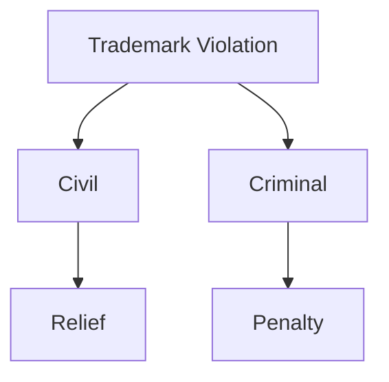

### Section 103 — False Trademarks / Trade Descriptions
**What does it cover?**
A person who **falsifies a trademark** or applies a **false trademark/trade description** with the prohibited intent/conduct can face criminal punishment.

**Punishment mentioned in the material**
*   **Imprisonment:** minimum **6 months**, up to **3 years**
*   **Fine:** minimum **₹50,000**, up to **₹2 lakh**

*(The court may impose a lesser punishment where the statutory conditions/proviso are satisfied and adequate/special reasons are recorded).*

🧠 **Memory**
**103 = Falsify**

### Section 104 — Selling Goods with False Trademark
This section deals with a person who **sells** or commercially deals in **goods/services bearing a false trademark**.

**Punishment mentioned**
*   **Imprisonment:** minimum **6 months**, up to **3 years**
*   **Fine:** minimum **₹50,000**, up to **₹2 lakh**

*(The court may impose a lesser punishment where the statutory requirements/proviso permit it and adequate reasons are given).*

**Example**
B knows goods carry a **false trademark** and sells them for commercial profit.
→ **Section 104** may apply.

🧠 **Difference**
*   **103** = Making/applying false mark
*   **104** = Selling/dealing in goods with false mark

### Section 105 — Subsequent Conviction
If a person has already been convicted under **Section 103 or 104** and commits the relevant offence **again**, enhanced punishment applies.

**Punishment mentioned**
*   Minimum imprisonment: **1 year**
*   May extend to **3 years**
*   Fine may also be imposed.

*(The court may impose imprisonment below one year/fine below the statutory amount only where the Act's requirements for giving **special reasons** are satisfied).*

🧠 **Memory**
**105 = Repeat offender → Enhanced punishment**

### Section 106 — Removing Piece Goods
A person who removes **pieces or bundles of goods bearing a false trademark**, in the circumstances covered by the provision, can be punished.

**Punishment mentioned**
*   **Fine up to ₹1,000**

🧠 **Memory**
**106 = Remove goods → Fine**

### Section 107 — Falsely Representing Trademark as Registered
A person cannot falsely represent that a trademark is **registered** when it is not.

**Punishment mentioned**
*   **Imprisonment up to 3 years**
*   **Fine**
*   **Or both**

**Example**
Actual status:
> Trademark = **Not registered**

Person advertises:
> **"Registered Trademark ®"**
with a false representation.
→ **Section 107** may apply.

🧠 **Memory**
**107 = Fake registration claim**

### Section 108 — False Representation of Place of Business
A person cannot use their **business premises/commercial office** in a manner that falsely makes ordinary people believe that it is the **Trade Marks Registry/Trade Marks Office**.

**Example**
Someone creates an office with signs designed to make people believe:
> "This is the official Trade Marks Office."
when it is actually a private business.

**Punishment mentioned**
*   **Imprisonment up to 2 years**
*   **Fine**
*   **Or both**

🧠 **Memory**
**108 = Fake Trade Marks Office**

### Section 109 — Falsification of Register
A person who **makes or causes to be made a false entry** in the official **Register of Trade Marks** can be punished.

**Punishment mentioned**
*   **Imprisonment up to 2 years**
*   **Fine**
*   **Or both**

**Example**
Someone deliberately causes a **false entry** to be inserted into the official trademark register.
→ **Section 109** applies.

🧠 **Memory**
**109 = Fake Register Entry**

---

## ⭐ Sections 103–109 — One-Table Revision

| Section | What to Remember | Punishment/Consequence |
| :--- | :--- | :--- |
| **103** | **False/falsified trademark** or trade description | 6 months–3 years + ₹50,000–₹2 lakh; statutory exceptions may permit lesser punishment |
| **104** | **Selling/dealing** in goods with false trademark | 6 months–3 years + ₹50,000–₹2 lakh; statutory exception may permit lesser punishment |
| **105** | **Subsequent conviction** | Enhanced punishment; 1–3 years, subject to statutory provisions |
| **106** | **Removing piece/bundle** goods bearing false mark | Fine up to ₹1,000 |
| **107** | **False claim** that trademark is registered | Up to 3 years + fine, or both |
| **108** | **False representation as Trade Marks Office** | Up to 2 years + fine, or both |
| **109** | **False entry** in trademark register | Up to 2 years + fine, or both |

🧠 **BEST MEMORY TRICK FOR 103–109**
Think of the story:
> **103 MAKES → 104 SELLS → 105 REPEATS → 106 REMOVES → 107 LIES ABOUT REGISTRATION → 108 PRETENDS TO BE OFFICE → 109 FAKES REGISTER**

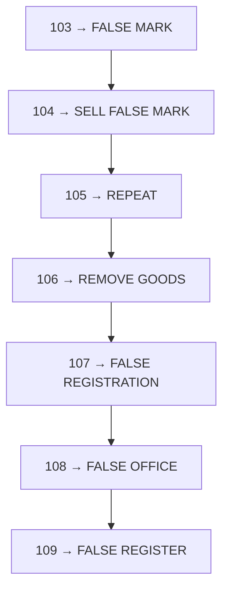

---

## 🚀 Final Exam Revision Map

### Civil Remedies
**I–D–A–M–J–N**
*   **I** → **Injunction** → **Stop**
*   **D** → **Damages** → **Compensate**
*   **A** → **Anton Piller** → **Secure evidence/goods**
*   **M** → **Mareva** → **Freeze assets**
*   **J** → **John Doe** → **Unknown infringer**
*   **N** → **Norwich Pharmacal** → **Obtain information from third party**

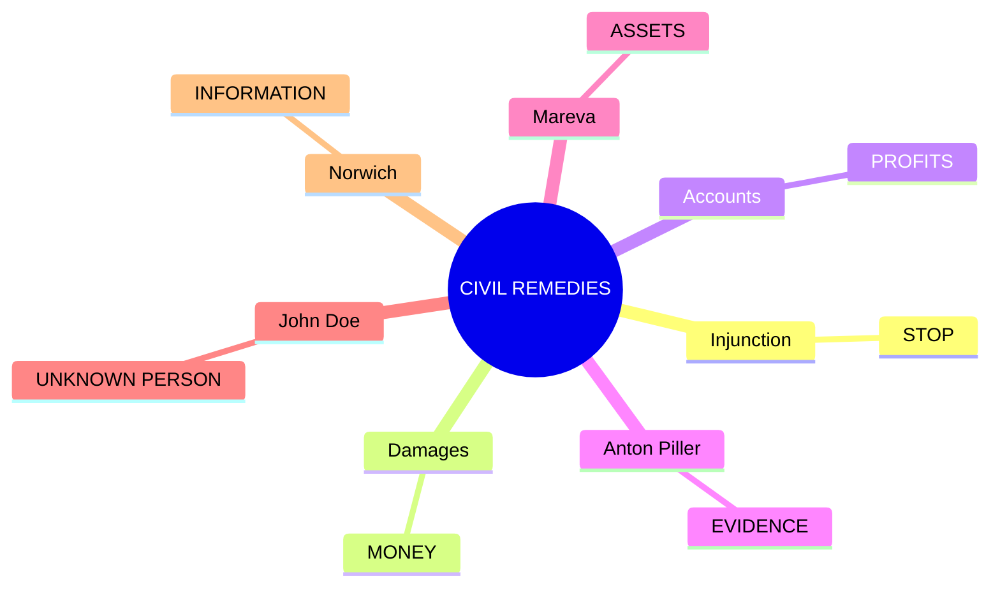

### Criminal Remedies
**103–109**
> **False Mark → Sell → Repeat → Remove → Fake Registration → Fake Office → Fake Register**

**One-line exam conclusion:**
> Thus, the **Trade Marks Act, 1999** provides a combination of **civil remedies** to stop infringement and compensate/protect the proprietor, and **criminal penalties** to punish specified trademark offences and deter unlawful conduct.

## 🧠 Ultimate Mindmap: Civil and Criminal Remedies
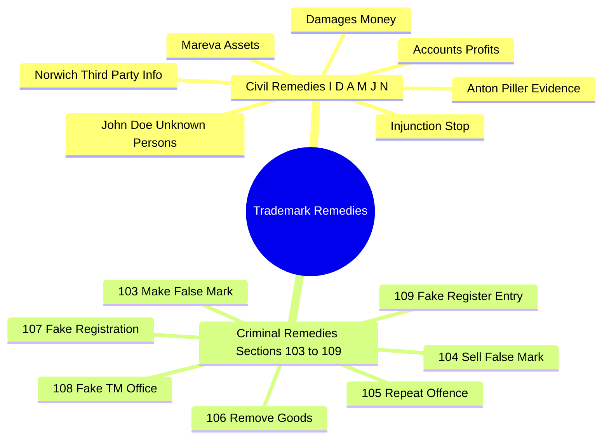
