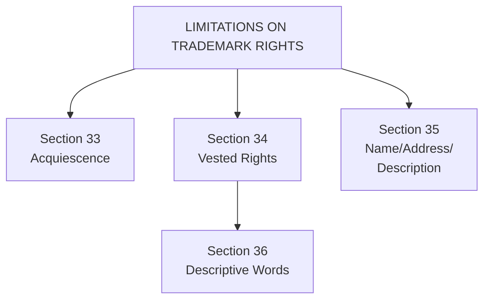
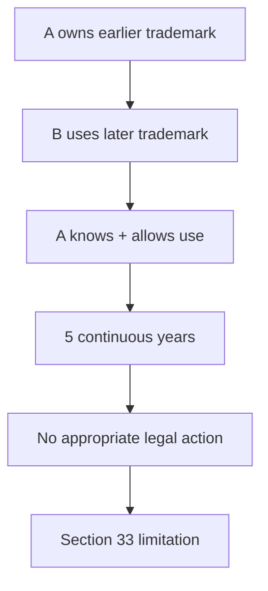
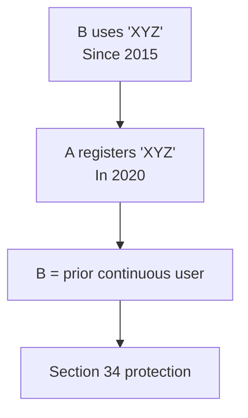
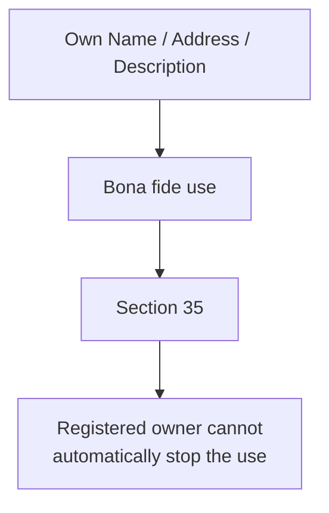
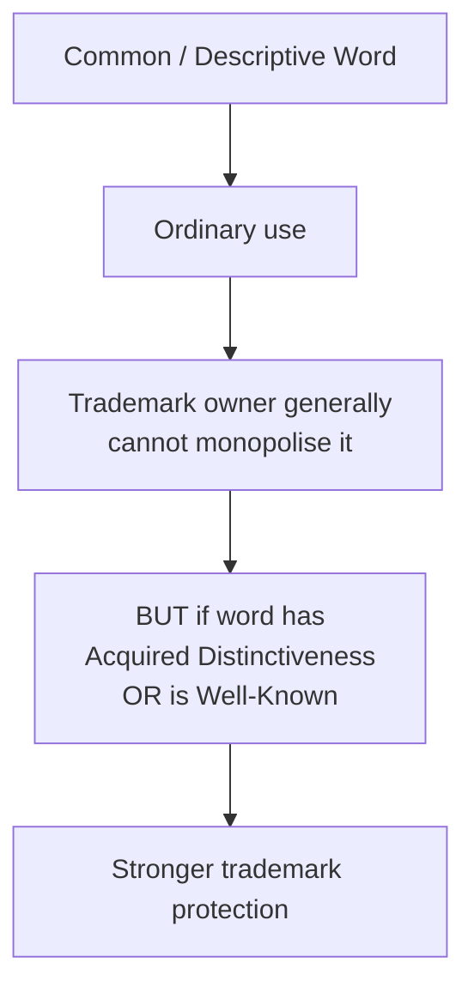
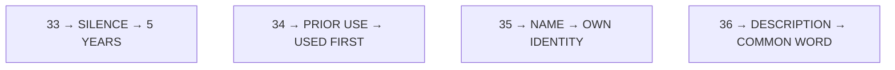
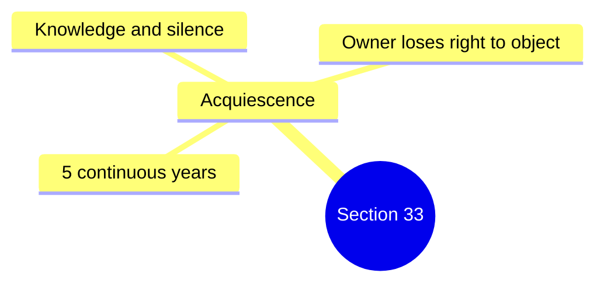
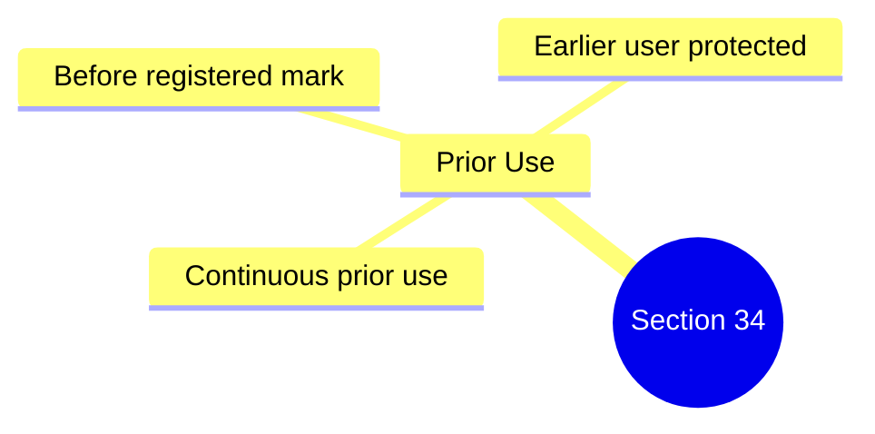
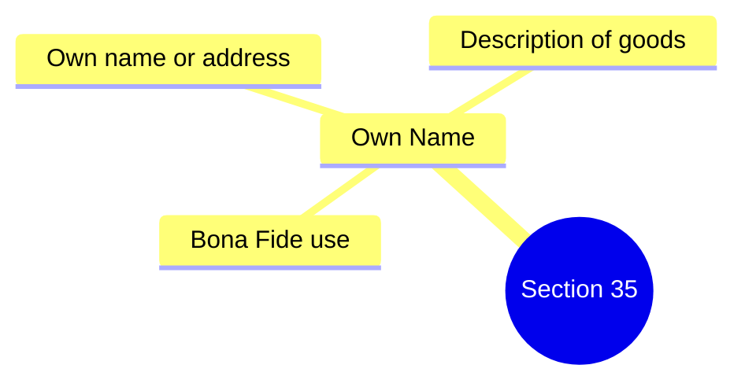
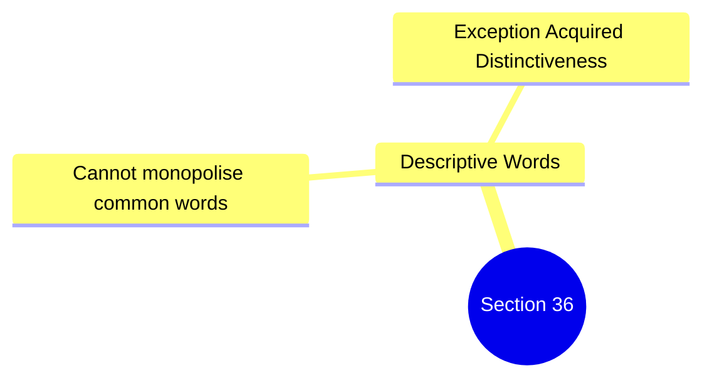

# Limitations on the Rights of the Trademark Owner

A trademark owner has **exclusive rights**, but these rights are **not absolute**. The Trade Marks Act, 1999 places certain limitations on the owner's ability to stop others from using certain marks/names/descriptions.

The important provisions here are:

🧠 **Memory Trick**
*   **33** → Acquiescence → **"Allowed for years"**
*   **34** → Vested Rights → **"Used earlier"**
*   **35** → Name/Address → **"My own identity"**
*   **36** → Description → **"Common description"**

---

## 1. Effect of Acquiescence — Section 33

**Meaning of Acquiescence**
**Acquiescence** means the trademark owner **knowingly allows** another party to use a later trademark for a **significant period** without taking legal action.

Under **Section 33**, where the proprietor of an earlier registered trademark has **acquiesced in the use of a later registered trademark for a continuous period of five years**, subject to the statutory conditions, the proprietor is generally **barred from seeking invalidation** of the later registration or opposing its use on the basis of the earlier mark.

**Simple Example**
Suppose:
*   **A** owns registered trademark **"ABC"**
*   **B** later registers **"ABCX"**
*   **A** knows about B's use
*   **A** allows B to use it for **5 continuous years**
*   **A** does not take the required legal action

Then A's ability to challenge B's later mark may be **restricted by Section 33**.

**Important Exam Point ⭐**
This provision prevents an owner from **sleeping on his rights for years and then suddenly objecting** after the other party has established its use.

🧠 **Memory**
**33 = 5 Years of Silence**

---

## 2. Vested / Prior Rights — Section 34

Section **34** protects certain **prior continuous users** of a trademark.

The basic principle is:
> **Earlier continuous use can prevail over later registration.**

If a person has continuously used a trademark **before the relevant registered trademark's use/registration**, the proprietor of the registered trademark may not be able to prevent that prior user from continuing such use, subject to the statutory conditions.

**Conditions in your material**
The use must have been:
1.  **Continuous**
2.  **For a period prior to the use** of the registered trademark
3.  **From a date before the registration** of the registered trademark

*(The Registrar also should not refuse registration merely because of the later registered mark when the **Section 34 conditions** are satisfied).*

**Example**

So, even though **A has registration**, B's **prior continuous use** can receive statutory protection.

🧠 **Memory**
**34 = FIRST USE WINS (subject to conditions)**

---

## 3. Use of Name, Address & Description — Section 35

Section **35** protects the **bona fide use** of a person's:
*   **Name**
*   **Address**
*   **Description of goods/services**

The registered trademark owner cannot prevent such use merely because it resembles the registered trademark, provided the use is **bona fide (in good faith)** and falls within the statutory protection.

**Example 1 — Name**
Suppose a person's genuine name is:
> **"Ramesh Kumar"**

and another business has a trademark containing "Ramesh".
The person can use his **own genuine name** in a bona fide manner, subject to the statutory requirements.

**Example 2 — Description**
Suppose a trader uses ordinary words to **describe his goods/services** rather than using them as a trademark.
That descriptive use may receive protection under Section 35.

🧠 **Memory**
**35 = "It's my NAME / ADDRESS / DESCRIPTION."**

---

## 4. Words Used for Name or Description — Section 36

Section **36** deals with the use of words that are the **name or description of an article, substance or service**.

The basic principle is that a trademark owner cannot automatically prevent others from using an ordinary word merely because it is part of or resembles their trademark.

**BUT — Important Exception ⭐**
The protection becomes relevant where the word has become so strongly associated with particular goods/services that it has:
*   **Acquired distinctiveness**, or
*   Become a **well-known trademark**.

So, the key question is whether the word is merely **descriptive/common**, or whether it has developed a **strong trademark significance**.

**Example**
Suppose a company has a trademark containing the word:
> **"SWEET"**

Another trader uses "sweet" simply to describe the nature of its product.
The trademark owner cannot automatically claim exclusive rights over the ordinary descriptive word.

But if the word has acquired a **special trademark significance** through extensive use and recognition, the legal position can be different.

🧠 **Memory**
**36 = DESCRIPTION → Don't monopolise ordinary words**

---

## ⭐ Section 33 vs 34 vs 35 vs 36

| Section | Concept | Easy Meaning | Memory |
| :--- | :--- | :--- | :--- |
| **33** | **Acquiescence** | Owner allows later mark for **5 years** without taking required action | **33 = 5 years silence** |
| **34** | **Prior/Vested Rights** | Protects certain **prior continuous users** | **34 = Used First** |
| **35** | **Name, Address & Description** | Protects **bona fide** use of own name/address/description | **35 = My Identity** |
| **36** | **Descriptive Words** | Ordinary descriptive words generally cannot be monopolised | **36 = Common Description** |

---

## 🧠 One Super Memory Story

Imagine a trademark owner **A**:

**33 → A stays SILENT**
A allows another mark for **5 years**.

**34 → B was THERE FIRST**
B has **prior continuous use**.

**35 → "That's MY NAME!"**
A person uses his **own name/address/description bona fide**.

**36 → "It's a COMMON WORD!"**
A trademark owner cannot monopolise an ordinary **descriptive word**, unless it has acquired trademark significance / is well-known as provided by law.

---

## ⭐ Exam Conclusion

> Therefore, the rights of a registered trademark proprietor are **not absolute**. **Sections 33–36** recognise important limitations based on **acquiescence, prior continuous use, bona fide use of names/addresses/descriptions, and use of descriptive words**. These provisions balance the exclusive rights of trademark owners with the legitimate interests of other traders and users.

## 🧠 Ultimate Mindmap 1: Acquiescence (Sec 33)

## 🧠 Ultimate Mindmap 2: Prior Use (Sec 34)

## 🧠 Ultimate Mindmap 3: Own Name (Sec 35)

## 🧠 Ultimate Mindmap 4: Descriptive Words (Sec 36)

