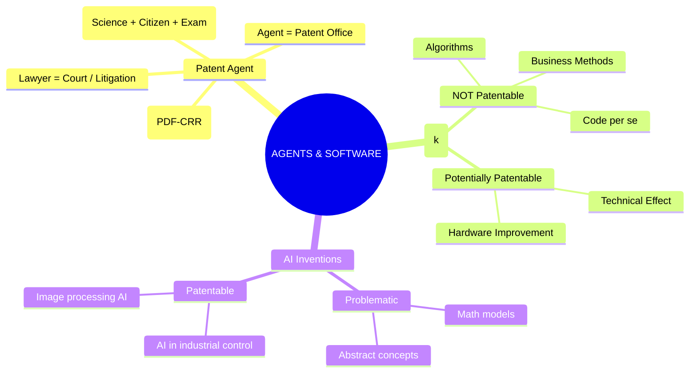

# Chapter 15: Patent Agents & Software / AI Patents

---

## 1. Patent Agents

**What is a Patent Agent?**
Think of a patent agent as your expert guide through the complicated legal process of getting a patent. 
> **Exam Keyword Definition:** A patent agent is a person who is **registered under Indian patent law** and is **authorized to perform specified professional activities** before the Patent Office.

### Functions of a Patent Agent
What exactly do they do for the inventor? 
1. **Prepare:** Get the patent applications ready.
2. **Draft specifications:** Write the highly technical descriptions and *claims* (the most critical part).
3. **File applications:** Submit the paperwork to the Patent Office.
4. **Communicate:** Talk back and forth with the Patent Office.
5. **Respond:** Reply to examination objections (like the First Examination Report or FER).
6. **Represent:** Appear on behalf of the applicants in permitted hearings.

> 🧠 **Memory Trick: P-D-F-C-R-R**
> **P**repare | **D**raft | **F**ile | **C**ommunicate | **R**espond | **R**epresent

### Qualification of a Patent Agent
How do you become one? You must satisfy strict **statutory eligibility requirements**:
- Must be a **citizen of India**.
- Meet prescribed **age requirements**.
- Have the required **scientific/technical qualifications** (like an Engineering or Science degree).
- Pass the **prescribed patent-agent examination**.

### Patent Agent vs Patent Attorney / Lawyer
*A very common exam question!* 

**Simple Explanation:** 
- The **Agent** helps you *get* the patent from the Patent Office. 
- The **Lawyer** helps you *defend* the patent in Court if someone copies it.

| Feature | Patent Agent (The Office Expert) | Advocate / Lawyer (The Court Expert) |
| :--- | :--- | :--- |
| **Focus area** | **Patent drafting, filing, and prosecution.** | **Litigation and court proceedings.** |
| **Representation** | Represents clients before the **Patent Office**. | Represents clients in **Court**. |
| **Handling disputes** | Responds to examiner objections. | Handles **Patent infringement suits** and legal opinions. |

---

## 2. Patents and Computer Programs (Software)

**Can I patent my software code in India?**
Generally, **NO**. 

**The Rule (Indian Patent Act – Section 3(k)):**
> *"A mathematical method or a business method or a computer programme per se or algorithms"* are excluded from patentability.

**"Per Se" Meaning:** It means "by itself". So, a computer program *just as a bunch of code* is **generally not patentable** in India.

**The Exception (When CAN you patent software?):**
The analysis changes if the software has a **technical effect or technical contribution**. If your software makes a physical machine work better, it *might* be patentable!

### Software Copyright vs Software Patent

| Feature | Software Copyright | Software Patent |
| :--- | :--- | :--- |
| **What it protects** | The **expression** of the software. | A **technical invention** involving software. |
| **Examples protected** | Source code, Object code, Program documentation. | A novel technical system implemented using software. |
| **Condition** | Exists automatically if original. | Must provide a **qualifying technical contribution** and satisfy the Patents Act (not be excluded). |

### Exam Examples: What is and isn't patentable?

| ❌ Generally NOT Patentable (Just Code/Logic) | ✅ Potentially Patentable (Has a Technical Effect) |
| :--- | :--- |
| Mathematical algorithm alone | Technical control of an industrial machine |
| Business method alone | Improved functioning of a communication system |
| Abstract software logic | Technical improvement in computer hardware performance |
| Computer program *per se* | A system where software physically solves a technical problem |

> ⚠️ **Exam Keyword Warning:** You cannot just add words like "computer implemented" to a bad idea to get a patent. Patentability depends on the **actual claims and technical substance**.

---

## 3. Patentability of AI-Based Inventions

Artificial Intelligence (AI) is growing fast, but patenting it is tricky because AI is essentially based on math and algorithms (which are banned under Section 3(k)).

**Potentially Problematic (Likely to be rejected):**
- Mathematical model alone.
- Algorithm alone.
- Abstract AI concept.
- Business method implemented using AI software.

**Possible Patent-Related Areas (Potentially Patentable):**
- AI-controlled industrial systems (e.g., AI that physical moves a robot arm).
- Novel hardware architecture (e.g., A new microchip designed specifically for AI).
- Technical image-processing systems (e.g., AI that scans medical X-rays).
- AI-based signal-processing techniques.

> 🧠 **Key Principle Formula for AI Patents:**
> **AI + Technical Contribution + Patentability Requirements = Potentially Patentable**

---

## 🧠 Ultimate Mindmap: Agents & Software Patents

