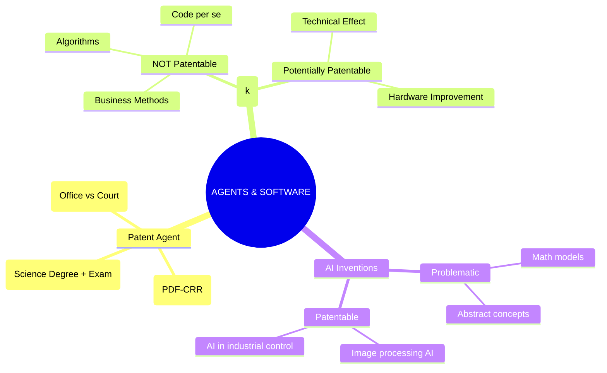

# Chapter 15: Patent Agents & Software / AI Patents

---

## 1. Patent Agents

A **Patent Agent** is a professional registered under Indian patent law who is authorized to perform specific professional activities before the Patent Office.

### Functions of a Patent Agent
1. **Prepare** patent applications.
2. **Draft** specifications and claims (the most important part).
3. **File** applications with the Patent Office.
4. **Communicate** with the Patent Office on behalf of the inventor.
5. **Respond** to examination objections (FER).
6. **Represent** applicants in permitted hearings/proceedings.

> 🧠 **Memory Trick: P-D-F-C-R-R**
> **P**repare | **D**raft | **F**ile | **C**ommunicate | **R**espond | **R**epresent

### Qualification of a Patent Agent
To become a registered patent agent, a person must:
- Be a **citizen of India**.
- Meet the prescribed **age requirements** (usually 21+).
- Possess a **degree in Science, Engineering, or Technology**.
- Pass the **prescribed patent-agent examination** (or satisfy other statutory routes).

### Patent Agent vs Patent Attorney / Lawyer
*This is a common exam differentiation question.*

| Feature | Patent Agent | Advocate / Lawyer |
| :--- | :--- | :--- |
| **Focus area** | Technical and procedural | Legal and judicial |
| **Drafting** | Drafts and files patent applications | Drafts legal notices and lawsuits |
| **Representation** | Represents clients before the **Patent Office** | Represents clients in **Court proceedings** |
| **Disputes** | Handles patent prosecution and examination | Handles litigation and patent infringement suits |

---

## 2. Patents and Computer Programs (Software)

In India, you generally **cannot** patent a basic computer program. 

**According to Section 3(k) of the Indian Patent Act:**
> *"A mathematical method or a business method or a computer programme per se or algorithms are excluded from patentability."*

**BUT**, the law becomes interesting if the software has a **technical effect**:
- A computer program *merely as such (per se)* = **Not Patentable**.
- A computer program associated with a **technical effect or contribution** = **Potentially Patentable**.

### Software Copyright vs Software Patent

| Feature | Software Copyright | Software Patent |
| :--- | :--- | :--- |
| **What it protects** | The *expression* of the software. | The *technical invention* involving software. |
| **Examples protected** | Source code, Object code, User manuals, Documentation. | A novel technical system implemented using software that provides a technical solution. |
| **Condition** | Must be original. | Must satisfy Novelty + Inventive Step + Not be excluded under Sec 3(k). |

### Computer Program Examples for Exam

| ❌ Generally NOT Patentable | ✅ Potentially Patentable |
| :--- | :--- |
| Mathematical algorithm alone | Technical control of an industrial machine using software |
| Business method alone | Improved functioning of a communication system |
| Abstract software logic | Technical improvement in computer hardware performance |
| Computer program *per se* | A system where software makes a machine work faster/better |

> ⚠️ **Important Note:** You cannot just add the words "computer implemented" to a bad idea and get a patent. Patentability depends on the **actual claims and technical substance**.

---

## 3. Patentability of AI-Based Inventions

Artificial Intelligence (AI) is growing rapidly, but getting a patent for AI is tricky.

**Potentially Patentable AI Inventions:**
- AI-controlled industrial systems (e.g., an AI that controls a robotic arm in a factory).
- Novel hardware architecture designed for AI.
- Technical image-processing systems (e.g., AI that detects diseases in X-rays).
- AI-based signal-processing techniques.
- Technical improvements in computing systems.

**Potentially Problematic (Likely to be rejected):**
- A mathematical model alone.
- An algorithm alone.
- Abstract AI concepts.
- A business method implemented using AI software.

> 🧠 **Key Principle Formula for AI Patents:**
> **AI + Technical Contribution + Patentability Requirements = Potentially Patentable**

---

## 🧠 Ultimate Mindmap: Agents & Software Patents

