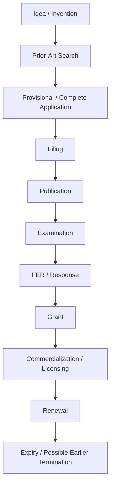
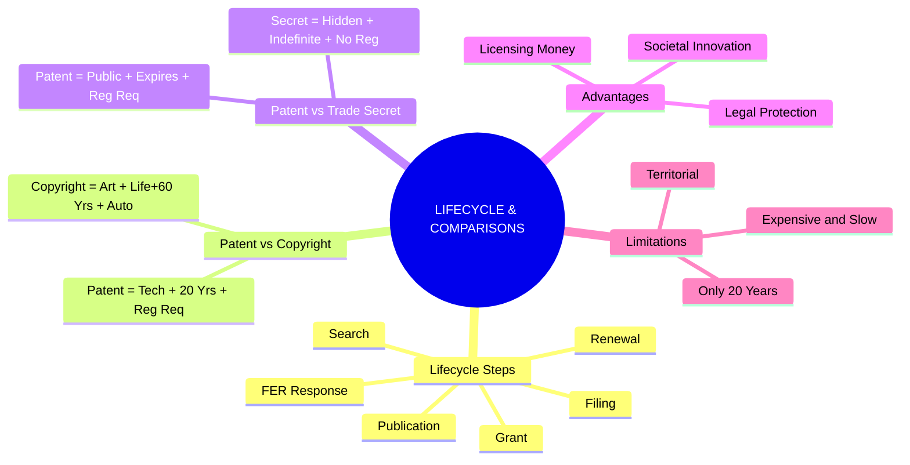

# Chapter 16: Patent Lifecycle & Key Comparisons

---

## 1. The Complete Patent Lifecycle

Getting a patent isn't just filling out a single form—it's a multi-year journey. 

**Here is the exact step-by-step lifecycle flow:**

### 💧 Complete Patent Process – Real-Life Example 
*Example: Smart Irrigation System*

Imagine a researcher develops a new smart irrigation controller. Here is how they navigate the patent process step-by-step:

- **Step 1:** Identify the technical invention. *(What exactly makes the irrigation controller new and inventive?)*
- **Step 2:** Conduct prior-art search. *(Check if anyone else in the world has already patented it).*
- **Step 3:** File **provisional specification**. *(File early to claim the date while finishing the prototype).*
- **Step 4:** Develop and finalize the invention.
- **Step 5:** File **complete specification** within the prescribed period. *(Provide all the deep technical details and claims).*
- **Step 6:** Request examination. *(The patent office won't look at it until you officially ask).*
- **Step 7:** Respond to examination objections. *(The examiner issues a First Examination Report (FER), and the inventor replies).*
- **Step 8:** Patent is **granted** if requirements are satisfied.
- **Step 9:** **Commercialize** or license the technology. *(Make money from the invention).*

---

## 2. Advantages & Limitations of Patenting

Why do people spend so much time and money getting patents? And what are the downsides?

### ✅ Advantages of Patenting (Who Benefits?)

| Beneficiary | Benefits Received | Simple Meaning |
| :--- | :--- | :--- |
| **For Inventors** | Legal protection, Commercialization, Licensing opportunities, Recognition. | You get credit, safety from thieves, and a way to make money by renting it out. |
| **For Companies** | Competitive advantage, Investment attraction, Technology licensing, Market differentiation. | Investors love patents. It makes your company stand out and crushes competitors. |
| **For Society** | Technical knowledge is disclosed, Innovation is encouraged, New technologies can be developed. | Society gets smarter because the secret is published for everyone to learn from. |

### ❌ Limitations of Patents (Exam Focus)

1. **Expensive:** Patent application and maintenance can be very expensive.
2. **Time-Consuming:** Patent prosecution (the back-and-forth with the patent office) can take time.
3. **Territorial:** Patent protection is territorial (An Indian patent only protects you in India). 
4. **Limited Term:** Patent protection has a limited term (max 20 years).
5. **Public Disclosure:** Patent details are publicly disclosed (you lose your secret).
6. **Litigation Costs:** Enforcement can involve heavy litigation costs if someone copies you.
7. **No Guarantees:** Patentability is not guaranteed merely by filing an application.

> 🧠 **Memory Trick: E-T-T-L-P-L-N**
> Expensive | Time | Territorial | Limited | Public | Litigation | No Guarantee

---

## 3. Patent vs Copyright (Comparison)

*A classic exam question highlighting the difference between technical and creative protection.*

| Feature | Patent | Copyright |
| :--- | :--- | :--- |
| **Protects** | **Invention** | **Creative expression** |
| **Example** | New technical device | Software source code |
| **Main Requirement** | Novelty + inventive step + industrial applicability | Originality / eligibility |
| **Registration** | **Required** for patent rights | **Not required** for existence |
| **Typical Term** | **20 years** | **Life + 60 years** for many works |
| **Focus** | **Technical solution** (How it works) | **Expression** (How it looks/sounds) |

> 🧠 **Memory Trick:**
> **Patent** = Invention = 20 Years = Registration Required
> **Copyright** = Creativity = Life + 60 Years = Automatic

---

## 4. Patent vs Trade Secret (Comparison)

*Should you patent your invention (and reveal it) or keep it a trade secret?*

| Feature | Patent | Trade Secret |
| :--- | :--- | :--- |
| **Protection** | **Statutory** (granted by law) | **Confidentiality-based** (you keep it hidden) |
| **Disclosure** | Patent application is **published** for the world to see. | Must remain absolutely **secret**. |
| **Duration** | Generally **20 years**. | Potentially **indefinite** (as long as it stays secret). |
| **Registration** | **Required**. | **No registration**. |
| **Risk** | Expires eventually. | **Lost** if secrecy is lost. |
| **Example** | New manufacturing technology. | Confidential formula/process (like Coca-Cola). |

---

## 🧠 Ultimate Mindmap: Lifecycle & Comparisons

