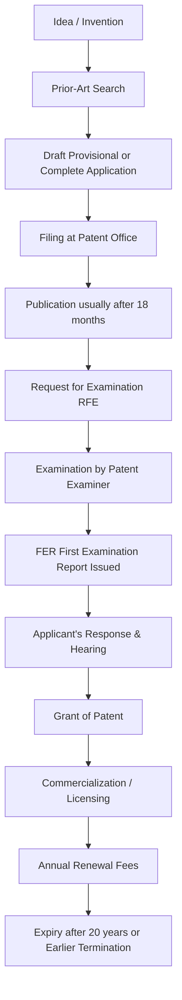
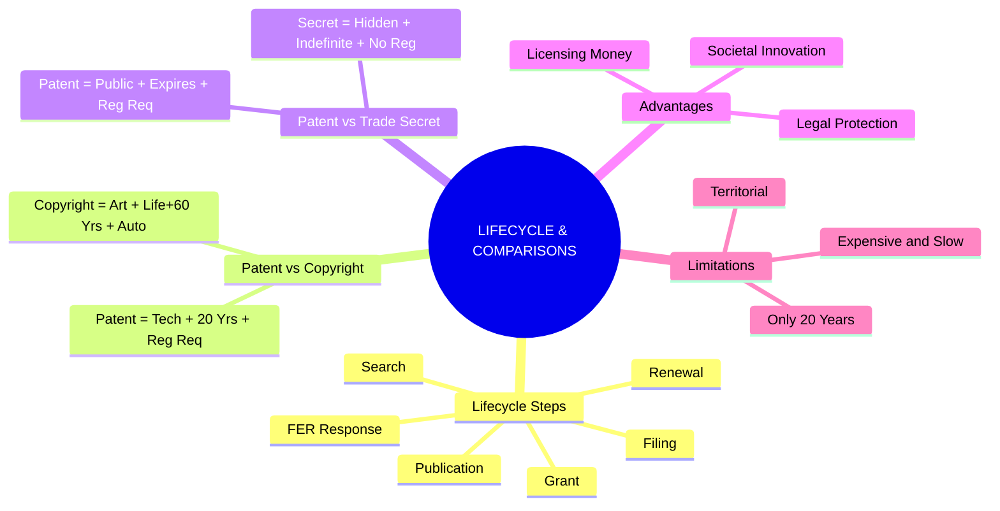

# Chapter 16: Patent Lifecycle & Key Comparisons

---

## 1. The Complete Patent Lifecycle

Getting a patent is a long process that can take several years. 

**Here is the exact step-by-step lifecycle:**

### Real-Life Example: Smart Irrigation System
Imagine a researcher develops a new smart irrigation controller. Here is how they navigate the patent process:

1. **Step 1 (Identify):** The researcher identifies the technical invention (e.g., a new sensor mechanism).
2. **Step 2 (Search):** They conduct a prior-art search to make sure no one else has patented this exact sensor globally.
3. **Step 3 (Provisional):** They file a *provisional specification* to quickly secure a priority date while they finish building the prototype.
4. **Step 4 (Finalize):** They develop and finalize the invention.
5. **Step 5 (Complete Spec):** They file the *complete specification* (with detailed claims) within 12 months of the provisional filing.
6. **Step 6 (Examination):** They submit a Request for Examination (RFE) so the patent office actually looks at it.
7. **Step 7 (FER Response):** The examiner raises some objections in an FER. The researcher's patent agent replies to clear the objections.
8. **Step 8 (Grant):** The objections are cleared, and the Patent is granted!
9. **Step 9 (Money):** The researcher commercializes the technology or licenses it to a farming equipment company to earn royalties.

---

## 2. Advantages & Limitations of Patenting

Why do people spend so much time and money getting patents? And what are the downsides?

### ✅ Advantages of Patenting

| Beneficiary | Benefits Received |
| :--- | :--- |
| **For Inventors** | Legal protection, Commercialization, Licensing opportunities, Recognition. |
| **For Companies** | Competitive advantage, Attracts investment, Market differentiation, Technology licensing. |
| **For Society** | Technical knowledge is disclosed to the public, Innovation is encouraged, New technologies are developed for the future. |

### ❌ Limitations of Patents (Exam Focus)

1. **Expensive:** Patent application, drafting by agents, and maintenance can be very costly.
2. **Time-Consuming:** Patent prosecution (the back-and-forth with the patent office) can take years.
3. **Territorial:** A patent granted in India only protects you in India. 
4. **Limited Term:** The protection only lasts for a maximum of 20 years.
5. **Public Disclosure:** All your technical secrets are publicly published for anyone to read.
6. **Litigation Costs:** Enforcing the patent against infringers in court is very expensive.
7. **No Guarantees:** Just filing an application does *not* guarantee you will actually get a patent.

---

## 3. Patent vs Copyright (Comparison)

*A classic exam question highlighting the difference between technical and creative protection.*

| Feature | Patent | Copyright |
| :--- | :--- | :--- |
| **What does it protect?** | **Invention** (Products, processes) | **Creative expression** (Art, literature) |
| **Example** | A new technical device | Software source code / A book |
| **Main Requirement** | Novelty + Inventive step + Industrial applicability | Originality / Eligibility |
| **Registration** | **Required** (You have no rights without it) | **Not required** (Exists the moment you create it) |
| **Typical Term** | **20 years** | **Lifetime of author + 60 years** |
| **Focus** | Technical solution | Artistic / Literary Expression |

---

## 4. Patent vs Trade Secret (Comparison)

*Should you patent your invention (and reveal it) or keep it a trade secret?*

| Feature | Patent | Trade Secret |
| :--- | :--- | :--- |
| **Nature of Protection** | Statutory (granted by law) | Confidentiality-based (you keep it hidden) |
| **Disclosure** | The application is published for the whole world to see. | Must remain absolutely secret. |
| **Duration** | Generally **20 years** (and then it expires). | Potentially **indefinite** (as long as it stays secret). |
| **Registration** | **Required** to get protection. | **No registration** (you just hide it). |
| **Risk** | It expires eventually. | Protection is lost forever if the secrecy is breached. |
| **Example** | New manufacturing technology. | Confidential Coca-Cola formula. |

---

## 🧠 Ultimate Mindmap: Lifecycle & Comparisons

