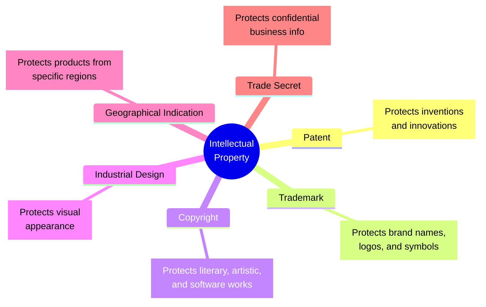

# 📚 Introduction to Intellectual Property Rights (IPR)

## 🧠 What is Intellectual Property (IP)?
**Intellectual Property (IP)** refers to the **creations of the human intellect or mind** that hold commercial, artistic, scientific, or industrial value. 
These are **intangible assets** (cannot be physically touched) but carry immense economic and social importance.

### 🌟 Examples of IP:
* **Inventions** and technological innovations
* **Computer software** and mobile applications
* **Books**, research papers, and articles
* **Music**, films, and videos
* **Logos**, brand names, and trademarks

---

## ⚖️ What are Intellectual Property Rights (IPR)?
**Intellectual Property Rights (IPR)** are the **legal rights** granted by the government to creators, inventors, and businesses over their intellectual creations. 
They provide the owner with **exclusive control** over the use, production, sale, licensing, and commercialization of their work for a **specified period**.

* **Simple Definition:** IPR gives creators the **exclusive legal right** to use, protect, and **benefit financially** from their creations while **preventing unauthorized use** by others.
* **WIPO Definition:** "Intellectual Property refers to creations of the mind, such as inventions, literary and artistic works, designs, symbols, names, and images used in commerce."

---

## 🎯 Objectives of IPR
1. To **encourage innovation and creativity**.
2. To provide **legal protection** for inventions and creative works.
3. To **reward inventors and creators** for their efforts.
4. To promote research and **technological development**.
5. To facilitate **technology transfer and commercialization**.
6. To protect consumers from **counterfeit (fake) products**.

---

## 💡 Characteristics of IPR
* **Intangible Nature:** Has no physical form but possesses economic value.
* **Exclusive Rights:** Only the owner has the legal authority to use, sell, or license it.
* **Territorial Protection:** Protection is generally limited to the **country or region** where granted.
* **Limited Duration:** Valid only for a **specified period**.
* **Transferable:** Can be sold, assigned, licensed, or inherited.
* **Legal Protection:** The owner can take legal action against infringement.
* **Commercial Value:** Can generate income through licensing, royalties, or franchising.

---

## 🏗️ Components of Intellectual Property

Here is a visual representation of the major forms of IP:

### 🔍 Real-Life Examples (Learn by Association)
| **Intellectual Property** | **Type of IPR** | **Explanation** |
| :--- | :--- | :--- |
| **Microsoft Windows** | **Copyright** | Protects the software code from being copied. |
| **Apple Logo** | **Trademark** | Protects the brand identity. |
| **New Electric Vehicle Battery** | **Patent** | Protects the novel invention and mechanism. |
| **Coca-Cola Bottle Shape** | **Industrial Design** | Protects the unique visual shape of the bottle. |
| **Darjeeling Tea** | **Geographical Indication (GI)** | Protects tea originating specifically from Darjeeling. |
| **Coca-Cola Formula** | **Trade Secret** | Protects the secret recipe from competitors. |

---

## ⚖️ Why are IPR Needed? (With vs Without)

| **Without IPR** ❌ | **With IPR** ✅ |
| :--- | :--- |
| Anyone could **copy inventions** without permission. | Inventors receive **strict legal protection**. |
| Authors wouldn't receive **recognition**. | Artists and authors earn **royalties**. |
| Businesses could **misuse famous brand names**. | Businesses can build **strong brands**. |
| **Counterfeit (fake) products** would increase. | Consumers receive **genuine and quality products**. |

---

## 🚀 Advantages of IPR
* 👤 **For Individuals:** Recognition, motivation to create, and **financial rewards** (royalties).
* 🏢 **For Businesses:** Brand protection, **competitive advantage**, and increased market value.
* 🌍 **For Society:** Encourages **technological advancement**, economic development, and creates employment.

---

## ⚠️ Limitations of IPR
* **Expensive:** Registration, maintenance, and enforcement can be costly.
* **Time-Bound:** Protection is limited to a **specific period** (e.g., patents usually last 20 years).
* **Territorial:** May require **separate registration** in different countries.
* **Monopolies:** Misuse of IPR can create monopolies and **restrict fair competition**.

---

## 🌐 Importance of IPR in the Digital Era
With the rapid growth of digital technologies, IPR provides a legal framework to protect:
* **Software applications** & AI innovations
* Websites, **multimedia**, and streaming content
* **E-commerce brands** and databases

*Digital information is easy to copy and distribute—IPR safeguards commercial interests against digital piracy.*
