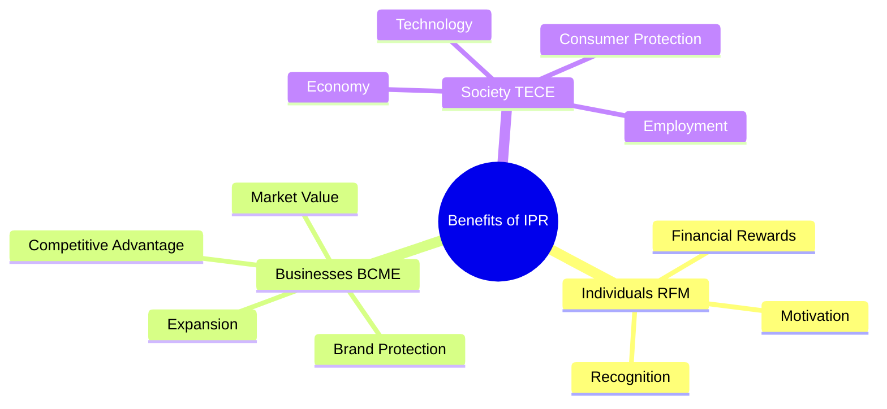
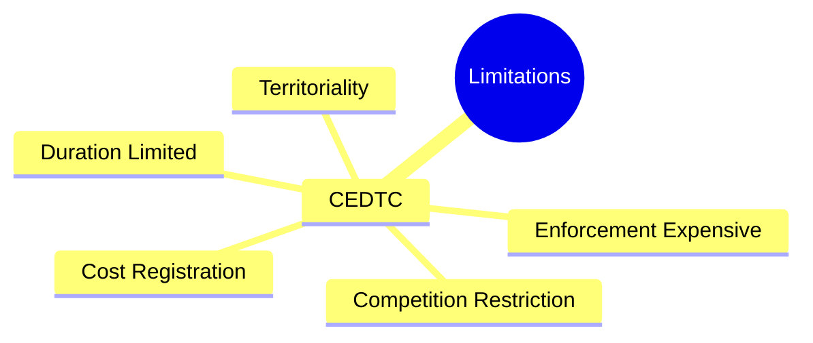
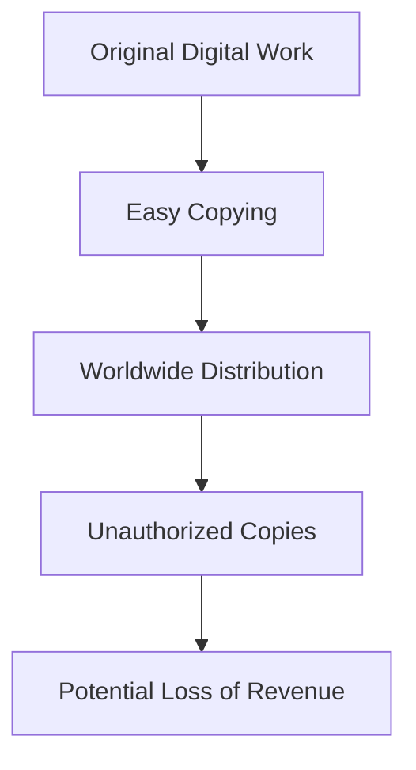
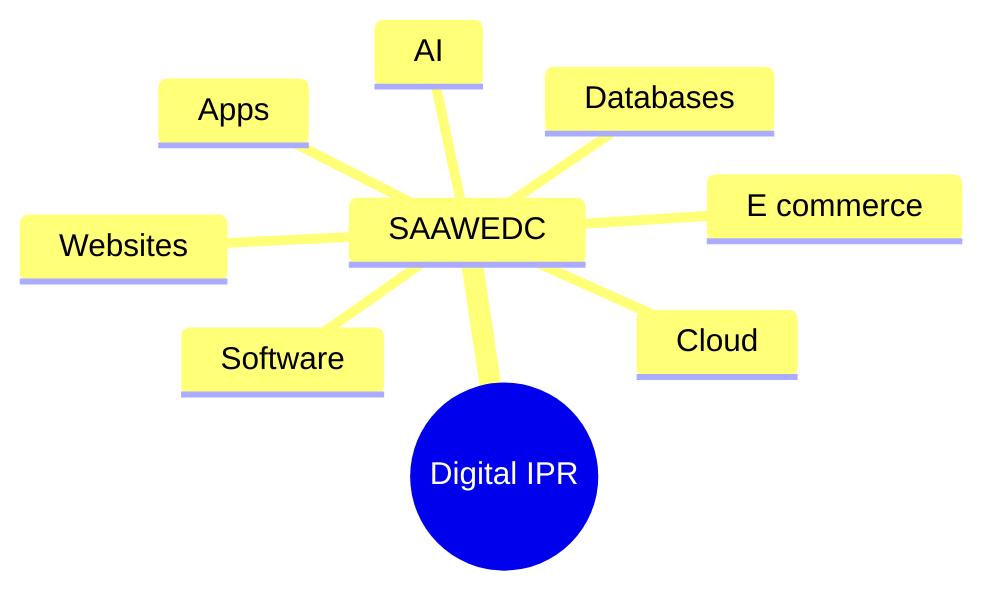

# Important Exam Questions: IPR Basics

## Q1: Advantages / Benefits of IPR

Intellectual Property Rights (IPR) provide benefits at three levels:
1. **Individuals**
2. **Businesses**
3. **Society**

They help provide protection, recognition, financial benefits, innovation and economic development.

### 1. Benefits to Individuals
1. **Recognition for Innovation**: IPR gives creators recognition for their inventions and creative works.
2. **Financial Rewards**: Creators can earn money through Licensing, Royalties, and Commercialization.
3. **Motivation to Create**: Legal protection provides an incentive for individuals to develop new ideas and innovations.
> **Individual → Recognition + Money + Motivation**

### 2. Benefits to Businesses
1. **Brand Protection**: Trademarks help businesses protect their brand identity.
2. **Competitive Advantage**: Protected IP can provide a business with a competitive advantage in the market.
3. **Increased Market Value**: A strong IP portfolio can contribute to the overall value of a business.
4. **Business Expansion**: Businesses can use licensing and franchising to expand their operations.
> **Business → Brand + Competition + Value + Expansion**

### 3. Benefits to Society
1. **Technological Advancement**: IP protection can encourage technological innovation, contributing to technological advancement.
2. **Economic Development**: Commercialization of IP can contribute to economic growth.
3. **Product Quality and Consumer Protection**: Trademarks and anti-counterfeiting mechanisms can help consumers distinguish genuine products from counterfeit products.
4. **Employment Opportunities**: Innovation and commercialization can contribute to business creation and employment.
> **Society → Technology + Economy + Consumer Protection + Jobs**

---

### ⭐ Exam-Ready Answer
IPR provides important benefits to individuals, businesses and society.

* **Benefits to Individuals**: Recognition for innovation and creative work. Financial rewards through licensing, royalties and commercialization. Motivation to create new ideas and innovations.
* **Benefits to Businesses**: Brand protection through trademarks. Competitive advantage through protected IP. Increased market value through strong IP portfolios. Business expansion through licensing and franchising.
* **Benefits to Society**: Technological advancement through increased innovation. Economic development through commercialization of IP. Consumer protection by helping distinguish genuine products from counterfeits. Employment opportunities through innovation and business creation.

### 🧠 Easy Memory Trick
* **Individuals → RFM**: **R**ecognition + **F**inancial rewards + **M**otivation
* **Businesses → BCME**: **B**rand + **C**ompetitive advantage + **M**arket value + **E**xpansion
* **Society → TECE**: **T**echnology + **E**conomy + **C**onsumer protection + **E**mployment

**One-line conclusion:**
> IPR rewards creators, strengthens businesses and promotes technological and economic development in society.

### 🧠 Ultimate Mindmap: Benefits of IPR

---

## Q2: Limitations / Disadvantages of IPR

Although Intellectual Property Rights (IPR) provide important protection, they also have certain limitations and disadvantages. The provided content identifies 5 major limitations.

### 1. Expensive Registration and Maintenance
Obtaining and maintaining certain IP rights can involve significant costs. For example, registration and maintenance of IP rights may require payment of fees and other expenses.
> **Keyword: Cost**

### 2. Legal Enforcement Can Be Expensive
If someone infringes an IP right, enforcing that right may require legal proceedings. Such enforcement can take considerable time and money.
> **Keyword: Enforcement Cost**

### 3. Limited Duration
Some forms of IP protection have a limited statutory duration. After the applicable protection period ends, the legal protection may no longer continue in the same form.
> **Keyword: Limited Duration**

### 4. Territorial Nature
IP protection is generally territorial. This means protection in one country does not automatically provide the same protection everywhere. International protection may require protection in multiple jurisdictions.
> **Keyword: Territoriality**

### 5. Possibility of Restricting Competition
IP rights create legally protected exclusivity. If IP rights are improperly used or combined with other market factors, they can contribute to market power and may restrict competition.
> **Keyword: Competition / Market Power**

---

### ⭐ Exam-Ready Answer
IPR has the following major limitations/disadvantages:
* **Expensive registration and maintenance** – Obtaining and maintaining certain IP rights can involve significant costs.
* **Expensive legal enforcement** – Enforcing IP rights may require legal proceedings, which can take time and money.
* **Limited duration** – Some forms of IP protection have a limited statutory duration.
* **Territorial nature** – Protection is generally limited by jurisdiction, so international protection may require protection in multiple jurisdictions.
* **Possibility of restricting competition** – IP exclusivity can contribute to market power and potentially restrict competition if improperly used or combined with other market factors.

### 🧠 Memory Trick
**C – E – D – T – C**
> **C**ost → **E**nforcement → **D**uration → **T**erritoriality → **C**ompetition

**One-line conclusion:**
> Thus, while IPR provides legal protection and rewards for creators, its costs, enforcement difficulties, limited duration, territorial nature and potential competition concerns are important limitations.

### 🧠 Ultimate Mindmap: Limitations of IPR

---

## Q3: Importance of IPR in the Digital Era

Intellectual Property Rights (IPR) are particularly important in the digital era because digital information can be copied and distributed extremely easily.

### 1. Digital Content is Easy to Copy
A digital product can be copied quickly and at very low cost.

Therefore, IPR provides a legal framework for addressing unauthorized copying and exploitation, depending on the type of IP involved.

### 2. Areas Where IPR is Important
IPR is relevant to many digital technologies and products, including:
* Software applications
* Artificial Intelligence (AI) innovations
* Mobile applications
* Websites
* Digital content
* Online educational materials
* Multimedia
* Streaming content
* E-commerce brands
* Databases
* Cloud-based services

### 3. Protection of Software
Software involves different types of IP.
* Software code may receive copyright protection.
* Certain technical inventions implemented through software may potentially involve patent protection, depending on the jurisdiction and legal requirements.
> **Example**: Software source code → Copyright

### 4. Protection of AI Innovations
AI-related elements such as **AI inventions, Software, Datasets, Models, Outputs, and Branding** can involve different forms of IP or related legal protection depending on the circumstances.

### 5. Protection of Mobile Applications
A mobile application may involve Copyright, Trademark, Potentially patent, and Trade secrets. For example, the application's source code may involve copyright, while its brand name/logo may involve trademark protection.

### 6. Protection of Websites and Digital Content
Website elements such as Code, Graphics, Videos, Articles, and Other digital content can involve copyright protection.

### 7. Protection of E-Commerce Brands
Brand names and logos used by e-commerce businesses can involve trademark protection.

### 8. Databases and Cloud Services
Different elements of databases and cloud-based services can potentially receive different forms of legal protection depending on the jurisdiction and circumstances.

---

### ⭐ Exam-Ready Answer
IPR is especially important in the Digital Era because digital information can be copied, modified and distributed very quickly and worldwide. Unauthorized copying and distribution can cause loss of revenue and other harms to creators and businesses. Therefore, IP law provides a legal framework for addressing unauthorized copying and exploitation, depending on the type of IP involved.

IPR is relevant to software applications, AI innovations, mobile applications, websites, digital content, online educational materials, multimedia, streaming content, e-commerce brands, databases and cloud services.
* **Software** → Copyright; potentially patent protection for certain qualifying technical inventions.
* **AI** → Different IP protections may apply to inventions, software, datasets, models, outputs and branding.
* **Mobile apps** → Copyright, trademark, potentially patent and trade secrets.
* **Websites/digital content** → Copyright.
* **E-commerce brands** → Trademark.
* **Databases/cloud services** → Different forms of protection may apply depending on the circumstances.

### 🧠 Easy Memory Trick
**Digital IPR = S-A-A-W-E-D-C**
* **S**oftware
* **A**I
* **A**pps
* **W**ebsites
* **E**-commerce
* **D**atabases
* **C**loud

### 🔥 Core Point to Remember
> Digital content is easy to copy + easy to distribute worldwide → therefore IPR becomes important for protecting and legally addressing unauthorized use.

### 🧠 Ultimate Mindmap: Digital IPR (SAAWEDC)

