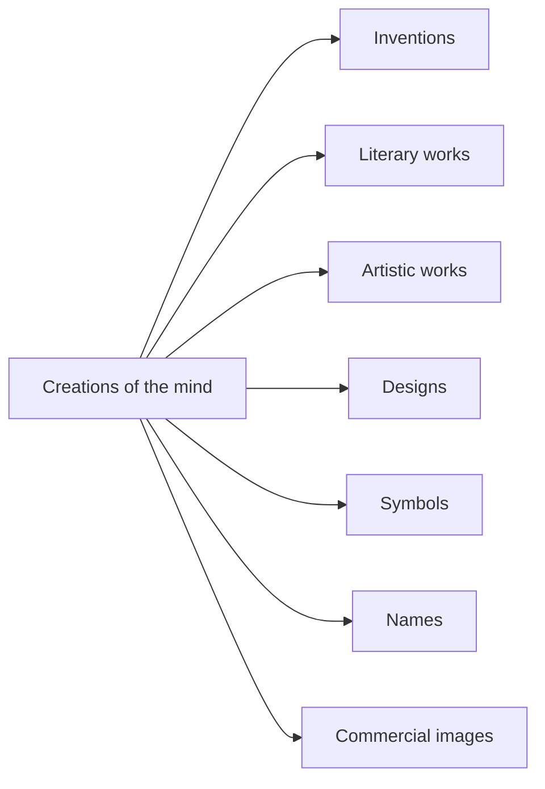
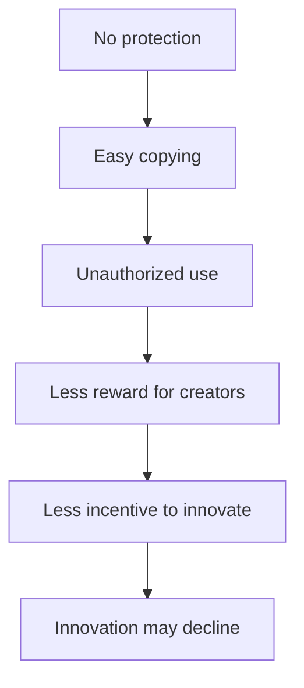
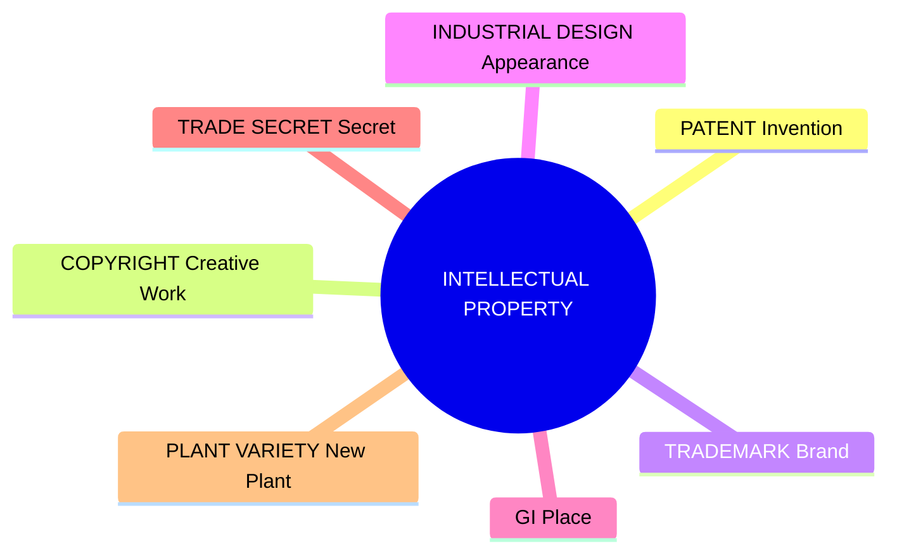
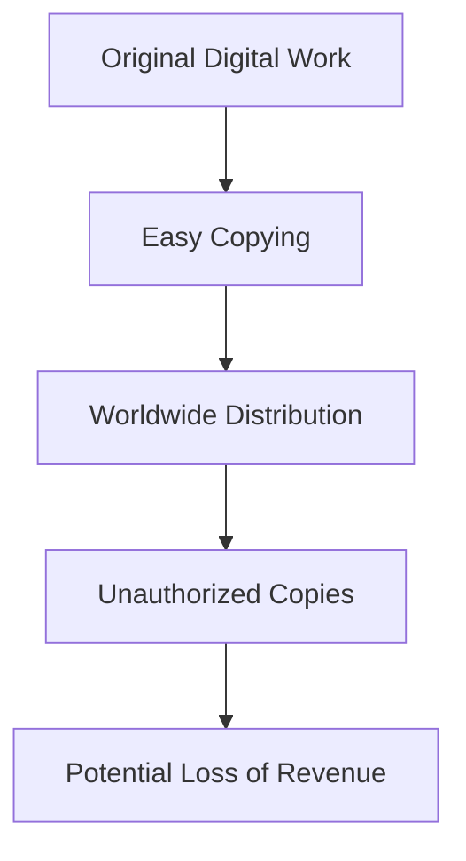

# Intellectual Property (IP) and Intellectual Property Rights (IPR)

## 1. Intellectual Property (IP)
Intellectual Property (IP) refers to creations of the human mind or intellect that have commercial, artistic, scientific, or industrial value.
These creations are generally intangible assets, meaning they do not have a physical form but can have significant economic and social value.

**Examples:**
- **Invention** → New electric vehicle battery
- **Software** → Microsoft Windows
- **Literary work** → Book/research paper
- **Artistic work** → Painting/photograph
- **Brand identity** → Apple logo
- **Business information** → Coca-Cola formula

> **Easy definition:** IP = Valuable creation of the human mind.

## 2. Intellectual Property Rights (IPR)
Intellectual Property Rights (IPR) are the legal rights granted to creators, inventors, authors, designers and businesses to protect their intellectual creations.
These rights provide certain exclusive rights over the use, production, sale, licensing and commercialization of the protected IP, subject to applicable law.

> **Easy definition:** IPR = Legal protection given to valuable creations of the human mind.

**Example Process:**

The patent gives the inventor legal protection against unauthorized commercial use, subject to applicable law.

## 3. IP vs IPR

| Feature | IP | IPR |
| :--- | :--- | :--- |
| **Meaning** | Creation / intellectual asset | Legal right protecting the creation |
| **Focus** | Refers to what has been created | Refers to legal protection over it |
| **Example 1** | New invention | Patent protecting the invention |
| **Example 2** | Apple logo | Trademark protecting the logo |

**One-line difference:**
> IP is the creation; IPR is the legal protection/right associated with that creation.

## 4. WIPO Definition of IP
According to the World Intellectual Property Organization (WIPO):
“Intellectual Property refers to creations of the mind, such as inventions, literary and artistic works, designs, symbols, names, and images used in commerce.”

**WIPO keywords to remember:**

---

## ⭐ Exam-Ready Answer
**Intellectual Property (IP)** refers to creations of the human mind or intellect having commercial, artistic, scientific or industrial value. These are generally intangible assets, such as inventions, software, books, artistic works, logos and business formulas.

**Intellectual Property Rights (IPR)** are the legal rights granted to creators, inventors, authors, designers and businesses to protect their intellectual creations. They provide certain exclusive rights to use, license, sell or commercialize the protected IP, subject to law.

The main difference is that IP is the creation itself, whereas IPR is the legal protection/right associated with that creation.
According to WIPO, IP refers to “creations of the mind”, including inventions, literary and artistic works, designs, symbols, names and images used in commerce.

> **Memory trick:**
> IP = Creation 🧠
> IPR = Protection ⚖️

---

# Why are IPR Needed? Explain the Need and Objectives of IPR

## 1. Need for IPR
Intellectual Property Rights (IPR) are needed to ensure that people who create something valuable receive legal protection and can benefit from their creation.

### Without IPR

**Problems without IPR:**
- Inventions can be copied without permission.
- Authors/creators may not receive proper recognition or reward.
- Brand names and logos can be misused.
- Innovation and creativity may decrease.
- Counterfeit/duplicate products may increase.

### With IPR
> **IPR → Protection + Reward + Innovation**

- Legal protection for creators
- Income/royalties through commercialization and licensing
- Encouragement for R&D and innovation

## 2. Objectives of IPR
The major objectives of IPR are:

1. **Encourage Innovation and Creativity** - Gives creators an incentive to develop new ideas, inventions and creative works.
2. **Provide Legal Protection** - Protects inventions and creative works from unauthorized exploitation.
3. **Reward Inventors and Creators** - Financial benefits, recognition, royalties and licensing income.
4. **Promote Research and Technological Development** - Encourage individuals and companies to invest in R&D.
5. **Facilitate Technology Transfer and Commercialization** - IP can be licensed or assigned to reach the market.
6. **Stimulate Economic and Industrial Development** - Contributes to business growth and investment.
7. **Protect Consumers from Counterfeit Products** - Trademarks help combat misleading products.
8. **Encourage Fair Competition** - Provides a framework to compete while respecting protected rights.

---

## ⭐ Exam-Ready Answer
**Intellectual Property Rights (IPR)** are needed to provide legal protection to valuable creations of the human mind and to ensure that creators can receive benefits from their creations. Without IPR, inventions and creative works can be easily copied or used without authorization, which may reduce the reward and incentive for innovation. IPR also helps protect brands and combat counterfeit products.

**Objectives of IPR:**
- Encourage innovation and creativity
- Provide legal protection
- Reward inventors and creators
- Promote research and technological development
- Facilitate technology transfer and commercialization
- Stimulate economic and industrial development
- Protect consumers from counterfeit products
- Encourage fair competition

> 🧠 **Memory Trick:**
> “I Protect, Reward, Research, Commercialize, Develop, Compete.”
> **Flow:** PROTECT → REWARD → INNOVATE → RESEARCH → COMMERCIALIZE → DEVELOP → CONSUMER PROTECTION → FAIR COMPETITION

---

# Characteristics / Features of Intellectual Property Rights (IPR)

## 1. Intangible Nature
IPR protects intellectual creations, which generally have no physical form, but can have significant economic value.
*Example: Software code has no physical form itself, but it can have huge economic value.*
> **Keyword:** Intangible

## 2. Exclusive Rights
IPR generally gives the owner exclusive legal rights to use, license, sell or otherwise exploit the protected IP, subject to legal limitations.
*Example: If a company owns a valid patent, others generally cannot commercially exploit the patented invention without authorization.*
> **Keyword:** Exclusive

## 3. Territorial Protection
IP rights are generally territorial, meaning protection is normally based on the country or jurisdiction in which the right is obtained.
*Example: Patent in India → Protection under Indian patent law; Patent in USA → Protection under US patent law.*
> **Keyword:** Territorial

## 4. Limited Duration
Many IP rights have a limited statutory duration. For example, patents have a defined statutory term.
*Important: Trademarks can generally be renewed, while trade-secret protection can potentially continue as long as secrecy is maintained.*
> **Keyword:** Limited Duration

## 5. Transferable
IP rights can often be: Sold, Assigned, Licensed, Transferred, Inherited (where applicable).
- **Assignment** = Transfer of ownership
- **License** = Permission to use without necessarily transferring ownership
> **Keyword:** Transferable

## 6. Legal Protection
The owner can use legal remedies against infringement or unauthorized use, subject to the relevant law.
> **Keyword:** Legal Protection

## 7. Commercial Value
IP can generate economic income through: Licensing, Royalties, Franchising, Commercialization, Sale/assignment.
> **Keyword:** Commercial Value

---

## ⭐ Exam-Ready Answer
The main characteristics/features of Intellectual Property Rights (IPR) are:
1. **Intangible Nature** – IP has no physical form but can have significant economic value.
2. **Exclusive Rights** – The owner generally gets exclusive rights to exploit the protected IP.
3. **Territorial Protection** – Protection is limited to the country/jurisdiction where obtained.
4. **Limited Duration** – Many IP rights have a limited statutory period.
5. **Transferable** – IP rights can be sold, assigned, licensed, or inherited.
6. **Legal Protection** – Owners can seek legal remedies against infringement.
7. **Commercial Value** – Generates income through licensing, royalties, sale, etc.

> 🧠 **Super-Easy Memory Trick: I E T L T L C**
> Intangible → Exclusive → Territorial → Limited → Transferable → Legal protection → Commercial value
> *"IP is Intangible, Exclusive, Territorial, Limited, Transferable, Legally protected and Commercially valuable."*

---

# Major Types / Forms of Intellectual Property Rights (IPR)

## 1. Patent
A Patent protects inventions and technological innovations. It generally provides exclusive rights for a limited statutory period, in exchange for disclosure of the invention.
🧠 **Patent → Invention**

## 2. Trademark
A Trademark protects brand names, logos, symbols, slogans and other signs that distinguish goods or services.
🧠 **Trademark → Brand Identity**

## 3. Copyright
Copyright protects original literary, artistic, musical and software works. It protects the expression of an idea, not the underlying idea itself.
🧠 **Copyright → Creative Expression**

## 4. Industrial Design
Industrial Design protects the visual/aesthetic appearance of a product (shape, configuration, pattern).
🧠 **Industrial Design → Appearance**

## 5. Geographical Indication (GI)
Protects products associated with a specific geographical origin, where the qualities or reputation are linked to that origin.
🧠 **GI → Geographical Origin / Place**

## 6. Trade Secret
Protects confidential business information that provides economic value because it is secret and is subject to reasonable measures to maintain secrecy.
🧠 **Trade Secret → Confidential Information**

## 7. Plant Variety Protection
Protects certain new plant varieties developed through breeding.
🧠 **Plant Variety Protection → New Plant Varieties**

---

## ⭐ Super-Easy Table for Exam
| Type of IPR | Protects | Example |
| :--- | :--- | :--- |
| **Patent** | Invention | New EV battery |
| **Trademark** | Brand identity | Apple logo |
| **Copyright** | Creative works | Software, book, song |
| **Industrial Design** | Product appearance | Coca-Cola bottle |
| **GI** | Geographical origin | Darjeeling Tea |
| **Trade Secret** | Confidential business information | Secret formula |
| **Plant Variety Protection** | New plant varieties | New bred crop variety |

> 🧠 **One-Line Memory Trick**
> Patent = Invention | Trademark = Brand | Copyright = Creative Work | Design = Appearance | GI = Place | Trade Secret = Secret | Plant Variety = Plant

## ✍️ Best Diagram to Draw in Exam

> **For an exam, remember the 7-type formula: P – T – C – D – G – T – P**

---

# Differentiate the Major Forms of Intellectual Property Rights

## ⭐ Key Differences — Easy to Remember

### 1. Patent vs Copyright
- **Patent** → Invention (e.g. New battery technology)
- **Copyright** → Creative expression (e.g. Software source code)
🧠 *Patent = Invention | Copyright = Creative Expression*

### 2. Trademark vs Copyright
- **Trademark** → Brand identifier (e.g. Logo/name)
- **Copyright** → Creative work/expression (e.g. Book/song/software)
🧠 *Trademark = Brand | Copyright = Creative Work*

### 3. Patent vs Trade Secret
- **Patent** → Qualifying invention; requires disclosure; statutory term.
- **Trade Secret** → Confidential valuable information; requires secrecy; can last as long as kept secret.
🧠 *Patent = Disclose + statutory term | Trade Secret = Keep secret + lasts forever*

---

# Advantages / Benefits of IPR

## 1. Benefits to Individuals
1. **Recognition** for Innovation
2. **Financial Rewards** (Licensing, Royalties)
3. **Motivation** to Create
> **Trick:** Individuals → RFM (Recognition + Financial + Motivation)

## 2. Benefits to Businesses
1. **Brand Protection**
2. **Competitive Advantage**
3. **Increased Market Value**
4. **Business Expansion**
> **Trick:** Businesses → BCME (Brand + Competition + Market value + Expansion)

## 3. Benefits to Society
1. **Technological Advancement**
2. **Economic Development**
3. **Product Quality and Consumer Protection**
4. **Employment Opportunities**
> **Trick:** Society → TECE (Technology + Economy + Consumer protection + Employment)

---

# Limitations / Disadvantages of IPR

1. **Expensive Registration and Maintenance** (Cost)
2. **Legal Enforcement Can Be Expensive** (Enforcement Cost)
3. **Limited Duration** (Statutory limits)
4. **Territorial Nature** (Country-by-country protection)
5. **Possibility of Restricting Competition** (Market power)

> 🧠 **Memory Trick: C – E – D – T – C**
> Cost → Enforcement → Duration → Territoriality → Competition

---

# Importance of IPR in the Digital Era

Digital information can be copied and distributed extremely easily.

## Areas Where IPR is Important
- **Software**: Copyright (code) and occasionally Patent (inventions).
- **AI Innovations**: Patents, Copyrights, Trade Secrets, branding.
- **Mobile Apps**: Copyright, Trademark, Patent, Trade Secrets.
- **Websites & Digital Content**: Copyright.
- **E-Commerce Brands**: Trademark.

> 🧠 **Easy Memory Trick: S-A-A-W-E-D-C**
> Software → AI → Apps → Websites → E-commerce → Databases → Cloud

> 🔥 **Core Point to Remember:**
> Digital content is easy to copy + easy to distribute worldwide → therefore IPR becomes important for protecting and legally addressing unauthorized use.
